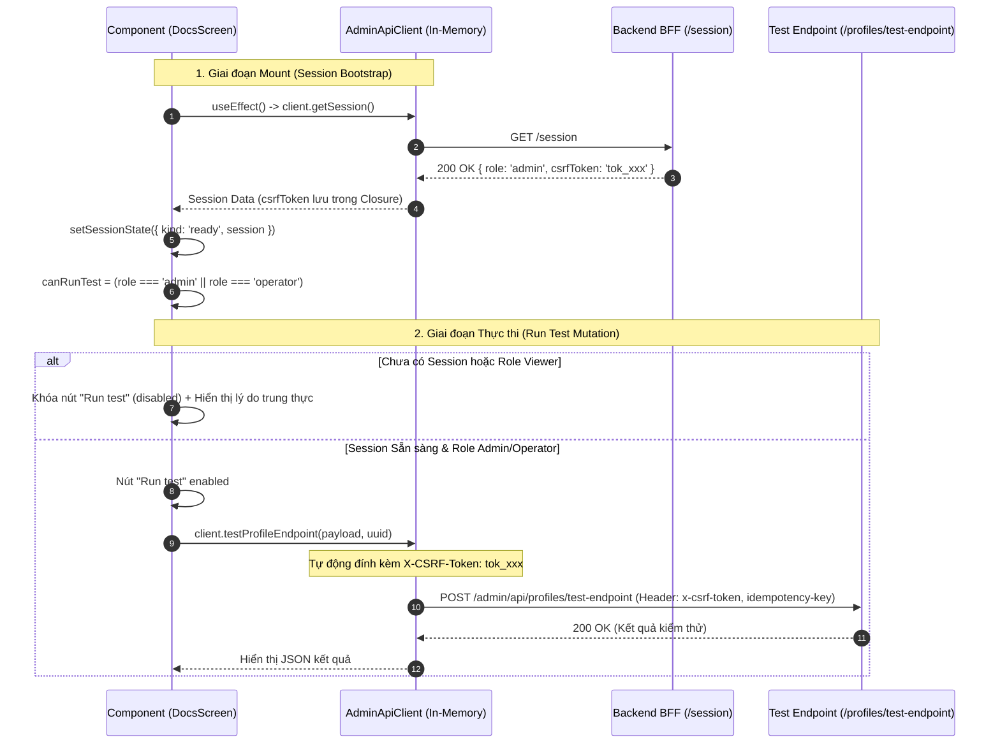

# Bảng Checklist Nghiệm Thu UI Wave 803 (UI Acceptance Checklist & Verification Gates)

**Ngày lập:** 2026-10-05  
**Tác giả / Vai trò:** Antigravity (UI Lead & Reviewer — `term_ae2d7e42-8042-4b85-95d5-cabed5ee3191`)  
**Task ID:** `task_8efab44dbdca` (Dispatch: `ctx_691729e9742d`)  
**Coordinator:** DeepSeek Coordinator (`term_6904d82c-e563-416b-9cc2-8da4f7bc16b3`)  
**Chế độ thực thi:** DOC-ONLY (0 source edit, 0 build, 0 test run)  
**Tài liệu tham chiếu:**
- `coordination/reports/ui-backlog-803-2026-10-05.md`
- `coordination/reports/ui-contract-matrix-803-2026-10-05.md`
- `coordination/reports/gap-inventory-803-2026-10-05.md`
- `docs/admin-ui-development-contract.md` (§3, §4, §5)

---

## 1. Mục Đích & Tiêu Chuẩn Nghiệm Thu Chung

Báo cáo này chuyển hóa toàn bộ kế hoạch UI Backlog Wave 803 và Ma trận hợp đồng đê ngành thành **Bộ Checklist Nghiệm Thu Chi Tiết (Acceptance Gates)** áp dụng cho 6 gói công việc **803-01..803-06**. 

Tài liệu này đóng vai trò:
1. **Chuẩn mực nghiệm thu cho Reviewer**: Đưa ra các tiêu chí kiểm thử có thể kiểm chứng bằng mắt và công cụ trên bản build thực tế.
2. **Kim chỉ nam minh chứng cho Lane Implement**: Xác định rõ ràng lập trình viên cần nộp những bằng chứng gì (evidence) để được duyệt `UI_APPROVED`.
3. **Bản đồ rào cản & điều kiện kích hoạt**: Định vị ranh giới giữa tính năng sẵn sàng làm ngay với các phân hệ bị chặn bởi chính sách người dùng (`Δ-DEV-03`) hoặc thiếu wire backend.

---

## 2. Bảng Phân Định Bằng Chứng & Trạng Thái Rào Cản 6 Packet 803

| Packet ID | Tên Packet | Trạng Thái Rào Cản | Điều Kiện Mở Khóa (Unblocking Condition) | Bằng Chứng Browser Thật (Playwright / Visual) | Bằng Chứng Offline (Typecheck / Lint / Unit) |
|---|---|---|---|---|---|
| **803-01** | `FIX-DOCS-CSRF` | **SẴN SÀNG (UNBLOCKED)** | Không có rào cản; thực thi ngay trên `docs-screen.tsx`. | • Network inspect bắt request POST `/profiles/test-endpoint` có header `x-csrf-token` và `idempotency-key`.<br>• Screenshot modal Test Workbench chạy thành công trả JSON và banner từ chối khi role viewer. | • `tsc --noEmit` exit 0.<br>• Unit test harness kiểm tra hook session mount và error boundary. |
| **803-02** | `WORKFLOW-TREE-SCAFFOLD` | **BỊ KHÓA (USER-GATED `Δ-DEV-03`)** | Người dùng phê duyệt mở `Δ-DEV-03` và thống nhất UX Tree/List structured view. | • Screenshot 5 state panels (`loading`, `ready`, `empty`, `error`, `denied`).<br>• Screenshot reflow mượt mà ở màn hình hẹp 320px. | • `tsc --noEmit` exit 0.<br>• State reducer unit tests (zero mock data bịa đặt). |
| **803-03** | `WORKFLOW-IMPORT-MODAL` | **BỊ KHÓA (USER-GATED `Δ-DEV-03`)** | Đi kèm với 803-02 sau khi người dùng mở `Δ-DEV-03`. | • Video/Screenshot kéo thả file `.json`/`.xml` hiển thị bảng preview schema.<br>• Test chặn file XXE/DTD và node lạ hiển thị AlertBanner đỏ.<br>• HAR inspect xác nhận 0 network call khi preview. | • Unit tests cho `workflow-parser.ts` với các payload XML attack, file >512KB, corrupt format. |
| **803-04** | `SETTINGS-EDITOR-WIRE` | **BỊ KHÓA (THIẾU WIRE BACKEND)** | Backend hoàn thành packet `SETTINGS-WIRE-BASE`, cung cấp route và DTO `/admin/api/settings` có CAS revision. | • DOM inspection xác nhận 0 plaintext secret.<br>• Kịch bản test CAS 409 Conflict giữ nguyên draft.<br>• Network capture xác minh quy trình `Keep`/`Replace`/`Clear`. | • Typecheck DTO interfaces.<br>• Unit test form state machine và validator. |
| **803-05** | `PROMPT-WIZARD-MODAL` | **BỊ KHÓA (THIẾU WIRE BACKEND)** | Backend đăng ký BFF endpoint cho AI Wizard (`POST /admin/api/profiles/prompt-wizard`). | • Screenshot giao diện diff so sánh 2 cột giữa prompt cũ và prompt gợi ý.<br>• Kiểm tra nút "Accept into Draft" nạp vào editor mà không tự lưu server. | • Unit test thuật toán diff text và kiểm tra bảo toàn biến `{user_prompt}`, `{input_content}`. |
| **803-06** | `NAV-POLISH-A11Y-803` | **SẴN SÀNG (UNBLOCKED)** | Không có rào cản; thực thi ngay trên `app-shell.tsx` và các header. | • Báo cáo quét tự động Axe A11y (0 critical/serious violations).<br>• Video test di chuyển tuần tự bằng phím Tab (visible focus rings, no trap).<br>• Screenshot 100% route ở 320px. | • Linting `jsx-a11y` exit 0.<br>• Kiểm tra route mapping chống link chết (dead links / 404). |

---

## 3. Tiêu Chí Nghiệm Thu Chi Tiết Cho Từng Packet (803-01 .. 803-06)

---

### 3.1. Packet 803-01: `FIX-DOCS-CSRF` (Docs Workbench CSRF & Session Guard)

- **File phạm vi:** `apps/admin-web/src/features/docs/docs-screen.tsx`
- **Mục tiêu:** Khắc phục triệt để lỗi thiếu `X-CSRF-Token` khi gọi POST `/profiles/test-endpoint`, áp dụng cơ chế fail-closed gating trên session role.

#### Checklist Điều Kiện UI Kiểm Bằng Mắt / Công Cụ Trên Build:
- [ ] **Trạng thái (UI States):**
  - Khi màn hình đang nạp: Nút "Run test" ở trạng thái `disabled`, hiển thị thông điệp chẩn đoán: `"Reading the admin session before enabling writes (the CSRF proof is issued by that read)."`
  - Khi session thất bại (401/500): Nút "Run test" `disabled`, hiển thị: `"Admin session unavailable, so the server-issued CSRF proof cannot be obtained; every write stays disabled (fail-closed)."`
  - Khi session role là `viewer`: Nút "Run test" `disabled`, hiển thị: `"Profile Test Endpoint requires an admin or operator session (this session is viewer); writes stay disabled."`
  - Khi session role là `admin` hoặc `operator`: Nút "Run test" enabled.
  - Khi đang thực thi (`busy: true`): Nút đổi nhãn thành `"Running..."`, khóa click.
  - Khi thành công (200 OK): Hiển thị khối `<pre>` chứa định dạng JSON kết quả rõ ràng trên nền `var(--bg-subtle)`.
  - Khi lỗi: Hiển thị `<AlertBanner variant="error">` với tiêu đề và chi tiết mã lỗi trung thực.
- [ ] **Nhãn & Khả năng tiếp cận (Labels & A11y):**
  - 4 ô input có `aria-label`: `"businessId"`, `"businessVersion"`, `"profileName"`, `"endpointSlug"`.
  - Vùng textarea có `aria-label="file urls"` và placeholder `"file_urls (one per line)"`.
  - Nút bấm có nhãn rõ ràng: `"Close"` và `"Run test"`.
- [ ] **Mô tả lỗi (Error Handling):**
  - Validation client-side: Báo lỗi đỏ nếu để trống bất kỳ trường nào trong 4 trường định danh: `422 INVALID_SCHEMA - Please fill businessId, businessVersion, profileName, endpointSlug`.
  - Xử lý lỗi server: Bắt và hiển thị đúng mã lỗi chuẩn HTTP từ server (`403 CSRF_REJECTED`, `404 NOT_FOUND`, `503 UPSTREAM_UNAVAILABLE`, `TRANSPORT_ERROR`).
- [ ] **Cấp quyền (RBAC Fail-Closed):**
  - Kiểm tra `canRunTest = sessionRole === 'admin' || sessionRole === 'operator'`. Role `viewer` hoặc session chưa sẵn sàng bị chặn hoàn toàn trước khi tạo network round-trip.
- [ ] **CSRF & Idempotency:**
  - Hook mount gọi `client.getSession()`.
  - Request POST gửi header `x-csrf-token` hợp lệ và `idempotency-key` ngẫu nhiên qua `crypto.randomUUID()`.
- [ ] **Secret Hygiene:**
  - 0 trường nhập mật khẩu, token hay client secret.
  - Không ghi dữ liệu ra `localStorage` hay `sessionStorage`.
- [ ] **Focus & Bàn phím:**
  - Phím `Esc` đóng modal, phím `Tab` duyệt tuần tự qua các input và 2 nút hành động.
  - Các ô nhập liệu có visible focus ring (`var(--focus-ring)`).
- [ ] **320px Reflow:**
  - Toàn bộ modal và form co giãn theo chiều dọc (`flex flex-col gap-3`), không có thanh cuộn ngang ở chiều rộng màn hình 320px.

---

### 3.2. Packet 803-02: `WORKFLOW-TREE-SCAFFOLD` (Khung Giao Diện Quản Trị Workflows)

- **File phạm vi:** `apps/admin-web/src/features/workflows/` (`workflows-screen.tsx`, `types.ts`, `state.ts`)
- **Điều kiện mở khóa:** Người dùng phê duyệt mở rào cản `Δ-DEV-03`.
- **Mục tiêu:** Xây dựng giao diện danh sách cấu trúc (Structured Tree View) quản lý workflow schemas, inputs và 10 loại node chuẩn.

#### Checklist Điều Kiện UI Kiểm Bằng Mắt / Công Cụ Trên Build:
- [ ] **Trạng thái (5 Standard State Panels):**
  - `loading`: Render skeleton table / loading spinner trong lúc tải dữ liệu.
  - `ready`: Render danh sách schemas, phiên bản và danh sách các nodes.
  - `empty`: Render StatePanel variant "empty" (`"No workflows registered yet"`) kèm hướng dẫn nạp schema.
  - `error`: Render AlertBanner đỏ với tiêu đề và mã lỗi khi API lỗi.
  - `denied`: Render StatePanel variant "denied" (`"403 FORBIDDEN - Administrator or Operator role required"`) khi session là viewer.
- [ ] **Nhãn & Phân loại Node:**
  - Cột bảng: "Workflow ID", "Version", "Node Count", "Status", "Updated At".
  - 10 standard node types có tag nhãn trực quan: `connector`, `parallel`, `join`, `file_parse`, `file_url_download`, `callback`, `archive_compress`, `archive_extract`, `human`, `input`.
- [ ] **Cấp quyền (RBAC):**
  - `admin` / `operator`: Được phép xem, mở modal import và lưu node overrides.
  - `viewer`: Chỉ xem cấu hình (read-only), các nút chỉnh sửa bị khóa.
- [ ] **Secret Hygiene:**
  - Các node loại `connector` chỉ hiển thị `connectorId` và tên credential tham chiếu, tuyệt đối không hiển thị credentials.
- [ ] **Focus & 320px Reflow:**
  - Bảng danh sách hoặc danh sách card tự động co giãn, các nút collapse/expand có kích thước chạm tối thiểu 44px x 44px.
  - Không bị tràn ngang ở màn hình 320px.

---

### 3.3. Packet 803-03: `WORKFLOW-IMPORT-MODAL` (Modal Import Schema JSON / XML)

- **File phạm vi:** `apps/admin-web/src/features/workflows/workflow-import-modal.tsx`, `workflow-parser.ts`
- **Điều kiện mở khóa:** Đi kèm với Packet 803-02 sau khi mở `Δ-DEV-03`.
- **Mục tiêu:** Cho phép import schema workflow từ file ngoài với bộ kiểm tra an toàn client-side chống XXE và schema validation.

#### Checklist Điều Kiện UI Kiểm Bằng Mắt / Công Cụ Trên Build:
- [ ] **Trạng thái (Modal Workflow States):**
  - `dropzone`: Khung nét đứt nhận file kéo thả hoặc nút "Browse file".
  - `parsing`: Hiển thị "Validating workflow schema...".
  - `preview`: Hiển thị bảng tóm tắt schema (tên, số node, danh sách input properties) trước khi nạp.
  - `rejected`: Hiển thị AlertBanner đỏ với lý do từ chối rõ ràng.
- [ ] **Mô tả lỗi & Kiểm tra An toàn:**
  - Chặn file > 512KB: `"File size exceeds maximum allowed limit (512 KB)"`.
  - Chặn sai định dạng: `"Unsupported file format. Only .json and .xml are allowed"`.
  - Chặn XXE / DTD (XML): `"Security rejection: XML entity or DTD declarations are not allowed"`.
  - Chặn node lạ: `"Schema error: Node '...' uses unsupported type 'xyz'. Must be one of 10 standard types"`.
- [ ] **CSRF & Network Hygiene:**
  - Tuyệt đối **zero network requests** khi người dùng đang ở bước kéo thả hoặc xem trước (preview).
  - Thao tác "Accept" chỉ nạp schema vào bộ nhớ form draft của client, không tự động gửi API lưu lên server.
- [ ] **Secret Hygiene:**
  - Không lưu nội dung file XML/JSON vào `localStorage` hay `sessionStorage`.
- [ ] **Focus & 320px Reflow:**
  - Dropzone và bảng preview co giãn trơn tru ở 320px; modal có focus trap bàn phím.

---

### 3.4. Packet 803-04: `SETTINGS-EDITOR-WIRE` (Form Cấu Hình Hệ Thống 17-Key)

- **File phạm vi:** `apps/admin-web/src/features/settings/` (`settings-screen.tsx`, `settings-editor.tsx`, `settings-api.ts`)
- **Điều kiện mở khóa:** Backend hoàn thành `SETTINGS-WIRE-BASE` và cung cấp route `/admin/api/settings`.
- **Mục tiêu:** Chuyển đổi 3 Card deployment catalog tĩnh thành 3 Form Editor độc lập (AI Defaults, Prompt Defaults, Storage & Retention).

#### Checklist Điều Kiện UI Kiểm Bằng Mắt / Công Cụ Trên Build:
- [ ] **Trạng thái & Quản trị Phiên bản (CAS):**
  - 3 form độc lập: AI Defaults, Prompt Defaults (5 slots), Storage & Retention.
  - Mỗi form theo dõi trạng thái `pristine` (chưa sửa), `dirty` (đã sửa), `saving` (đang lưu).
  - Xử lý xung đột `409 Conflict`: Khi server báo lệch revision, hiển thị cảnh báo: `"Configuration modified by another operator. Your draft has been preserved."` kèm nút `Compare with Server` và `Reload`. **Không xóa giá trị người dùng đang nhập**.
- [ ] **Nhãn & Phân loại Trực quan:**
  - Phân định rõ bằng badge: `managed` (đã wire), `requires deployment action` (cố định hạ tầng), `requires backend` (chưa có endpoint).
  - Nhãn 5 prompt slots chuẩn: `image`, `pdf`, `docx`, `compare`, `generate`.
- [ ] **Quy chuẩn Secret Write-Only (`Keep` / `Replace` / `Clear`):**
  - Áp dụng nghiêm ngặt cho 4 credential keys (`ai_api_key`, `openai_api_key`, `s3_access_key`, `s3_secret_key`):
    - Khi key đã tồn tại trên server: Hiển thị trạng thái `Configured (●●●●●●●●)` kèm nút "Replace" và nút "Clear".
    - Không bao giờ đưa raw secret vào thuộc tính `value` của HTML input hay text trong DOM.
    - Ô input chỉ mở ra khi bấm "Replace", mang thuộc tính `type="password"` và `autocomplete="new-password"`.
    - Tuyệt đối không lưu secret vào `localStorage` hay in ra log console.
- [ ] **Cấp quyền (RBAC):**
  - Chỉ tài khoản `admin` mới được phép lưu. Tài khoản `operator` hoặc `viewer` ở chế độ read-only hoàn toàn.
- [ ] **CSRF & Readback Verification:**
  - Mọi thao tác lưu đều gửi header `X-CSRF-Token`, `Idempotency-Key` và `expectedRevision`.
  - Chỉ toast thông báo thành công sau khi gọi GET readback xác nhận revision mới từ máy chủ.
- [ ] **Focus & 320px Reflow:**
  - Bố cục form dạng card co giãn mượt mà ở 320px, input focus ring hiển thị rõ ràng.

---

### 3.5. Packet 803-05: `PROMPT-WIZARD-MODAL` (AI Prompt Wizard cho Profiles)

- **File phạm vi:** `apps/admin-web/src/features/profiles/prompt-wizard-modal.tsx`
- **Điều kiện mở khóa:** Backend cung cấp endpoint wizard `/admin/api/profiles/prompt-wizard`.
- **Mục tiêu:** Modal gợi ý prompt thông minh tương ứng `CFGADM-06`, hỗ trợ người vận hành tinh chỉnh system prompt cho Profile.

#### Checklist Điều Kiện UI Kiểm Bằng Mắt / Công Cụ Trên Build:
- [ ] **Trạng thái:**
  - Form nhập mục tiêu xử lý (task intent, document types, guidelines).
  - Trạng thái loading: "Generating optimized prompt...".
  - Trạng thái kết quả: Giao diện Diff so sánh giữa "Current Prompt" và "Proposed Prompt".
- [ ] **Nhãn & Hành động:**
  - Nút "Generate Proposal", nút "Accept into Draft", nút "Discard".
- [ ] **Kiểm soát Tác vụ & Bảo toàn Biến Mẫu:**
  - Bấm "Accept into Draft" **chỉ nạp vào form Profile Draft trên client**, tuyệt đối không tự động kích hoạt API `publishProfile` hay `upsertProfile`.
  - Kiểm tra bảo toàn các biến placeholder bắt buộc như `{user_prompt}`, `{input_content}`.
- [ ] **Timeout & Giới hạn Mạng:**
  - Bọc lời gọi sinh prompt trong `AbortController` với thời gian chờ tối đa 15 giây, hiển thị `TRANSPORT_TIMEOUT` nếu quá hạn.
- [ ] **Cấp quyền (RBAC):**
  - Yêu cầu session role `admin` hoặc `operator`.
- [ ] **Focus & 320px Reflow:**
  - Chế độ Diff trên màn hình 320px tự động chuyển thành tab xem lần lượt hoặc inline diff để chống tràn ngang.

---

### 3.6. Packet 803-06: `NAV-POLISH-A11Y-803` (Hoàn Thiện Điều Hướng & Trải Nghiệm Tiếp Cận)

- **File phạm vi:** `apps/admin-web/src/app-shell/app-shell.tsx`, `apps/admin-web/src/features/overview/overview-screen.tsx`, Header components.
- **Điều kiện mở khóa:** **SẴN SÀNG (UNBLOCKED)**; thực thi ngay trên nền tảng hiện có.
- **Mục tiêu:** Thống nhất thanh menu điều hướng AppShell, bổ sung liên kết quay lại Legacy Shell (`/admin`), và kiểm định chất lượng Accessibility (Tab flow / Focus rings / Reflow).

#### Checklist Điều Kiện UI Kiểm Bằng Mắt / Công Cụ Trên Build:
- [ ] **Hệ Thống Menu Điều Hướng (Navigation Polish):**
  - Thanh AppShell Navigation hiển thị đầy đủ và rõ ràng các mục: Overview, Profiles, Connectors, API Keys, Operations, Businesses, Usage, Security, Identity, Settings, Docs, Workflows.
  - Active route được làm nổi bật trực quan (`var(--bg-active)`).
  - Mỗi màn hình mới có link "Open in Legacy Shell" trỏ chính xác về route tương ứng trên `/admin/*`.
- [ ] **Ngăn Chặn Liên Kết Chết (Zero 404):**
  - 100% các link trên AppShell và Overview trỏ đúng route trong `router.tsx`, không phát sinh lỗi 404 Not Found.
- [ ] **Chất Lượng Tiếp Cận (Accessibility & Focus Flow):**
  - 100% các phần tử tương tác (button, link, input, tab) có visible focus ring rõ ràng (`var(--focus-ring)`).
  - Toàn bộ ứng dụng có thể duyệt thông suốt bằng phím `Tab` và `Shift+Tab` mà không gặp bẫy bàn phím (no keyboard trap).
  - Có liên kết "Skip to main content" ẩn cho người dùng khiếm thị/sử dụng bàn phím.
- [ ] **Hiển thị Phiên & Quyền Hạn (Session Badge):**
  - Header hiển thị role (`admin`, `operator`, `viewer`) và tenant scope của phiên làm việc hiện tại.
- [ ] **320px Mobile Reflow:**
  - Header và Navigation co giãn thành menu drawer hoặc hamburger menu trên màn hình 320px.
  - Không xuất hiện thanh cuộn ngang ở bất kỳ route nào.

---

## 4. Đặc Tả Chuẩn Mực: CSRF & Session Bootstrap Pattern Cho Packet 803-01

Nhằm đảm bảo Packet `803-01` (`FIX-DOCS-CSRF`) và mọi màn hình có mutation tuân thủ chính xác mô hình bảo mật fail-closed đã được chứng minh tại `features/identity/identity-screen.tsx`, bộ quy tắc sau đây là **tiêu chuẩn bắt buộc**:



### 4.1. Mã nguồn Mẫu Chuẩn (Standard Code Blueprint)

```typescript
// 1. Khởi tạo instance và state
const client = useMemo(() => createAdminApiClient(), []);
const [sessionState, setSessionState] = useState<
  | { kind: 'loading' }
  | { kind: 'ready'; session: AdminWebSession }
  | { kind: 'failed'; problem: AdminApiProblem }
>({ kind: 'loading' });

// 2. Mount effect với cờ active chống rò rỉ bộ nhớ
useEffect(() => {
  let active = true;
  void (async () => {
    const session = await client.getSession();
    if (!active) return;
    setSessionState(
      session.ok 
        ? { kind: 'ready', session: session.data } 
        : { kind: 'failed', problem: session.problem }
    );
  })();
  return () => {
    active = false;
  };
}, [client]);

// 3. Phân quyền và tính toán cờ fail-closed
const sessionRole = sessionState.kind === 'ready' ? sessionState.session.role : null;
const canRunTest = sessionRole === 'admin' || sessionRole === 'operator';

const testUnavailableReason =
  sessionState.kind === 'loading'
    ? 'Reading the admin session before enabling writes (the CSRF proof is issued by that read).'
    : sessionState.kind === 'failed'
      ? 'Admin session unavailable, so the server-issued CSRF proof cannot be obtained; every write stays disabled (fail-closed).'
      : !canRunTest
        ? `Profile Test Endpoint requires an admin or operator session (this session is ${sessionRole}); writes stay disabled.`
        : '';
```

### 4.2. Tiêu Chí Nghiệm Thu CSRF Cho Reviewer
1. **Kiểm tra Fail-Closed:** Khi chưa gọi xong `getSession()` hoặc khi session trả về lỗi, nút "Run test" phải bị disabled 100%, không cho phép bấm.
2. **Kiểm tra Header Mạng:** Khi bấm nút "Run test", request POST phát sinh bắt buộc phải chứa:
   - `x-csrf-token`: Chuỗi token không rỗng, khớp với token trả về từ `/session`.
   - `idempotency-key`: Chuỗi UUID duy nhất cho mỗi lần gọi.
3. **Kiểm tra Role Gating:** Khi đăng nhập dưới tài khoản `viewer`, nút "Run test" bị disabled kèm câu giải thích: `Profile Test Endpoint requires an admin or operator session (this session is viewer); writes stay disabled.`

---

## 5. Kết Luận & Hướng Dẫn Điều Phối

1. **Thứ tự thực thi ưu tiên:**
   - **Giai đoạn 1 (Làm ngay):** Packet `803-01` (`FIX-DOCS-CSRF`) và Packet `803-06` (`NAV-POLISH-A11Y-803`) là 2 packet không có bất kỳ rào cản nào, có thể nghiệm thu và đóng gói ngay lập tức.
   - **Giai đoạn 2 (Chờ Người Dùng):** Packet `803-02` và `803-03` sẽ được kích hoạt ngay khi nhận được phê duyệt mở `Δ-DEV-03`.
   - **Giai đoạn 3 (Chờ Backend Wire):** Packet `803-04` và `803-05` sẽ thực thi khi backend hoàn thiện `SETTINGS-WIRE-BASE` và route AI Wizard.
2. **Cam kết chất lượng:** Mọi gói công việc khi nộp nghiệm thu đều phải cung cấp đầy đủ bằng chứng đối chiếu theo danh mục tại Mục 2 và các tiêu chí tại Mục 3 trước khi Reviewer cấp verdict `UI_APPROVED`.
