# DUGate — Solution Architecture Document

> **Document ID**: SA-DUGATE-2026-001  
> **Version**: 2.0  
> **Classification**: INTERNAL — FOR APPROVAL  
> **Author**: Solution Architecture Team  
> **Date**: 2026-04-04  
> **Status**: APPROVED

---

## Table of Contents

1. [Executive Summary](#1-executive-summary)
2. [Business Context & Problem Statement](#2-business-context--problem-statement)
3. [Solution Overview](#3-solution-overview)
4. [Architecture Principles](#4-architecture-principles)
5. [System Context (C4 Level 1)](#5-system-context-c4-level-1)
6. [Container Architecture (C4 Level 2)](#6-container-architecture-c4-level-2)
7. [Component Architecture (C4 Level 3)](#7-component-architecture-c4-level-3)
8. [Sequence Diagrams](#8-sequence-diagrams)
9. [Deployment Architecture — Docker & Kubernetes](#9-deployment-architecture--docker--kubernetes)
10. [Security Architecture](#10-security-architecture)
11. [Non-Functional Requirements (NFR)](#11-non-functional-requirements-nfr)
12. [Technology Stack Decision Matrix](#12-technology-stack-decision-matrix)
13. [Approval Sign-off](#13-approval-sign-off)

---

## 1. Executive Summary

**DUGate** (Document Understanding API Gateway) là một giải pháp kiến trúc cổng trung gian API nội bộ, chuyên biệt xử lý các bài toán **Phân tích Tài liệu** (Document Understanding) cho môi trường doanh nghiệp — đặc biệt phù hợp với ngành Tài chính & Ngân hàng.

Thay vì mỗi nghiệp vụ tự tích hợp riêng lẻ đến hàng chục dịch vụ AI thông qua LLMs Hub nội bộ, DUGate **quy chuẩn hóa** toàn bộ lớp truy cập thành **6 API Endpoint duy nhất**, vận hành trên kiến trúc **Pipeline Engine bất đồng bộ** với khả năng **định tuyến theo Profile**, đảm bảo:

- **Zero-coupling** giữa ứng dụng nghiệp vụ và AI backend
- **Multi-tenant isolation** qua API Key + Profile-based routing với cấu hình tham số thống nhất (Unified Parameter Schema)
- **Audit-grade traceability** với structured logging & cURL reconstruction
- **Enterprise-grade deployment** trên Docker & Kubernetes

---

## 2. Business Context & Problem Statement

Trong bối cảnh chuyển đổi số, nhu cầu xử lý tài liệu bằng AI (OCR, trích xuất, phân loại, đối soát, v.v.) ngày càng tăng nhanh trên nhiều đơn vị nghiệp vụ. Các mô hình LLM hiện được cung cấp tập trung qua **LLMs Hub** nội bộ. Tuy nhiên, cần **quy hoạch các dịch vụ về Document Understanding** thành một lớp cổng trung gian chuẩn hóa để giải quyết các vấn đề phát sinh khi mỗi ứng dụng tự tích hợp riêng lẻ:

| # | Vấn đề | Ảnh hưởng |
|---|--------|-----------|
| P1 | Mỗi app tự tích hợp riêng lẻ → N×M integrations | Chi phí bảo trì tăng tuyến tính, logic bị phân mảnh |
| P2 | Không kiểm soát prompt/model tập trung | Rủi ro prompt injection, output inconsistency giữa các đơn vị |
| P3 | Không có audit trail trên API gọi AI | Vi phạm compliance nội bộ, khó truy vết sự cố |
| P4 | Không có spending limit per-team | Token usage vượt tầm kiểm soát |
| P5 | Thiếu cơ chế pipeline chain | Không thể ghép nối nhiều bước xử lý (OCR → Extract → Validate) |

**DUGate giải quyết** bằng cách đóng vai trò lớp Gateway giữa ứng dụng nghiệp vụ và LLMs Hub — chuẩn hóa toàn bộ thành 6 API duy nhất:

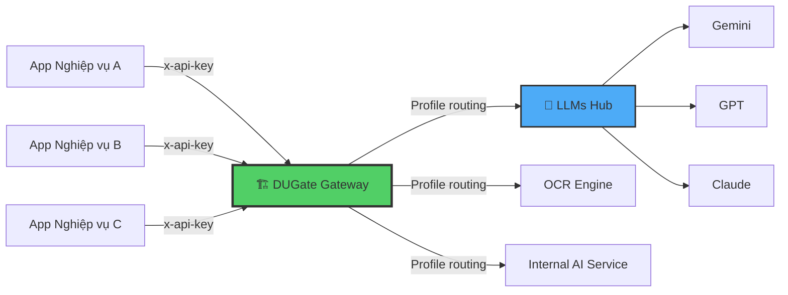

---

## 3. Solution Overview

### 3.1 Kiến trúc Logic — 6 Unified Endpoints

DUGate quy chuẩn hóa toàn bộ bài toán Document Understanding thành **6 hành động ngữ nghĩa** (semantic actions):

| # | Endpoint | Chức năng | Sub-cases |
|---|----------|-----------|-----------|
| 1 | `/api/v1/ingest` | Đọc, OCR, số hóa tài liệu | `parse`, `ocr`, `digitize`, `split` |
| 2 | `/api/v1/extract` | Trích xuất dữ liệu có cấu trúc | `invoice`, `contract`, `id-card`, `receipt`, `table`, `custom` |
| 3 | `/api/v1/analyze` | Đánh giá, phân loại, fact-check | `classify`, `sentiment`, `compliance`, `fact-check`, `quality`, `risk`, `summarize-eval` |
| 4 | `/api/v1/transform` | Chuyển đổi, dịch thuật, mã hóa PII | `convert`, `translate`, `rewrite`, `redact`, `template` |
| 5 | `/api/v1/generate` | Sinh nội dung mới (tóm tắt, QA) | `summary`, `qa`, `outline`, `report`, `email`, `minutes` |
| 6 | `/api/v1/compare` | So sánh ngữ nghĩa/text diff | `diff`, `semantic`, `version` |

### 3.2 Core Architecture Pattern

```
Client Request → Middleware (Auth) → Endpoint Runner (Routing & Param Guard) → Pipeline Submit → Pipeline Engine → External API Processor → LLMs Hub / AI Backend
       ↑                                                                                                                                           ↓
       └──────────────────── Operation Polling / Webhook ←─────────────────── PostgreSQL (State Machine) ←─────────────────────────────────────────┘
```

### 3.3 Chat Assistant Capability

Ngoài 6 Endpoint chính chuyên phục vụ kết nối dữ liệu máy-máy (M2M), DUGate cung cấp thêm lớp tiện ích **Chat Assistant** (`/api/chat`).
- **Mục đích**: Giao diện tương tác trò chuyện quản trị cấu hình AI cho Admin.
- **Cơ chế**: Proxy tới LLMs Hub thông qua external connection `sys-assistant`. Hệ thống tự động nội suy và context hóa các tham số (ví dụ: `{{available_routes_json}}`, `{{user_chat_message}}`) dựa trên cấu trúc hiện hành từ `SERVICE_REGISTRY`.

---

## 4. Architecture Principles

| # | Nguyên tắc | Mô tả |
|---|-----------|------|
| AP-1 | **Gateway Abstraction** | Ứng dụng nghiệp vụ KHÔNG bao giờ gọi trực tiếp AI backend. DUGate là điểm truy cập duy nhất. |
| AP-2 | **Unified Parameter Guardrails** | Mọi tùy chỉnh tham số phụ thuộc vào khai báo `ParamSchema` tập trung. Các tham số hệ thống bị khóa (locked params) sẽ bị từ chối nếu Client chủ ý gửi từ bên ngoài. |
| AP-3 | **Profile-Driven Isolation** | Cấu hình Profile chỉ định các tham số và logic routing riêng cho từng ứng dụng API Key mà không ảnh hưởng key khác. |
| AP-4 | **Async-First** | Mọi pipeline mặc định bất đồng bộ (`202 Accepted`). |
| AP-5 | **Zero Client Code Change** | Thay đổi AI backend, pipeline model chỉ cần admin thao tác trên Server — 0 dòng code ứng dụng thay đổi. |
| AP-6 | **Defence in Depth** | Tầng auth kép: NextAuth (Admin UI) + API Key (Public API). AES-256-GCM bảo vệ secret key lưu trữ. |

---

## 5. System Context (C4 Level 1)

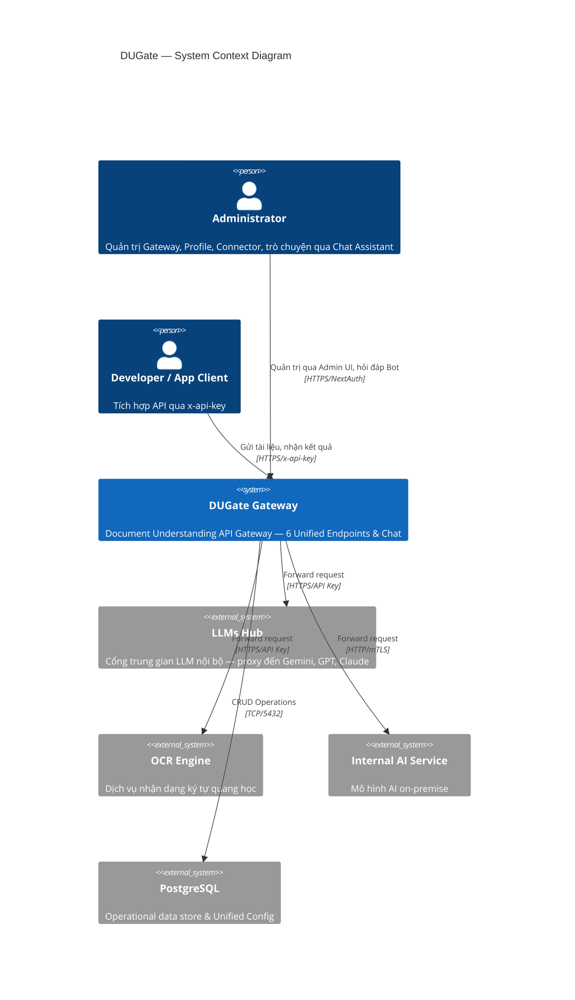

---

## 6. Container Architecture (C4 Level 2)

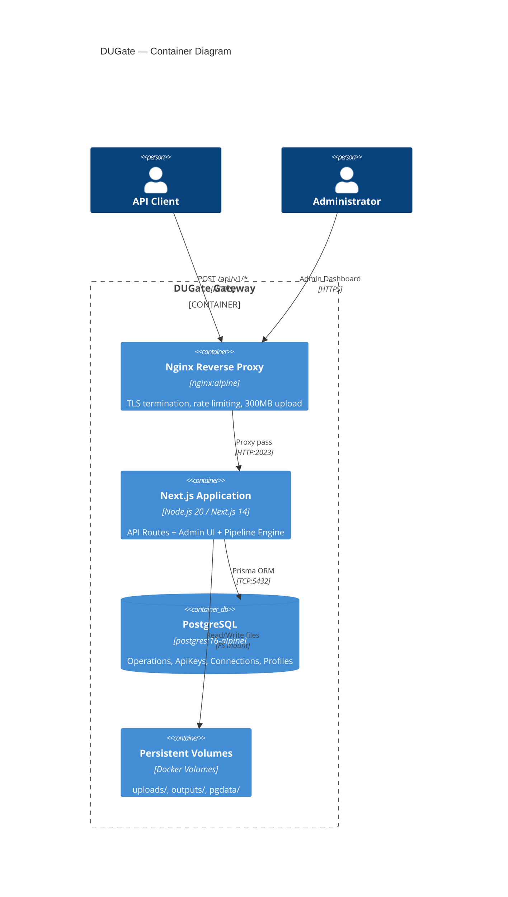

---

## 7. Component Architecture (C4 Level 3)

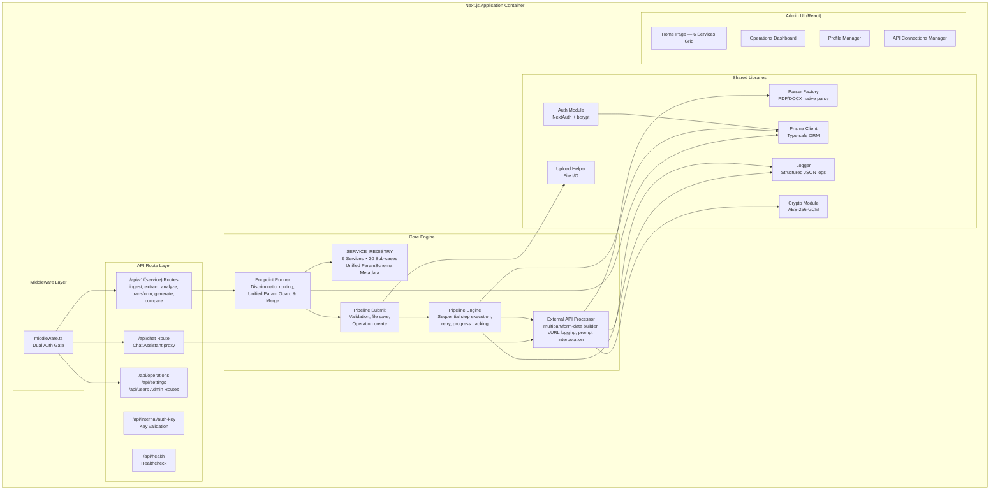

### 7.1 SERVICE_REGISTRY & ParamSchema

Version 2.0 đưa toàn bộ khai báo Metadata lưu tại `SERVICE_REGISTRY`, được định dạng bởi `ParamSchema`. Các schema này quy định rõ loại tham số, tính bắt buộc, và đặc biệt là cờ `defaultLocked` nhằm định tuyến cái nào được Client override và cái nào Admin được quyền khoá cứng (enforcement parameter).

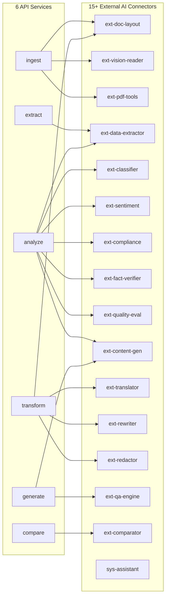

---

## 8. Sequence Diagrams

### 8.1 Luồng xử lý API Request (Async — Production Flow)

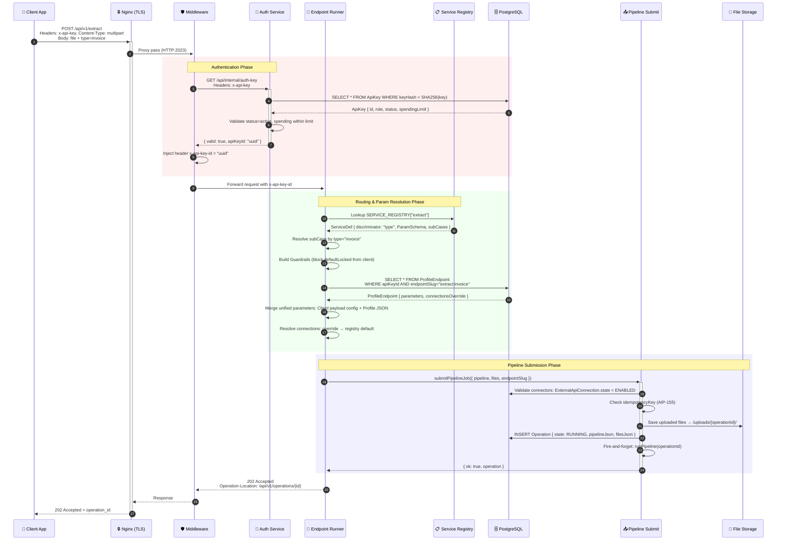

### 8.2 Pipeline Engine — Multi-Step Execution

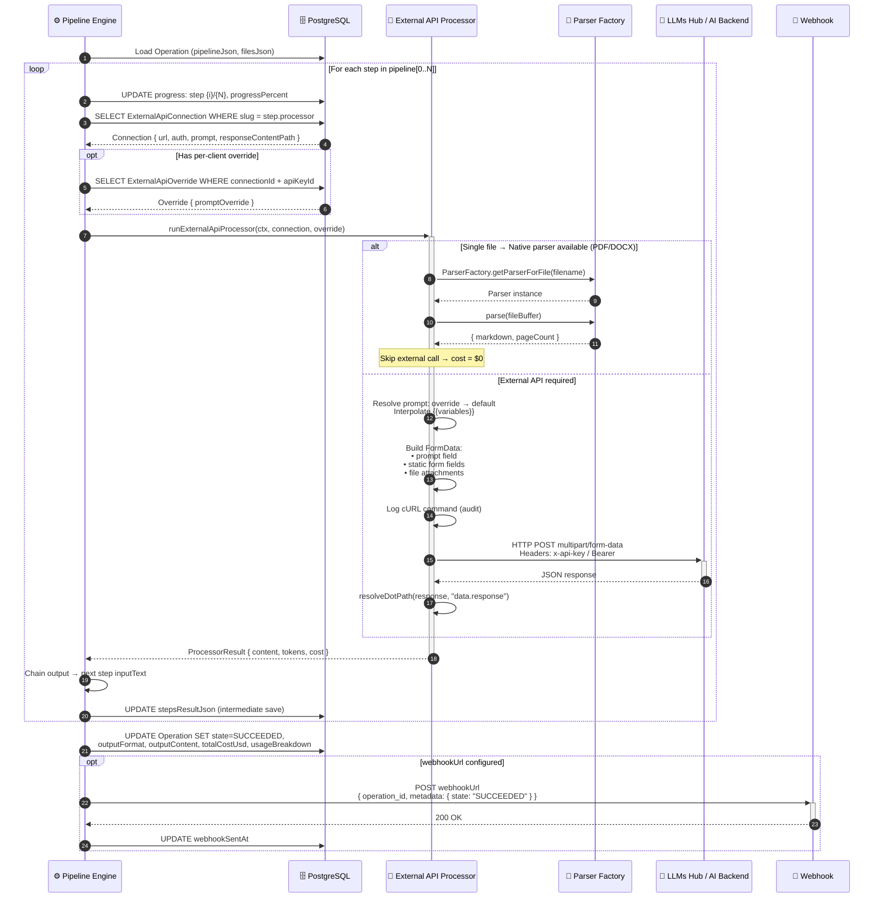

### 8.3 Operation Polling — Client-side

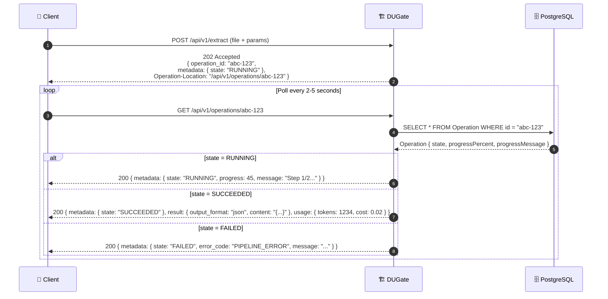

### 8.4 Per-Profile Connector Routing Override

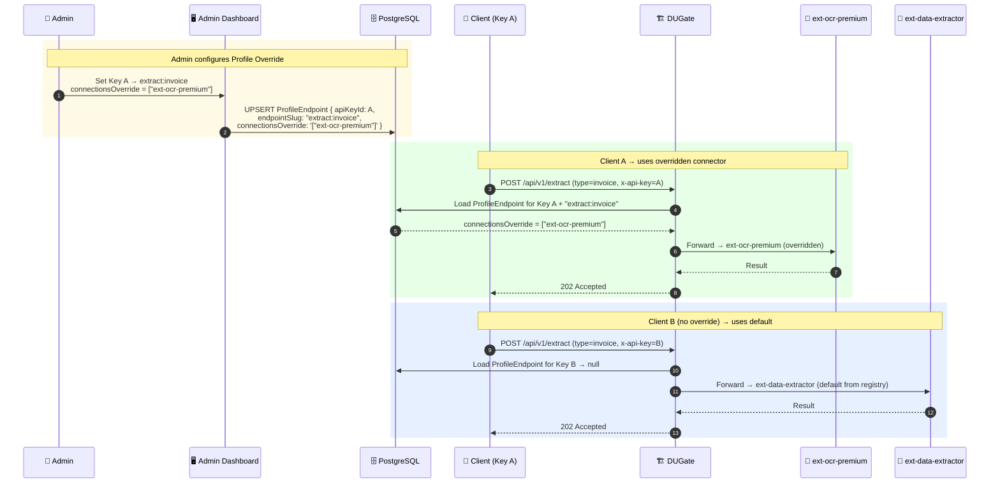

### 8.5 Admin Authentication — NextAuth Session Flow

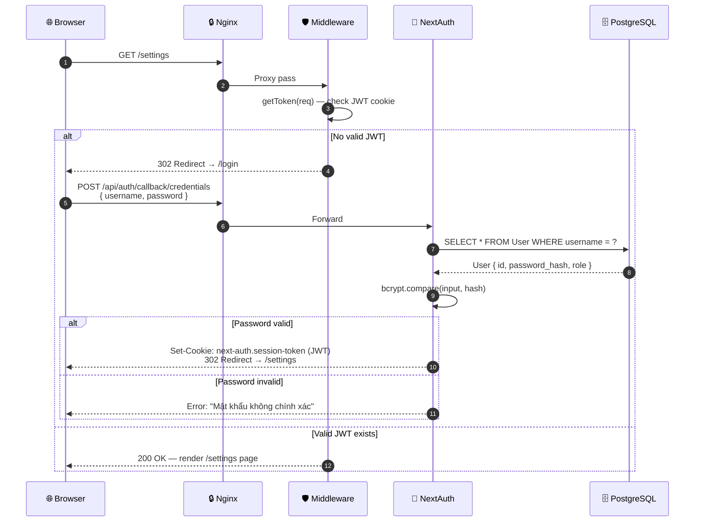

---

## 9. Deployment Architecture — Docker & Kubernetes

### 9.1 Tổng quan triển khai

Hệ thống được đóng gói hoàn toàn bằng **Docker** với multi-stage build (giảm image từ ~1.2GB → ~350MB), triển khai trên **Kubernetes** cho môi trường production. Môi trường dev/staging sử dụng Docker Compose.

| Thành phần | Image | Port | Vai trò |
|------------|-------|------|---------|
| **dugate-app** | `node:20-slim` (multi-stage) | 2023 | API Gateway + Admin UI + Pipeline Engine |
| **dugate-db** | `postgres:16-alpine` | 5432 | Operation state, API Key, Connection registry |
| **nginx-ingress** | `nginx:alpine` | 80/443 | TLS termination, rate-limit, upload cap 300MB |

### 9.2 Docker Compose — Development / Staging

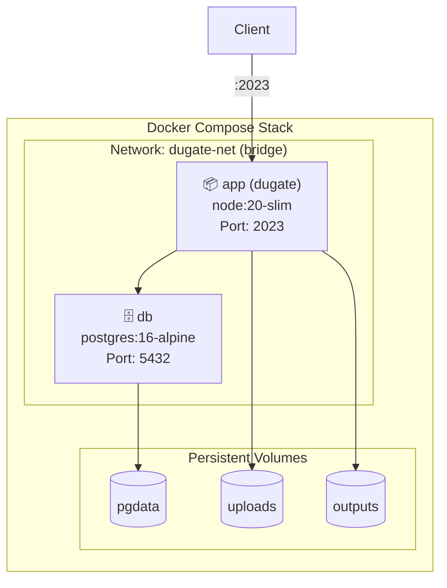

### 9.3 Kubernetes — Production Topology

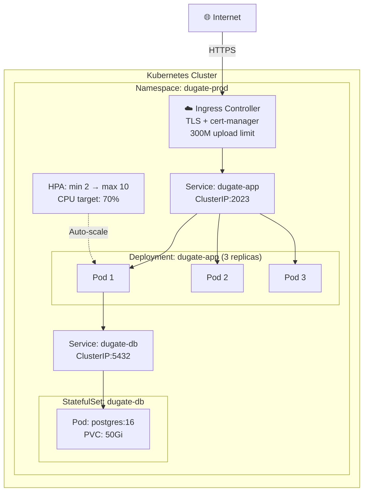

**Đặc điểm triển khai chính:**

| Khía cạnh | Cấu hình |
|-----------|----------|
| **Deployment strategy** | RollingUpdate — `maxSurge: 1`, `maxUnavailable: 0` (zero-downtime) |
| **Auto-scaling** | HPA: 2 → 10 pods, trigger tại CPU 70% hoặc Memory 80% |
| **Health check** | Liveness + Readiness probe qua `GET /api/health` |
| **Secrets** | K8s Secret: `DB_PASSWORD`, `NEXTAUTH_SECRET`, `ENCRYPTION_KEY` |
| **Storage** | PVC ReadWriteMany cho `uploads/` và `outputs/` |
| **Database** | StatefulSet + PVC 50Gi ReadWriteOnce |

---

## 10. Security Architecture

### 10.1 Authentication Matrix

| Endpoint Pattern | Auth Method | Token / Key | Session Type |
|-----------------|-------------|-------------|--------------|
| `/api/v1/*` | API Key Header | `x-api-key` → SHA-256 → DB lookup | Stateless |
| `/api/chat` | NextAuth JWT | Cookie Auth Guard | Stateless (Bot usage via session) |
| `/api/auth/*` | NextAuth Credentials | username + bcrypt password | JWT cookie |
| `/api/internal/*` | Internal only (middleware bypass) | N/A — only callable by middleware | N/A |
| `/api/health` | None (public) | N/A | N/A |
| `/*` (pages) | NextAuth JWT | Session cookie | JWT |

### 10.2 Secrets Management

| Secret | Storage | Rotation Strategy |
|--------|---------|-------------------|
| `DB_PASSWORD` | K8s Secret / `.env` | Quarterly, zero-downtime via pg_hba reload |
| `NEXTAUTH_SECRET` | K8s Secret | Requires re-login for all admin sessions |
| `ENCRYPTION_KEY` | K8s Secret | Requires re-encrypt all ExternalApiConnection.authSecret |
| AI API Keys | DB (AES-256-GCM encrypted) | Admin changes via Dashboard — no deployment needed |
| `x-api-key` (client) | Client-managed | Admin revokes + issues new key via Dashboard |

---

## 11. Non-Functional Requirements (NFR)

| NFR | Target | Implementation |
|-----|--------|---------------|
| **Availability** | 99.9% uptime | K8s replicas ≥ 2, RollingUpdate zero-downtime, PG healthcheck |
| **Latency (P95)** | < 500ms (gateway overhead) | Direct proxy, no message queue, async pipeline |
| **Throughput** | 100 req/s sustained | HPA auto-scale 2→10 pods, connection pooling via Prisma |
| **Max upload** | 300MB per file | Nginx `client_max_body_size`, K8s Ingress annotation |
| **Pipeline timeout** | 300s per connector step | Per-connector `timeoutSec` config, AbortController |
| **Data retention** | Files: 24h, Operations: 30d | Cleanup scheduler cron + `filesDeleted` flag |
| **Recovery (RPO/RTO)** | RPO: 1h, RTO: 15min | PG WAL archival, PVC snapshots, rollout undo |
| **Observability** | Full structured logging | JSON log format, correlation ID, cURL audit trail |
| **Scalability** | Horizontal only | Stateless app pods, shared PVC for uploads |

---

## 12. Technology Stack Decision Matrix

| Layer | Technology | Lý do chọn | Thay thế đã xem xét |
|-------|-----------|-----------|---------------------|
| **Runtime** | Node.js 20 LTS | Ecosystem Next.js, async I/O native, low-memory footprint | Deno (immature ecosystem) |
| **Framework** | Next.js 14 App Router | SSR admin UI + API routes cùng codebase, chuẩn Vercel | Express.js (không có SSR), NestJS (over-engineering) |
| **Database** | PostgreSQL 16 | ACID, JSONB native, Prisma first-class support, mature | MySQL (JSONB yếu), MongoDB (không ACID) |
| **ORM** | Prisma 5 | Type-safe schema, auto-migration, connection pooling | TypeORM (less type-safe), Drizzle (younger ecosystem) |
| **Auth** | NextAuth v4 + bcryptjs | Native Next.js integration, JWT stateless, credential provider | Passport.js (not Next-native), Clerk (SaaS dependency) |
| **Encryption** | AES-256-GCM (native crypto) | Zero-dependency, NIST approved, authenticated encryption | Vault (infrastructure overhead) |
| **Container** | Docker + multi-stage build | 350MB production image, reproducible builds | Podman (less tooling) |
| **Orchestration** | Kubernetes | HPA, rolling update, secret management, network policy | Docker Swarm (limited auto-scaling) |
| **Reverse Proxy** | Nginx | TLS termination, rate-limit, mature config | Traefik (auto-discovery overkill for single service) |
| **AI Integration** | HTTP multipart/form-data via LLMs Hub | Provider-agnostic, tương thích LLMs Hub nội bộ, no SDK lock-in | SDK per-provider (tight coupling, bypass Hub) |

---

## 13. Approval Sign-off

| Vai trò | Họ tên | Ngày | Chữ ký |
|---------|--------|------|--------|
| **Solution Architect** | | | |
| **Technical Lead** | | | |
| **Security Officer** | | | |
| **Infrastructure Lead** | | | |
| **Project Manager** | | | |

---

> **Document Control**  
> - v2.0 (2026-04-04): Cập nhật kiến trúc tham số Unified Parameters, ParamSchema Metadata, Tích hợp tính năng Chat Assistant. 
> - v1.0 (2026-04-03): Initial draft — full architecture with sequence diagrams, Docker & K8s deployment
> - Next review: Q3-2026

---

*DUGate — Kiến trúc chuẩn hóa truy cập Document AI cho doanh nghiệp.*
