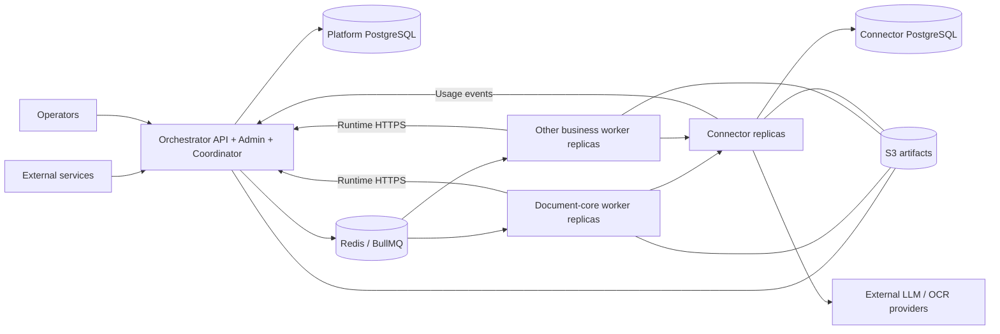
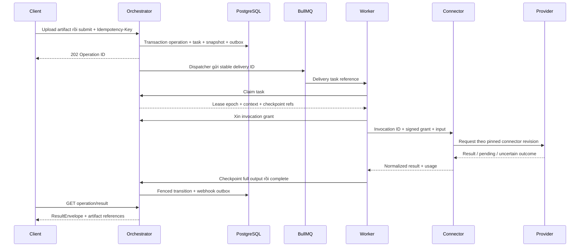

# 02 — Kiến trúc ứng dụng và dữ liệu

## Ranh giới triển khai



| Thành phần | Sở hữu | Không chịu trách nhiệm |
|---|---|---|
| Orchestrator | Auth, profile, registry, operation/task state, leases, checkpoint metadata, artifact ownership, outbox, coordinator, audit, usage projection | Parse tài liệu, prompt nghiệp vụ, gọi provider trực tiếp |
| Business worker | Recipe, business validation, prompts, xử lý bước, output schema, document-kit | Ghi platform DB, quản lý provider secrets, tự chọn queue của business khác |
| Connector | Adapter/mapping, credential/config revision, invocation ledger, provider quota, usage events | Điều phối workflow, quyết định nghiệp vụ, cấp quyền client |
| PostgreSQL | Trạng thái bền vững, constraints, transactions | Truyền file lớn |
| Redis/BullMQ | Vận chuyển lệnh, delayed delivery, quota coordination | Nguồn sự thật duy nhất của operation |
| S3 | File nguồn, output lớn, full checkpoints/session objects | Authorization nghiệp vụ độc lập với platform |

Coordinator gộp trong subproject Orchestrator. Ban đầu có thể cùng container với API qua lifecycle server rõ ràng; background loops bắt buộc dùng DB claims/leases khi có nhiều replica. Nếu đo tải cho thấy cần tách process API và background thì dùng cùng codebase/domain, không tạo thêm service nghiệp vụ Coordinator.

Document worker riêng được thay bằng `packages/document-kit` dùng trong business worker. Tác vụ parser nặng cần giới hạn process/thread concurrency, bộ nhớ, timeout; không được chặn event loop làm mất heartbeat.

## Luồng tiếp nhận đến kết quả



202 chỉ bảo đảm đã persist operation/outbox thành công, không bảo đảm provider đã bắt đầu. Redis mất message được reconcile từ task/outbox trong DB; việc này phải được fault-test trước khi đưa vào SLA.

## Tính đúng đắn khi phân tán

1. **Submit idempotency**: unique key theo tenant/key/action; cùng body trả operation cũ, khác body 409. Hash dùng canonical request và artifact identity.
2. **Outbox**: ghi state và lệnh dispatch cùng transaction; dispatcher có thể gửi lại. Queue delivery là at-least-once.
3. **Lease/fencing**: claim cấp `leaseEpoch` tăng dần; heartbeat/checkpoint/complete phải dùng epoch hiện hành. Worker cũ không được ghi đè kết quả hoặc cancel.
4. **Checkpoint**: lưu full output và input hash theo step key ổn định. Preview UI không được dùng để resume. Object phải finalized trước khi tham chiếu bền vững.
5. **Invocation dedup**: Connector lưu invocation ID/hash trước dispatch. Crash sau provider nhận request có thể dẫn tới `UNKNOWN`; không cam kết exactly-once inference nếu provider không hỗ trợ idempotency/reconciliation.
6. **Usage**: Connector phát event mỗi actual attempt; platform dedup event ID. Parent workflow chỉ tổng hợp. Cancel không xóa usage đã phát sinh.

## Workflow, wait và state

Operation đi qua ACCEPTED → QUEUED → RUNNING; có thể WAITING_CHILDREN, WAITING_INPUT, RETRY_PENDING. Terminal là SUCCEEDED, FAILED, CANCELLED, TIMED_OUT. Progress là chỉ báo, không dùng để suy luận terminal.

Parent tạo child dependencies và continuation qua runtime transaction rồi nhường slot. Join v1 là all-success; thất bại được đưa vào failure continuation theo policy. Human wait v1 chỉ một wait tại root, sau join. Resume kiểm tra wait ID, schema và expected state version, không chạy lại task bằng random identity. Terminal không resume; replay tạo operation mới, có liên kết `replayOf`.

Platform sở hữu business retry budget và deadline; BullMQ chỉ phục hồi delivery. Provider retry phải phân biệt chưa gửi, đã xử lý, hoặc không biết. Không nhân số lần retry giữa SDK, Connector, BullMQ và workflow.

## Dữ liệu và quyền sở hữu

Platform DB: Tenant, ApiKey, BusinessVersion, ProfileRevision, Operation, Task, TaskDependency, StepCheckpoint, HumanWait, Artifact, Outbox, WebhookDelivery, UsageProjection, AuditLog. Connector DB: ConnectorRevision, SecretVersion, Invocation, UsageOutbox. Chi tiết constraints trong [data spec](../docs/04-data-state.md).

Baseline có thể dùng một EC2 PostgreSQL chuyên biệt với hai database/role riêng. Worker không có DB credentials. Connector không ghi trực tiếp platform schema. S3 key là nội bộ, client chỉ thấy artifact ID và đường tải đã kiểm tra quyền. Dữ liệu giữ cho operation đang chạy/chờ phải được pin khỏi garbage collection.

## Cấu trúc source và mở rộng

```text
du-rework/
  services/orchestrator/     API, Admin, generic runtime/coordinator
  services/connector/        management, invocation, adapters, ledger
  businesses/document-core/  6 actions, recipes, schemas, business tests
  businesses/<new-business>/ image và manifest độc lập
  packages/contracts/       wire schemas và version compatibility
  packages/worker-sdk/       claim, heartbeat, checkpoint, wait, complete
  packages/connector-client/ typed invocation client
  packages/document-kit/     parsing, conversion, diff, archive utilities
  packages/observability/    structured logs, tracing, metrics
  infra/                    deployment assets
  tests/                    cross-service contract, E2E, fault/load tests
  architecture/             hồ sơ review này
```

Manifest version là immutable và có digest; queue gắn business/exact version. Deploy version mới song song, enable rồi chuyển profile; giữ worker version cũ khi còn operation hoặc human wait có thể resume. Rollback profile pointer không viết lại snapshot của operation đang chạy.
