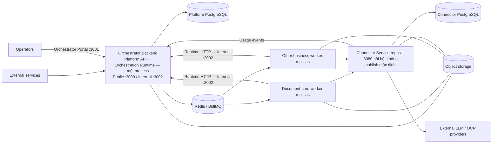
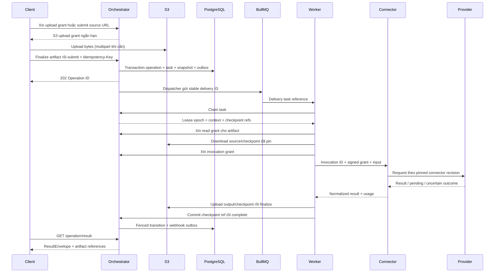

# 02 — Kiến trúc ứng dụng và dữ liệu

## Ranh giới triển khai



Public JSON `:3000` chặn admin/runtime/internal sớm bằng generic 404 (`http/ingress-guard.ts`), kể cả khi caller có credential hợp lệ; audience do listener quyết định, không lấy từ `Host`/forwarding headers. Internal JSON `:3002` giữ route public/admin/runtime cho BFF/workers/services với auth/tenant/business policy đầy đủ. Orchestrator Portal/BFF giữ listener riêng `:3001` (UI/session/OIDC + BFF allowlist, không proxy tùy ý). Connector `:8080` không publish host mặc định; debug local chỉ opt-in qua `compose/local-debug.yml` bind literal `127.0.0.1`. Chi tiết ingress xem [deployment guide](../docs/12b-deployment-guide.md#11-pm-m02-ingress-matrix). `BIND_ADDRESS` mặc định `127.0.0.1` chỉ áp cho mapping 3000/3001.

| Thành phần | Sở hữu | Không chịu trách nhiệm |
|---|---|---|
| Orchestrator Backend | Auth, profile, registry, operation/task state, leases, checkpoint metadata, artifact ownership, outbox, generic coordinator module, audit, usage projection | Parse tài liệu, prompt nghiệp vụ, gọi provider trực tiếp |
| Business worker | Recipe, business validation, prompts, xử lý bước, output schema, document-kit | Ghi platform DB, quản lý provider secrets, tự chọn queue của business khác |
| Connector | Adapter/mapping, credential/config revision, invocation ledger, provider quota, usage events | Điều phối workflow, quyết định nghiệp vụ, cấp quyền client |
| PostgreSQL | Trạng thái bền vững, constraints, transactions | Truyền file lớn |
| Valkey/BullMQ (Redis-compatible) | Vận chuyển lệnh, delayed delivery, quota coordination | Nguồn sự thật duy nhất của operation |
| S3 | File nguồn, output lớn, full checkpoints/session objects | Authorization nghiệp vụ độc lập với platform |

Queue mặc định là **Valkey + BullMQ**. Valkey là fork BSD của Redis do Linux Foundation, wire-protocol tương thích 100% nên `BullMQ` giữ nguyên — chỉ đổi `REDIS_URL` sang Valkey. Không dùng Redis 7.4+ RSAL cho deploy mới. `pgboss` (Postgres queue) là phương án thay thế khi muốn bỏ hẳn Valkey để chỉ còn `Postgres+S3`, nhưng không chạy chung với `BullMQ` trên cùng một queue — phải chọn một. Quyết định Valkey+BullMQ được ghi để throughput 10k-30k job/s và latency 1-5ms thay vì 300-1k job/s của pgboss.

Production không lưu file bytes trong PostgreSQL hoặc Valkey. PostgreSQL giữ artifact metadata/hash/object ref và trạng thái; BullMQ/Valkey chỉ chở task reference. Slice hiện tại vẫn ghi `artifact_blobs` trong PostgreSQL, nên chưa đạt kiến trúc mục tiêu. Migration và acceptance được theo dõi tại [plan storage/logging](../tasks/DEPLOY-STORAGE-LOGGING-2026-09-24.md). Khi bật S3, Postgres chỉ giữ `artifact_ref (s3_key, etag, size)` và con trỏ operation/task — không lưu context/input/output hay bytes.

Coordinator gộp trong subproject Orchestrator. Ban đầu có thể cùng container với API qua lifecycle server rõ ràng; background loops bắt buộc dùng DB claims/leases khi có nhiều replica. Nếu đo tải cho thấy cần tách process API và background thì dùng cùng codebase/domain, không tạo thêm service nghiệp vụ Coordinator.

Document worker riêng được thay bằng `packages/document-kit` dùng trong business worker. Tác vụ parser nặng cần giới hạn process/thread concurrency, bộ nhớ, timeout; không được chặn event loop làm mất heartbeat.

## Luồng tiếp nhận đến kết quả



202 chỉ bảo đảm đã persist operation/outbox thành công, không bảo đảm provider đã bắt đầu. Valkey mất message được reconcile từ task/outbox trong DB; việc này phải được fault-test trước khi đưa vào SLA.

Source URL là nhánh ingestion riêng: worker tải URL có kiểm soát, stream vào S3, xác minh rồi pin artifact bất biến trước khi parse. Retry/resume không phụ thuộc URL gốc sau lần tải thành công. Không coi URL trong input là artifact `READY` hay đưa signed URL vào queue. Sơ đồ trên minh họa nhánh client-upload; source URL có thêm bước ingestion trước bước xử lý nghiệp vụ.

### Ingest / OCR là luồng Connector thông thường

Mọi service — gồm `ingest` (`parse`, `ocr`, `digitize`, `split`) — đều đi qua **Connector gateway** như luồng `extract/analyze/transform` thông thường. Không có OCR local trong worker.

*   Worker chỉ làm `sharp` nhẹ để convert PDF page → PNG (1024px) nếu cần, rồi gọi `Connector` qua `invocation grant` như mọi action khác. Toàn bộ 6 actions đều dùng chung `ExternalApiConnection` → `Connector` → `External LLM`.
*   Prompt OCR (extract text/layout) nằm trong `ExternalApiConnection` / `ProfileEndpoint` overrides của Connector, versioned theo `ConnectorRevision`. Worker không chứa prompt OCR hay secret provider.
*   `lib/parsers/*` (`mammoth`, `pdf-parse`, `xlsx`) chỉ dùng cho fallback/offline hoặc `document-kit` utilities, không nằm trên hot path ingest khi S3+LLM đã bật. Task ingest là IO-bound (chờ LLM), không block event loop OCR CPU.

## Tính đúng đắn khi phân tán

1. **Submit idempotency**: unique key theo tenant/key/action; cùng body trả operation cũ, khác body 409. Hash dùng canonical request và artifact identity.
2. **Outbox**: ghi state và lệnh dispatch cùng transaction; dispatcher có thể gửi lại. Queue delivery là at-least-once.
3. **Lease/fencing**: claim cấp `leaseEpoch` tăng dần; heartbeat/checkpoint/complete phải dùng epoch hiện hành. Worker cũ không được ghi đè kết quả hoặc cancel.
4. **Checkpoint**: lưu full output và input hash theo step key ổn định. Preview UI không được dùng để resume. Object phải finalized trước khi tham chiếu bền vững.
5. **Invocation dedup**: Connector lưu invocation ID/hash trước dispatch. Crash sau provider nhận request có thể dẫn tới `UNKNOWN`; không cam kết exactly-once inference nếu provider không hỗ trợ idempotency/reconciliation.
6. **Usage**: Connector phát event mỗi actual attempt; platform dedup event ID. Parent workflow chỉ tổng hợp. Cancel không xóa usage đã phát sinh.

## Workflow, wait và state

Operation đi qua ACCEPTED → QUEUED → RUNNING; có thể WAITING_CHILDREN, WAITING_INPUT, RETRY_PENDING. Terminal là SUCCEEDED, FAILED, CANCELLED, TIMED_OUT. Progress là chỉ báo, không dùng để suy luận terminal.

Parent tạo child dependencies và continuation qua runtime transaction rồi nhường slot. Join v1 là all-success; thất bại được đưa vào failure continuation theo policy. Human wait v1 chỉ một wait tại root, sau join. Resume kiểm tra wait ID, schema và expected state version, không chạy lại task bằng random identity. Terminal không resume; replay tạo operation mới, có liên kết `replayOf`.

Platform sở hữu business retry budget và deadline; BullMQ chỉ phục hồi delivery. Provider retry phải phân biệt chưa gửi, đã xử lý, hoặc không biết. Không nhân số lần retry giữa SDK, Connector, BullMQ và workflow.

## Dữ liệu và quyền sở hữu

Platform DB: Tenant, ApiKey, BusinessVersion, ProfileRevision, Operation, Task, TaskDependency, StepCheckpoint, HumanWait, Artifact, Outbox, WebhookDelivery, UsageProjection, AuditLog. Connector DB: ConnectorRevision, SecretVersion, Invocation, UsageOutbox. Chi tiết constraints trong [data spec](../docs/04-data-state.md).

PostgreSQL có thể tự quản trên EC2 hoặc dùng RDS; Redis/Valkey có thể tự quản trên EC2 hoặc dùng ElastiCache. Worker không có DB credentials. Connector không ghi trực tiếp platform schema. S3 key là nội bộ, client chỉ thấy artifact ID và đường tải đã kiểm tra quyền. Dữ liệu giữ cho operation đang chạy/chờ phải được pin khỏi garbage collection.

## Cấu trúc source và mở rộng

```text
du-rework/
  services/orchestrator/     API, Admin, generic runtime/coordinator
  services/connector/        management, invocation, adapters, ledger
  businesses/document-core/  6 actions, recipes, schemas, business tests
  businesses/<new-business>/ image và manifest độc lập
  packages/contracts/       wire schemas và version compatibility
  packages/worker-sdk/       claim, heartbeat, checkpoint, wait, complete
  packages/connector-client/ typed invocation client
  packages/document-kit/     parsing, conversion, diff, archive utilities
  packages/observability/    structured logs, tracing, metrics
  infra/                    deployment assets
  tests/                    cross-service contract, E2E, fault/load tests
  architecture/             hồ sơ review này
```

Manifest version là immutable và có digest; queue gắn business/exact version. Deploy version mới song song, enable rồi chuyển profile; giữ worker version cũ khi còn operation hoặc human wait có thể resume. Rollback profile pointer không viết lại snapshot của operation đang chạy.
