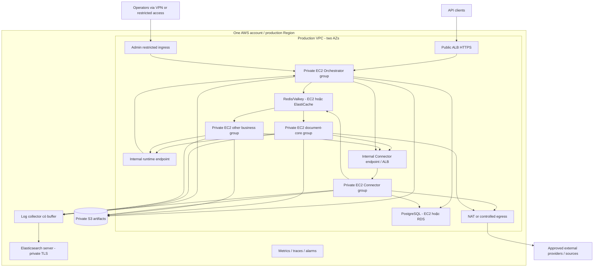

# 06 — Kiến trúc triển khai AWS trên EC2

## Giả định và quyết định

Một AWS account, một Region cho production; VPC riêng theo môi trường, ít nhất hai AZ được chuẩn bị để mở rộng. Orchestrator và Connector chạy trong **hai container riêng trên cùng một EC2** ở pilot; business workers chạy trên EC2 khác. PostgreSQL và Redis/Valkey ở các host hoặc dịch vụ managed riêng, không cùng host ứng dụng. Docker images immutable, quản lý process bằng systemd/Docker Compose trên từng host ở giai đoạn đầu. Compose một host không phải bộ điều phối multi-host.

Private S3 là **bắt buộc cho bytes của source, result và full checkpoint**; PostgreSQL chỉ giữ metadata/ref, Valkey chỉ giữ delivery/control metadata. Queue mặc định là **Valkey + BullMQ** (BSD, wire-compatible với Redis) — giữ nguyên `BullMQ` code, chỉ đổi `REDIS_URL` sang Valkey; không dùng Redis 7.4+ RSAL cho deploy mới. `pgboss` là phương án thay thế để bỏ hẳn Valkey (chỉ còn Postgres+S3) nhưng không chạy chung với BullMQ trên cùng queue. RDS PostgreSQL và ElastiCache Valkey là **hai lựa chọn triển khai tùy chọn, độc lập** với phương án tự quản trên EC2; cùng một contract ứng dụng, không khóa vào một nhà cung cấp DB/cache. Elasticsearch server là đích tập trung bắt buộc cho application/container logs qua collector có buffer; lỗi Elasticsearch không làm hỏng request/operation. Một account không đồng nghĩa cùng mạng quyền hoặc credential; tách IAM roles, SG, secrets và data theo môi trường.

## Topology mục tiêu

Sơ đồ là phân bố logic; O và C ở cùng EC2 pilot nhưng khác container, endpoint, credential và quyền DB. Worker không nhận public ingress. Worker remote download chỉ bật khi có policy; provider inference chỉ đi từ Connector. S3 access nên dùng VPC endpoint khi phù hợp để tránh đưa file qua NAT không cần thiết. Runtime/Admin không được vô tình xuất ra public ALB bằng catch-all route. Audit nghiệp vụ bền vững ở DB, Elasticsearch là bản tìm kiếm/quan sát, không phải nguồn sự thật.

## Luồng file bắt buộc trước production

1. Với external multipart push, Orchestrator xác thực tenant/size/type, tạo artifact `STAGING` và cấp upload grant ngắn hạn vào private S3. Client upload trực tiếp (hoặc compatibility endpoint chỉ stream qua S3, không buffer toàn file), rồi gọi finalize; chỉ artifact đã xác minh size/checksum/ownership và ở trạng thái `READY` mới được submit. File lớn dùng S3 multipart upload và abort incomplete uploads; không dùng ETag multipart làm SHA-256 toàn file. [AWS multipart upload](https://docs.aws.amazon.com/AmazonS3/latest/userguide/mpuoverview.html).
2. Với source URL, Orchestrator có thể nhận operation 202 và tạo ingestion task; business task chưa runnable. Worker ingestion có egress policy tải theo streaming limit, chặn SSRF/redirect/DNS rebinding, ghi **một bản bất biến vào S3 trước khi parse**. Retry/resume đọc cùng artifact đã pin, không tải lại URL có thể đổi nội dung/hết hạn. Nếu download chưa hoàn tất, retry có thể tải lại theo policy; operation chưa được coi có source `READY`.
3. Queue chỉ mang task/operation/ref, không mang bytes hoặc signed URL. Orchestrator giữ metadata, object key nội bộ, hash, tenant, retention và quyền; worker lấy read/write grant theo task lease. Result/checkpoint finalize object trước khi commit ref. Orphan `STAGING`, incomplete multipart và temp files được cleanup nhưng không xóa source/checkpoint của active hoặc waiting operation.
   Giới hạn kích thước JSON input/queue/DB metadata để base64 file không thể đi vòng qua S3; inline text nhỏ là ngoại lệ có budget riêng.
4. Không có đường ghi mới vào `artifact_blobs`; migration của dữ liệu cũ cần backfill + đối chiếu hash/ref, rollback/dual-read có thời hạn, rồi mới loại bỏ PG blob. Không xóa bytes cũ chỉ vì bản ghi metadata đã trỏ S3.

## Hai cấu hình triển khai cần phân biệt

| Vai trò | Tối giản để pilot | Khi cần chịu lỗi instance/AZ |
|---|---|---|
| Orchestrator + Connector | 1 EC2, hai container/image/credential riêng; API/Admin/coordinator ở Orchestrator | Ít nhất 2 EC2 mỗi role qua LB, distributed claims/session configuration |
| document-core | 1 EC2, giới hạn parser concurrency | Ít nhất 2 EC2 chia AZ, Auto Scaling group riêng |
| Business bổ sung | EC2/group riêng khi xuất hiện | Scale riêng theo queue/version |
| PostgreSQL | EC2 riêng **hoặc** RDS PostgreSQL; platform/connector DB role tách | Self-host: replication/fencing; RDS: Multi-AZ và reconnect/failover test |
| Redis/Valkey | EC2 riêng **hoặc** ElastiCache Valkey | Replica/failover đã test với BullMQ; chọn cluster mode theo client compatibility |
| Object storage | Private S3, bắt buộc | Versioning/lifecycle/backup theo retention, active refs được pin |
| Log search | Elasticsearch server riêng, collector buffer tại app hosts | Retention/ILM, collector replay và alert khi ingest lag |

Số EC2 pilot tùy lựa chọn managed/self-hosted; việc gộp O/C giảm một host nhưng không phải HA. Không cam kết availability nhiều AZ nếu app, DB, Redis/Valkey, Elasticsearch hoặc NAT/endpoint còn single point of failure.

Self-hosted PostgreSQL HA không đạt được chỉ bằng thêm standby: cần replication mode, promotion authority, connection endpoint, fencing và runbook split-brain. RDS Multi-AZ cũng cần diễn tập reconnect sau failover. Redis/Valkey replication có thể mất write khi failover; DB reconciliation phải khôi phục queue, còn quota phải bảo thủ sau counter loss. ElastiCache cluster mode enabled cần client cluster-aware; không bật chỉ vì chọn managed. Chứng minh tương thích BullMQ/client đã pin trước bật failover tự động. Kubernetes không cần cho baseline này. [RDS Multi-AZ](https://docs.aws.amazon.com/AmazonRDS/latest/UserGuide/Concepts.MultiAZ.Failover.html), [ElastiCache cluster mode](https://docs.aws.amazon.com/AmazonElastiCache/latest/dg/modify-cluster-mode.html).

## Network và Security Groups

Các port dưới là **quy ước đề xuất**, phải khớp container/IaC thực tế. Internal TLS terminate tại proxy/LB hoặc service; không coi private subnet là thay thế service auth.

| Nguồn | Đích | Port | Mục đích |
|---|---|---|---|
| Client internet hoặc approved CIDRs | Public ALB | 443 | Public API |
| ALB SG | Orchestrator SG | 8443 | Target HTTPS và health checks |
| VPN/restricted admin ingress | Orchestrator admin target | 8443 | Admin UI/API; RBAC vẫn bắt buộc |
| Worker/Connector SG | Internal runtime LB/Orchestrator | 443/8443 | Runtime; Connector chỉ usage/artifact scopes |
| Worker/Orchestrator SG | Internal Connector LB | 443 | Invocation / management theo scope |
| Internal Connector LB SG | Connector SG | 8443 | Target HTTP API qua TLS |
| Orchestrator/Connector SG | PostgreSQL SG | 5432 TLS | Đúng DB role; worker không được phép |
| Orchestrator/Worker/Connector SG | Redis SG | 6379 TLS configured | Queue/quota, ACL theo prefix/role đã test |
| Services được cấp | S3 endpoint / AWS APIs | 443 | Scoped object access, logging, secrets |
| Log collector SG | Elasticsearch private endpoint | 443/TLS | Batch ingest, API key chỉ ghi vào data stream đúng môi trường |
| Connector SG | Approved provider egress | 443 | LLM/OCR |

App target SG chỉ nhận từ LB SG cho public listener, không mở thẳng internet. AWS hướng dẫn dùng LB security group làm nguồn ingress của targets và mở đúng target/health-check ports. [AWS ALB security groups](https://docs.aws.amazon.com/elasticloadbalancing/latest/application/load-balancer-update-security-groups.html).

Security Group không phải URL/domain filter: provider/webhook/remote URL allowlist cần application validation hoặc egress proxy/firewall. Chặn metadata/private/link-local destinations ở SSRF layer, kiểm lại DNS/redirect. Runtime public path deny phải có negative E2E test. Không mở SSH ra internet; ưu tiên SSM với IAM và audit.

## IAM, storage và cấu hình

- EC2 instance role riêng từng host/group; vì Orchestrator và Connector cùng EC2 pilot, **instance role không tạo isolation giữa hai container**. Dùng credential cấp theo service qua broker/proxy/secret scope phù hợp; không cấp quyền bucket/provider secret hợp nhất cho cả host rồi coi container là ranh giới IAM. Worker không được đọc provider secrets hoặc toàn bucket chỉ vì cùng account.
- Object access bằng grant/presigned URL hoặc broker phù hợp artifact ownership; giới hạn method/key/expiry. Signed URL là bearer capability, không ghi logs. Với temporary credentials, URL hết hạn khi credential hết hạn dù TTL request dài hơn. [AWS S3 presigned URLs](https://docs.aws.amazon.com/AmazonS3/latest/userguide/using-presigned-url.html).
- S3 private, encryption, lifecycle; EBS encrypted cho DB/Redis. Không chia sẻ host paths giữa EC2. Scratch worker có quota, cleanup, không chứa checkpoint duy nhất.
- Image chứa code/tools đã pin; không chứa `.env`, credentials hoặc dữ liệu khách. Runtime config gồm DB/Redis endpoints, service identity, storage bucket/prefix, signing keys, quotas, limits, retention; secrets qua secret references.
- Platform và Connector có thể dùng cùng PostgreSQL instance/cluster ban đầu nhưng database/roles riêng. Nếu Connector ledger gây tải lớn, chuyển Connector DB độc lập theo migration plan mà worker không đổi code.
- App chỉ phát JSON log đã redacted ra stdout; collector theo host/container gắn service/version/environment, buffer trên disk có quota, retry/backoff và gửi TLS tới Elasticsearch. Không gửi trực tiếp từ request handler; kiểm tra redaction trước collector và ở ingest pipeline. Không log raw file, prompt, secret, signed URL, URL có query token, webhook payload hoặc arbitrary error detail.

## Quy trình deploy và rollback

1. Chốt riêng PostgreSQL EC2/RDS và Redis/Valkey EC2/ElastiCache; chuẩn bị VPC/subnets/SG/IAM/S3, DNS/TLS, secrets, Elasticsearch + collector, backup. Ghi bằng IaC trước release, không chỉ thao tác console.
2. Build/test images trong CI, pin digest; scan dependencies/images; publish ECR. Version runtime/schema/manifest độc lập nhưng có compatibility matrix.
3. Backup và chạy migrations theo expand/contract; chỉ một migration owner. Khởi động PostgreSQL/Redis rồi Connector/Orchestrator và worker, health/readiness checks theo dependency.
4. Worker đăng ký version disabled; smoke test nội bộ, kiểm tra capabilities/heartbeat. Enable rồi chuyển profile cho tenant canary, quan sát error/latency/usage.
5. Rolling deploy từng group. Worker scale-in/deploy ngừng claim, hoàn thành hoặc checkpoint/yield rồi shutdown; hết grace thì fenced recovery xử lý. Dùng ASG lifecycle hook nếu autoscaling.
6. Rollback image/profile tới version tương thích. Không rollback DB phá hủy cột sau khi code mới đã ghi dữ liệu. Giữ old workers cho các snapshot/waits cũ; chỉ retire khi không còn dependency.

Health live chỉ kiểm tra process; ready phải phản ánh khả năng nhận công việc. Provider lỗi không nhất thiết làm toàn bộ Connector liveness fail gây restart storm; dùng readiness/circuit trạng thái theo dependency có giải thích. Không triển khai hay cutover AWS trong phạm vi bộ tài liệu này.
