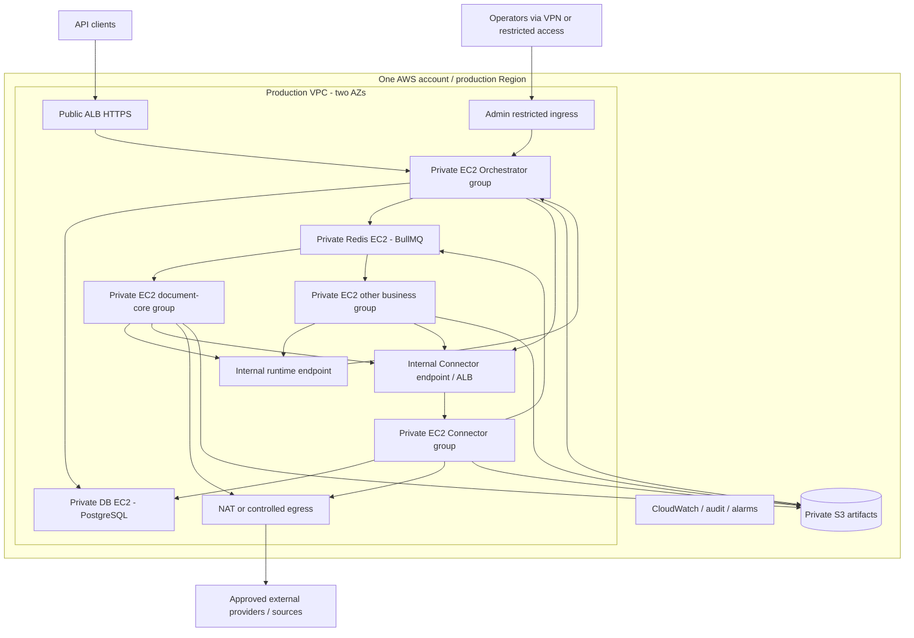

# 06 — Kiến trúc triển khai AWS trên EC2

## Giả định và quyết định

Một AWS account, một Region cho production; VPC riêng theo môi trường, ít nhất hai AZ được chuẩn bị để mở rộng. Orchestrator, business workers, Connector, PostgreSQL và Redis chạy trên **các EC2 riêng theo vai trò**. Không đặt database cùng EC2 với application. Docker images immutable, quản lý process bằng systemd/Docker Compose trên từng host ở giai đoạn đầu. Compose một host không phải bộ điều phối multi-host.

S3 được đề xuất làm object storage managed; ALB, ECR, CloudWatch, KMS/Secrets Manager, SSM là dịch vụ hỗ trợ trong cùng account. Không dùng RDS/ElastiCache làm baseline vì yêu cầu DB trên EC2. Một account không đồng nghĩa cùng mạng quyền hoặc cùng credential; tách IAM roles, SG, secrets và data theo môi trường.

## Topology mục tiêu

Sơ đồ là phân bố logic; nhóm có thể có một hoặc nhiều EC2. Worker không nhận public ingress. Worker remote download chỉ bật khi có policy; provider inference chỉ đi từ Connector. S3 access nên dùng VPC endpoint khi phù hợp để tránh đưa file qua NAT không cần thiết. Runtime/Admin không được vô tình xuất ra public ALB bằng catch-all route.

## Hai cấu hình triển khai cần phân biệt

| Vai trò | Tối giản để pilot | Khi cần chịu lỗi instance/AZ |
|---|---|---|
| Orchestrator | 1 EC2, API/Admin/coordinator cùng service | Ít nhất 2 EC2 qua ALB, distributed claims/session configuration |
| document-core | 1 EC2, giới hạn parser concurrency | Ít nhất 2 EC2 chia AZ, Auto Scaling group riêng |
| Business bổ sung | EC2/group riêng khi xuất hiện | Scale riêng theo queue/version |
| Connector | 1 EC2, internal DNS | Ít nhất 2 EC2 + internal LB, quota dùng Redis chung |
| PostgreSQL | 1 EC2, EBS riêng; platform/connector DB role tách | Primary + standby EC2 khác AZ, replication/failover/fencing đã diễn tập |
| Redis | 1 EC2, persistent EBS, persistence cấu hình | Primary/replica + quorum failover đã kiểm thử client/BullMQ |
| Object storage | Private S3 | Cùng S3, versioning/lifecycle/backup theo retention |

Pilot có ít nhất 5 EC2 theo vai trò cơ bản, chưa tính management/failover nodes. Pilot **không phải HA**, dù ALB có hai AZ. Không cam kết availability nhiều AZ nếu DB/Redis chỉ có một instance hoặc NAT/endpoint còn single point of failure.

Self-hosted PostgreSQL HA không đạt được chỉ bằng thêm standby: cần chọn replication mode, promotion authority, connection endpoint, fencing primary cũ và runbook split-brain. Redis replication có thể mất write khi failover; DB reconciliation phải khôi phục queue, còn quota phải bảo thủ để tránh burst vượt provider sau counter loss. Chọn topology Redis và chứng minh tương thích phiên bản BullMQ đã pin trước bật failover tự động. Kubernetes không cần cho baseline này.

## Network và Security Groups

Các port dưới là **quy ước đề xuất**, phải khớp container/IaC thực tế. Internal TLS terminate tại proxy/LB hoặc service; không coi private subnet là thay thế service auth.

| Nguồn | Đích | Port | Mục đích |
|---|---|---|---|
| Client internet hoặc approved CIDRs | Public ALB | 443 | Public API |
| ALB SG | Orchestrator SG | 8443 | Target HTTPS và health checks |
| VPN/restricted admin ingress | Orchestrator admin target | 8443 | Admin UI/API; RBAC vẫn bắt buộc |
| Worker/Connector SG | Internal runtime LB/Orchestrator | 443/8443 | Runtime; Connector chỉ usage/artifact scopes |
| Worker/Orchestrator SG | Internal Connector LB | 443 | Invocation / management theo scope |
| Internal Connector LB SG | Connector SG | 8443 | Target HTTP API qua TLS |
| Orchestrator/Connector SG | PostgreSQL SG | 5432 TLS | Đúng DB role; worker không được phép |
| Orchestrator/Worker/Connector SG | Redis SG | 6379 TLS configured | Queue/quota, ACL theo prefix/role đã test |
| Services được cấp | S3 endpoint / AWS APIs | 443 | Scoped object access, logging, secrets |
| Connector SG | Approved provider egress | 443 | LLM/OCR |

App target SG chỉ nhận từ LB SG cho public listener, không mở thẳng internet. AWS hướng dẫn dùng LB security group làm nguồn ingress của targets và mở đúng target/health-check ports. [AWS ALB security groups](https://docs.aws.amazon.com/elasticloadbalancing/latest/application/load-balancer-update-security-groups.html).

Security Group không phải URL/domain filter: provider/webhook/remote URL allowlist cần application validation hoặc egress proxy/firewall. Chặn metadata/private/link-local destinations ở SSRF layer, kiểm lại DNS/redirect. Runtime public path deny phải có negative E2E test. Không mở SSH ra internet; ưu tiên SSM với IAM và audit.

## IAM, storage và cấu hình

- EC2 instance role riêng từng group; quyền ECR pull, logs và secrets tối thiểu. Worker không được đọc provider secrets hoặc toàn bucket chỉ vì cùng account.
- Object access bằng grant/presigned URL hoặc broker phù hợp artifact ownership; giới hạn method/key/expiry. Signed URL là bearer capability, không ghi logs. Với temporary credentials, URL hết hạn khi credential hết hạn dù TTL request dài hơn. [AWS S3 presigned URLs](https://docs.aws.amazon.com/AmazonS3/latest/userguide/using-presigned-url.html).
- S3 private, encryption, lifecycle; EBS encrypted cho DB/Redis. Không chia sẻ host paths giữa EC2. Scratch worker có quota, cleanup, không chứa checkpoint duy nhất.
- Image chứa code/tools đã pin; không chứa `.env`, credentials hoặc dữ liệu khách. Runtime config gồm DB/Redis endpoints, service identity, storage bucket/prefix, signing keys, quotas, limits, retention; secrets qua secret references.
- Platform và Connector có thể dùng cùng PostgreSQL EC2 ban đầu nhưng database/roles riêng. Khi Connector ledger gây tải lớn, chuyển Connector DB sang EC2 riêng theo migration plan mà worker không đổi code.

## Quy trình deploy và rollback

1. Chuẩn bị VPC/subnets/SG/IAM/EBS/S3, DNS/TLS, secrets, logging và backup. Ghi bằng IaC trước release, không chỉ thao tác console.
2. Build/test images trong CI, pin digest; scan dependencies/images; publish ECR. Version runtime/schema/manifest độc lập nhưng có compatibility matrix.
3. Backup và chạy migrations theo expand/contract; chỉ một migration owner. Khởi động PostgreSQL/Redis rồi Connector/Orchestrator và worker, health/readiness checks theo dependency.
4. Worker đăng ký version disabled; smoke test nội bộ, kiểm tra capabilities/heartbeat. Enable rồi chuyển profile cho tenant canary, quan sát error/latency/usage.
5. Rolling deploy từng group. Worker scale-in/deploy ngừng claim, hoàn thành hoặc checkpoint/yield rồi shutdown; hết grace thì fenced recovery xử lý. Dùng ASG lifecycle hook nếu autoscaling.
6. Rollback image/profile tới version tương thích. Không rollback DB phá hủy cột sau khi code mới đã ghi dữ liệu. Giữ old workers cho các snapshot/waits cũ; chỉ retire khi không còn dependency.

Health live chỉ kiểm tra process; ready phải phản ánh khả năng nhận công việc. Provider lỗi không nhất thiết làm toàn bộ Connector liveness fail gây restart storm; dùng readiness/circuit trạng thái theo dependency có giải thích. Không triển khai hay cutover AWS trong phạm vi bộ tài liệu này.
