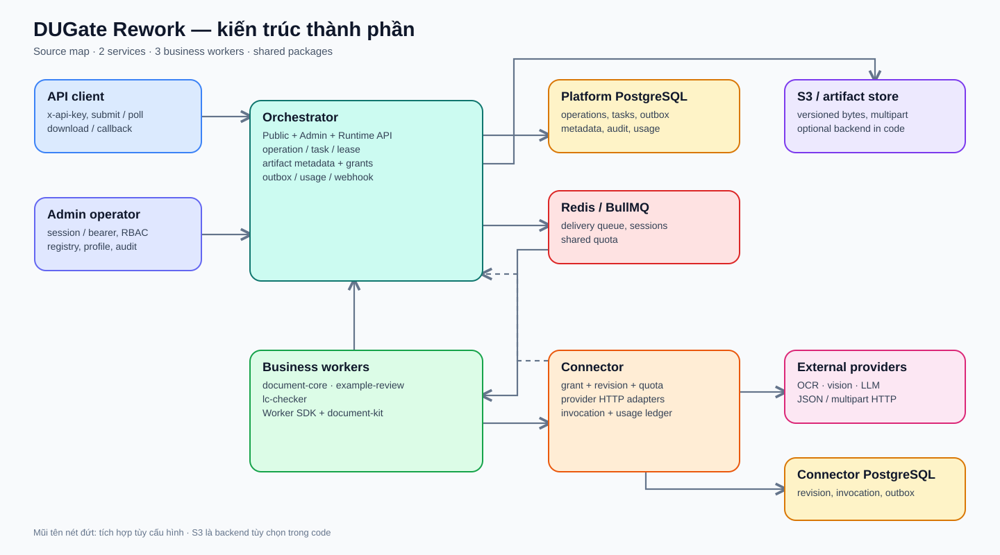
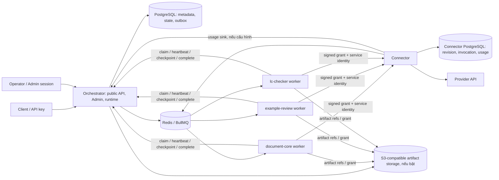

# 10 — Kiến trúc hệ thống hiện hành

**Phạm vi:** toàn bộ workspace `du-rework/`, đối chiếu cấu trúc source ngày 2026-10-04. Đây là bản đồ implementation, không phải xác nhận release. Các tài liệu `01–09` là hồ sơ thiết kế/đánh giá mục tiêu; [README](README.md) chỉ đường đọc và giải thích mức tin cậy.

## 1. Hệ thống giải quyết việc gì?

[Mở bản vẽ draw.io để chỉnh sửa](diagrams/system-components.drawio). Sơ đồ tách client/Admin, Orchestrator, ba business worker, Connector và các kho dữ liệu; mũi tên nét đứt là tích hợp phụ thuộc cấu hình. Các đường chi tiết được mô tả ở [12](12-flows-and-data.md).

DUGate Rework nhận yêu cầu xử lý tài liệu qua API bất đồng bộ. Client tải hoặc tham chiếu tài liệu, submit action/workflow, lấy operation ID, theo dõi trạng thái và đọc kết quả/artifact. Platform tách phần điều phối và dữ liệu dùng chung khỏi business xử lý tài liệu và khỏi provider gateway. Theo [workspace manifest](../pnpm-workspace.yaml), source chia thành hai service triển khai độc lập, ba business worker và sáu shared package.

Ba **vai trò triển khai** là Orchestrator, Business Worker và Connector. Vì worker được đóng gói theo từng business, trên đĩa chỉ có hai thư mục dưới `services/`; ba worker nằm dưới `businesses/`. Không có Coordinator service riêng trong source.

## 2. Ranh giới sở hữu

| Chủ thể | Sở hữu | Không sở hữu |
|---|---|---|
| Orchestrator | Public/Admin/runtime HTTP, tenant/API key, registry/profile, operation/task/lease, artifact metadata, outbox, usage projection, audit, webhook | Parser và business action, provider credential thực thi |
| Business worker | Manifest và action/workflow của business, xử lý file bằng `document-kit`, quyết định bước và kết quả | Platform PostgreSQL, tenant auth, generic lease/queue policy |
| Connector | Connector revision/credential, invocation ledger, quota provider, HTTP adapter, provider usage outbox | Operation lifecycle, business workflow |
| `orchestrator/packages/contracts` | DTO/schema và wire contract dùng chung | Persistence hoặc process lifecycle |

Ranh giới này được thực thi qua [Orchestrator router](../orchestrator/services/orchestrator/src/server.ts), [bootstrap](../orchestrator/services/orchestrator/src/app/bootstrap/create-app.ts), [Connector composition](../orchestrator/services/connector/src/composition.ts), [worker SDK](../orchestrator/packages/worker-sdk/src/worker.ts) và các package manifest. Các service hiện dùng `node:http` và raw `pg` trong source; mô tả Next.js/Drizzle ở tài liệu mục tiêu cũ không phản ánh implementation này.

## 3. Thành phần hạ tầng

| Hạ tầng | Vai trò hiện tại | Nguồn |
|---|---|---|
| PostgreSQL | Orchestrator lưu tenant, key, business version, operation, task, outbox, artifact metadata, usage/audit; Connector lưu revision, encrypted credential legacy, invocation và usage outbox. Migration của hai service riêng. | [Platform migrations](../orchestrator/services/orchestrator/migrations/), [Connector migrations](../orchestrator/services/connector/src/db/migrations/) |
| Redis/BullMQ | Task delivery, shared quota và một số session/challenge; task state và fencing authority ở PostgreSQL/runtime. | [Dispatcher](../orchestrator/services/orchestrator/src/modules/queue/dispatcher.ts), [Connector quota](../orchestrator/services/connector/src/quota-redis.ts) |
| S3-compatible storage | Artifact bytes, upload/multipart/version pin khi cấu hình S3. Orchestrator vẫn có backend PostgreSQL cho pilot/test. | [Artifact storage](../orchestrator/services/orchestrator/src/modules/artifacts/), [source ingestion](../orchestrator/services/orchestrator/src/modules/operations/ingestion-storage-s3.ts) |
| Vault | Credential source KV v2 và các đường key provider/Transit theo cấu hình. Không coi sự hiện diện của module là bằng chứng wiring/live deployment. | [Connector resolver](../orchestrator/services/connector/src/vault/), [Orchestrator encryption](../orchestrator/services/orchestrator/src/modules/encryption/) |
| External provider | JSON hoặc multipart HTTP qua Connector adapter/transport. | [Adapters](../orchestrator/services/connector/src/adapters/) |
| Log destination | `@du/observability` tạo log/context/redaction; collector Elasticsearch có source nhưng cần topology triển khai riêng. | [Observability](../orchestrator/packages/observability/src/), [log collector](../orchestrator/services/orchestrator/src/log-collector.ts) |

## 4. Luồng xử lý cấp cao

1. Client xác thực bằng `x-api-key`, submit action hoặc gọi upload. Orchestrator xác định tenant/profile/business version và ghi operation/task/outbox trong PostgreSQL.
2. Dispatcher đọc outbox và phát delivery vào queue BullMQ của đúng business/version. Source URL cần ingestion gate được consumer xử lý trước khi task business được phát.
3. Worker nhận delivery, gọi runtime API để claim lease, đọc context và ghi checkpoint/progress. Workflows có thể fan-out, wait-input, resume hoặc gọi Connector.
4. Connector kiểm service identity và signed invocation grant, pin revision/credential, giữ quota/ledger, gọi provider và lưu usage. Usage outbox có thể POST về Orchestrator.
5. Worker hoàn tất hoặc fail task qua runtime API. Client poll operation/result hoặc nhận webhook; artifact được đọc qua đường storage và policy mã hóa tương ứng.

Chi tiết các nhánh, trạng thái và owner nằm trong [12 — luồng và dữ liệu](12-flows-and-data.md).

## 5. Hiện trạng so với thiết kế mục tiêu

| Chủ đề | Trong source hiện tại | Tài liệu mục tiêu / lưu ý |
|---|---|---|
| HTTP platform | `node:http`; `server.ts` chọn nhóm route, `http/routes/` xử lý public/runtime/admin, `app/bootstrap/create-app.ts` lắp dependency và lifecycle | [02-application](02-application.md) mô tả một phần kiến trúc mục tiêu cũ; không dùng làm bằng chứng framework hiện hành. |
| Database | `pg` + SQL migration riêng service | Đề xuất Drizzle ở tài liệu cũ chưa phải dependency/source thực tế. |
| Admin UI | Server-rendered shell trong `orchestrator/src/app/admin/` | Có code; hiệu lực các auth mode và browser acceptance phải xem gate mới nhất. |
| Legacy API | `handleLegacyRoute` trong `compat/` được gọi từ `http/routes/public.ts`, gồm `/api/v1/docs/{action}`, multipart và `?sync=true` | Kiểm wire và end-to-end theo [legacy parity contract](../docs/39-legacy-parity-contract.md); có route không đồng nghĩa mọi parity gate đã đạt. |
| Storage | PostgreSQL hoặc S3 theo cấu hình, có migration/read-path code | Private versioned S3 là mục tiêu production; test fixture không chứng minh deployment. |
| Release | Source có nhiều vertical slice và test | [Task board](../tasks/README.md) và [review](../coordination/reports/review.md) vẫn là nguồn đánh giá gate, không suy ra release từ sơ đồ này. |

## 6. Đọc tiếp

- [11 — cấu trúc subproject](11-subprojects.md): mỗi service, worker, package và ranh giới dependency.
- [12 — luồng, state và contract](12-flows-and-data.md): submit, queue, Connector, artifact, kết quả.
- [13 — triển khai, bảo mật và vận hành](13-deployment-and-operations.md): môi trường, startup, test topology, gate.
- [14 — bản đồ tài liệu và nguồn sự thật](14-document-governance.md): dùng tài liệu nào cho mỗi câu hỏi.
- [15 — năng lực nghiệp vụ](15-business-capabilities.md): action/variant và ba worker.
- [16 — catalog giao tiếp](16-interface-catalog.md): các nhóm API và identity boundary.
- [17 — ví dụ Public API](17-public-api-examples.md) và [18 — ví dụ API nội bộ](18-internal-api-examples.md): request/response và điều kiện sử dụng.
