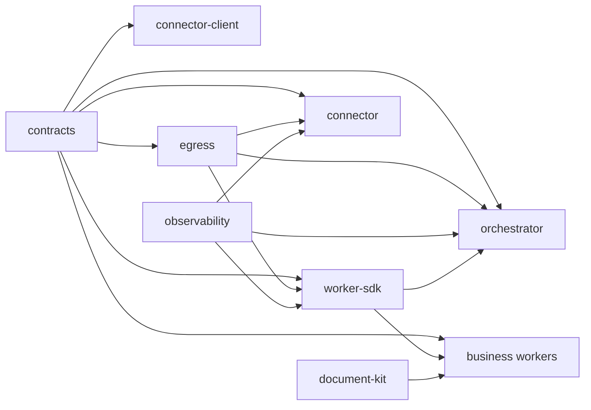

# 11 — Cấu trúc subproject và dependency

**Nguồn kiểm:** [pnpm workspace](../pnpm-workspace.yaml), `package.json` của từng subproject và cây `src/` ngày 2026-10-04. Đây là inventory code, không gán nhãn ACCEPTED cho từng package.

## 1. Cây workspace

```text
du-rework/
├── services/
│   ├── orchestrator/       # platform API + runtime + admin
│   └── connector/          # provider gateway
├── businesses/
│   ├── document-core/      # sáu action tài liệu + workflow nội bộ
│   ├── example-review/     # extension/reference worker
│   └── lc-checker/         # kiểm tra bộ chứng từ LC
├── packages/
│   ├── contracts/          # schema/DTO/wire contract
│   ├── worker-sdk/         # BullMQ/runtime client/task context
│   ├── connector-client/   # typed Connector invocation client
│   ├── document-kit/       # parser/converter/archive
│   ├── egress/             # network policy + pinned fetch
│   └── observability/      # logger, redaction, metrics
├── tests/                  # integration/cross-service/stubs/isolation
├── infra/                  # test Compose, Vault policies, deploy proposal
├── architecture/           # bộ tài liệu hệ thống này
├── docs/                   # spec, API, runbook và hồ sơ evidence lịch sử
├── tasks/                  # task/acceptance/gate
├── coordination/           # receipt, report, review theo thời gian
└── tools/, scripts/        # OpenAPI tooling, build/dev orchestration
```

`businesses/scratch/` và các `node_modules/`, `dist/`, `.cache/` không thuộc các subproject sản phẩm được mô tả ở đây. Workspace cũng bao gồm `tests/*` theo glob, nhưng đó là project kiểm chứng chứ không phải dịch vụ phục vụ request.

## 2. Services

| Service | Điểm vào / module quan trọng | Vai trò |
|---|---|---|
| [Orchestrator](../services/orchestrator/CODE-ARCHITECTURE.md) | `src/main.ts` → `createApp` trong `src/server.ts` → `src/app/bootstrap/create-app.ts`; `src/http/routes/*`, `src/modules/*`, `src/app/admin/*`, `src/compat/*`, `migrations/*` | API public/admin/runtime, lifecycle operation/task, registry/profile, artifact, queue, usage và audit. |
| [Connector](../services/connector/CODE-ARCHITECTURE.md) | `src/entrypoint.ts` → `src/composition.ts`; `src/http/server.ts`, `src/services.ts`, `src/invoke.ts`, `src/adapters/*`, `src/db/*` | Gateway provider với grant, identity, quota, revision/credential, invocation ledger và usage outbox. |

Hai file liên kết ở trên có cây source chi tiết, mô tả từng module và sơ đồ riêng của service.

## 3. Business workers

| Business | Cấu trúc code | Chức năng |
|---|---|---|
| [document-core](../businesses/document-core/README.md) | `src/manifest/`, `actions/`, `pipelines/`, `recipes/`, `validation/`, `types/`; `main.ts`/`worker.ts` | Sáu action `ingest`, `extract`, `analyze`, `transform`, `generate`, `compare` với 31 variant trong manifest và connector slots; có workflow `disbursement` và `doc-compare` riêng. |
| [example-review](../businesses/example-review/README.md) | `manifest.ts`, `review.ts`, `worker.ts`, `main.ts`, `registry-tool.ts` | Business extension mẫu: review nhiều artifact, fan-out/join, optional human approval và optional reasoning connector. |
| [lc-checker](../businesses/lc-checker/README.md) | `rules/`, `lc-checker.ts`, `fanout.ts`, `validation.ts`, `legacy-facade.ts`, `worker.ts`, `manifest.ts` | Kiểm tra bộ chứng từ Letter of Credit theo ruleset có version, OCR/fan-out và report gắn rule citation; domain rule còn cần sign-off theo README. |

Mỗi worker có manifest, queue/version và image riêng. Worker dùng `@du/worker-sdk` để nhận delivery và báo runtime; không import source nội bộ Orchestrator/Connector theo package manifests đã xem.

## 4. Shared packages

| Package | Nội dung source chính | Consumer trực tiếp theo package manifests |
|---|---|---|
| [`@du/contracts`](../packages/contracts/src/) | `public-api.ts`, `runtime.ts`, `queue.ts`, `connector.ts`, `manifest.ts`, `sdk.ts`, usage/encryption/vault schemas. | Hai services, ba workers, worker SDK, connector client, egress. |
| [`@du/worker-sdk`](../packages/worker-sdk/src/) | `worker.ts`, `runtime-client.ts`, `task-context.ts`, `connector-invoker.ts`, artifact/source helpers, fan-out. | Orchestrator dùng source-ingestion logic/types; ba workers dùng runtime SDK. |
| [`@du/connector-client`](../packages/connector-client/src/) | `client.ts`, `sdk-invoker.ts`, `transport.ts`, errors/types. | Package độc lập; chưa có import trong source production của service hoặc business, worker SDK đang dùng invoker riêng. |
| [`@du/document-kit`](../packages/document-kit/src/) | `parsers/`, `converters/`, `formats/`, `archives/`. | Ba workers. |
| [`@du/egress`](../packages/egress/src/) | `pinned-fetch.ts` và exports: chính sách fetch/địa chỉ mạng. | Orchestrator, Connector, worker SDK. |
| [`@du/observability`](../packages/observability/src/) | `logger.ts`, `context.ts`, `redaction.ts`, `metrics.ts`, Elasticsearch collector. | Orchestrator, Connector, worker SDK. |

## 5. Dependency graph



Mũi tên ở đây đọc là **dependency → consumer** (theo `package.json`, không phải hướng HTTP request). Các worker không phụ thuộc trực tiếp vào source service. Thay đổi `@du/contracts` cần kiểm tra cả producer và consumer; thay đổi schema DB của một service thuộc migration owner của service đó.

## 6. Quy ước mở rộng

Thêm business: tạo package trong `businesses/`, manifest/action handler/worker entrypoint/queue riêng, dùng contract + SDK public, đăng ký version qua runtime/admin. Thêm provider protocol: mở rộng Connector adapter và contract tương ứng. Thay đổi generic operation, lease hoặc storage: sửa Orchestrator và kiểm consumer worker SDK. Các hướng dẫn phát triển chi tiết hơn có ở [extension guide](../docs/16-extension-developer-guide.md), nhưng phải đối chiếu source hiện tại khi áp dụng.
