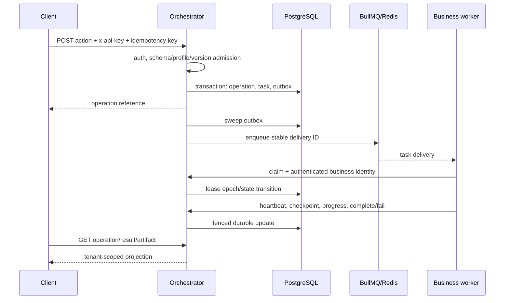
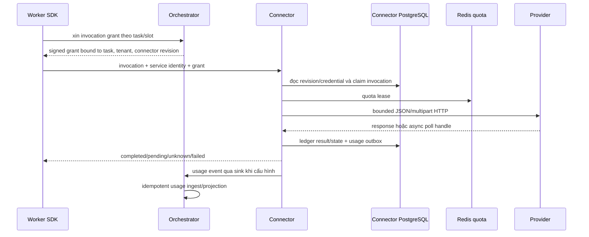

# 12 — Luồng xử lý, dữ liệu và contract

**Nguồn kiểm:** [Orchestrator route dispatcher](../orchestrator/services/orchestrator/src/server.ts), [HTTP route groups](../orchestrator/services/orchestrator/src/http/routes/), [composition](../orchestrator/services/orchestrator/src/app/bootstrap/create-app.ts), [platform migrations](../orchestrator/services/orchestrator/migrations/), [Connector HTTP/runtime](../orchestrator/services/connector/src/), [Connector migrations](../orchestrator/services/connector/src/db/migrations/) và [contracts](../orchestrator/packages/contracts/src/). Các đường tùy chọn phụ thuộc cấu hình runtime.

## 1. Bề mặt API và danh tính

| Bề mặt | Caller | Xác thực / quyền | Nơi xử lý |
|---|---|---|---|
| `/api/v1/*` | Client/tenant | `x-api-key`, tenant/profile policy và resource fencing; một số route admin có bearer/session riêng. | `http/routes/public.ts` |
| `/api/runtime/v1/*` | Worker/Connector | Worker identity theo business cho task route; token usage riêng cho Connector usage ingress. | `http/routes/runtime.ts`, `modules/runtime/*`, `modules/usage/*` |
| `/api/v1/admin/*`, admin shell | Operator | Đa số route admin JSON chỉ nhận **admin bearer token** (`assertAdminAuth` trong `http/routes/admin.ts` so `Bearer <adminToken>`, không có nhánh session; khi thiếu token thì fail-closed 401). Session/OIDC/local cấp quyền trên `POST /api/v1/admin/actions` qua `resolveAdminActionAuthAsync`, và admin action có RBAC/CSRF. | `http/routes/admin.ts`, `app/admin/*`, `modules/admin-actions/*` |
| Connector `/connectors*`, `/invocations*` | Orchestrator/worker trusted caller | Service identity theo scope; invocation có signed grant, revision/tenant binding. | `connector/src/http/server.ts`, `services.ts` |

Danh sách route, trạng thái implementation và wire shape cần đọc từ code + [Public API spec](../docs/06-public-api.md) + [legacy parity contract](../docs/39-legacy-parity-contract.md). `docs/21-openapi.json` là artifact do tooling sinh và catalog có thể chưa đủ route; không dùng một mình để kết luận route vắng mặt. `/api/v1/docs/{action}` hiện có mount compat trong source, nhưng việc khớp toàn bộ wire cũ vẫn là gate kiểm chứng riêng.

## 2. Submit → queue → worker → result

**Chủ dữ liệu:** `modules/operations/submission.ts` nhận và lưu submission; `modules/queue/dispatcher.ts` phát outbox; `modules/runtime/runtime.ts` giữ lease/checkpoint/transition; `modules/operations/facade.ts` chiếu kết quả; `modules/webhooks/webhooks.ts` gửi callback. PostgreSQL là nơi quyết định task state; BullMQ là kênh delivery có thể phát lại. Worker phải dùng lease epoch hiện tại, vì một delivery cũ không được hoàn tất task sau khi lease đã đổi.

Task có source cần ingest được đánh dấu gate. `modules/operations/ingestion-consumer.ts` chuyển source/pin artifact trước khi business dispatch. Dispatcher lọc outbox còn `gate='ingestion'`; runtime claim cũng phải từ chối task chưa sẵn sàng. Đây là hai ranh giới khác nhau, không thay thế cho nhau.

## 3. Worker → Connector → provider → usage

Connector có management plane (`/connectors*`) và invocation plane (`/invocations*`). Revision `ACTIVE` mới được dùng; grant và stored revision phải khớp binding. `invoke.ts` giữ idempotency, quota, deadline và replay/poll; kết quả provider không rõ ràng được ghi `UNKNOWN` thay vì gửi lại mù. Provider transport áp giới hạn response/host/network. Usage event được lưu ở Connector outbox rồi dispatcher gửi sang Orchestrator khi có `USAGE_SINK_URL` và token.

**Giới hạn wiring cần theo dõi:** standalone `connector/src/composition.ts` chưa truyền `SecretResolver` vào `DurableConnectorRuntime`; nhánh revision `vault-kv2` trong `services.ts` sẽ từ chối invocation nếu thiếu resolver. Module Vault có mặt trong source không đồng nghĩa deployment path này đã chạy.

## 4. Artifact và mã hóa

| Đường | Code owner | Bất biến quan trọng |
|---|---|---|
| Client upload | `modules/public-api/upload-encryption-gateway.ts`, `modules/artifacts/multipart-service.ts` | Admission theo tenant/key; multipart chỉ khả dụng khi S3 backend được cấu hình. |
| Worker upload/finalize | `modules/artifacts/*`, runtime artifact routes | Artifact gắn task/lease; READY sau khi kiểm metadata/hash/pin theo storage facade. |
| Source URL ingestion | `modules/operations/ingestion-consumer.ts`, `ingestion-storage-s3.ts` | Đưa source về reference bền vững trước business queue; cấu hình PostgreSQL-only không xử lý nhánh S3 gate này. |
| At-rest encryption | `modules/encryption/crypto-storage-facade.ts`, `vault-transit-provider.ts` | Khi được cấu hình, bytes được mã hóa trước object storage; key provider thuộc deployment. |
| Public result/download | `modules/public-api/delivery-encryption.ts`, `modules/encryption/artifact-read-decrypt.ts` | Đọc có tenant fencing; policy recipient encryption quyết định wrapper hoặc bytes/plain response. |

Orchestrator hỗ trợ PostgreSQL blob backend và S3 backend theo config trong `main.ts`/`server.ts`; migration sang S3 có CLI riêng. Vì vậy câu “mọi file byte đều ở S3” chỉ đúng cho topology production mục tiêu, không đúng cho mọi chế độ code hiện có. `artifact_blobs` có trong migration nền tảng, còn metadata/ref/ownership nằm ở các bảng artifact.

## 5. Mô hình dữ liệu sở hữu theo service

| Database/schema owner | Nhóm bảng nền tảng | Ý nghĩa |
|---|---|---|
| Orchestrator | `tenants`, `api_keys`, `business_versions`, profile/binding tables | Identity, registry và chọn version. |
| Orchestrator | `operations`, `submission_keys`, `tasks`, `task_dependencies`, `step_checkpoints`, `human_waits`, `outbox` | Idempotent submit, state, dependency, lease/checkpoint, human wait-input và delivery bền vững. `human_waits` (migration `0005_continuation.sql`) là bảng nền cho nhánh chờ người dùng nhập liệu. |
| Orchestrator | `artifacts`, `artifact_blobs`, grant/multipart tables | Ownership, upload/download và object reference. |
| Orchestrator | `usage_events`, audit/webhook/budget tables | Usage, chi phí, audit và callback. |
| Connector | `connector_revisions`, `secret_versions`, `connector_invocations`, `connector_usage_outbox` | Cấu hình/credential, invocation ledger và usage delivery. |

Danh sách này là nhóm khái niệm, không thay thế DDL. DDL đầy đủ nằm trong hai thư mục migration; mỗi service phải dùng migration của chính mình. Business worker không ghi trực tiếp vào Platform/Connector DB.

## 6. Các loại trạng thái cần phân biệt

- **Operation** là yêu cầu bên ngoài; có thể có nhiều task/step. Trạng thái operation không đồng nghĩa trạng thái một delivery BullMQ.
- **Task** có lease epoch và deadline; worker report phải qua runtime fencing. Retry/redelivery không phải lệnh tạo business side effect mới nếu checkpoint hoặc idempotency đã ghi.
- **Artifact** có trạng thái upload/finalize/READY và version pin riêng; có metadata trong DB và bytes ở backend được chọn.
- **Connector invocation** có ledger độc lập với task. `UNKNOWN` là kết quả provider mơ hồ; cần reconciliation/poll theo contract, không suy thành retry an toàn.
- **Acceptance task/gate** trong `tasks/` là tiến độ dự án, không phải runtime state; cùng tên “complete/accepted” không liên quan tới operation completion.

## 7. Nguồn contract chi tiết

- [Public API spec](../docs/06-public-api.md), [Result envelope](../docs/06-result-envelope.md), [legacy parity](../docs/39-legacy-parity-contract.md).
- [Runtime/Admin API spec](../docs/07-internal-api.md), [Connector API spec](../docs/08-connector-api.md), [queue/SDK](../docs/09-queue-sdk.md).
- [Data/state design](../docs/04-data-state.md), [business registry](../docs/05-business-registry.md), [OpenAPI artifact](../docs/21-openapi.json).

Các spec này có thời điểm cập nhật khác nhau. Với hành vi **đang chạy trong source**, route/schema/migration là điểm đối chiếu; với hành vi **mong muốn**, đọc spec/ADR; với mức **đã chứng minh**, xem test receipt và review gần nhất.
