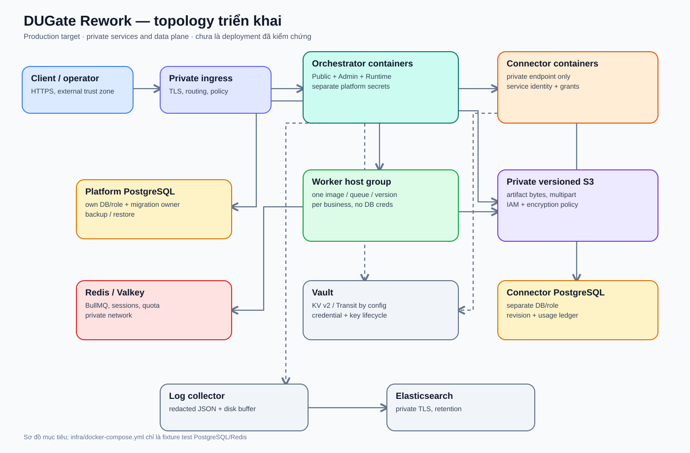
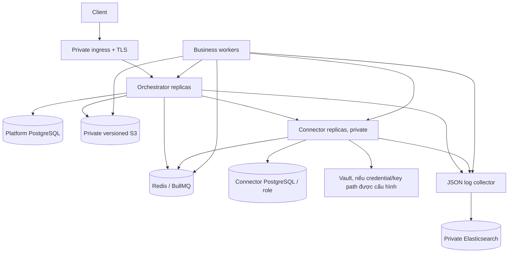

# 13 — Triển khai, bảo mật và vận hành

**Phạm vi:** mô tả topology code hỗ trợ và topology production đề xuất. [Deployment proposal](../infra/deployment-architecture.md), [infra README](../infra/README.md) và [task board](../tasks/README.md) chứa các gate chi tiết. Tài liệu này không phải runbook đã nghiệm thu.

## 1. Hai môi trường phải tách rõ

[Mở bản vẽ draw.io để chỉnh sửa](diagrams/deployment-topology.drawio). Hình thể hiện topology **mục tiêu** với private ingress, container/worker độc lập và data plane riêng; [fixture Compose hiện có](../infra/docker-compose.yml) chỉ phục vụ test.

| Môi trường | Thành phần | Ý nghĩa |
|---|---|---|
| Local/test fixture | [infra/docker-compose.yml](../infra/docker-compose.yml): PostgreSQL `5433`, Redis `6380`, tùy chọn Connector profile; `scripts/dev.cjs` có thể chạy app/worker từ source. | Phát triển và integration, có test credential và dữ liệu có thể bị dọn. Không là topology production. |
| Production mục tiêu | Private ingress/TLS → Orchestrator; Connector private; workers trên host/replica riêng; PostgreSQL theo service role, Redis/Valkey, private versioned S3, Vault, log collector → Elasticsearch. | Đề xuất triển khai trong [infra/deployment-architecture.md](../infra/deployment-architecture.md); cần build/deploy, backup/restore, failover và live proof trước go-live. |

Root `du-rework/docker-compose.yml` và các Compose cục bộ chưa tạo thành topology production đã kiểm chứng. `infra/docker-compose.yml` là fixture test có cổng loopback và password test. Không dùng các kết quả unit/offline để suy ra multi-service E2E hoặc production readiness.

Sơ đồ trên là **đích triển khai**, không là danh sách container đang chạy. Workers không cần platform DB credential; giao tiếp trạng thái qua runtime API và artifact grant.

## 2. Build, migration, startup

1. Cài dependency/build từ `du-rework/` bằng pnpm workspace (`pnpm install --frozen-lockfile`, `pnpm build`). Hai service và ba business có `package.json`/Dockerfile riêng.
2. Provision DB/Redis/S3/Vault và secret theo môi trường. Tách platform/Connector DB role và secret; worker không có DB URL.
3. Orchestrator có CLI `migrate`, `migrate:status`, `migrate:verify`; standalone `main.ts` gọi `createApp` với `autoMigrate` mặc định false và xác minh schema lúc boot. Connector standalone `entrypoint.ts` gọi composition mà `start()` chạy `database.migrate()` trước listener. Đây là khác biệt thực tế cần giải quyết khi scale Connector replica hoặc tuần tự hóa migration production.
4. Bật Connector và Orchestrator; chờ health/readiness. Bật worker theo business/version; kiểm registration/heartbeat trước khi nhận tải. Orchestrator có `/health`/`/api/v1/health`; Connector có `/health/live` và `/health/ready`. Worker readiness dựa runtime registration/heartbeat, không có HTTP health endpoint chung.
5. Khi shutdown, signal đi vào `main.ts`/`shutdown.ts` của Orchestrator, `entrypoint.ts`/`lifecycle.ts` của Connector và worker entrypoint. Drain phải phù hợp deadline, webhook/outbox và lease; kiểm bằng test triển khai, không suy từ hàm tồn tại trong source.

Các biến env chi tiết nằm ở [root README](../README.md), [Orchestrator README](../services/orchestrator/README.md), [Connector README](../services/connector/README.md) và README từng business. Không sao chép secret/example password sang tài liệu này.

## 3. Trust boundaries

| Ranh giới | Kiểm soát trong code | Điều kiện triển khai |
|---|---|---|
| Client → Orchestrator | `x-api-key`/tenant fencing; body limits; idempotency. | HTTPS và key provisioning/rotation riêng môi trường. |
| Operator → Admin | Admin bearer cho các route admin JSON; OIDC/local session chỉ cấp quyền trên `POST /api/v1/admin/actions`. Có RBAC, CSRF cho cookie mutation. | Issuer/callback/cookie secret/role mapping phải cấu hình và browser-test đúng mode. Cookie không mở được các route admin JSON khác. |
| Worker → Runtime | Business identity token, task/lease epoch fencing. | Mỗi business/version có token riêng, không dùng chung admin/usage secret. |
| Worker/Orchestrator → Connector | Service identity scope + signed invocation grant; revision/tenant binding. | Connector private; secret/grant authority thống nhất giữa các process. |
| Connector → Provider | Host/network policy, bounded fetch, quota, credential source. | Chỉ allow endpoint cần thiết; credential rotation/Vault path phải được wire và live-verify. |
| Service → storage/logs | Artifact ownership, encryption policy, log redaction. | S3 bucket/version/IAM, Vault key, log TLS/retention và backup phải được cấu hình. |

Đường mã hóa trong source không có nghĩa mọi deployment tự động mã hóa. `main.ts` chỉ truyền cấu hình crypto khi env đầy đủ; public upload encryption và S3 phụ thuộc nhau trong wiring hiện tại. Xem [encryption task](../tasks/APP-ENCRYPTION-2026-09-27.md) và [security task](../tasks/SEC-OIDC-VAULT-2026-09-24.md) để biết phạm vi kiểm chứng còn cần.

## 4. Quan sát và sự cố

- Correlation ID và structured/redacted logging thuộc `@du/observability`; usage, audit và outbox là dữ liệu nghiệp vụ bền vững khác với application log.
- Trạng thái operation/task xem qua Public/Admin API; health phụ thuộc không thay thế kiểm luồng submit → worker → Connector → result.
- Queue integrity, lease recovery, webhook delivery và artifact integrity có code/sweep riêng. Không sửa trực tiếp task/outbox row để “chữa” sự cố nếu chưa có thủ tục owner xác nhận.
- [Operational runbooks](../docs/17-operational-runbooks.md) tự ghi trạng thái **DRAFT / NOT ACCEPTED**; dùng để thiết kế drill và đối chiếu, không xem là hướng dẫn production đã phê duyệt.
- Backup/restore scripts ở `infra/scripts/` cần thử trên môi trường cô lập và ghi recovery point trước mutation production.

## 5. Kiểm thử và mức bằng chứng

| Mức | Có thể kết luận | Không thể kết luận |
|---|---|---|
| Typecheck/unit/offline | Logic module/contract với stub theo scope test. | DB/Redis/S3/Vault/provider thật hoặc browser/deploy topology. |
| Integration trên test infra | Một số ranh giới DB/Redis và HTTP được kiểm với namespace cụ thể. | Production config, failover, tenant isolation toàn hệ thống nếu scenario chưa phủ. |
| Multi-service/live/browser/drill | End-to-end hoặc vận hành theo đúng kịch bản và môi trường đã ghi. | Các kịch bản khác chưa chạy, hoặc release nếu reviewer/gate chưa chốt. |

Danh mục test ở [docs/28](../docs/28-test-inventory.md) và acceptance ở [docs/35](../docs/35-acceptance-baseline.md) là bảng theo dõi, có thể chứa snapshot cũ. Đánh giá go-live phải dùng task rows, raw receipt và review mới nhất, theo [quy tắc AGENTS](../AGENTS.md). Không cập nhật số pass hoặc cờ gate trong bộ tài liệu kiến trúc này.

## 6. Rủi ro/giới hạn được nhìn thấy khi rà soát

| Vấn đề | Bằng chứng code/tài liệu | Tác động cần xét |
|---|---|---|
| Orchestrator route/composition tập trung trong một file lớn | [server.ts](../services/orchestrator/src/server.ts) | Thay auth, startup hoặc route dễ ảnh hưởng nhiều bề mặt; cần focused consumer tests và review khi tách module. |
| Connector standalone chưa inject Vault resolver | [composition.ts](../services/connector/src/composition.ts), [services.ts](../services/connector/src/services.ts) | Revision `vault-kv2` fail-closed khi invoke ở wiring này. |
| Connector migration chạy lúc service start | [composition.ts](../services/connector/src/composition.ts) | Cần chủ sở hữu migration độc lập/serialized trước multi-replica rollout. |
| Tài liệu API và deployment có snapshot lệch source | [docs/06](../docs/06-public-api.md), [root README](../README.md), [server.ts](../services/orchestrator/src/server.ts) | Không dùng nhãn “chưa implement” cũ thay cho kiểm route/contract hiện tại. |

Đây là các điểm đối chiếu kiến trúc, không phải verdict acceptance hoặc danh sách đầy đủ finding. [Task board](../tasks/README.md) và [review gần nhất](../coordination/reports/review.md) mới quản lý owner, bằng chứng và gate.
