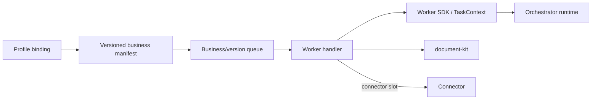

# 15 — Năng lực nghiệp vụ và worker

**Nguồn kiểm:** manifest, handler và README của từng business ngày 2026-10-02. Bảng này là catalog chức năng khai báo/được cài trong source; nó không khẳng định mọi variant đã pass E2E hoặc đáp ứng chất lượng provider thực.

## 1. Business model dùng chung

Orchestrator không cài hành vi của từng business. Một business cung cấp manifest có version, action/handler kind, schema input/output, connector slots và queue; worker nhận task theo version đã đăng ký. Profile ở platform quyết định action/version và binding tới Connector. Worker SDK cung cấp TaskContext, runtime client, checkpoint, fan-out, artifact và Connector invocation. Tách này cho phép triển khai business riêng mà không đặt parser hoặc quy tắc ngành trong Orchestrator.

## 2. `document-core`

[Source](../businesses/document-core/src/) và [README](../businesses/document-core/README.md). Manifest `src/manifest/document-core.manifest.ts` khai báo sáu action công khai với tổng 31 variant (4 + 6 + 7 + 5 + 6 + 3). `src/actions/` chứa entrypoint handler; `src/pipelines/`/`recipes/` chứa workflow và step; `src/validation/` chuẩn hóa và kiểm input/output; `src/worker.ts` nối handler vào worker SDK.

| Action | Variant khai báo | Kết quả chính / đường xử lý |
|---|---|---|
| `ingest` | `parse`, `ocr`, `digitize`, `split` | Chuyển tài liệu thành text/Markdown, OCR hoặc chia tài liệu; parse/split có đường local, OCR/vision cần Connector/provider. |
| `extract` | `invoice`, `contract`, `id-card`, `receipt`, `table`, `custom` | Trích xuất cấu trúc theo schema và loại tài liệu. |
| `analyze` | `classify`, `sentiment`, `compliance`, `fact-check`, `quality`, `risk`, `summarize-eval` | Phân loại/đánh giá chất lượng, rủi ro, compliance hoặc nội dung. |
| `transform` | `convert`, `translate`, `rewrite`, `redact`, `template` | Chuyển định dạng/ngôn ngữ, viết lại, che thông tin hoặc áp template. |
| `generate` | `summary`, `outline`, `report`, `email`, `minutes`, `qa` | Sinh nội dung mới từ tài liệu/đầu vào. |
| `compare` | `diff`, `semantic`, `version` | So sánh văn bản, ngữ nghĩa hoặc phiên bản tài liệu. |

`document-core` còn có hai workflow nội bộ, cùng khai báo trong `handlerKinds` và có action riêng trong manifest — chúng khác sáu action public:

| Workflow | Cơ chế | Vị trí |
|---|---|---|
| `disbursement` | Fan-out, checkpoint, chờ duyệt và các connector slot cho classify/extract/crosscheck/report. | `src/pipelines/workflows/disbursement/` |
| `doc-compare` | So sánh tài liệu hai phía theo cấu trúc và reference claims, có chunking/checkpoint và connector slot riêng. Được đăng ký thành handler kind + action riêng, **không** gộp vào `compare`. | `src/pipelines/workflows/doc-compare/` |

Đọc [README](../businesses/document-core/README.md) và `src/pipelines/workflows/` khi tích hợp. Các BRD/sơ đồ từng action ở [business docs](../businesses/document-core/docs/).

## 3. `example-review`

[Source](../businesses/example-review/src/) và [README](../businesses/example-review/README.md). Đây là business mở rộng mẫu với action `review`: nhận 1–10 artifact, fan-out review từng item, join kết quả xác định, có reasoning connector tùy chọn và nhánh chờ human approval. Nó chứng minh boundary “business mới dùng contracts/SDK/document-kit, không import service internals”. Live proof của tất cả continuation/admin activation phải đọc test receipt/task hiện hành, không suy từ handler tồn tại.

## 4. `lc-checker`

[Source](../businesses/lc-checker/src/) và [README](../businesses/lc-checker/README.md). Worker kiểm bộ chứng từ Letter of Credit: OCR/fan-out, kiểm các discrepancy theo ruleset versioned, xuất report kèm rule citation. `src/rules/` giữ registry và nguồn quy tắc; `lc-checker.ts` là state machine; `validation.ts` kiểm citation/count/verdict; `legacy-facade.ts` chuyển wire workflow cũ. README ghi ruleset còn `PROVISIONAL` và cần domain owner sign-off; output yêu cầu người kiểm tra ký xác nhận.

## 5. Điều kiện để thêm business/variant

1. Định nghĩa yêu cầu và input/output schema; cập nhật manifest version và handler mapping.
2. Chọn bước local trong `document-kit` hoặc connector slot theo capability; không đưa provider secret vào manifest, queue payload hay source business.
3. Dùng runtime checkpoint/lease/fan-out/wait-input qua SDK; side effect phải có cách xử lý replay/lease loss.
4. Thêm tests ở business, contract consumer tests nếu wire đổi, rồi đăng ký version và profile binding. Deployment image/queue của business có thể phát hành độc lập khi contract tương thích.

Thiết kế plugin/business chi tiết hơn ở [extension developer guide](../docs/16-extension-developer-guide.md), [registry spec](../docs/05-business-registry.md) và [queue/SDK spec](../docs/09-queue-sdk.md).
