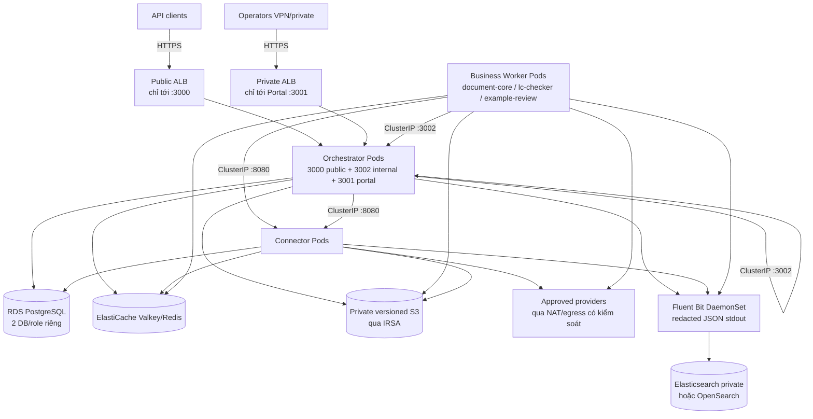

# 19 — Kiến trúc triển khai EKS

**Phạm vi:** topology mục tiêu đưa DU Rework lên Amazon EKS. Đây là **tài liệu kiến trúc + mapping**, không phải bằng chứng deployment đã kiểm chứng. Mọi gate/go-live vẫn theo [09](09-readiness.md); triển khai EC2 hiện có ở [06](06-aws-deployment.md) vẫn giữ nguyên như một lựa chọn topology.

Đối chiếu source tại thời điểm viết: `Dockerfile` (5 targets, Node 24, runtime `node`, Orchestrator `EXPOSE 3000 3001`), `compose/*.yml` (env/listener/health), ingress fence (`services/orchestrator/src/http/ingress-guard.ts`), Connector router (`services/connector/src/http/server.ts`). Sample manifests ở [`infra/eks/`](../infra/eks/README.md); hướng dẫn từng bước ở [`docs/12c-eks-deployment-guide.md`](../docs/12c-eks-deployment-guide.md).

## 1. Mục tiêu và nguyên tắc

1. Giữ nguyên **ba vai trò triển khai** (Orchestrator Backend, Connector Service, Business Workers) và ranh giới sở hữu trong [10](10-current-system.md) — chỉ đổi nền tảng điều phối từ EC2/Compose sang EKS, không đổi domain.
2. Giữ nguyên **ma trận ingress PM-M02**: Public JSON `:3000`, Internal JSON `:3002`, Portal/BFF `:3001`, Connector `:8080` nội bộ. Trên EKS, fence thực thi ở **hai lớp**: route guard trong code (đã có) + Ingress/Service/NetworkPolicy (tài liệu này).
3. Một process Orchestrator phục vụ **cả hai JSON listener** (3000 + 3002) như hiện tại; không tách Runtime thành Service riêng.
4. Stateful plane (PostgreSQL, Valkey/Redis, S3, secrets) **nằm ngoài cluster hoặc dùng managed service**; không chạy DB production trong Pod trừ fixture test.
5. Mọi image **immutable theo digest**, migration chạy bằng **Job một lần**, secret qua **Secrets Manager + External Secrets hoặc Sealed Secrets + IRSA**, không bake secret vào image.

## 2. Topology mục tiêu

So với topology EC2 trong [06](06-aws-deployment.md): EC2 group → **Deployment + HPA + PDB**; ALB target group → **Service + Ingress**; host network → **VPC CNI + NetworkPolicy**; instance role → **IRSA role per ServiceAccount**; systemd/Compose unit → **Job/CronJob + rollout**.

## 3. Mapping service → Kubernetes

| Thành phần | Image target (`Dockerfile`) | Deployment | Container ports | K8s Service | Ingress |
|---|---|---|---|---|---|
| Orchestrator Backend (Public JSON) | `orchestrator` | `orchestrator` (≥2 replicas HA) | 3000 | `orchestrator-public` (ClusterIP 3000) | Public ALB → 3000 duy nhất |
| Orchestrator Backend (Internal JSON) | cùng Pod | cùng Pod | 3002 | `orchestrator-internal` (ClusterIP 3002, **không ingress**) | Không |
| Orchestrator Portal / BFF | cùng image/bundle | cùng Pod | 3001 | `orchestrator-portal` (ClusterIP 3001) | Private ALB → 3001 duy nhất |
| Connector Service | `connector` | `connector` (≥2 khi migration đã serialize) | 8080 | `connector` (ClusterIP 8080, **không ingress**) | Không |
| document-core | `document-core` | `document-core` (HPA theo backlog) | không | không | Không |
| lc-checker | `lc-checker` | `lc-checker` | không | không | Không |
| example-review | `example-review` | `example-review` | không | không | Không |
| Migration | `orchestrator` image, command `migrate` | `Job/orchestrator-migrate` (+ Job connector khi có mode một lần) | không | không | Không |

Worker **không có Service, không có Ingress, không có DB credential** — giao tiếp ra ngoài chỉ qua `orchestrator-internal:3002` và `connector:8080`, đúng như `RUNTIME_URL`/`CONNECTOR_URL` trong compose fragments.

## 4. Ingress và NetworkPolicy (PM-M02 trên EKS)

| Ingress | Listener đích | Policy |
|---|---|---|
| Public ALB (internet-facing hoặc private theo quyết định) | `orchestrator-public:3000` | Chỉ route public `/api/v1/*` (trừ admin) + health. Không target 3002/8080. TLS tại ALB, security group chỉ mở 443. |
| Private ALB (internal scheme) | `orchestrator-portal:3001` | Chỉ UI/session/OIDC + BFF allowlist. Không proxy tùy ý tới internal API. |
| Không có ingress | `orchestrator-internal:3002`, `connector:8080` | Chỉ ClusterIP. External-DNS/host mapping bị cấm cho hai Service này. |

`NetworkPolicy` mẫu (default-deny + allowlist tối thiểu):

- Ingress Controller → `orchestrator-public:3000`, → `orchestrator-portal:3001`.
- Worker Pods → `orchestrator-internal:3002`, → `connector:8080`.
- Orchestrator Pods → `connector:8080` (management/probe), → RDS 5432, → ElastiCache 6379, → S3 endpoint 443.
- Connector Pods → RDS 5432, → ElastiCache 6379, → provider egress 443 (kết hợp `PROVIDER_ALLOW_HOSTS` ở tầng app).
- Từ chối mọi traffic tới 3002/8080 từ namespace/ingress không thuộc allowlist. Lưu ý: NetworkPolicy là lớp bổ sung — **authorization trong route vẫn bắt buộc** (reachable không đồng nghĩa authorized).

## 5. Config / Secret / IRSA mapping

| Compose env | EKS nguồn | Ghi chú |
|---|---|---|
| `DATABASE_URL`, `REDIS_URL` | External Secrets (Secrets Manager) → `Secret` | RDS + ElastiCache endpoints/TLS; hai DB role riêng platform/connector. Worker **không mount** `DATABASE_URL`. |
| `RUNTIME_TOKEN`, `ADMIN_TOKEN`, `ENCRYPTION_KEY`, `INVOCATION_GRANT_SECRET`, `SERVICE_IDENTITY_SECRET`, `CONNECTOR_*`, `USAGE_TOKEN`, `WEBHOOK_SECRET`, `ADMIN_SHELL_COOKIE_SECRET`, OIDC client secret | External Secrets → `Secret`, mount env | Không commit giá trị thật; sample chỉ giữ placeholder. |
| `PORT`, `ORCHESTRATOR_*_PORT/HOST`, `RUNTIME_URL`, `CONNECTOR_URL`, `ORCHESTRATOR_INTERNAL_BASE_URL`, `ARTIFACT_STORAGE_BACKEND`, `*_CONCURRENCY`, `HEARTBEAT_*`, `SHUTDOWN_*`, `PROVIDER_ALLOW_HOSTS` | `ConfigMap` | URL nội bộ dùng DNS ClusterIP: `RUNTIME_URL=http://orchestrator-internal:3002/api/runtime/v1`, `CONNECTOR_URL=http://connector:8080`, `ORCHESTRATOR_INTERNAL_BASE_URL=http://orchestrator-internal:3002`, usage sink `http://orchestrator-internal:3002/api/runtime/v1/usage-events`. |
| S3 bucket/region/endpoint | `ConfigMap` + IRSA | Ưu tiên workload role (xem [s3-role-source-ingestion](../docs/s3-role-source-ingestion.md)): Pod dùng ServiceAccount gắn role, **bỏ trống** `AWS_ACCESS_KEY_ID/SECRET` khi dùng IRSA. |
| Vault | `ConfigMap` + Secret | `DU_VAULT_*` chỉ cấu hình khi path đã wire và live-verify; standalone Connector thiếu resolver sẽ fail-closed (`vault-kv2`) — xem [12](12-flows-and-data.md) §3. |

Mỗi Deployment có **ServiceAccount riêng** (`orchestrator`, `connector`, `document-core`, …) để gắn IRSA role khác nhau theo nguyên tắc quyền tối thiểu.

## 6. Migration, health, shutdown trên EKS

- **Migration:** `Job` một lần với chính image Orchestrator (`node dist/migrate-cli.js migrate`), `restartPolicy: Never`, chạy trước rollout, sau đó verify read-only rồi mới mở ingress. `AUTO_MIGRATE=false` trong Deployment. Connector hiện migrate lúc start — **chưa scale multi-replica an toàn** cho tới khi có migration owner serialize; sample giữ `replicas: 1` mặc định cho Connector kèm chú thích mở rộng.
- **Probes:**

| Pod | Liveness | Readiness | Ghi chú |
|---|---|---|---|
| Orchestrator | `GET /health` :3000 | `GET /api/v1/health` :3000 | `/health` hiện là dependency readiness (PG+Redis), không probe S3; provider outage không được làm sập liveness toàn bộ. |
| Connector | `GET /health/live` :8080 | `GET /health/ready` :8080 | Đúng phân biệt live/ready của source. |
| Workers | Không có HTTP endpoint | Runtime registration/heartbeat | Readiness = đã register version + heartbeat; HPA không dựa readiness HTTP. |

- **Shutdown:** `terminationGracePeriodSeconds` ≥ drain + buffer: Orchestrator 60s (drain 30s), Connector 60s (drain 30s), worker 30s (stop 15s). Rollout dùng `RollingUpdate maxUnavailable: 0~1, maxSurge: 1`; worker scale-in phải drain claim/checkpoint trước khi kill (xem runbook sự cố trong [08](08-operations.md)).

## 7. Autoscaling

- Orchestrator/Connector: HPA theo CPU/memory + (khuyến nghị) custom metric outbox age/in-flight. Không scale chỉ theo RPS vì admission nhanh không đồng nghĩa hoàn thành nhanh.
- Worker theo business/version: HPA theo **backlog-per-ready-instance** và `oldest runnable age` (nguyên tắc trong [07](07-capacity.md)), không dùng tổng số operation (gồm WAITING_INPUT/delayed retries). `CONCURRENCY`/parser slots bị chặn theo memory: `slots ≤ floor((RAM − overhead)/peak RSS mỗi task)`.
- Scale-in bảo thủ: PDB `minAvailable`, cooldown, không xóa replica cuối của version còn wait/snapshot cần resume. Max replicas bị chặn theo ngân sách + provider quota.

## 8. Storage, log, quan sát

- **RDS PostgreSQL:** Multi-AZ, backup/PITR, hai database/role riêng; schema migration đúng owner. **ElastiCache Valkey:** `noeviction`, TLS + AUTH/ACL đã test với BullMQ; Redis persistence không thay thế DB truth (reconcile sau restore).
- **S3:** private, versioning, encryption (SSE-S3/KMS), lifecycle không xóa object của operation active/waiting; truy cập qua IRSA + scoped grant/presigned URL, không share bucket credential cho client.
- **Log:** mỗi container ghi JSON đã redacted ra stdout → Fluent Bit DaemonSet (buffer disk có quota) → Elasticsearch/OpenSearch private qua TLS. Không log raw file/prompt/secret/signed URL. Metrics labels bounded (business/action/status); trace giữ `correlationId/operationId/taskId/leaseEpoch/invocationId`.

## 9. Rollout / rollback

1. Build/pin 5 image digests, push ECR, ghi digest vào manifests (không dùng tag trôi).
2. Backup DB + recovery point; chạy migrate `Job`, verify schema.
3. Deploy Connector → Orchestrator (đợi readiness) → workers; kiểm registration/heartbeat trước khi mở tải.
4. Canary bằng profile/version (register disabled → enable → chuyển tenant canary), quan sát error/latency/usage.
5. Rollback = deploy lại image/profile tương thích trước (schema forward-compatible, expand/contract); không rollback DB phá hủy, không `kubectl rollout undo` mù khi schema đã tiến.

## 10. Giới hạn và việc chưa làm

- Sample manifests là **điểm khởi đầu đã đối chiếu compose**, chưa phải production đã kiểm chứng: chưa có wildcard/PDB finales, chưa có External Secrets provisioning, chưa có ALB Controller/IAM role thật, chưa chạy fault/restore rehearsal trên EKS.
- PM-M02 full acceptance, live S3/Vault/real-provider, security gate (Node24/image scan) và VFY/REVIEW của plan migration vẫn **OPEN** — không suy ra sẵn sàng cutover từ việc có thêm tài liệu/YAML này.
- Quyết định còn cần chủ dự án chốt trước sizing/release: Region/AZ, instance/node-group mix, RDS/ElastiCache SKU, S3/KMS policy, retention/PII, availability/RPO/RTO, provider quota, client compatibility — như agenda trong [09](09-readiness.md).
