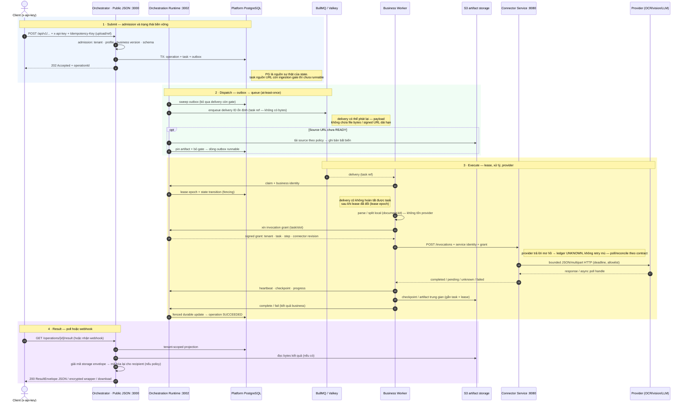
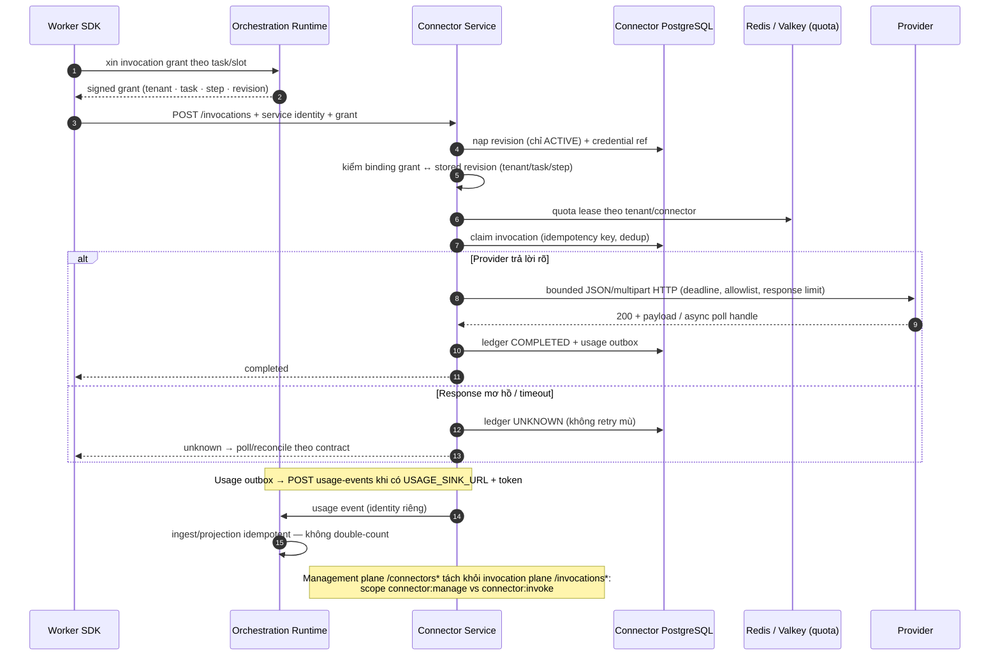
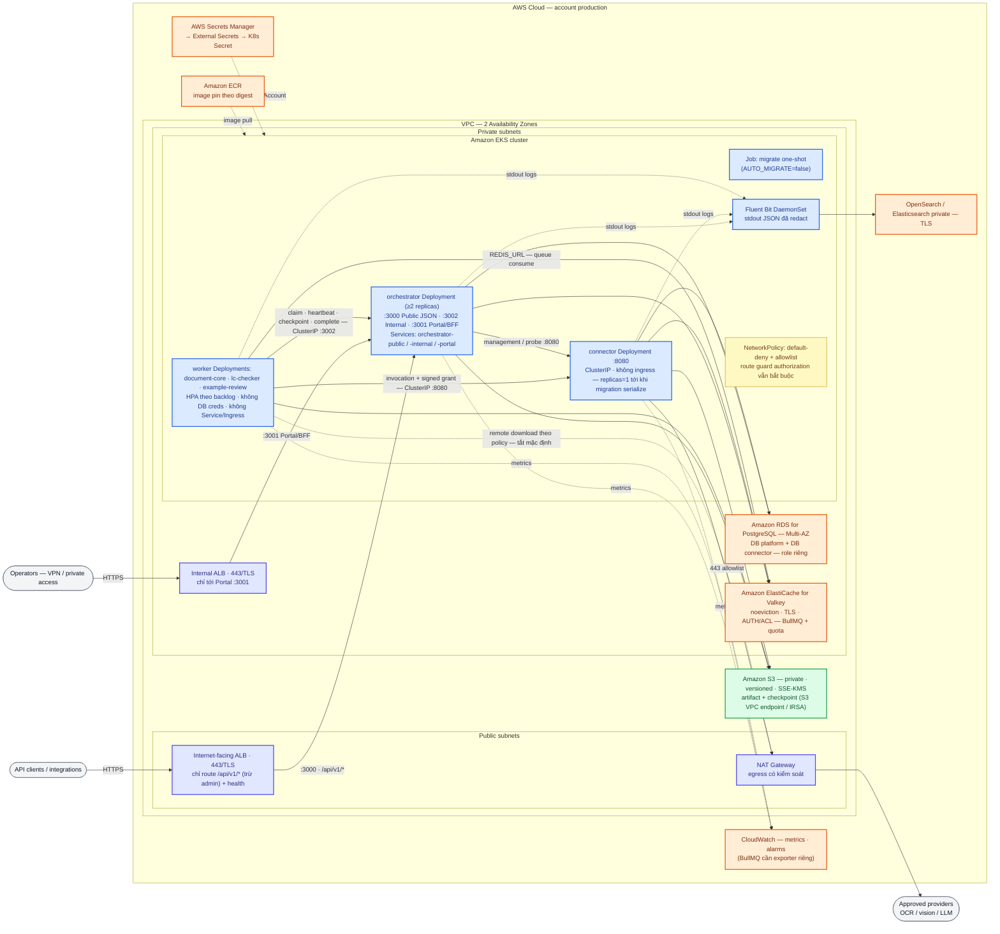
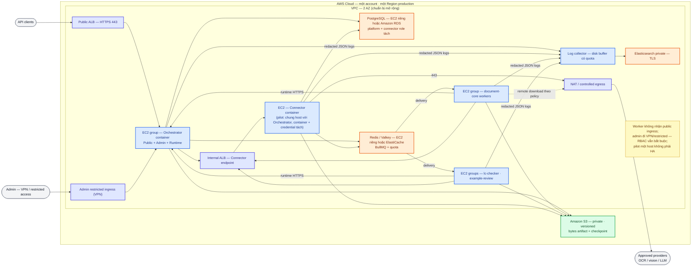

# Sơ đồ trực quan — luồng xử lý và triển khai AWS

**Phạm vi:** bộ sơ đồ Mermaid tổng hợp cho DU Platform (`du-rework`): vòng đời một yêu cầu theo phong cách sequence diagram và topology triển khai AWS theo phong cách architecture diagram. Sơ đồ mô tả **topology mục tiêu + implementation hiện có**, không phải bằng chứng deployment đã kiểm chứng; mọi gate/go-live vẫn theo [09-readiness.md](../09-readiness.md).

**Nguồn đối chiếu:** [10 — hệ thống hiện hành](../10-current-system.md), [12 — luồng và dữ liệu](../12-flows-and-data.md), [06 — deploy AWS trên EC2](../06-aws-deployment.md), [19 — deploy trên EKS](../19-eks-deployment.md), [docs/40 — kiến trúc repo và service](../../docs/40-du-platform-architecture.md).

> Quy ước đọc: nét liền là đường bắt buộc trong topology mục tiêu; nét đứt là phụ thuộc theo cấu hình (optional feature). DB/RDS/Redis là nguồn trạng thái bền vững; queue chỉ là kênh delivery có thể phát lại; bytes không đi qua queue.

## 1. Sequence — vòng đời một yêu cầu (submit → dispatch → execute → result)

> Bản SVG tĩnh: [visual-sequence-e2e.svg](visual-sequence-e2e.svg)

Bất biến chính của luồng:

- **PostgreSQL là nơi quyết định task state**; BullMQ/Valkey chỉ là kênh delivery có thể phát lại. Worker report phải qua runtime fencing (lease epoch).
- **Bytes không đi qua control plane**: queue, DB metadata và log không chứa file bytes, raw prompt, provider secret hay signed URL dài hạn.
- **Hai ranh giới ingestion độc lập**: dispatcher lọc outbox còn `gate='ingestion'`, và runtime từ chối claim task chưa READY (`STATE_CONFLICT` trước khi cấp lease).
- **Invocation grant** giới hạn tenant/task/step/input/artifact/revision; service identity không thay thế grant.
- **Kết quả**: contract đã freeze — `200 JSON` plain hoặc encrypted wrapper; không còn `302`.

## 2. Sequence — Connector invocation, UNKNOWN và usage

> Bản SVG tĩnh: [visual-sequence-connector.svg](visual-sequence-connector.svg)

> Wiring cần theo dõi: standalone Connector chưa truyền `SecretResolver` vào runtime cho nhánh `vault-kv2` — nhánh này fail-closed khi thiếu resolver ([12 §3](../12-flows-and-data.md)).

## 3. AWS diagram — topology EKS (mục tiêu)

> Bản SVG tĩnh: [visual-aws-eks.svg](visual-aws-eks.svg)

Điểm khác biệt so với topology EC2 ([06](../06-aws-deployment.md)): EC2 group → **Deployment + HPA + PDB**; ALB target group → **Service + Ingress**; host network → **VPC CNI + NetworkPolicy**; instance role → **IRSA role per ServiceAccount**; systemd/Compose unit → **Job + RollingUpdate**.

- **Ingress chỉ có hai cửa**: Public ALB → `orchestrator-public:3000`; Private ALB → `orchestrator-portal:3001`. `orchestrator-internal:3002` và `connector:8080` là ClusterIP, **không có ingress**.
- **Worker không có** Service, Ingress, hay DB credential; chỉ nói chuyện qua `orchestrator-internal:3002` và `connector:8080`.
- **Stateful plane ngoài cluster**: RDS (2 DB/role), ElastiCache, S3 — không chạy DB production trong Pod.

## 4. AWS diagram — phương án EC2 (song song, theo 06)

> Bản SVG tĩnh: [visual-aws-ec2.svg](visual-aws-ec2.svg)

- Kubernetes **không cần** cho baseline EC2; Docker images immutable + systemd/Compose trên từng host.
- PostgreSQL và Redis/Valkey là **lựa chọn độc lập**: tự quản trên EC2 **hoặc** RDS/ElastiCache — cùng contract ứng dụng.
- HA thật cần ≥2 EC2 mỗi role qua LB + cấu hình session/distributed claims; gộp Orchestrator + Connector trên một host chỉ là phương án pilot, không phải HA.

## Cách xem và tái tạo

- GitHub/VSCode/VitePress render trực tiếp các khối Mermaid trong file này; không phụ thuộc dịch vụ vẽ bên ngoài khi xem.
- Ảnh SVG xuất kèm (dùng cho trình xem không hỗ trợ Mermaid): [sequence e2e](visual-sequence-e2e.svg) · [sequence Connector](visual-sequence-connector.svg) · [AWS EKS](visual-aws-eks.svg) · [AWS EC2](visual-aws-ec2.svg). SVG được xuất từ đúng khối Mermaid tương ứng, không chỉnh tay.
- Muốn xuất lại ảnh: dán từng khối vào [mermaid.live](https://mermaid.live), hoặc dùng `npx -y @mermaid-js/mermaid-cli -i <file>.mmd -o <file>.svg`.
- Khi topology source ([06](../06-aws-deployment.md), [19](../19-eks-deployment.md)) thay đổi, cập nhật khối Mermaid tương ứng trong file này và xuất lại SVG cùng lúc.
