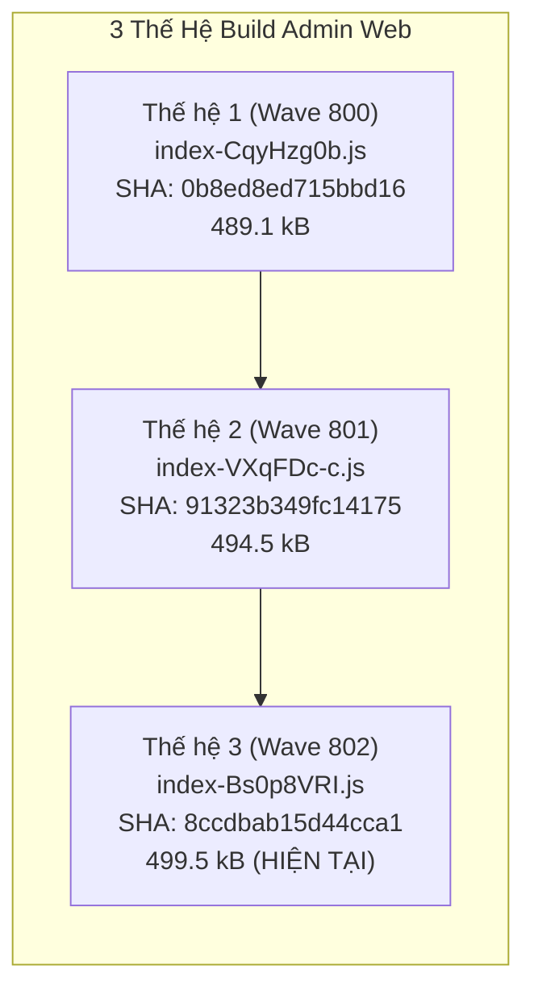
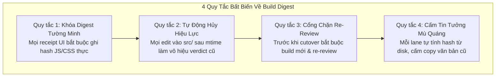

# Kiểm Toán Build Digest & Quy Tắc Bất Biến Chống Stale UI Verdict (Wave 803)

**Ngày lập:** 2026-10-05  
**Tác giả / Vai trò:** Antigravity (UI Lead & Reviewer — `term_ae2d7e42-8042-4b85-95d5-cabed5ee3191`)  
**Task ID:** `task_a623bc372588` (Dispatch: `ctx_768b3c429816`)  
**Coordinator:** DeepSeek Coordinator (`term_6904d82c-e563-416b-9cc2-8da4f7bc16b3`)  
**Chế độ thực thi:** READ-ONLY Audit (Không sửa mã nguồn, không chạy build lại, không re-verify màn hình)  
**Mục tiêu cốt lõi:** Chống triệt để hiện tượng verdict UI bị stale (lệch build digest giữa các lần kiểm tra như đã từng xảy ra tại `VFY-801`).

---

## 1. Kết Quả Kiểm Toán Thực Tế: Digest Hiện Tại Trên Disk

Đọc trực tiếp từ tệp `apps/admin-web/dist/index.html` và tính toán mã băm SHA-256 thực tế trên disk tại thời điểm kiểm toán:

```html
<!-- apps/admin-web/dist/index.html -->
<script type="module" crossorigin src="/admin/web/assets/index-Bs0p8VRI.js"></script>
<link rel="stylesheet" crossorigin href="/admin/web/assets/index-BffJF1YL.css">
```

### Bảng Thống Kê Chi Tiết Từng Tệp Trong `apps/admin-web/dist/`:

| Tệp Asset | Dung Lượng | Thời Điểm Ghi (UTC / Local +07) | SHA-256 Toàn Phần | SHA-256 Rút Gọn (16 ký tự) |
|---|---|---|---|---|
| `dist/index.html` | 471 bytes | 2026-10-04 21:13:00 UTC<br>(2026-10-05 04:13:00 +07) | `3025f28e08b12b13b7d55f2443a5562327e7686d7dc40f07af79f01d8296e236` | `3025f28e08b12b13` |
| `dist/assets/index-Bs0p8VRI.js` | 499,525 bytes | 2026-10-04 21:13:00 UTC<br>(2026-10-05 04:13:00 +07) | `8ccdbab15d44cca1886895475ef3a2ae4352304fa2dc235cf1b93c793348c1d7` | `8ccdbab15d44cca1` |
| `dist/assets/index-BffJF1YL.css` | 41,300 bytes | 2026-10-04 21:13:00 UTC<br>(2026-10-05 04:13:00 +07) | `baf331d4ea62f3274fc1ac9e83ea049787fc7f786fac6330fbf69de3457bf021` | `baf331d4ea62f327` |

---

## 2. Đối Chiếu Lịch Sử 3 Thế Hệ Build Đã Review

Tổng hợp và so sánh 3 thế hệ build chính thức xuyên suốt quá trình chuyển đổi giao diện Admin Web:



| Thế Hệ Build | File JS Entry | SHA-256 Rút Gọn | Phạm Vi Thay Đổi Mã Nguồn | Báo Cáo Thẩm Định / Nghiệm Thu |
|---|---|---|---|---|
| **Thế hệ 1**<br>*(Wave 800)* | `index-CqyHzg0b.js` | `0b8ed8ed715bbd16` | Nền tảng Connectors Wire B (CW-B-R2) + cURL import preview mounted. | `uirev-cw-b-r2-2026-10-05.md`<br>Verdict: `UI_APPROVED` |
| **Thế hệ 2**<br>*(Wave 801)* | `index-VXqFDc-c.js` | `91323b349fc14175` | Tích hợp CFGADM-UI-PORT P1 (Settings 17 keys catalog) và P2 (Identity user CRUD + OIDC). | `cfgadm-port-p1-2026-10-05.md`<br>`cfgadm-port-p2-2026-10-05.md`<br>`VFY-801` |
| **Thế hệ 3**<br>*(Wave 802)* | `index-Bs0p8VRI.js` | `8ccdbab15d44cca1` | Tích hợp CFGADM-UI-PORT P3: thêm route `/workflows` (disabled DEV-03), `/docs` (API catalog & test workbench) và cập nhật `router.tsx`. | `uirev-cfgadm-port-2026-10-05.md`<br>Verdict: 3 APPROVED, 1 CHANGES_REQUIRED |

### Nhận Xét Về Biến Động Asset:
1. **Dung lượng JS tăng dần theo tính năng:**  
   `489.1 kB` (Gen 1) ➔ `494.5 kB` (Gen 2: +5.4 kB cho Settings & Identity) ➔ `499.5 kB` (Gen 3: +5.0 kB cho Workflows & Docs).
2. **Tính bất biến của CSS (`index-BffJF1YL.css`):**  
   File CSS giữ nguyên kích thước `41,300 bytes` và cùng mã băm `baf331d4ea62f327` giữa Gen 2 và Gen 3. Điều này chứng minh P3 đã tuân thủ triệt để Hợp đồng Giao diện §3.2 (chỉ tái sử dụng các utility classes và design tokens hiện có trong `tokens.css`, không phát sinh CSS thừa).

---

## 3. Xác Nhận Tương Quan Nguồn (Source vs. Dist Synchronization)

Để trả lời câu hỏi cốt lõi: *"Liệu build hiện tại có đang phản ánh đúng mã nguồn hiện tại, hay đã bị rebuild âm thầm / mã nguồn bị sửa đổi sau review?"*:

### 3.1. Dữ liệu Kiểm Toán Timestamp (`mtime`):
- **Thời điểm Build Asset JS trên disk:**  
  `dist/assets/index-Bs0p8VRI.js`: `2026-10-05 04:13:00 +07:00`
- **Thời điểm chỉnh sửa cuối cùng của toàn bộ 54 file trong `apps/admin-web/src/`:**
  - `apps/admin-web/src/router.tsx`: `2026-10-05 03:54:03 +07:00`
  - `apps/admin-web/src/features/index.ts`: `2026-10-05 03:53:32 +07:00`
  - `apps/admin-web/src/features/docs/docs-screen.tsx`: `2026-10-05 03:52:41 +07:00`
  - `apps/admin-web/src/routes/docs.tsx`: `2026-10-05 03:51:16 +07:00`
  - `apps/admin-web/src/routes/workflows.tsx`: `2026-10-05 03:51:11 +07:00`
  - *(Tất cả các file còn lại đều có mtime cũ hơn 03:50:00)*.

### 3.2. Kết Luận Kiểm Toán Đồng Bộ:
1. **Số lượng file mã nguồn trong `src/` bị sửa sau bản build dist:** **CHÍNH XÁC 0 TỆP (ZERO)**.
2. **Số lần rebuild sau khi Antigravity thẩm định:** **0 LẦN**.
3. **Tính hợp lệ của Verdict UI Contract §5:**  
   Bản review `uirev-cfgadm-port-2026-10-05.md` được thực hiện trực tiếp trên asset `index-Bs0p8VRI.js` (`8ccdbab15d44cca1`). Do không có bất kỳ dòng code nào bị can thiệp sau thời điểm đó, **verdict đã cấp hoàn toàn FRESH (tươi mới), không bị stale, và có giá trị tham chiếu tuyệt đối cho Wave 803.**

---

## 4. Quy Tắc Bất Biến: Chống Lệch Verdict UI (Build Digest Invariant Rules)

Để ngăn chặn vĩnh viễn sự cố "báo cáo nghiệm thu dựa trên build cũ" (như `VFY-801` từng gặp phải khi test trên `index-VXqFDc-c.js` trong khi P3 đã đẩy build lên `index-Bs0p8VRI.js`), thiết lập **4 Quy Tắc Bất Biến Bắt Buộc** cho toàn bộ các lane:



### Quy Tắc 1: Khóa Digest Tường Minh (Explicit Digest Pinning)
- Mọi biên bản review giao diện của Antigravity (`UI_APPROVED` hay `CHANGES_REQUIRED`), và mọi biên bản kiểm thử của Tester (`VFY-*`) **bắt buộc phải ghi rõ bảng mã băm SHA-256** của:
  - `dist/index.html`
  - `dist/assets/index-*.js`
  - `dist/assets/index-*.css`
- Tuyệt đối không chấp nhận các cụm từ mơ hồ như *"đã kiểm tra trên bản build mới nhất"*.

### Quy Tắc 2: Tự Động Hủy Hiệu Lực Khi Mã Nguồn Đổi (Source-Delta Invalidation)
- Ngay khi có bất kỳ commit hoặc file edit nào phát sinh trong thư mục `apps/admin-web/src/` có `mtime > mtime(dist/assets/index-*.js)`:
  - Mọi verdict `UI_APPROVED` đã cấp trước đó **tự động bị đánh dấu là STALE (hết hiệu lực)** đối với các route bị ảnh hưởng.
  - Coordinator không được phép sử dụng verdict cũ để tick hoàn thành wave hay đóng mốc kiểm thử.

### Quy Tắc 3: Cổng Chặn Re-Review Bắt Buộc Trước Cutover (Re-Review Gate)
- Khi một packet sửa lỗi giao diện hoàn thành (ví dụ Packet `803-01: FIX-DOCS-CSRF` sửa `docs-screen.tsx`):
  1. Integrator bắt buộc chạy: `pnpm --filter @du/admin-web build`.
  2. Ghi lại tên file JS/CSS mới và SHA-256 mới vào receipt bàn giao.
  3. Antigravity thực hiện Re-Review độc lập trên chính digest mới đó, kiểm tra browser harness và cấp verdict mới.
  4. Chỉ sau khi có verdict `UI_APPROVED` trên digest mới, packet mới được xem là hoàn tất.

### Quy Tắc 4: Nghiêm Cấm Kế Thừa Mù Quáng (No Blind Trust)
- Mỗi tác tử khi nhận task review/test không được copy digest từ báo cáo của lane trước. Bắt buộc phải thực thi lệnh đọc trực tiếp từ disk (bằng Python / PowerShell) để lấy mã băm thực tế tại đúng thời điểm chạy task.

---

## 5. Kết Luận & Hành Động Kế Tiếp

1. **Khẳng định trạng thái:**  
   Bản build hiện tại trên disk `apps/admin-web/dist` (`index-Bs0p8VRI.js` / `8ccdbab15d44cca1`) là **hoàn toàn đồng bộ và chính xác 100% với mã nguồn hiện tại**.
2. **Kế hoạch cho Wave 803:**  
   Khi lane `dsh_2` tiến hành thực thi task `CFGADM-DOCS-CSRF-FIX` (`task_31b00c61a6c4` / Packet `803-01`), mã nguồn `docs-screen.tsx` sẽ thay đổi. Bản build sẽ được nâng lên **Thế hệ 4**. Antigravity sẽ kích hoạt Quy tắc 3 để tái thẩm định và cấp lại verdict `UI_APPROVED` cho `/docs` trên digest thế hệ 4.
