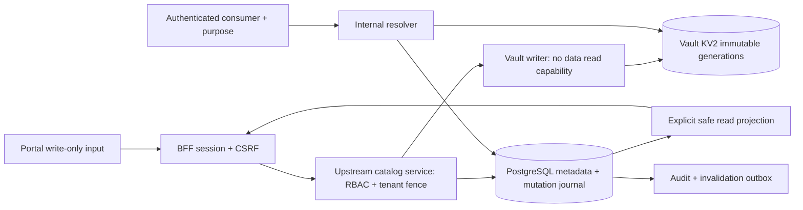

# Secrets Backend Next-Phase Design — 2026-10-06

Packet: DISPATCH PACKET 6 [P1]. Owner: codex_arch. Status: **SPECIFIED / DESIGN REVIEW PENDING**. Implementation, independent verification và live acceptance: **NOT_DONE**. Không sửa product code, không commit/push; packet này không dispatch worker hoặc đóng gate.

## 1. Decision boundary và nguồn

[Claude Reviewer §11.2](claude-audit-review-r4-2026-10-06.md) phê duyệt Option A DESCOPE backend sang phase tiếp theo, từ chối rushed in-memory/DB catalog. SC-01 vẫn OPEN; backend chưa có phải giữ typed 404/503, validation 422 không echo value, Portal write-only và disabled-with-reason. Spec này đáp ứng yêu cầu riêng: Vault KV2-backed catalog, projection proof, persistence và rotation semantics. Không tự đổi verdict REVIEW-07 hoặc degraded behavior.

Nguồn local đã đối chiếu:

- [Secret Catalog task](../../tasks/SECRET-CATALOG-2026-10-06.md): stable IDs, deployment-level backend, approved Vault connection và no plaintext readback.
- [Canonical contracts](../../packages/contracts/src/secret-catalog.ts): ACTIVE/DISABLED/REVOKED; managed_value/vault_reference; create, rotate expectedRevision, disable, strict read/list schemas.
- [BFF](../../services/orchestrator/src/app/admin/bff/secrets.ts): GET list / POST create dispatch, rotate/disable/test POST, platform-admin mutation + CSRF, tenant fencing. Đây là boundary đã có, không phải upstream persistence.
- [Runtime resolver](../../services/orchestrator/src/modules/secrets/vault-resolver.ts), [SC-02 receipt](sc-02-vault-runtime-resolver-2026-10-06.md): injected managed decryptor, Vault reader, tenant/purpose checks, revision cache. Chưa đồng nhất interface với Vault-backed managed catalog; phải review integration riêng.
- [Credential writer](../../services/orchestrator/src/modules/connector-credentials/vault-kv2-writer.ts), [writer policy](../../infra/vault/policies/orchestrator-writer.hcl), [reader policy](../../infra/vault/policies/connector-reader.hcl): reuse HTTP hygiene và identity pattern, không reuse scope rộng làm quyền catalog tự động.

Vault API semantics đối chiếu nguồn chính thức ngày 2026-10-06: CAS, explicit version reads, retention và deletion/destruction tại [KV2 API](https://developer.hashicorp.com/vault/api-docs/secret/kv/kv-v2); cấu hình audit tại [Vault audit devices](https://developer.hashicorp.com/vault/docs/audit). Implementation phải pin và test đúng Vault version deploy, không dựa mock HTTP status làm chuẩn.

## 2. Kiến trúc đề xuất

**Catalog = durable control-plane metadata trong PostgreSQL + managed secret material trong Vault KV2**, liên kết bằng immutable identity/generation. PostgreSQL không chứa plaintext hoặc copy ciphertext của value trong phase này; Vault giữ material và bảo vệ storage bằng cơ chế của Vault. Đây không phải DB secret store và không tuyên bố metadata DB tự được Vault envelope-encrypted. Metadata/backups vẫn cần encryption/access policy của deployment.

`managed_value` backend là lựa chọn deployment-level: phase này chọn Vault KV2. Không thêm Portal toggle Vault-vs-DB, không silent fallback sang encrypted DB/in-memory khi Vault lỗi. `vault_reference` là liên kết đến connection được operator phê duyệt; user chỉ cung cấp locator mount/path/field/version trong scope cho phép. Connection registry server-side cố định origin/TLS identity/namespace/mount/prefix; không nhận URL/token từ user.

Control plane sở hữu metadata và mutations; workers không trực tiếp list/read Vault. Connector/Orchestrator consumer chỉ resolve bên trong authenticated execution đã kiểm tra tenant, service, purpose và consumer binding; không có public resolve-to-plaintext API. Nếu phải truyền credential giữa trusted services, dùng channel authenticated/TLS riêng và không lưu nó trong operation result, queue, artifact hoặc receipt.

## 3. Persistence model và isolation

Các bảng dưới đây là đề xuất migration mới; chưa chọn migration number, chưa tạo schema/source:

| Store | Fields và invariants |
|---|---|
| `secret_catalog` | PK secretId; tenantId immutable; name + normalized name unique per tenant; purpose; permitted services; provider descriptor; public state; positive catalog revision; rotation metadata; timestamps. Internal activeGenerationId nullable. Không value/envelope/token. |
| `secret_generations` | generationId UUID; tenantId/secretId FK; deployment backend binding revision; mount/path/field; pinned Vault version; lifecycle PREPARED/PUBLISHED/ORPHAN/DESTROY_PENDING/DESTROYED; mutationId; timestamps. Internal only, không serialize nguyên row. |
| `secret_mutations` | mutationId; tenant/actor/secret/action; expectedRevision; idempotency key digest + keyed request MAC; lease/fencing epoch; state; candidate generation; safe error code; result revision. Không request body hoặc literal value. |
| `secret_usage` | tenant/secretId + consumer kind/id/revision/slot, purpose/service; transactional FK to authoritative consumer write. Index phục vụ disable warnings, không cấp quyền resolve. |
| `secret_events` / outbox | transactionally committed audit event và invalidation reference: IDs/revision/action/actor/time/outcome; không credentials hoặc raw request/error. |

Tenant composite FKs và scoped queries bắt buộc; platform principal vẫn phải chọn tenant rõ cho mutation. Cross-tenant lookup trả non-disclosing NOT_FOUND/denied trước Vault call. Names display-only; reference binding dùng secretId. Rename không đổi identity/path; name reuse của tombstone mặc định bị chặn để tránh nhầm legacy consumers. Chuẩn normalization/case-folding phải freeze trong migration review.

PostgreSQL và Vault đều cần durable production storage, backup/restore và restart proof. Không chạy Vault dev/in-memory làm acceptance. DB backup không chứa material; Vault backup là secret-bearing artifact, có access/encryption/retention riêng. Restore phải reconcile activeGeneration → pinned version; mismatch fail-closed, không tự chuyển latest. Không tuyên bố transaction ACID xuyên PG/Vault.

### Managed path và CAS strategy

Path do server tạo: `<approved-root>/tenants/<tenantId>/catalog/<secretId>/generations/<generationId>`; field cố định `value`. Một generation một KV key, value immutable sau create; rotation tạo generation mới. Writer policy tenant/path-scoped, runtime reader tách identity. Không dùng display name hoặc user path cho managed material.

**Hai fence:** catalog mutation dùng `expectedRevision` trong PG; Vault generation creation dùng `options.cas=0` và KV mount `cas_required=true`. Mỗi published generation pin version 1. Rotation không overwrite active path nên reader cũ không vô tình lấy value mới và orphan write không trở thành active chỉ vì Vault đã nhận request. Đây là deliberate immutable-generation design, không phải same-path CAS=N rotation. CAS=0 chỉ tạo key chưa tồn tại; read pin và retention behavior tuân theo [KV2 API](https://developer.hashicorp.com/vault/api-docs/secret/kv/kv-v2).

Writer không cần data-read. Reconciler có metadata-read để xác nhận version 1 tồn tại, chưa deleted/destroyed; sole controlled writer + reserved immutable path + mandatory CAS là điều kiện quy kết write. Version >1 hoặc path do principal ngoài policy ghi là `INTEGRITY_CONFLICT`, không publish. Operator/admin bypass là privileged trust boundary phải audit; không claim CAS chống root Vault.

Tradeoff: nhiều keys hơn same-path versioning, cần orphan GC và quota; đổi lại tránh distributed overwrite/readback recovery. Nếu reviewer yêu cầu same-path CAS=N, cần packet khác có durable generation correlation và proof cho ambiguous timeout; không thay đổi chiến lược âm thầm khi implement.

## 4. Create/rotation protocol và crash recovery

1. Authenticate/authorize/tenant fence; validate canonical write schema và bounds; verify deployment capability. Require idempotency key cho create/rotate. Body handling write-only, no request dump/APM capture.
2. Transaction PG reserve mutation + name/secret + candidate generation; CAS expectedRevision, ACTIVE state và không có mutation cạnh tranh. Commit PREPARED journal với unique mutation identity; public entry chưa được báo configured thành công. Không giữ DB transaction mở khi gọi Vault.
3. Synchronously write literal vào reserved generation path bằng CAS=0. Plaintext chỉ ở transient request/writer memory; không đưa vào durable queue/journal. Bound network/body/time, forbid redirect và sanitize mọi Vault error.
4. Xác minh successful Vault response version=1. PG transaction publication có predicate expected revision/state/current mutation/fencing epoch; atomically install generation, increment revision (create starts 1), update rotation metadata + outbox + result. Chỉ sau commit trả safe DTO; không echo write body.
5. Runtime dùng active generation pinned version; invalidation outbox phát cross-process. Old generations được giữ theo retention policy cho audit/recovery, không tự cấp quyền resolve lịch sử.

| Failure window | Recovery / public semantics |
|---|---|
| Trước PREPARED commit | Không write Vault; retry cùng key an toàn |
| PREPARED, Vault chưa có key; process crash mất request value | Không có durable value để tự retry. Mark AWAITING_RESUBMIT; client gửi lại cùng key/body hoặc operator cancel; không pretend async writer có payload |
| Write timeout hoặc mất response | Mark WRITE_UNCERTAIN; reconcile metadata reserved path. Có đúng version 1 hợp lệ ⇒ publish theo fence; chưa có ⇒ vẫn pending và retry cùng CAS=0, không suy ra write thất bại chỉ từ một 404 |
| Vault committed, PG unavailable | Không báo mutation success; durable journal + metadata reconcile publish sau PG phục hồi; active pointer cũ vẫn dùng cho rotation |
| PG committed, HTTP response mất | Same key/body replay trả safe committed result, không tạo generation tiếp theo |
| Disable/revoke/cancel thắng publication fence | Candidate không publish; mark ORPHAN, cleanup sau reconciliation; operation không tự bật lại secret |
| Hai rotate cùng expectedRevision | Một reservation/publication thắng; còn lại 409 REVISION_CONFLICT hoặc mutation-in-progress, không last-write-wins |

Lease epoch chỉ fence PG publication; nó không fence request Vault đã gửi. Retry và late response cùng generation đều CAS=0 nên không ghi hai versions. Cancelled mutation path vẫn theo dõi GC qua cửa sổ request timeout/reconciliation; nếu late write xuất hiện sau scan thì sweep tiếp, không xóa journal sớm. Không tái sử dụng generationId/path sau cancel/destroy.

Đề xuất mutation-in-progress trả 503 typed + Retry-After và correlationId; không tạo 202 endpoint mới khi chưa contract review. Replay committed create/rotate có thể dùng stored safe response snapshot, nhưng phải authorize lại và không mô tả snapshot ACTIVE cũ như state hiện tại; client refresh list. Các response/body shapes mới cần freeze riêng trước implementation.

Idempotency scope = tenant + actor authority + action/secret + key. Keyed MAC trên canonical request (gồm value) phục vụ same-key/different-body 409; không dùng unkeyed SHA của low-entropy secret làm fingerprint. MAC key riêng trong deployment secret management, versioned, không trả qua API/log; mất key phải có typed replay-unverifiable policy, không tạo duplicate silently. Retry horizon đề xuất 24h; journal/reference tombstone giữ lâu hơn pending/orphan lifetime. Hết horizon trả expired-key rõ, không tái thực hiện cùng key trong im lặng. Không ghi MAC hoặc raw idempotency key vào audit public.

## 5. No-plaintext-readback projection và proof obligation

No-readback nghĩa material không thoát qua admin/API/Portal/read model/log/DB; không nghĩa runtime không bao giờ có plaintext để gửi credential đến consumer hợp lệ. Writer nhận plaintext đầu vào nhưng không có capability đọc material đã lưu.

Projection function tạo object mới bằng allowlist: catalogVersion, secretId, tenantId, name, purpose, services, provider locator hợp lệ, state, revision, rotation nếu có, valueConfigured, bounded usageReferences. Không spread persistence row, request body hoặc Vault response. Parse output bằng canonical `SecretCatalogEntryReadSchema` / `SecretCatalogListPageSchema`; schema failure là fail-closed sanitized response, không fallback relay raw payload. BFF/Portal cũng validate read shape trước render; upstream `relayUpstream` hiện tại không được tự coi là proof đã có projection backend.

`valueConfigured` = generation đã publish hoặc link đã cấu hình/probe theo policy; không phải Vault healthy ngay lúc đọc, không phải credential usable và không chuyển false do outage tạm thời. DISABLED/REVOKED vẫn có thể true vì material/config vẫn tồn tại; resolver dựa state. Usage list tối đa 64 theo contract; nếu nhiều hơn, trả deterministic bounded subset và dùng dependency query riêng proposed cho destructive decisions, không giả định danh sách đó đầy đủ.

| Boundary | Mechanism | Evidence bắt buộc |
|---|---|---|
| DB/journal/outbox | Không column value/request-body; typed allowlist writes | Sentinel scan logical rows/backups + schema inspection |
| List/create/rotate/disable/test responses | Explicit projection + strict schema, generic typed errors | Positive requests và adversarial nested value/token/unknown fields; response bytes scan |
| Vault writer | No data-read ACL; metadata-only recovery | Real identity write PASS; GET data denied; metadata read allowed |
| Portal | Password/write-only input; never hydrate old value; no persistent browser storage | Playwright DOM/network/storage scan, including rejected save and refreshed page |
| Logs/traces/audit | Body/header redaction, fixed messages; no upstream raw errors | Sentinel scan stdout, collector/APM, application audit and Vault audit output |
| Runtime/consumer | Resolve only at use, bounded ephemeral memory, no result/queue persistence | Approved value reaches authorized receiver/provider only; all deny paths zero dispatch |

Strict top-level schema alone không đủ: nested schemas phải strict và mọi serializer/errors phải được kiểm tra. Không đưa value vào display name/reason/custom metadata; user-controlled metadata có thể tự chứa bí mật nên hạn chế/redact diagnostics và hướng dẫn rõ. Không thể chứng minh chống user cố tình đặt secret vào label chỉ bằng key-name rejection.

Proof gồm canary secrets với raw/JSON-escaped/base64/URL-encoded variants và distinctive substrings; scan mọi output/artifact ngoài approved Vault material/transient authorized channel. Control chứng minh scanner phát hiện sentinel injected fixture. Storage scan dùng PG logical dump, object artifacts và Vault durable storage/backup bytes dưới controlled tester; Vault data endpoint đọc có thể dùng riêng tester identity làm positive control, tuyệt đối không cấp quyền đó cho writer. Audit devices cấu hình an toàn và kiểm tra log thực tế; không dựa riêng masking/default để kết luận no-leak ([Vault audit docs](https://developer.hashicorp.com/vault/docs/audit)). Memory zeroization trong JS chỉ best-effort; cấm heap/core dump production và review APM/body capture, không claim xóa tuyệt đối string khỏi heap.

## 6. Lifecycle semantics

| Action/state | Proposed semantics |
|---|---|
| Create managed | ACTIVE chỉ sau publication; stable UUID, revision 1; pending mutation không phải public state mới |
| Link Vault reference | Không copy material. Validate approved connection/scope, safe probe bằng resolver identity; pinned hoặc latest explicit theo capability; success response chỉ metadata |
| Rotate ACTIVE managed | expectedRevision bắt buộc; new immutable generation; revision +1 một lần, rotatedAt set sau publication; omitted metadata preserves |
| Rotate linked reference | Existing literal rotate DTO không áp dụng: reject typed unsupported, không ghi vào external owned path. Locator/version change cần future explicit update schema + review |
| Disable ACTIVE | CAS state → DISABLED, revision +1, reason sanitized audit; deny future resolves immediately via authoritative state check; không xóa Vault material |
| Enable DISABLED | Future separate authorized DTO/route, not current BFF contract. Fresh probe + CAS + revision bump; không implicit enable qua rotate |
| Revoke ACTIVE/DISABLED | Future irreversible state → REVOKED with CAS; deny resolution and cancel publication; tombstone retained. Không tự map disable thành revoke |
| Clear/delete | Không nằm trong current catalog API. Consumer explicit clear gỡ binding theo schema; không destroy shared secret. Purge cần riêng authorization, dependency scan và retention approval |
| Destroy material | Managed-only maintenance identity sau retention/dependency policy; durable DESTROY_PENDING → confirmed DESTROYED. External vault_reference không được catalog tự delete/destroy |

Disable/revoke deny future resolve, không thể thu hồi credential đã gửi hoặc hủy request đang chạy chỉ bằng xóa cache. Security owner quyết định upstream credential revocation khi cần; KV destruction khác provider-side revoke. Retry cùng key không bump revision thêm. Rename/permissions change nếu bổ sung phải CAS/revision bump và cập nhật runtime grant; không dùng stale permissive reference.

Vault soft-delete và destruction có ý nghĩa khác nhau; retention và max_versions có thể ảnh hưởng data availability. Destruction managed generations phải qua maintenance workflow và xác minh status; không tự undelete để bypass REVOKED. Semantics này dựa [KV2 API](https://developer.hashicorp.com/vault/api-docs/secret/kv/kv-v2); exact deployed behavior cần live tests.

## 7. Runtime binding, cache và permission semantics

Permission axes tách `list/read-metadata/create/link/rotate/disable/test/use`; listing không cấp use. Giữ current platform-admin + CSRF mutation BFF, không tự mở tenant-admin writes. Upstream verify principal độc lập, không tin tenant/purpose/services từ caller reference. Runtime lookup authoritative row theo secretId và consumer binding, kiểm tra state/tenant/purpose/service/current revision trước Vault access. `generic` purpose không là wildcard.

Managed resolver cần internal adapter đọc active Vault generation; existing injected decryptor interface không được đặt tên deceptive cho Vault implementation. Freeze contract adapter chuẩn trong implementation packet, test service identity và Connector binding; không sửa interface trong design packet này. Contract literal max 64 KiB và resolver default 8192 chars hiện khác nhau: unify bounds/reject unsupported length tại write, tránh create thành công rồi runtime fail cho PEM lớn.

Phase đầu **cache plaintext off (TTL 0)** cho authoritative revoke semantics; mỗi use kiểm tra DB. Invalidation outbox vẫn chuẩn bị cho safe cache sau này. DB/Vault outage deny use, không stale cache fallback. Nếu sau này bật cache, phải định nghĩa max stale window và linearization bằng authoritative revision check; không claim broadcast invalidation bảo đảm tức thời trên partition.

Rotation: binding secretId mặc định lấy current generation tại use. Snapshot operation lưu secretId/binding/policy metadata, không material. Nếu business cần credential generation pin across retries, schema và retention/grant review riêng; pin cũ vẫn phải deny khi DISABLED/REVOKED, không bypass state fence. Policy snapshot immutability không phải quyền dùng revoked secret.

`vault_reference latest`: explicit opt-in capability; không cache value theo catalog revision vì external rotation không bump revision. Resolve latest tại use, audit effective version internally nếu reader hỗ trợ; pinned fail khi version deleted/destroyed, không fallback latest. Namespace capability phải phù hợp deployed Vault edition và registry; không nhận namespace từ user như arbitrary routing override.

Safe test/probe có rate limit, use/probe permission riêng và value-free result. Nó được phép đọc vào internal resolver memory nhưng không trả bytes; tên status không khẳng định toàn bộ provider auth hợp lệ nếu chỉ probe storage. No arbitrary URL/header origin từ secret; consumer vẫn enforce egress và header constraints.

## 8. Identity, errors và operational controls

Machine auth dùng AppRole/Kubernetes theo deployment; không root token/static browser token. Tách catalog writer (data create/update + metadata read), runtime reader (data read scoped), metadata projector (không data read), maintenance destroy identity (không gộp vào writer). Existing `du/connector/*` policies cần catalog-specific tenant paths; wildcard service token không phải tenant-isolation proof. TLS/trust origin registry, redirect error, bounded timeout/response, no credential logging, token renewal fail-closed.

Errors proposed: 401/403 authorization; non-disclosing 404; 409 revision/idempotency/integrity conflict; 422 `{pointer,message}` validation; 503 backend unavailable/write uncertain/in-progress; sanitized 502 unexpected store protocol. Error names và body phải freeze theo HTTP conventions hiện hành. Không mặc định Vault CAS conflict luôn HTTP 412: adapter hiện map 412 nhưng phase mới phải test actual response và phân loại an toàn trên Vault version thật, không relay `errors[]` raw.

Read metadata có thể vẫn phục vụ khi Vault down nếu PG healthy, kèm capability status ngoài catalog DTO qua contract riêng nếu cần; valueConfigured giữ nghĩa cấu hình. Writes/test/use fail-closed. Backend absent giữ degraded typed behavior tới khi rollout hoàn tất. Readiness capability không đổi false save thành success. Vault token mất/expired, tampered material hoặc missing version không fallback DB/literal.

Retention proposal: published generations không auto-GC khi còn referenced/pinned; orphan journal quiescence + minimum 24h trước purge; thời gian giữ old published material theo security policy được reviewer chốt, không hardcode tự xóa. KV automatic deletion tắt cho managed generations cho tới khi có retention review. GC theo catalog metadata, không user input path. Monitor pending age, uncertain writes, orphan count, CAS conflicts, Vault latency/denials, DB fence failures, outbox lag; metrics IDs/labels bounded, không chứa material hoặc raw locator tùy tiện.

## 9. Rollout và verification plan

1. Independent design review: approve store split, immutable-generation CAS, no-readback threat boundary, auth/retention, contract deltas. SC-01 vẫn OPEN.
2. Implement leased packets: migrations/repository; Vault writer+reconciler; upstream routes/projection/RBAC; resolver adapters; outbox/lifecycle; BFF/Portal integration. Coordinator gán owners/leases riêng; chưa dispatch từ báo cáo này.
3. Offline verification: contract/projection fuzz; cross-tenant/service/purpose denies; same-key body conflicts; competing rotations; DB/Vault failure at every protocol boundary; disable racing publication; late response and orphan cleanup; latest/pinned/cache semantics; malformed/oversized errors sanitized.
4. Live Vault + PG proof: exact candidate digests, non-dev durable Vault, real machine policies, applied-state migrations, restart/redeploy durability, CAS/reconciliation, no-plaintext byte scans, Portal roundtrip và production boot-wired runtime consumer path.
5. Restore/recovery drill: backup both stores, restore mismatch deny, reconcile orphan/pending without value readback, confirm disable/revoke persisted. No live credential material in receipts.
6. Regenerate OpenAPI bằng `tools/openapi/gen_openapi.py` sau contract/API implementation; NO-DROP + structural validator; sync architecture/connector/Portal docs. Không hand-edit generated spec.
7. Tester độc lập ghi VERIFIED theo matrix; Claude review riêng mới cho ACCEPTED. Candidate-only rollout không tự promote production hoặc gỡ REVIEW-07.

| Acceptance obligation | Evidence cần có | Status |
|---|---|---|
| Durable catalog/material sau restart | PG row + Vault pinned read bằng authorized tester + runtime use | NOT_RUN |
| No plaintext readback/storage leak | Projection tests, browser/log/dump scans + scanner controls | NOT_RUN |
| CAS/concurrency/crash safety | Real Vault cases + PG fence matrix + reconcile logs | NOT_RUN |
| Lifecycle/revocation isolation | Before/after disable/revoke, stale grant/cache, race evidence | NOT_RUN |
| Correct production composition | Boot path → catalog → adapter → Vault → authorized consumer | NOT_RUN |
| Backup/restore và GC policy | Applied config, restore drill, deletion/destruction evidence | NOT_RUN |

Evidence root đề xuất `coordination/reports/raw/secrets-backend-next-phase-2026-10-06/<run-id>/`: sanitized manifest/config, source/image/fixture SHA-256, migration applied-state, policy capabilities, commands/exit codes, audit scans, reconciliation/lifecycle timeline và summary. Reviewer phải kiểm tra provenance của đúng candidate; không dùng historical SC-02 mock receipt thay live proof.

## 10. Review decisions cần chốt và receipt

Reviewer cần chốt: (a) immutable-generation CAS=0 + PG revision fence; (b) publish/reconcile semantics khi response uncertain; (c) mandatory idempotency/MAC key/replay horizon; (d) enable/revoke/update/purge contract là packet riêng; (e) cache off và authority-check mỗi use; (f) generation retention/provider-side revocation; (g) catalog isolation policies và configured-vs-available semantics. Đây là design review questions, không chặn việc hoàn thành spec hiện tại và không phải yêu cầu user cấp permission mới.

Đã viết design đề xuất chi tiết và đối chiếu contract/source + Vault documentation. Chỉ tạo báo cáo Markdown này. Chưa implement backend, chưa đổi API/schema/product code, chưa chạy live Vault, chưa đóng SC-01 hoặc acceptance gate. Các semantics mới nêu rõ là proposed và cần review trước implementation.

### Source snapshot SHA-256

Hashes l? snapshot l?c l?p spec, kh?ng ph?i acceptance c?a implementation; concurrent changes ph?i ???c review l?i.

| Source | SHA-256 |
|---|---|
| `packages/contracts/src/secret-catalog.ts` | `ea465415c527f2189051b39caefed71452e9acbd54e5fe0562479c5f027b3164` |
| `services/orchestrator/src/app/admin/bff/secrets.ts` | `e843a77165f4725ef1a489320f95e996d4a6d86037cdec5d341b8ad30d42801d` |
| `services/orchestrator/src/modules/secrets/vault-resolver.ts` | `2383329f5cc5349070be83ab8d95daa3b04acbeca52470dc2cc26039069ca395` |
| `services/orchestrator/src/modules/connector-credentials/vault-kv2-writer.ts` | `f0a2b721706c491ffeae8dc39df4ade0830763fd4c1fae9ec20821a319473ddb` |
| `coordination/reports/claude-audit-review-r4-2026-10-06.md` | `97eeed2fc8ad6209ee741ea92558ffc1f07df92e6a500671cdefc17f4ef5663a` |
