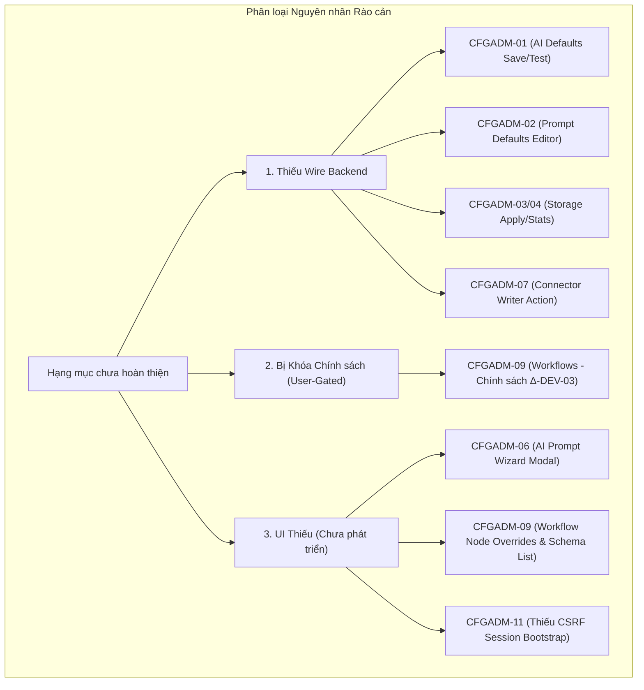
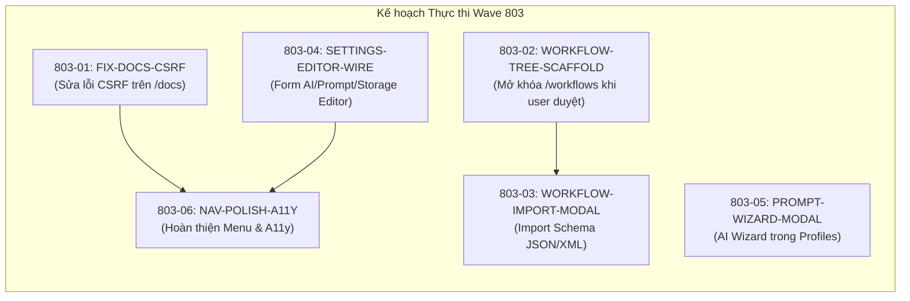

# Kế hoạch UI Backlog Wave 803 & Đối chiếu Đặc tả CFGADM-01..11

**Ngày lập:** 2026-10-05  
**Tác giả / Vai trò:** Antigravity (UI Lead / Reviewer — `term_ae2d7e42-8042-4b85-95d5-cabed5ee3191`)  
**Task ID:** `task_79d0da0dc17d` (Dispatch `ctx_c1417023b70f`)  
**Coordinator:** DeepSeek Coordinator (`term_6904d82c-e563-416b-9cc2-8da4f7bc16b3`)  
**Chế độ thực thi:** READ-ONLY Mapping (Không sửa source code, không rebuild, không dispatch lane khác)  
**Tài liệu căn cứ:**
- `tasks/ADMIN-LEGACY-CONFIG-PARITY-2026-10-04.md`
- `coordination/reports/cfgadm-ui-inventory-2026-10-05.md`
- `coordination/reports/cfgadm-screen-spec-review-2026-10-04.md`
- `coordination/reports/uirev-cfgadm-port-2026-10-05.md` (Biên bản thẩm định §5 Wave 802)
- Hợp đồng giao diện `docs/admin-ui-development-contract.md` (§3, §4, §5)

---

## 1. Bảng Đối Chiếu Hiện Trạng: Đặc Tả CFGADM 01..11 vs. Source `apps/admin-web`

Bảng đối chiếu toàn diện 11 module quản trị cấu hình legacy với cấu trúc hiện tại trong `apps/admin-web/src/features/*` và `apps/admin-web/src/routes/*` sau đợt porting Wave 802:

| Mã Đặc Tả | Chức năng Legacy (Root DUGate) | Route & Module trong Admin Web Rework | Trạng thái Thẩm định | Đánh giá Hiện trạng & Phân loại |
|---|---|---|---|---|
| **CFGADM-01** | Settings AI defaults (`ai_provider`, `ai_api_key`, `ai_model`, `openai_api_key`, `openai_base_url`) | `/settings` `features/settings/` (`settings-screen.tsx`, `catalog.ts`, `state.ts`) | **UI_APPROVED** *(dưới dạng Catalog)* ⚠️ **BỊ CHẶN** *(đối với chức năng Editor)* | Đã port 6 dòng catalog hiển thị thông tin thay thế; toàn bộ 6 button hành động bị disabled kèm lý do trung thực. Bị chặn chức năng chỉnh sửa do **thiếu wire backend**. |
| **CFGADM-02** | Prompt defaults (5 slots: `image`, `pdf`, `docx`, `compare`, `generate`) | `/settings` `features/settings/` | **UI_APPROVED** *(dưới dạng Catalog)* ⚠️ **BỊ CHẶN** *(đối với chức năng Editor)* | Đã port 5 dòng catalog prompt slots; controls disabled. Thiếu bộ soạn thảo prompt, bộ preset song ngữ và cơ chế lưu/diff do **thiếu wire backend**. |
| **CFGADM-03/04** | Storage & Retention (S3 endpoint, bucket, secret, region, TTL, cache/output stats + cleanup) | `/settings` `features/settings/` | **UI_APPROVED** *(dưới dạng Catalog)* ⚠️ **BỊ CHẶN** *(đối với chức năng Apply/Test)* | Đã port 6 dòng catalog storage & retention; controls disabled. Thiếu nút test S3 probe, stats preview và cleanup jobs do **thiếu wire backend & storage adapter**. |
| **CFGADM-05a** | API keys (Client/name/note, issue copy-once, rotate, revoke, tenant fence) | `/api-keys` `features/api-keys/api-keys-screen.tsx` | **ĐÃ PORT + UI_APPROVED** | Đã hoàn thiện 100%: danh sách key, modal cấp key copy-once, thu hồi, phân trang, lọc, gating CSRF và tenant fencing qua cùng-origin BFF. |
| **CFGADM-05b** | Profiles & Endpoint Catalog (Locks, priority, raw params, extensions, URL auth, steps, rollback) | `/profiles` `features/profiles/profiles-screen.tsx` | **ĐÃ PORT + UI_APPROVED** | Đã hoàn thiện 100%: biên tập draft bulk endpoints, phân loại priority, connection steps, URL auth, CAS concurrency `expectedRevision` và rollback modal. |
| **CFGADM-06** | AI Wizard (`ext-prompt-wizard`) + Test Endpoint workbench | `/profiles` (Test Endpoint) `/docs` (Test Workbench) AI Wizard: *chưa có* | **ĐÃ PORT một phần** - Test Endpoint: OK - Docs Workbench: **CHANGES_REQUIRED** - AI Wizard: **CHƯA PORT** | Test Endpoint trong `/profiles` hoạt động tốt. Test Workbench trong `/docs` bị **CHANGES_REQUIRED** do thiếu header `X-CSRF-Token` (`docs-screen.tsx:22, 66`). AI Wizard **chưa port** do thiếu route backend và UI wizard. |
| **CFGADM-07** | Connection CRUD + Import cURL + auth modes + multipart + test provider | `/connectors` `features/connectors/connectors-screen.tsx` (`curl-import.ts`, `curl-import-preview.tsx`) | **ĐÃ PORT (Scaffold) + UI_APPROVED** ⚠️ **CHƯA PORT** *(đối với Full CRUD Editor)* | Tra cứu revision read-only và cURL Import preview (có Q2 mask/unmask toggle) đã duyệt trong `UI-REVIEW-CW-B-R2`. Form tạo mới/chỉnh sửa connector và nút save/test/activate thật **chưa port** do thiếu writer action (`PAR-03/14`). |
| **CFGADM-08** | Identity (User CRUD, roles ADMIN/USER/VIEWER, password write-only, OIDC metadata) | `/identity` `features/identity/identity-screen.tsx` (`identity-api.ts`) | **ĐÃ PORT + UI_APPROVED** | Đã hoàn thiện: Danh sách user, tạo user mật khẩu write-only, gán role (mặc định VIEWER), toggle status (không hard delete), OIDC metadata allowlist 4 trường, fail-closed capability. |
| **CFGADM-09** | Workflows (List, import JSON/XML, pipeline mappings, node overrides, run/HITL) | `/workflows` `features/workflows/workflows-screen.tsx` | **ĐÃ PORT (Disabled) + UI_APPROVED** ⛔ **BỊ CHẶN** *(đối với chức năng Builder/Runner)* | Màn hình xuất xưởng ở trạng thái DISABLED có banner cảnh báo chính sách `Δ-DEV-03`. Toàn bộ chức năng biên tập workflow, import JSON/XML, node overrides và submit operation **bị chặn**. |
| **CFGADM-10** | Dashboard & History/Operations (Metrics 24h/7d, filter, operations list/detail, cancel, recovery) | `/overview` `/operations` `/usage` | **ĐÃ PORT + UI_APPROVED** | Danh sách operations và màn hình chi tiết (`operations-screen.tsx`) hoạt động tốt; Audit ledger trên Overview hoàn thiện. Phần biểu đồ tổng hợp Usage hiện đang hiển thị trạng thái "requires backend". |
| **CFGADM-11** | API Docs & Test Workbench (Catalog 13 endpoints, try-it modal) | `/docs` `features/docs/docs-screen.tsx` | **ĐÃ PORT còn CHANGES_REQUIRED** | Catalog 13 endpoint sạch và responsive 320px. Tuy nhiên form modal Test Workbench gửi POST `/profiles/test-endpoint` **bị thiếu header `X-CSRF-Token`** do chưa khởi tạo session client. |

---

## 2. Phân Tích Chi Tiết Nguyên Nhân Các Hạng Mục Chưa Port / Bị Chặn

Đối với các thành phần chưa hoàn thiện tính năng biên tập thực sự, nguyên nhân được phân loại cụ thể theo 3 nhóm rào cản:

### 2.1. Rào cản 1: Thiếu Wire Backend (Backend Wire Missing)
1. **CFGADM-01, 02, 03/04 (Settings Wire):**
   - *Thực trạng:* `grep -n Settings packages/contracts/src/*.ts` trả về **0 kết quả**. Trong toàn bộ mã nguồn hiện tại không hề tồn tại Schema DTO, route `/admin/api/settings` hay writer action nào cho 17 legacy keys.
   - *Hệ quả:* Màn hình `/settings` buộc phải xuất xưởng ở dạng deployment catalog trung thực, vô hiệu hóa toàn bộ nút `Apply`, `Replace secret`, `Retire` để tránh việc tạo form lưu giả mạo.
   - *Điều kiện giải phóng:* Backend cần hoàn thành packet `SETTINGS-WIRE-BASE` (hoặc định nghĩa hợp đồng schema DTO cho `aiDefaults`, `promptDefaults`, `storageConfig`).

2. **CFGADM-07 (Connector Writer & Activation Action):**
   - *Thực trạng:* Quản trị Connector mới chỉ có tầng đọc ledger (`listConnectors`, `getConnectorRevision`). Các hành động lưu thay đổi, kích hoạt (`activate`), kiểm tra kết nối với provider thật (`test`), hoặc xoay vòng secret bị chặn do phụ thuộc vào kiến trúc Vault/Credential workflow (`PAR-03/14`).
   - *Điều kiện giải phóng:* Backend triển khai action endpoints trong `/admin/api/actions` (`connector.upsert`, `connector.test`, `connector.activate`).

### 2.2. Rào cản 2: Khóa Chính Sách Người Dùng (User-Gated Policy)
1. **CFGADM-09 (Workflows Surface — `Δ-DEV-03`):**
   - *Thực trạng:* Theo chỉ thị từ người dùng và chính sách điều phối `Δ-DEV-03`, phân hệ Workflow tạm thời bị vô hiệu hóa ("ships disabled with honest reason until unblocked").
   - *Hệ quả:* Màn hình `/workflows` chỉ hiển thị thẻ thông báo `AlertBanner` cảnh báo route bị khóa bởi chính sách triển khai, từ chối tải hoặc biến đổi dữ liệu workflow.
   - *Điều kiện giải phóng:* Cần người dùng xác nhận quyết định mở khóa và lựa chọn định hướng kiến trúc (xem Mục 3).

### 2.3. Rào cản 3: UI Thiếu Hoặc Khiếm Khuyết Cần Sửa (UI Missing / Defect)
1. **CFGADM-11 (Lỗi thiếu CSRF Proof trong Docs Screen):**
   - *Thực trạng:* `docs-screen.tsx` khởi tạo client bằng `useMemo(() => createAdminApiClient(), [])` nhưng không gọi `client.getSession()` lúc mount. Do đó trường `csrfToken` nội tại bị `null`. Khi người dùng mở Test Workbench và bấm "Run test", request POST gửi tới `/profiles/test-endpoint` bị thiếu header `X-CSRF-Token`, dẫn tới lỗi HTTP 403 `CSRF_REJECTED` trên server thật.
   - *Điều kiện giải phóng:* Bổ sung lệnh bootstrap session trong `docs-screen.tsx`.

2. **CFGADM-06 (AI Prompt Wizard):**
   - *Thực trạng:* Màn hình tạo mới/gợi ý prompt bằng AI (`ext-prompt-wizard`) chưa có giao diện trong `apps/admin-web/src/features/`.
   - *Điều kiện giải phóng:* Cần xây dựng component `PromptWizardModal` tích hợp vào màn hình Profiles.

---

## 3. Danh Sách Câu Hỏi Cần User Trả Lời Để Mở Khóa `Δ-DEV-03` Và Settings Wire

Để chuẩn bị kế hoạch Wave 803 và gỡ bỏ các rào cản chính sách, cần lấy ý kiến quyết định của User đối với 8 câu hỏi cốt lõi sau:

### Nhóm A: Mở khóa phân hệ Workflows (`Δ-DEV-03`)
1. **Vị trí điều hướng của Workflows:**  
   Người dùng muốn Workflows là một mục menu độc lập trên thanh điều hướng chính (`/admin/web/workflows`) hay là một tab cấu hình nằm bên trong trang Businesses (`/admin/web/businesses`)?
2. **Hình thức giao diện Workflow Builder (Parity UX vs. Canvas):**  
   Bản cũ ở root DUGate quản lý workflow bằng dạng danh sách có cấu trúc (Tree/List View) gồm Inputs Schema, Node list và Node Overrides (không dùng canvas kéo thả). Người dùng có đồng ý giữ nguyên UX dạng Structured List / Form Overrides cho Wave 803 để đạt parity nhanh chóng và tối ưu hiệu năng bundle, thay vì tích hợp thư viện Canvas phức tạp (như ReactFlow)?
3. **Mô hình thực thi Workflow (Execution & Runner Delegation):**  
   Khi người dùng chạy thử workflow qua nút "Run Workflow", UI sẽ gửi yêu cầu tạo Operation bất đồng bộ tới backend `/admin/api/operations` (do BullMQ worker P9 xử lý và Admin Web poll kết quả), thay vì chạy runner đồng bộ trong web process như bản cũ, có đúng định hướng kiến trúc không?
4. **Quy chuẩn kiểm tra an toàn khi Import Workflow Schema:**  
   Khi nạp file JSON/XML workflow, người dùng có đồng ý áp dụng bộ lọc an toàn client-side (giới hạn dung lượng tối đa 512KB, chống XXE/DTD, và chỉ cho phép 10 loại node chuẩn: `connector`, `parallel`, `join`, `file_parse`, `file_url_download`, `callback`, `archive_compress`, `archive_extract`, `human`, `input`) không?

### Nhóm B: Kích hoạt Settings Wire có Writer Thật (CFGADM 01..04)
5. **Cơ chế lưu trữ Settings Động ở Backend:**  
   Các cấu hình động (AI defaults, Prompt defaults) sẽ được lưu vào đâu: bảng PostgreSQL `system_settings` có quản lý phiên bản (CAS concurrency `expectedRevision`), hay ghi trực tiếp vào file `.env` thông qua deployment agent, hay quản lý như một Platform Policy?
6. **Mô hình bảo mật Credential cho Settings (Vault vs. Encrypted Database):**  
   Đối với 4 credential keys (`ai_api_key`, `openai_api_key`, `s3_access_key`, `s3_secret_key`), người dùng muốn quản lý theo cơ chế nào:
   - *Lựa chọn 1 (Vault Secret-Ref):* UI chỉ gửi mô hình write-only (`keep`/`replace`/`clear`), backend đẩy trực tiếp vào HashiCorp Vault và lưu tham chiếu secret-ref.
   - *Lựa chọn 2 (Encrypted DB):* Backend mã hóa AES-256-GCM lưu trữ trực tiếp trong cơ sở dữ liệu tương tự Profile secret.
7. **Ranh giới cấu hình S3 Storage (Platform Deployment vs. Runtime UI):**  
   Thông số S3 bucket và credentials có được phép thay đổi qua giao diện Admin Web hay bắt buộc cố định ở cấp hạ tầng (`docker-compose.yml` / boot-time env) để tránh rủi ro mất kết nối lưu trữ tài liệu trong quá trình vận hành?
8. **Quyết định đối với legacy key `api_secret_key`:**  
   Theo khảo sát mã nguồn, key `api_secret_key` không còn bất kỳ consumer nào trong hệ thống runtime. Người dùng có xác nhận chính thức khai tử (`retire`) key này khỏi hệ thống hay muốn giữ lại cho mục đích tích hợp sau này?

---

## 4. Đề Xuất Danh Sách Packet UI Cho Wave 803

Kế hoạch Wave 803 được chia thành **6 packet nhỏ, độc lập, không xung đột file lease**, kèm theo tiêu chuẩn nghiệm thu khắt khe của Reviewer:

### Packet 803-01: `FIX-DOCS-CSRF` (Sửa lỗi CSRF Token trên Docs Screen)
- **Mục tiêu:** Khắc phục ngay lỗi thiếu `X-CSRF-Token` trong Test Workbench của `/docs`.
- **Phạm vi file:** `apps/admin-web/src/features/docs/docs-screen.tsx`.
- **Nội dung code:** Thêm `useEffect` gọi `client.getSession()` khi mount để client nạp sẵn `csrfToken` trước khi gọi `client.testProfileEndpoint`.
- **Tiêu chuẩn Reviewer:**
  1. Typecheck exit code 0.
  2. Test Playwright bắt request POST `/admin/api/profiles/test-endpoint` xác nhận header `x-csrf-token` tồn tại và không rỗng.
  3. Antigravity cấp verdict **`UI_APPROVED`** cho `/docs`.

### Packet 803-02: `WORKFLOW-TREE-SCAFFOLD` (Khung Giao Diện Workflows)
- **Điều kiện tiên quyết:** User phản hồi đồng ý mở `Δ-DEV-03`.
- **Phạm vi file:** `apps/admin-web/src/features/workflows/` (`workflows-screen.tsx`, `types.ts`, `state.ts`).
- **Nội dung code:** Xây dựng danh sách Workflow Schemas, bảng xem chi tiết Input Properties và 10 loại nodes chuẩn; thay thế banner disabled bằng giao diện read-only an toàn.
- **Tiêu chuẩn Reviewer:**
  1. Fail-closed khi chưa có quyền writer.
  2. Không bịa đặt dữ liệu (dữ liệu lấy từ API hoặc render intentional empty state).
  3. Reflow mượt mà ở màn hình 320px, kiểm tra a11y đầy đủ.

### Packet 803-03: `WORKFLOW-IMPORT-MODAL` (Modal Import Schema JSON & XML)
- **Mục tiêu:** Cho phép người vận hành nạp schema workflow từ tệp cấu hình bên ngoài.
- **Phạm vi file:** `apps/admin-web/src/features/workflows/workflow-import-modal.tsx`, `workflow-parser.ts`.
- **Nội dung code:** Dialog tải file kéo thả, parser client-side chống XXE, kiểm tra tính hợp lệ của danh sách nodes và form preview trước khi chấp nhận vào editor.
- **Tiêu chuẩn Reviewer:**
  1. Bắt buộc reject các file XML chứa thực thể bên ngoài (XXE).
  2. Bắt buộc reject các node lạ không thuộc 10 types hợp lệ.
  3. Zero network requests khi đang ở bước preview.

### Packet 803-04: `SETTINGS-EDITOR-WIRE` (Tích Hợp Form Cấu Hình 17-Key)
- **Điều kiện tiên quyết:** Backend hoàn thành và chốt DTO trong `SETTINGS-WIRE-BASE`.
- **Phạm vi file:** `apps/admin-web/src/features/settings/` (`settings-screen.tsx`, `settings-editor.tsx`).
- **Nội dung code:** Chuyển đổi 3 Card tĩnh thành 3 Form Editor độc lập:
  - Form AI Defaults (chọn provider, custom model/URL, credential write-only).
  - Form Prompt Defaults (5 prompt slots, preset mẫu, diff view).
  - Form Storage (S3 config, cache TTL).
- **Tiêu chuẩn Reviewer:**
  1. Secret inputs tuân thủ chặt chẽ pattern `Keep`/`Replace`/`Clear`, không hiển thị mật khẩu ra DOM.
  2. Lưu độc lập từng nhóm có kèm `expectedRevision` và idempotency key.
  3. Browser test xác minh không lộ secret vào `localStorage` hay console log.

### Packet 803-05: `PROMPT-WIZARD-MODAL` (AI Prompt Wizard cho Profiles)
- **Mục tiêu:** Bổ sung chức năng gợi ý prompt thông minh tương ứng `CFGADM-06`.
- **Phạm vi file:** `apps/admin-web/src/features/profiles/prompt-wizard-modal.tsx`.
- **Nội dung code:** Modal nhập mục tiêu xử lý văn bản, gọi service wizard qua BFF, hiển thị diff so sánh giữa prompt hiện tại và prompt đề xuất, cho phép nạp vào Profile draft.
- **Tiêu chuẩn Reviewer:**
  1. Không tự động bấm publish hay thay đổi policy trên server.
  2. Giữ nguyên các placeholder biến mẫu (ví dụ `{user_prompt}`, `{input_content}`).

### Packet 803-06: `NAV-POLISH-A11Y-803` (Hoàn Thiện Điều Hướng & Trải Nghiệm)
- **Mục tiêu:** Thống nhất toàn bộ liên kết điều hướng và kiểm tra tiếp cận (Accessibility).
- **Phạm vi file:** `apps/admin-web/src/app-shell/app-shell.tsx`, `apps/admin-web/src/features/overview/overview-screen.tsx`.
- **Nội dung code:** Bổ sung link `/workflows` và `/docs` lên thanh điều hướng AppShell và menu Overview; rà soát focus rings và phím Tab trên 100% các route.
- **Tiêu chuẩn Reviewer:**
  1. 100% routes truy cập được bằng bàn phím qua phím Tab.
  2. Tất cả các liên kết trong AppShell và Overview trỏ đúng route trong `router.tsx`, không có lỗi 404.

---

## 5. Kết Luận

1. **Tổng quan hiện trạng:** Sau Wave 802, hệ thống đã sở hữu nền tảng Admin Web rất vững chắc với **7/11 module đã đạt chuẩn `UI_APPROVED`** (API Keys, Profiles, Connectors scaffold, Identity, Workflows disabled banner, Operations/History, Settings deployment catalog).
2. **Nhiệm vụ ưu tiên số 1:** Sửa lỗi CSRF của `/docs` thông qua packet `803-01` để chuyển đổi verdict sang `UI_APPROVED`.
3. **Kế hoạch mở rộng:** Các chức năng chuyên sâu (biên tập Workflows và chỉnh sửa Settings động) được phân rã thành các packet độc lập, sẵn sàng kích hoạt ngay khi nhận được phản hồi của User về `Δ-DEV-03` và khi backend cung cấp `SETTINGS-WIRE-BASE`.
