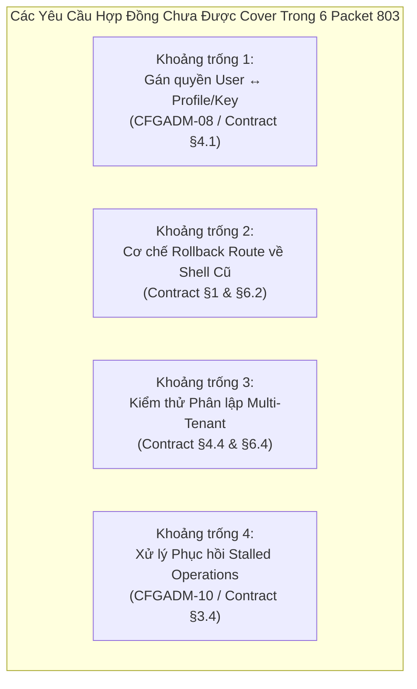
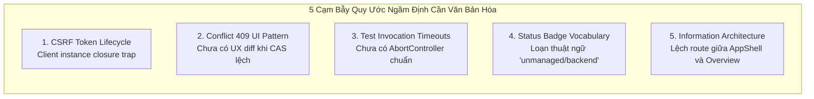

# Ma Trận Hợp Đồng UI Đê Ngành Wave 803 (Admin-Web Contract Matrix)

**Ngày lập:** 2026-10-05  
**Tác giả / Vai trò:** Antigravity (UI Lead & Reviewer — `term_ae2d7e42-8042-4b85-95d5-cabed5ee3191`)  
**Task ID:** `task_c4a210d2335b` (Dispatch: `ctx_270fb241b89e`)  
**Coordinator:** DeepSeek Coordinator (`term_6904d82c-e563-416b-9cc2-8da4f7bc16b3`)  
**Chế độ thực thi:** READ-ONLY Verification & Cross-Cutting Matrix (Không sửa mã nguồn, không chạy test/build lại)  
**Tài liệu quy chuẩn gốc:** `docs/admin-ui-development-contract.md` (§3, §4, §5)  

---

## 1. Mục Đích & Phương Pháp

Báo cáo này thiết lập **bảng ma trận hợp đồng đê ngành** (Cross-Cutting Contract Compliance Matrix) nhằm chuẩn hóa các tiêu chuẩn kỹ thuật theo `docs/admin-ui-development-contract.md` (§3 Component & Màn hình, §4 BFF & An toàn, §5 Quy chuẩn Review). 

Ma trận đóng vai trò thước đo nhanh cho mọi gói công việc (**Packet UI 803**) để:
1. Đối chiếu hiện trạng từng file mã nguồn mới/sửa đổi trong `features/`, `routes/`, `router.tsx` và `app-shell/`.
2. Định vị chính xác tọa độ mã nguồn (`file:line`) đạt chuẩn hoặc phát hiện lỗi vi phạm.
3. Chỉ rõ hành động kỹ thuật bắt buộc cho 6 packet UI 803.
4. Phát hiện các yêu cầu mà 6 packet 803 chưa bao phủ (uncovered gaps) và các quy ước đang bị ngầm định (implicit conventions) có nguy cơ gây lỗi hồi quy.

---

## 2. Bảng Ma Trận Hợp Đồng UI Đê Ngành (Cross-Cutting Contract Matrix)

| Tiêu Chuẩn Hợp Đồng | Yêu Cầu Kỹ Thuật Cốt Lõi | File & Dòng Kiểm Chứng (`file:line`) | Hiện Trạng | Hành Động Phân Bổ Cho Packet UI 803 |
|---|---|---|---|---|
| **§3.1 Ranh giới Component** | `components/ui` pure props & callbacks; không fetch API, không đọc cookie, không chứa logic tenant/role. | `components/ui/button.tsx:1-40`<br>`components/ui/state-panel.tsx:1-85`<br>`components/ui/card.tsx:1-68` | **ĐẠT** | Duy trì quy chuẩn: các component mới của 803 chỉ dùng primitive, không nhúng fetch trong `ui/`. |
| **§3.2 Đơn nguồn Tokens** | 100% style dùng CSS variables từ `tokens.css`; không hardcode mã hex/rgb; không CSS Modules riêng. | `styles/tokens.css:14-60`<br>`features/settings/settings-screen.tsx:44`<br>`features/identity/identity-screen.tsx:310`<br>`features/docs/docs-screen.tsx:103` | **ĐẠT** | **Packet 803-02/03/04/05:** Sử dụng triệt để `var(--*)` (`--bg-card`, `--border-subtle`, `--text-main`, v.v.). |
| **§3.3 State Panels Chuẩn** | Đủ 5 trạng thái cho pane: `loading`, `ready`, `empty`, `error`, `denied`. | `features/identity/identity-screen.tsx:167-184`<br>`features/identity/identity-screen.tsx:253-259, 307`<br>`features/api-keys/api-keys-screen.tsx:62-68, 114` | **ĐẠT** *(Identity, ApiKeys)*<br>⚠️ **CHƯA ĐẠT** *(Docs, Workflows)* | **Packet 803-01:** Thêm Loading/Error state vào `/docs`.<br>**Packet 803-02:** Thêm Empty/Denied/Loading state vào `/workflows`. |
| **§3.4 Concurrency & Readback** | Giữ draft khi `409 Conflict`; chỉ thông báo thành công sau khi readback xác nhận revision mới từ server. | `features/identity/identity-screen.tsx:121, 140-147`<br>`features/api-keys/api-keys-screen.tsx:122-126` | **ĐẠT** *(Identity, ApiKeys)*<br>⚠️ **CHƯA ĐẠT** *(Docs)* | **Packet 803-04:** Bắt buộc áp dụng readback và CAS `expectedRevision` khi lưu Settings.<br>**Packet 803-02:** Áp dụng khi lưu node overrides. |
| **§3.5 A11y & 320px Reflow** | Semantic HTML, labels gắn `id`/`htmlFor`, focus ring thấy được, Tab bàn phím, không tràn ngang ở 320px. | `features/settings/settings-screen.tsx:44-71`<br>`features/identity/identity-screen.tsx:347-385`<br>`features/docs/docs-screen.tsx:143-173`<br>`features/workflows/workflows-screen.tsx:10-31` | **ĐẠT** *(Reflow 320px 4/4)*<br>⚠️ **CHƯA ĐẠT** *(Thiếu label-for ở docs-screen:169)* | **Packet 803-01:** Gắn `htmlFor`/`id` chuẩn cho textarea trong Docs Workbench.<br>**Packet 803-06:** Audit toàn diện focus ring & Tab flow trên 100% routes. |
| **§3.6 Secret Write-Only** | Credentials là write-only; không đưa raw secret vào DOM, HTML form, log, draft storage, hay URL query. | `features/identity/identity-screen.tsx:360-373`<br>`features/settings/settings-screen.tsx:50-52`<br>`features/settings/catalog.ts:26, 71`<br>`features/api-keys/api-keys-screen.tsx:41, 97-106` | **ĐẠT** *(0 raw secret in DOM)* | **Packet 803-04:** Áp dụng nghiêm ngặt mô hình `Keep`/`Replace`/`Clear` cho 4 secret fields của Settings, không render raw value. |
| **§4.1 Session & Tenant Fence** | `/session` trả principal, role, tenant scope, CSRF token; kiểm tra quyền trên từng request; không lấy scope từ query/body. | `lib/api/client.ts:221-224`<br>`features/identity/identity-screen.tsx:75-80, 194-217`<br>`features/api-keys/api-keys-screen.tsx:51-54` | **ĐẠT** | **Packet 803-01:** Bắt buộc `DocsScreen` gọi `client.getSession()` để đồng bộ session fence.<br>**Packet 803-02:** Áp dụng cho Workflows. |
| **§4.2 Mutation CSRF & Idempotency** | Mọi mutation (POST/PUT/PATCH) gửi `X-CSRF-Token`, idempotency key, và kiểm soát mã lỗi HTTP. | `features/identity/identity-screen.tsx:118, 122`<br>`features/identity/identity-api.ts:97-98`<br>`features/api-keys/api-keys-screen.tsx:91`<br>`features/docs/docs-screen.tsx:66` | ❌ **CHƯA ĐẠT** tại `docs-screen.tsx:66`<br>*(Bị thiếu header CSRF)* | **Packet 803-01 (ƯU TIÊN 1):** Sửa `docs-screen.tsx` gọi `client.getSession()` để nạp `csrfToken` trước khi gọi `testProfileEndpoint`. |
| **§4.3 Secret Storage Hygiene** | Tuyệt đối KHÔNG dùng `localStorage`/`sessionStorage` cho token/secret; secret copy-once dùng `no-store` và mất sau reload. | `features/api-keys/api-keys-screen.tsx:41, 103`<br>`features/identity/identity-screen.tsx:37-38` | **ĐẠT** *(0 use of browser storage)* | **Packet 803-03:** Bộ nhớ đệm schema XML/JSON của Workflow chỉ giữ trong RAM component, không đẩy vào storage. |
| **§4.4 Tenant Isolation Testing** | Kiểm thử độc lập xác nhận Tenant A không thể đọc/ghi dữ liệu của Tenant B; denied state hiển thị chuẩn. | `tests/browser/admin-web/harness.ts:36-39`<br>`features/overview/overview-screen.tsx:6-10` | ⚠️ **CHƯA ĐẠT** *(Chưa có browser spec kiểm tra cross-tenant)* | Cần bổ sung test case trong bộ test tự động kiểm chứng Tenant Isolation (đề xuất Packet bổ sung). |
| **§5.1 Điều kiện Review UI** | Chỉ review khi build tích hợp thật, typecheck exit 0, có browser evidence thực nghiệm; không duyệt trên ảnh rời. | `coordination/reports/uirev-cfgadm-port-2026-10-05.md:1-55`<br>`dist/assets/index-Bs0p8VRI.js` | **ĐẠT** | Mọi Packet của 803 phải chạy qua harness và nộp browser screenshots trước khi Antigravity cấp `UI_APPROVED`. |
| **§5.2 Cấp Verdict Độc Lập** | Cấp `UI_APPROVED` hoặc `CHANGES_REQUIRED` kèm task ID, `file:line`, lỗi cụ thể và bằng chứng. | `coordination/reports/uirev-cfgadm-port-2026-10-05.md:58-65` | **ĐẠT** | Tuân thủ nghiêm ngặt: sau khi Packet 803-01 hoàn thành, Antigravity review lại trên build mới và chuyển verdict sang `UI_APPROVED`. |

---

## 3. Rà Soát Các Yêu Cầu Hợp Đồng Mà 6 Packet 803 CHƯA COVER

Đối chiếu toàn diện giữa danh mục 6 packet đề xuất trong `ui-backlog-803` với `docs/admin-ui-development-contract.md` và `ADMIN-LEGACY-CONFIG-PARITY-2026-10-04.md`, phát hiện **4 khoảng trống hợp đồng lớn chưa được phân bổ công việc**:



### 3.1. Khoảng trống 1: Quản lý gán quyền User ↔ Profile/Key (`CFGADM-08` / Contract §4.1)
- **Yêu cầu hợp đồng:** Contract §4.1 và Parity doc §2 row 50 quy định rõ: `"Identity → Users/roles/profile grants; atomic assignment replace/diff... Legacy USER chỉ có self-service trên profile được giao, không thành toàn quyền tenant operator"`.
- **Hiện trạng:** Packet `803-04` chỉ tập trung vào Settings và `803-02/03` tập trung vào Workflows. Màn hình `/identity` hiện mới chỉ có User CRUD cơ bản, **hoàn toàn chưa có tab/modal gán Profile Grants cho từng User**.
- **Đề xuất bổ sung:** Lập **Packet 803-07: `IDENTITY-PROFILE-ASSIGNMENT`** để bổ sung giao diện gán quyền Profile cho User.

### 3.2. Khoảng trống 2: Cơ chế Rollback Route về Legacy Shell (`/admin`) (Contract §1 & §6.2)
- **Yêu cầu hợp đồng:** Contract §1 và §6.2 nhấn mạnh: `"Mỗi route mới phải có đường quay lại renderer cũ cho đến khi kiểm thử và review đạt yêu cầu... Giữ các route /admin/* hiện có trong quá trình chuyển từng màn hình"`.
- **Hiện trạng:** Hiện tại chỉ có `not-found.tsx:18-20` và `app-shell.tsx:44-49` có liên kết chung trỏ về `/admin`. Từng màn hình mới (`/identity`, `/settings`, `/workflows`, `/docs`) **chưa có nút chuyển đổi ngữ cảnh hoặc cờ fallback** để người vận hành quay về đúng trang tương ứng trên legacy shell khi gặp sự cố.
- **Đề xuất bổ sung:** Tích hợp liên kết "Mở trang này trên Legacy Shell" vào Header của từng màn hình trong **Packet 803-06**.

### 3.3. Khoảng trống 3: Bộ Test Phân lập Tenant Độc lập (Contract §4.4 & §6.4)
- **Yêu cầu hợp đồng:** Contract §4.4 và §6.4 bắt buộc: `"test operator tenant A không đọc được B", "browser test theo role và hai tenant"`.
- **Hiện trạng:** Toàn bộ 9 test Playwright hiện tại (`cfgadm-08-identity-crud.spec.ts`, `cfgadm-settings-port-p1.spec.ts`) chỉ chạy dưới danh nghĩa một session giả định. Chưa hề có test case Playwright tự động đăng nhập Tenant A và truy cập tài nguyên của Tenant B để xác nhận trạng thái `DeniedState` (403).
- **Đề xuất bổ sung:** Lập **Packet 803-08: `TEST-MULTI-TENANT-ISOLATION`** để bổ sung kịch bản kiểm thử multi-tenant Playwright.

### 3.4. Khoảng trống 4: Phục hồi Stalled Operations & Maintenance Jobs (CFGADM-10)
- **Yêu cầu hợp đồng:** `ADMIN-LEGACY-CONFIG-PARITY` §2 row 53 quy định: `"History search/status/cancel/delete... recover-stalled / maintenance job preview/status/confirm"`.
- **Hiện trạng:** Màn hình `/operations` hiện tại chỉ cho xem danh sách và xem chi tiết, hoàn toàn chưa có chức năng hủy (`cancel`) hay kích hoạt phục hồi tiến trình treo (`recover-stalled`).
- **Đề xuất bổ sung:** Lập **Packet 803-09: `OPERATIONS-LIFECYCLE-ACTIONS`** bổ sung action buttons cho operations.

---

## 4. Rà Soát Các Quy Ước ĐANG IMPLICIT (Ngầm Định Cần Văn Bản Hóa)

Quá trình đối chiếu phát hiện **5 quy ước kỹ thuật đang mang tính ngầm định**, chưa được mô tả chi tiết trong hợp đồng dẫn đến việc lập trình viên triển khai sai lệch:



### 4.1. Implicit 1: Vòng đời CSRF Token trong Instance Client (Client Closure Trap)
- **Thực tế ngầm định:** `createAdminApiClient()` trong `lib/api/client.ts:146` lưu `let csrfToken: string | null = null`. Token này **chỉ được nạp vào bộ nhớ khi gọi `getSession()` thành công**.
- **Cạm bẫy:** Lập trình viên viết màn hình mới (`docs-screen.tsx`) lầm tưởng rằng `client` sẽ tự động đọc cookie hoặc tự gọi session ngầm khi cần gửi POST. Hậu quả là request gửi đi mà hoàn toàn không có `X-CSRF-Token`.
- **Chuẩn hóa bắt buộc:** Mọi màn hình có mutation bắt buộc phải khởi tạo hook:
  ```typescript
  // Quy chuẩn bắt buộc cho mọi screen có mutation:
  const client = useMemo(() => createAdminApiClient(), []);
  useEffect(() => {
    void client.getSession().then((res) => {
      if (res.ok) setSession(res.data);
    });
  }, [client]);
  ```

### 4.2. Implicit 2: Giao thức xử lý xung đột 409 Conflict (CAS Concurrency UX)
- **Thực tế ngầm định:** Hợp đồng ghi `"giữ draft khi 409"`, nhưng không quy định UX chi tiết khi bị xung đột phiên bản.
- **Cạm bẫy:** Hiện tại `identity-screen.tsx:430` chỉ hiện một dòng alert đơn giản: `"This user changed on the server. Refresh the list..."`. Người dùng không biết trường nào bị lệch và không có nút so sánh (diff).
- **Chuẩn hóa bắt buộc:** Khi gặp 409, giao diện phải:
  1. Giữ nguyên toàn bộ giá trị người dùng đang nhập trên form (không xóa form).
  2. Hiển thị banner cảnh báo phiên bản đã thay đổi.
  3. Cung cấp nút `Tải lại bản mới nhất từ máy chủ` để người dùng chủ động quyết định ghi đè hay hủy bỏ.

### 4.3. Implicit 3: Thời gian Timeout và Cơ chế Hủy cho các nút "Test"
- **Thực tế ngầm định:** Các thao tác gọi thử nghiệm (`Test Endpoint`, `Test Connection`, `Test Bucket`) gọi ra dịch vụ ngoài có thể bị treo hoặc phản hồi chậm.
- **Cạm bẫy:** `docs-screen.tsx:66` gọi `client.testProfileEndpoint(...)` không có timeout hay `AbortController`. Nếu backend bị treo, UI sẽ bị kẹt vĩnh viễn ở trạng thái `busy: true` ("Running...").
- **Chuẩn hóa bắt buộc:** Mọi thao tác Test trên UI phải bọc trong `AbortController` với timeout cứng **15 giây**, hiển thị thông báo lỗi `TRANSPORT_TIMEOUT` khi quá thời gian.

### 4.4. Implicit 4: Chuẩn hóa bộ từ vựng trạng thái (Status Badge Vocabulary)
- **Thực tế ngầm định:** Các màn hình hiện tại dùng lẫn lộn:
  - `identity-screen.tsx:226`: `"chưa managed"`
  - `settings-screen.tsx:34`: `"not managed"`
  - `settings-screen.tsx:83`: `"requires deployment action"`
  - `overview-screen.tsx:125`: `"requires backend"`
  - `workflows-screen.tsx:27`: `"preview mode"`
- **Chuẩn hóa bắt buộc:** Thống nhất 3 trạng thái duy nhất:
  1. `requires backend`: Tính năng đã thiết kế giao diện nhưng endpoint API chưa sẵn sàng.
  2. `requires deployment action`: Cấu hình cố định ở cấp hạ tầng (docker/compose/env), không sửa qua UI.
  3. `policy disabled`: Bị vô hiệu hóa do chính sách triển khai (ví dụ `Δ-DEV-03`).

### 4.5. Implicit 5: Phân cấp Điều hướng (Information Architecture Discrepancy)
- **Thực tế ngầm định:** Header chính (`app-shell.tsx:12-15`) chỉ hiển thị 2 link: `Overview` và `Bootstrap`. Toàn bộ 11 routes còn lại bị đẩy vào thanh phụ của `overview-screen.tsx:88-115`.
- **Cạm bẫy:** Người vận hành khi đang ở màn hình con (`/identity`, `/settings`, `/docs`) không có thanh menu để chuyển nhanh sang màn hình khác mà buộc phải quay lại `/overview`.
- **Chuẩn hóa bắt buộc:** Thiết kế thanh điều hướng chuẩn (Header Nav hoặc Collapsible Sidebar) chứa đầy đủ các phân hệ chính trong **Packet 803-06**.

---

## 5. Bảng Checklist Đo Nhanh Cho 6 Packet UI 803

Bảng kiểm kỹ thuật dành cho Developer và Reviewer để nghiệm thu nhanh từng packet trong vòng 30 giây:

| Packet ID | Tên Packet | Checklist Kiểm Thử Nhanh (30-Second Fast Gate) | Điều Kiện Nghiệm Thu Của Reviewer |
|---|---|---|---|
| **803-01** | `FIX-DOCS-CSRF` | [ ] Gọi `client.getSession()` trong `useEffect` lúc mount.<br>[ ] Request POST `/profiles/test-endpoint` mang header `x-csrf-token`.<br>[ ] Bọc `AbortController` 15s.<br>[ ] Gắn `htmlFor`/`id` cho textarea `file urls`. | Playwright bắt request POST xác nhận có `x-csrf-token`. Antigravity cấp **`UI_APPROVED`** cho `/docs`. |
| **803-02** | `WORKFLOW-TREE-SCAFFOLD` | [ ] Gỡ banner disabled khi user duyệt `Δ-DEV-03`.<br>[ ] Render danh sách Schemas và 10 loại nodes dạng tree/list.<br>[ ] Đủ 5 state panels chuẩn (`loading`, `ready`, `empty`, `error`, `denied`).<br>[ ] Reflow chuẩn ở 320px, 0 overflow. | Fail-closed, 0 mock data bịa đặt, browser test 320px pass. |
| **803-03** | `WORKFLOW-IMPORT-MODAL` | [ ] Modal kéo thả hỗ trợ `.json` và `.xml`.<br>[ ] Parser chặn XXE / DTD entities.<br>[ ] Giới hạn dung lượng tải lên 512KB.<br>[ ] Validate chỉ cho phép 10 standard node types.<br>[ ] 0 network request khi đang xem trước (preview). | Test negative: file XML độc hại và node lạ bị từ chối với thông báo lỗi đỏ. |
| **803-04** | `SETTINGS-EDITOR-WIRE` | [ ] 3 form độc lập: AI Defaults, Prompt Defaults, Storage.<br>[ ] 4 trường secret áp dụng pattern `Keep`/`Replace`/`Clear`.<br>[ ] Gửi `expectedRevision` khi lưu, giữ draft khi 409.<br>[ ] Chỉ toast thành công sau khi readback xác nhận revision mới. | 0 raw secret trong DOM/log. Test lưu độc lập từng nhóm, CAS conflict giữ draft. |
| **803-05** | `PROMPT-WIZARD-MODAL` | [ ] Modal mở từ Profiles Screen.<br>[ ] Hiển thị diff so sánh prompt cũ vs prompt đề xuất.<br>[ ] Nút "Accept draft" chỉ nạp vào form draft, không tự publish.<br>[ ] Giữ nguyên các placeholder mẫu `{user_prompt}`, `{input_content}`. | Visual diff rõ ràng, không có side-effect tự lưu lên server. |
| **803-06** | `NAV-POLISH-A11Y-803` | [ ] Đưa đầy đủ các route vào hệ thống menu điều hướng.<br>[ ] Bổ sung link "Mở trên Legacy Shell" tương ứng cho từng màn.<br>[ ] 100% interactive elements có focus ring rõ ràng.<br>[ ] Điều hướng thông suốt 100% bằng phím Tab không bị trap. | Keyboard accessibility test pass, 0 liên kết chết (404). |

---

## 6. Đề Xuất Bổ Sung 3 Packet Mở Rộng (Wave 803 Extension)

Để đóng hoàn toàn 4 khoảng trống hợp đồng nêu tại Mục 3, khuyến nghị Coordinator bổ sung 3 sub-packets tiếp nối:
1. **Packet 803-07: `IDENTITY-PROFILE-ASSIGNMENT`** (Bổ sung giao diện gán User ↔ Profile Grants theo CFGADM-08).
2. **Packet 803-08: `TEST-MULTI-TENANT-ISOLATION`** (Bổ sung kịch bản kiểm thử Playwright cross-tenant A vs B).
3. **Packet 803-09: `OPERATIONS-LIFECYCLE-ACTIONS`** (Bổ sung nút Cancel Operation và Recover-Stalled theo CFGADM-10).

---

## 7. Kết Luận

Báo cáo ma trận đê ngành đã thiết lập đầy đủ khung tham chiếu kỹ thuật và chuẩn hóa toàn bộ các điều khoản của `docs/admin-ui-development-contract.md` (§3, §4, §5) áp dụng trực tiếp cho cây mã nguồn `apps/admin-web/`. Các lập trình viên và reviewer của Wave 803 có thể sử dụng trực tiếp bảng ma trận tại Mục 2 và checklist tại Mục 5 để đo kiểm nhanh chóng, đảm bảo chất lượng xuất xưởng fail-closed và tuân thủ hợp đồng 100%.
