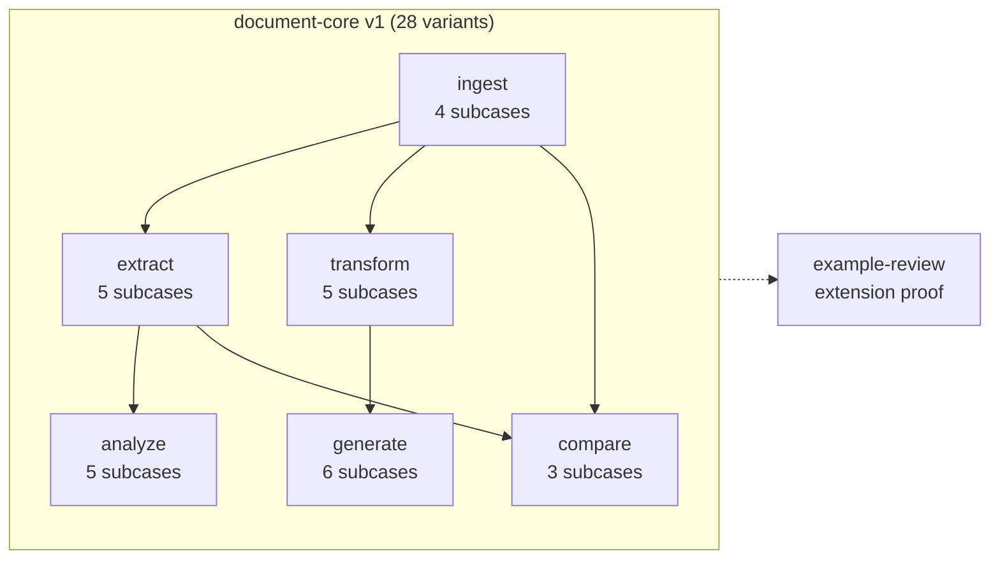
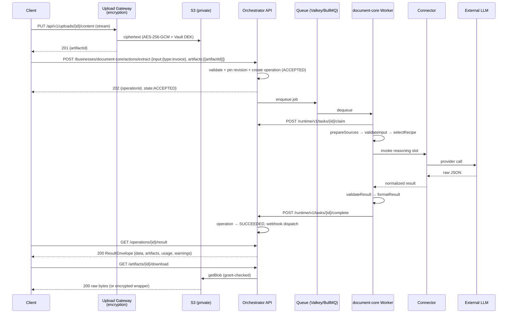
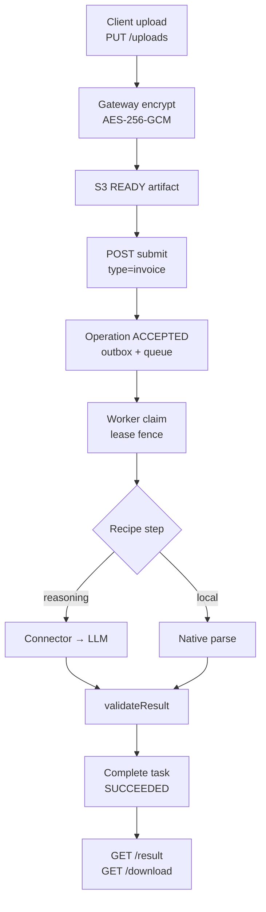

# 00 — Business Design Analysis

> Tổng hợp phân tích nghiệp vụ: capability map, actor/use-case, BR ↔ UC traceability, field dictionary, variant matrix, và sample flow. Nguồn chính: [01-product-scope.md](01-product-scope.md), [10-document-core.md](10-document-core.md), [05-business-registry.md](05-business-registry.md), [architecture/01-product.md](../architecture/01-product.md).

---

## 1. Business capability map

| Business | Actions | Variants | Discriminator | Slot chính |
|---|---|---|---|---|
| `document-core` | ingest | 4 — `parse`, `ocr`, `digitize`, `split` | `mode` | `ocr` (scan), local parse |
| `document-core` | extract | 5 — `invoice`, `contract`, `receipt`, `table`, `custom` | `type` | `reasoning` |
| `document-core` | analyze | 5 — `classify`, `sentiment`, `compliance`, `quality`, `risk` | `task` | `reasoning` |
| `document-core` | transform | 5 — `convert`, `translate`, `rewrite`, `redact`, `template` | `action` | `reasoning` / local |
| `document-core` | generate | 6 — `summary`, `outline`, `report`, `email`, `minutes`, `qa` | `task` | `reasoning` |
| `document-core` | compare | 3 — `diff`, `semantic`, `version` | `mode` | `reasoning` (+ `vision` opt.) |
| `example-review` | review | 1+ | custom | parallel + HITL |

Tổng **28 subcases** trong `document-core` (4+5+5+5+6+3). Con số 31 trong registry cũ (`lib/endpoints/registry.ts`) được ghi là inventory-only — không dùng làm chuẩn.

---

## 2. Actor × Use-case matrix

| UC | Tên | Actor chính | Actor liên quan | BR liên quan | Ranh giới quyền |
|---|---|---|---|---|---|
| UC-01 | Admin tạo connector & publish revision | Administrator | Operator | BR-09, BR-10 | Audit mọi thay đổi; credential không lộ |
| UC-02 | Publisher đăng ký manifest, gán profile, cấp API key | Administrator, Business developer | API client | BR-02, BR-03, BR-10, BR-12 | Publisher chỉ được businessId đã provision |
| UC-03 | Client upload → submit extract invoice → poll → download | API client | — | BR-04, BR-05, BR-03 | Chỉ tenant/profile/operation của mình |
| UC-04 | Worker retry bước lỗi, giữ output bước trước | Business developer | Operator | BR-06, BR-11 | Checkpoint bền vững, không ghi phí lặp |
| UC-05 | Business mới dùng document-kit + connector SDK, deploy riêng | Business developer | Administrator | BR-02, BR-07 | Không sửa platform DB trực tiếp |
| UC-06 | Workflow song song + human input, restart & resume | API client, Business developer | Administrator | BR-07, BR-08, BR-06 | Một human wait mở / root; không block pool |
| UC-07 | Publish business v2, profile chuyển v2, operation cũ chạy v1 | Administrator | API client | BR-02, BR-03 | Operation pin profile revision + manifest digest |
| UC-08 | Provider nhận request nhưng worker mất response → UNKNOWN | Business developer | Operator | BR-09, BR-11 | Không tuyên bố exactly-once |

### Actor fail-closed (từ [01](01-product-scope.md))

| Actor | Điều kiện | Kết quả |
|---|---|---|
| API client (`x-api-key`) | unknown/revoked key | **401** |
| API client | cross-tenant access | **404** (không lộ tồn tại) |
| API client | action ngoài profile | **403** |
| Admin | thiếu `ADMIN_TOKEN` / token sai | **401** |
| Admin | `ADMIN_TOKEN == RUNTIME_TOKEN` | từ chối boot |
| Worker (`RUNTIME_TOKEN`) | stale lease | **409** `LEASE_LOST` |
| Worker | slot chưa khai báo | **409** `BINDING_DENIED` |
| Connector | grant không ký / hết hạn | **403/404** |
| Connector | quota hết | **429** |

---

## 3. Traceability: BR ↔ UC

| BR | Yêu cầu | UC chính | UC phụ | Trạng thái trong kiến trúc hiện tại |
|---|---|---|---|---|
| BR-01 | 6 action = 1 business | UC-03, UC-07 | UC-05 | ✅ `document-core` 6 actions materialized |
| BR-02 | Plugin business bằng registration | UC-02, UC-05 | UC-07 | ✅ `example-review` proof; `05` lifecycle |
| BR-03 | Profile-driven routing | UC-02, UC-03 | UC-07 | ✅ profile pin version/action/connector |
| BR-04 | Async operation | UC-03 | UC-04, UC-06 | ✅ submit → operation → poll |
| BR-05 | Quản lý artifact | UC-03 | UC-06 | ✅ S3 durable + PG metadata (`09-system-architecture`) |
| BR-06 | Retry / checkpoint | UC-04 | UC-06, UC-08 | ✅ step checkpoint + resume |
| BR-07 | Business workflow | UC-06 | UC-05 | ✅ worker-owned DAG, human wait |
| BR-08 | Cancel / resume | UC-06 | UC-04 | ✅ idempotent, race-controlled |
| BR-09 | Provider gateway | UC-01 | UC-04, UC-08 | ✅ Connector + invocation ledger |
| BR-10 | Admin cấu hình động | UC-01, UC-02 | UC-07 | ✅ registry/profile/connector admin |
| BR-11 | Traceability | UC-04 | UC-06, UC-08 | ✅ operation → task → invocation → provider |
| BR-12 | Isolation | UC-02 | UC-03 | ✅ worker claim fence theo business/version |

---

## 4. Variant matrix (28 subcases)

| # | Action | Discriminator | Subcase | Capability yêu cầu | Artifact policy |
|---|---|---|---|---|---|
| 1 | ingest | `mode=parse` | Parse native | local parser | 1 file bắt buộc |
| 2 | ingest | `mode=ocr` | OCR scan | `ocr` slot | 1 file bắt buộc |
| 3 | ingest | `mode=digitize` | Digitize | `ocr` slot | 1 file bắt buộc |
| 4 | ingest | `mode=split` | Split | local | 1 file → N artifacts |
| 5 | extract | `type=invoice` | Invoice | `reasoning` | file hoặc text |
| 6 | extract | `type=contract` | Contract | `reasoning` | file hoặc text |
| 7 | extract | `type=receipt` | Receipt | `reasoning` | file hoặc text |
| 8 | extract | `type=table` | Table | `reasoning` | file hoặc text |
| 9 | extract | `type=custom` | Custom schema | `reasoning` + schema validation | file hoặc text |
| 10 | analyze | `task=classify` | Classify | `reasoning` | file hoặc text |
| 11 | analyze | `task=sentiment` | Sentiment | `reasoning` | file hoặc text |
| 12 | analyze | `task=compliance` | Compliance | `reasoning` | file hoặc text + criteria |
| 13 | analyze | `task=quality` | Quality | `reasoning` | file hoặc text |
| 14 | analyze | `task=risk` | Risk | `reasoning` | file hoặc text |
| 15 | transform | `action=convert` | Convert | local (format matrix) | file |
| 16 | transform | `action=translate` | Translate | `reasoning` | file hoặc text + targetLanguage |
| 17 | transform | `action=rewrite` | Rewrite | `reasoning` | file hoặc text + style |
| 18 | transform | `action=redact` | Redact | `reasoning` hoặc local | file hoặc text + rules |
| 19 | transform | `action=template` | Template | local | file hoặc text + templateId |
| 20 | generate | `task=summary` | Summary | `reasoning` | file hoặc text |
| 21 | generate | `task=outline` | Outline | `reasoning` | file hoặc text |
| 22 | generate | `task=report` | Report | `reasoning` | file hoặc text + audience |
| 23 | generate | `task=email` | Email | `reasoning` | file hoặc text + tone |
| 24 | generate | `task=minutes` | Minutes | `reasoning` | file hoặc text |
| 25 | generate | `task=qa` | Q&A | `reasoning` | file hoặc text + questions |
| 26 | compare | `mode=diff` | Diff | local + `reasoning` opt. | source + target (mỗi side 1 file/text) |
| 27 | compare | `mode=semantic` | Semantic | `reasoning` | source + target |
| 28 | compare | `mode=version` | Version | `reasoning` | source + target |

> Chi tiết field-level BRD cho từng action: `businesses/document-core/docs/{action}.md` (cần bổ sung — hiện mới có outline trong [10](10-document-core.md)).

---

## 5. Field dictionary (tóm tắt)

| Action | Input chính | Output business data | Profile settings | Link BRD |
|---|---|---|---|---|
| ingest | `artifacts`, `language`, `pages`, `mode` | `DocumentResult` (contentRef, page/block metadata, provenance) | allowlist MIME/extension, mode enable | `document-core/docs/ingest.md` (TODO) |
| extract | `documents`/`text`, `type`/`fields`/`schema` | `ExtractionResult` (data, evidence refs, warnings) | field presets, prompt override, slot binding | `document-core/docs/extract.md` (TODO) |
| analyze | `documents`/`text`, `task`, `criteria`/`categories` | `AnalysisResult` (findings, scores, labels) | task enable, slot binding, criteria schema | `document-core/docs/analyze.md` (TODO) |
| transform | `documents`/`text`, `action`, `targetLanguage`/`style`/`template` | `TransformResult` (contentRef, format, metadata) | format matrix, slot binding | `document-core/docs/transform.md` (TODO) |
| generate | `documents`/`text`, `task`, `questions`/`audience`/`tone` | `GenerationResult` (contentRef, format) | task enable, prompt override, format | `document-core/docs/generate.md` (TODO) |
| compare | `source` + `target` (mỗi side file/text) | `ComparisonResult` (changes, references, summary) | max files/side, mode enable | `document-core/docs/compare.md` (TODO) |

Canonical input dùng **camelCase**; compatibility facade map `snake_case` form fields. `artifactPolicy` (`minFiles`/`maxFiles`) và `connectorSlots` (`ocr`/`reasoning`/`vision`) do pipeline definition khai báo.

---

## 6. Sample flow — UC-03: Upload → Extract Invoice

---

## 7. Liên kết tài liệu

| Tài liệu | Vai trò |
|---|---|
| [01-product-scope.md](01-product-scope.md) | BR-01..12, UC-01..08, actor, release scope |
| [02-architecture.md](02-architecture.md) | Kiến trúc mục tiêu 3 tầng |
| [05-business-registry.md](05-business-registry.md) | Manifest v1 + registration lifecycle |
| [10-document-core.md](10-document-core.md) | Action matrix + pipeline definition |
| [06-public-api.md](06-public-api.md) | Public API spec (endpoint catalog) |
| [09-system-architecture.md](09-system-architecture.md) | Đường dữ liệu đã materialize |
| [architecture/01-product.md](../architecture/01-product.md) | Tổng quan sản phẩm (unified queue) |
| `businesses/document-core/docs/{action}.md` | BRD chi tiết từng action (cần bổ sung) |
