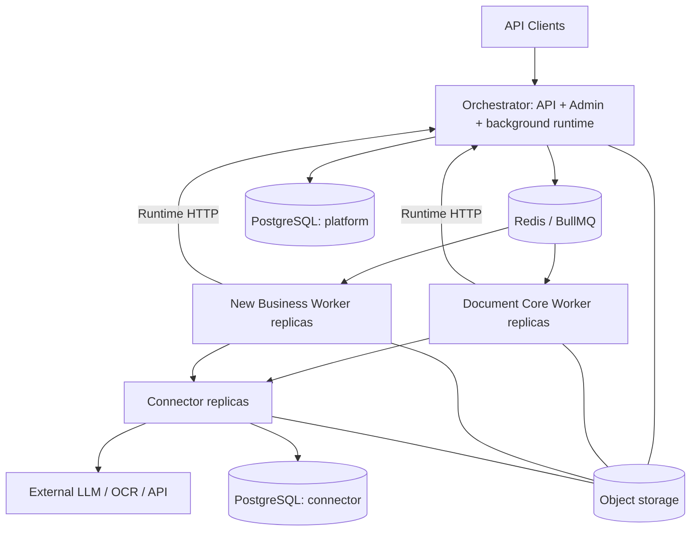

# Kiến trúc mục tiêu

## Ba tầng triển khai

Hai schema PostgreSQL có thể nằm cùng một instance, dùng DB role riêng. Worker không có credential PostgreSQL. Object storage được truy cập bằng scoped grant qua artifact API; không chia sẻ local path giữa container.

## Orchestrator

- Sở hữu tenant, profile, registry, operation, task, step checkpoint, artifact metadata, billing projection, outbox và audit.
- Public/Admin/Runtime API là thin handlers; nghiệp vụ platform nằm trong module application/domain.
- Generic coordinator làm dispatch, lease/reconciliation, dependency readiness, resume, deadline, webhook. Không import code document-core hoặc workflow ngành.
- Runtime nhận worker reports qua HTTP có fencing; queue chỉ là phương tiện vận chuyển job.
- V1 đề xuất Node server chạy lâu dài, host Next.js UI/API và khởi động background loops rõ ràng một lần trong lifecycle server. Không khởi tạo vòng lặp ở module import của route hay môi trường serverless.
- Có thể cùng container/process ban đầu. Outbox/reconciliation dùng claim/lease PostgreSQL để nhiều replica không chạy hiệu ứng lặp. Không dùng singleton trong RAM như distributed lock.
- P1 xác minh custom-server build/shutdown với phiên bản Next được pin. Tách background process cùng subproject nếu spike chứng minh cần; đó là thay đổi topology được ghi ADR, không thêm domain Coordinator.

## Business Worker

- Một business có image riêng và queue theo exact version; nhiều replica cùng consume queue đó.
- Sở hữu code xử lý, pipeline definitions, prompt templates, business input/output schemas, resume semantics.
- Dùng worker-sdk để claim/checkpoint/schedule tasks/wait/complete. Dùng document-kit cho parse/convert; connector-client cho provider call.
- Điều phối bước nội bộ ở business code. Một linear job có thể chạy vài bước; task dài cần checkpoint và yield.
- Parallel child tasks consume queue của cùng business. Parent phải persist wait và trả slot, không block chờ child ở cùng pool.
- V1 không cho business gọi trực tiếp public API của business khác để tránh vòng lặp, billing và quyền khó kiểm soát. Tái sử dụng document utilities qua package; cross-business composition là ADR tương lai.

## Connector

- Sở hữu connector revisions, adapter config, credentials, invocation ledger, provider quota state.
- Admin quản lý qua Orchestrator proxy đến Connector management API. Orchestrator giữ metadata/binding references và schema config công khai; không đọc secret đã lưu.
- Không có prompt nghiệp vụ, parser DOCX/XLSX, DAG hay tenant billing policy trong adapter.
- Worker gửi logical binding và cấu hình đã pin được runtime cấp quyền; Connector xác minh invocation grant, resolve credential hiện hành được phép.
- Provider-specific upload/poll/session protocol thuộc adapter. File parse nội bộ thuộc business.
- Thêm business sử dụng adapter đã có không đổi Connector. Giao thức provider mới có thể cần adapter mới.

## Luồng thành công

1. API xác thực key, resolve profile/action, validate input/artifact ownership, pin các revision.
2. Transaction tạo operation + execution snapshot + root task + outbox.
3. Dispatcher enqueue job ID ổn định; khi crash sau enqueue có thể gửi lại an toàn.
4. Worker lấy job, claim task bằng runtime API; nhận lease/fencing token và execution snapshot.
5. Worker chạy step, gọi Connector nếu cần; output lớn thành artifact.
6. Worker ghi step output đầy đủ và task completion qua runtime API. Transaction bảo vệ duplicate/stale completion.
7. Runtime cập nhật operation hoặc enqueue continuation theo dependency đã lưu; webhook được dispatch riêng.
8. Client polling operation, lấy artifact có quyền.

## Quy tắc consistency

- PostgreSQL là nguồn chính của trạng thái nghiệp vụ. BullMQ completed không đồng nghĩa operation SUCCEEDED.
- At-least-once delivery; mọi mutation quan trọng phải idempotent hoặc fenced.
- HTTP worker reports không được chỉ giữ trong RAM: task chỉ được ack sau durable acceptance; replay task đọc checkpoint nếu report bị mất response.
- Object write và DB commit không atomic: object có staging metadata; orphan sweeper và checksum finalize.
- Connector ledger và platform usage projection không atomic: Connector có usage outbox/reconciliation cursor; platform ingest theo unique usage event ID.
- Không tự suy ra thất bại vĩnh viễn từ mất heartbeat; recover bằng lease expiry, checkpoint và invocation reconciliation.

## Tại sao không thêm service ngay

Document worker riêng chỉ có lợi khi parse CPU/RAM thành bottleneck dùng chung. Coordinator riêng chỉ cần khi vòng đời hoặc tải runtime khác hẳn API. Cả hai đều có module boundary để tách sau, chưa tăng deployment hiện tại.

## Trạng thái kiến trúc đã hiện thực (ARCH-DOC-01, snapshot 2026-09-28, cập nhật 2026-10-01)

> **Phần trên là `kiến trúc mục tiêu` — dung ở mức độ, KHÔNG phải mô tả thứ đã chạy.** Phần này ghi phần **đã materialize trên cây**, tách bạch bằng chứng offline và receipt đọc trực tiếp. **Mọi hàng `verified` dưới đây đều là OFFLINE; không hàng nào có live S3 / PostgreSQL thật / Redis thật / Vault thật / browser thật.**

### 1. Native parse/split so với Connector OCR/vision

| Phần | Ai chạy | Hiện trạng | Bằng chứng |
|---|---|---|---|
| Native parse + split | **business worker, cục bộ** | Parse/split chạy **local trong document-core**, không gọi Connector | [INGEST-WIRE-01 Mục 21](../coordination/reports/qwen-platform.md#L2018); [Mục 22](../coordination/reports/qwen-platform.md#L2101) sửa pin gate |
| OCR / vision | **qua Connector** | Worker gửi **artifact reference**; provider fetch **chưa được chứng minh** | Mục 21 ghi **Δ48**: connector nhận artifacts reference nhưng **chưa chứng minh nó FETCH ĐƯỢC** byte thật cho provider; bytes sau reference khớp digest/MIME (test ingest-wire) |

**Mục 23 (W-DATA-03-ORCH-VERIFY) vừa bổ sung một lớp gate phía Orchestrator:** `claimTask` từ chễi `PENDING_INGESTION` là `STATE_CONFLICT` **trước khi cấp lease** — nên claim bị từ **không lấy lease, không tăng attempt, không ghi last_delivery_id**. Dispatcher không dispatch row gate-ingestion **không đủ là boundary** — cánh claim mới là ranh giới thật.

**Mục 22 sửa gap thật ở phía business:** `prepareSources` chỉ kiểm pin khi `artifactInputs.length > 0`, nên một task URL chưa READY (0 artifact) có thể bỏ qua pin và vẫn parse `input.text` báo thành công dù chưa tải byte nào. Sau đó pin được kiểm **khi pin có**, phân biệt *có artifact sai* (SOURCE_PIN_MISMATCH) và *chưa READY* (INGESTION_SOURCE_UNRESOLVED). **Đây là TIGHTENING fail-closed** — breaking cho task URL dùng inline text (Δ52), coordinator cần biết trước production.

### 2. Đường mã hóa: app gateway / Vault Transit / recipient delivery

| Đoạn | Hiện trạng | Bằng chứng |
|---|---|---|
| Storage envelope (AES-256-GCM) | Đã có schema trong @du/contracts | [ENC-01](../coordination/reports/tester.md#L8350) — 7 schema + 2 constant, build 0 |
| Vault Transit key provider | Đã có adapter: DEK wrap/unwrap + rewrap | [ENC-02](../coordination/reports/tester.md#L7831) 9/9 tsc 0 |
| Storage crypto facade | Đã có: chunk + bounded stream + fresh DEK | [ENC-03](../coordination/reports/tester.md#L7916) 10/10 tsc 0 |
| Recipient key registry | Đã có: PoP, fingerprint, version CAS, revoke | [ENC-06](../coordination/reports/tester.md#L7875) 8/8 tsc 0 |
| Public upload gateway | Đã có: mã hóa trước khi ghi S3 | [ENC-05](../coordination/reports/tester.md#L8102) 41/41 tsc 0 |
| Delivery encryption (recipient) | Đã có: policy server-side, fail-closed | [ENC-07](../coordination/reports/tester.md#L7938) 22/22 tsc 0 |
| Worker-sdk crypto seam | Đã có: port trung thực của facade | [INGEST-WIRE-01](../coordination/reports/qwen-platform.md#L2018) 14/14; [DATA-04 independent](../coordination/reports/tester.md#L8438) 311/542 tsc 0 |
| Webhook delivery encryption | Đã có: mã hóa payload webhook trước khi gửi | [W-ENC-08-WEBHOOK qwen-admin Mục 29](../coordination/reports/qwen-admin.md) — `webhooks.ts` + `server.ts` + 334 dòng test. **Δ120:** HMAC giờ phủ **ciphertext** ⇒ receiver contract đổi (verify trên encrypted body). **Δ121:** `webhook_deliveries.payload` trong DB **vẫn plaintext** → thuộc ENC-META-01, chưa đóng. `ENC-08` chưa ACCEPTED |
| Recipient key registry (delta) | Đã có, đang mở rộng negative coverage | qwen-platform Cycle 51 `W-PLAT-CR28-11-RECIPIENT-KEY-REGISTRY-NEGATIVE` (dispatch 01:10) |

**Response wire đã freeze:** `GET /operations/{id}/result` = 200 JSON (plain = strict v1 ResultEnvelope, encrypted = strict v1 wrapper); `GET /artifacts/{id}/download` = **200 raw bytes** (plain) hoặc 200 JSON wrapper (encrypted) — **302 đã bị loại khỏi contract**. Xem [RESULT-WIRE-01](../coordination/reports/tester.md#L8245).

**Phần chưa có bằng chứng offline:** metadata/control-plane encryption ([ENC-META-01](../coordination/reports/tester.md#L7955) 23/23), tiêu đạt **byte-scan** thật, và **migration** legacy plaintext sang ciphertext ([ENC-09](../coordination/reports/tester.md#L8139) 9/9 offline).

### 2b. Các mảng kiến trúc mới materialize (snapshot 2026-10-01)

| Mảng | Hiện trạng trên cây | Bằng chứng / giới hạn |
|---|---|---|
| **Admin shell** | `services/orchestrator/src/app/admin/` (~30 file: `shell-router.ts`, `shell-server.ts`, per-section data/renderer/view-models, `crypto-config-api/store`, `oidc-boot/oidc-flow`), mount bằng `attachAdminShell` trong `createApp` (`server.ts:714`, remount `:877`); `server.listen` tại `server.ts:860` | Đã mount nhưng auth còn **token/OIDC**, chưa có local user — `LOCAL-R02/R03`; shell chỉ mount khi có `adminToken` (`server.ts:869`, `shell-server.ts:501`) |
| **Shared egress** | `packages/egress/` — pinned DNS-rebinding-safe fetch: **một** resolution cấp cho cả policy lẫn socket | PR-Q3-03/09; mọi egress HTTP của orchestrator/worker đi qua package này, không tự `fetch` |
| **OpenAPI generator** | `tools/openapi/gen_openapi.py` sinh `docs/21-openapi.json` **từ router + `@du/contracts`** (operations-list params, usage-events params, delivery schemas đều derive), kèm guard "không được mất path/schema đã có" (`validate_openapi.py`, `probe_cases.js`) | Generator chưa phủ đủ route admin/uploads/runtime ⇒ xem known gap ghi ở [docs/06](06-public-api.md); **không patch tay `docs/21`** (serialize-point) |
| **Audit surface** | `GET /api/v1/admin/audit` với audit page + sortable allow-list riêng (vì `admin_audit_events` không có `updated_at`), chuyển sang executor keyset dùng chung | **Δ124:** cursor dialect đổi 3-slot `decodeListCursor` → **4-slot có mã sort** ⇒ client giữ token cũ **422** (Δ126 allow-list sort chưa đồng nhất giữa 4 list). Đây chính là lớp rủi ro mà COMP-06 phải xử lý cho cursor legacy |
| **Audit read path đúng fence** | `shell-server.ts` đọc dữ liệu audit qua **HTTP API**, không lấy DB handle trực tiếp | Δ142 — giữ được tenant fence cho compat/admin read path |
| **Open work: Admin local auth** | `DU_ADMIN_AUTH_MODE=local\|oidc\|both` chưa triển khai | [LOCAL-00..06](../tasks/ADMIN-LOCAL-AUTH-2026-09-30.md) — tất cả `[ ]`, chưa dispatch |

### 3. Ranh giới S3 durable artifact so với PostgreSQL metadata

| Lớp | Vai trò | Hiện trạng |
|---|---|---|
| S3 / object storage | **File bytes durable** | Adapter đã có: [DATA-01](../coordination/reports/tester.md#L8350) 3 suites 35/35 tsc 0, độc lập |
| PostgreSQL platform | **Metadata + ref + control plane** | Vẫn là nguồn sự thật nghiệp vụ; **không** giữ file bytes |
| PostgreSQL bytea (fallback) | **Chỉ là pilot có kiểm soát** | [DATA-05](../coordination/reports/tester.md#L8461) 20/20 tsc 0: migration chỉ xong khi hết ref chưa resolve / orphan / S3 READY chưa pin; fallback **bắt buộc** migrationWindow: true, window đóng thì đọc chỉ S3 |

**Boundary quan trọng:** artifact **bytes** đi theo đường S3/encryption; **không có** bytea trong queue, log hay metadata DB. Job payload không chứa file bytes ([docs/09](09-queue-sdk.md)).

### 4. Bảng target / current / verified

| Hạng mục | Target (ADR) | Current (đã materialize) | Verified offline | Còn thiếu để ACCEPTED |
|---|---|---|---|---|
| Artifact storage S3 | S3 durable bytes (ADR-10) | S3 adapter + facade | [DATA-01](../coordination/reports/tester.md#L8350) 35/35 independent | Live S3 |
| Public upload | Gateway mã hóa trước S3 | Có gateway | [ENC-05](../coordination/reports/tester.md#L8102) 41/41 | Live S3/PG/Redis |
| Worker streaming | Bounded stream + finalize epoch | Có | [DATA-04](../coordination/reports/tester.md#L8438) 311/542 independent | Live object storage, Redis |
| PG blob migration | Backfill có verify + rollback | Có | [DATA-05](../coordination/reports/tester.md#L8461) 20/20 independent | Live migration, restore |
| Ingest artifact ref | Worker gửi reference thật; task chưa READY không claim được | Có (pin gate + **claim gate**) | [INGEST-WIRE-01 Muc 21](../coordination/reports/qwen-platform.md#L2018) 542/542; [Mục 23](../coordination/reports/qwen-platform.md#L2184) | **Δ48** connector fetch, **Δ53** live |
| Result delivery | 200 JSON, không 302 | Có | [RESULT-WIRE-01](../coordination/reports/tester.md#L8245) 22/22 + contract freeze | External decrypt thật |
| Metadata encryption | Control plane mã hóa | Có | [ENC-META-01](../coordination/reports/tester.md#L7955) 23/23 | Live byte-scan |
| Admin crypto config | UI + API + CSRF | Có, Δ112 đóng | [ENC-08 CSRF](../coordination/reports/qwen-admin.md#L3280) 47/47 + 79/79 | **Δ110 đã đóng** (W-ENC-08-WEBHOOK receipt); còn **Δ120** receiver contract + **Δ121** `webhook_deliveries.payload` plaintext, và **Δ113** OIDC wiring |
| Log schema | Shared JSON + redaction | Có | [LOG-01](../coordination/reports/tester.md#L8265) 23/23 + 21/21 | Live collector |

**Không hàng nào ở trên là ACCEPTED.** Gate G-DATA, G-ENC, G6 đều NO-GO; task row vẫn là [~].

### 5. Snapshot 20/09 và tương lai

Các snapshot cũ ngày 20/09 là **lịch sử**, không phải trạng thái hiện tại. [docs/03](03-project-structure.md) ghi những khác biệt framework/DB **cần ADR**; phần trên của file này vẫn là **mục tiêu**. Khi ADR HTTP/UI framework được chốt, phần này và phần mục tiêu phải đồng bộ cùng lúc.
