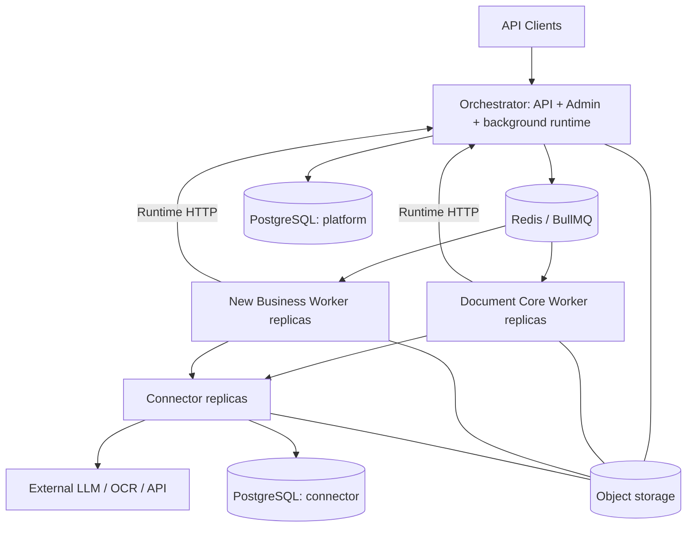

# Kiến trúc mục tiêu

## Ba tầng triển khai

Hai schema PostgreSQL có thể nằm cùng một instance, dùng DB role riêng. Worker không có credential PostgreSQL. Object storage được truy cập bằng scoped grant qua artifact API; không chia sẻ local path giữa container.

## Orchestrator

- Sở hữu tenant, profile, registry, operation, task, step checkpoint, artifact metadata, billing projection, outbox và audit.
- Public/Admin/Runtime API là thin handlers; nghiệp vụ platform nằm trong module application/domain.
- Generic coordinator làm dispatch, lease/reconciliation, dependency readiness, resume, deadline, webhook. Không import code document-core hoặc workflow ngành.
- Runtime nhận worker reports qua HTTP có fencing; queue chỉ là phương tiện vận chuyển job.
- V1 đề xuất Node server chạy lâu dài, host Next.js UI/API và khởi động background loops rõ ràng một lần trong lifecycle server. Không khởi tạo vòng lặp ở module import của route hay môi trường serverless.
- Có thể cùng container/process ban đầu. Outbox/reconciliation dùng claim/lease PostgreSQL để nhiều replica không chạy hiệu ứng lặp. Không dùng singleton trong RAM như distributed lock.
- P1 xác minh custom-server build/shutdown với phiên bản Next được pin. Tách background process cùng subproject nếu spike chứng minh cần; đó là thay đổi topology được ghi ADR, không thêm domain Coordinator.

## Business Worker

- Một business có image riêng và queue theo exact version; nhiều replica cùng consume queue đó.
- Sở hữu code xử lý, pipeline definitions, prompt templates, business input/output schemas, resume semantics.
- Dùng worker-sdk để claim/checkpoint/schedule tasks/wait/complete. Dùng document-kit cho parse/convert; connector-client cho provider call.
- Điều phối bước nội bộ ở business code. Một linear job có thể chạy vài bước; task dài cần checkpoint và yield.
- Parallel child tasks consume queue của cùng business. Parent phải persist wait và trả slot, không block chờ child ở cùng pool.
- V1 không cho business gọi trực tiếp public API của business khác để tránh vòng lặp, billing và quyền khó kiểm soát. Tái sử dụng document utilities qua package; cross-business composition là ADR tương lai.

## Connector

- Sở hữu connector revisions, adapter config, credentials, invocation ledger, provider quota state.
- Admin quản lý qua Orchestrator proxy đến Connector management API. Orchestrator giữ metadata/binding references và schema config công khai; không đọc secret đã lưu.
- Không có prompt nghiệp vụ, parser DOCX/XLSX, DAG hay tenant billing policy trong adapter.
- Worker gửi logical binding và cấu hình đã pin được runtime cấp quyền; Connector xác minh invocation grant, resolve credential hiện hành được phép.
- Provider-specific upload/poll/session protocol thuộc adapter. File parse nội bộ thuộc business.
- Thêm business sử dụng adapter đã có không đổi Connector. Giao thức provider mới có thể cần adapter mới.

## Luồng thành công

1. API xác thực key, resolve profile/action, validate input/artifact ownership, pin các revision.
2. Transaction tạo operation + execution snapshot + root task + outbox.
3. Dispatcher enqueue job ID ổn định; khi crash sau enqueue có thể gửi lại an toàn.
4. Worker lấy job, claim task bằng runtime API; nhận lease/fencing token và execution snapshot.
5. Worker chạy step, gọi Connector nếu cần; output lớn thành artifact.
6. Worker ghi step output đầy đủ và task completion qua runtime API. Transaction bảo vệ duplicate/stale completion.
7. Runtime cập nhật operation hoặc enqueue continuation theo dependency đã lưu; webhook được dispatch riêng.
8. Client polling operation, lấy artifact có quyền.

## Quy tắc consistency

- PostgreSQL là nguồn chính của trạng thái nghiệp vụ. BullMQ completed không đồng nghĩa operation SUCCEEDED.
- At-least-once delivery; mọi mutation quan trọng phải idempotent hoặc fenced.
- HTTP worker reports không được chỉ giữ trong RAM: task chỉ được ack sau durable acceptance; replay task đọc checkpoint nếu report bị mất response.
- Object write và DB commit không atomic: object có staging metadata; orphan sweeper và checksum finalize.
- Connector ledger và platform usage projection không atomic: Connector có usage outbox/reconciliation cursor; platform ingest theo unique usage event ID.
- Không tự suy ra thất bại vĩnh viễn từ mất heartbeat; recover bằng lease expiry, checkpoint và invocation reconciliation.

## Tại sao không thêm service ngay

Document worker riêng chỉ có lợi khi parse CPU/RAM thành bottleneck dùng chung. Coordinator riêng chỉ cần khi vòng đời hoặc tải runtime khác hẳn API. Cả hai đều có module boundary để tách sau, chưa tăng deployment hiện tại.
