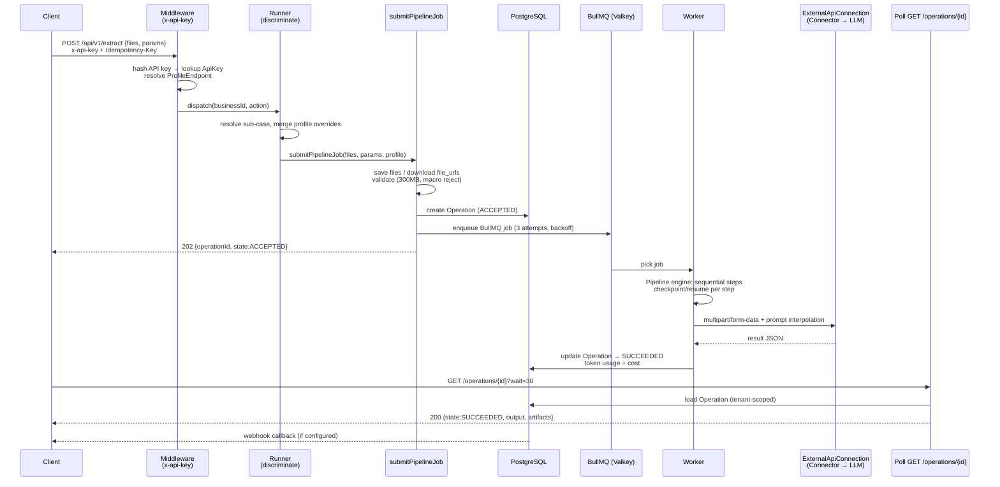
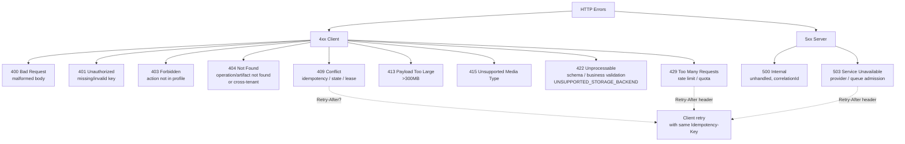

# API Spec Overview

> Bổ trợ cho [06-public-api.md](06-public-api.md) (public), [07-internal-api.md](07-internal-api.md) (admin/runtime), [08-connector-api.md](08-connector-api.md) (connector), và [21-openapi.json](21-openapi.json) (machine-readable). Tài liệu này cho cái nhìn tổng quan hệ thống API với sơ đồ.

---

## 1. API landscape

```mermaid
flowchart TB
  subgraph Client["Client surfaces"]
    PUB[Public API<br/>/api/v1]
    ADM[Admin API<br/>/api/internal/v1]
  end
  subgraph Platform["Orchestrator"]
    PUB --> MW[Middleware<br/>x-api-key | NextAuth | OIDC]
    ADM --> MW2[Admin middleware<br/>RBAC + CSRF]
    MW --> RUN[Runner<br/>discriminate → submitPipelineJob]
    MW2 --> REG[Registry / Profile / Connector proxy]
    RUN --> Q[(BullMQ<br/>Valkey)]
  end
  subgraph Runtime["Runtime API<br/>/api/runtime/v1"]
    W[Business Worker] --> RT[Claim / Step / Complete / Artifact]
    CX[Connector] --> RT2[Usage ingestion]
    RT --> Platform
  end
  subgraph External["Provider"]
    CX2[Connector adapters] --> LLM[LLM / OCR / Vision API]
  end
  W --> CX2
  Platform -.->|webhook| Client
```

| Surface | Base path | Auth | Đối tượng |
|---|---|---|---|
| **Public** | `/api/v1` | `x-api-key` (hashed, `ApiKey.status=ACTIVE`) | API client (tenant/profile-scoped) |
| **Admin** | `/api/internal/v1` | NextAuth session / OIDC / `ADMIN_TOKEN` | Administrator / Operator |
| **Runtime** | `/api/runtime/v1` | `RUNTIME_TOKEN` / `ADMIN_TOKEN` (bearer) | Business worker, Connector |
| **Auth** | `/api/auth` | NextAuth (Credentials + OIDC) | UI login |
| **Health** | `/api/health` | none | LB / k8s probe |
| **Bull-board** | `/api/bull-board` | admin | Queue dashboard |
| **Swagger** | `/api/swagger` | none / admin | API docs |

---

## 2. Endpoint catalog (tổng hợp)

### Public — `/api/v1`

| # | Method & Path | Mô tả | Auth |
|---|---|---|---|
| 1 | `POST /ingest` | Ingest: `parse`/`ocr`/`digitize`/`split` | x-api-key |
| 2 | `POST /extract` | Extract: `invoice`/`contract`/`id-card`/`receipt`/`table`/`custom` | x-api-key |
| 3 | `POST /analyze` | Analyze: `classify`/`sentiment`/`compliance`/`fact-check`/`quality`/`risk`/`summarize-eval` | x-api-key |
| 4 | `POST /transform` | Transform: `convert`/`translate`/`rewrite`/`redact`/`template` | x-api-key |
| 5 | `POST /generate` | Generate: `summary`/`qa`/`outline`/`report`/`email`/`minutes` | x-api-key |
| 6 | `POST /compare` | Compare: `diff`/`semantic`/`version` | x-api-key |
| 7 | `POST /workflows/{id}` | Workflow DAG (e.g. disbursement) | x-api-key |
| 8 | `GET /operations` | List operations (cursor, limit, state, sort) | x-api-key / admin bearer |
| 9 | `GET /operations/{id}` | Poll operation (AIP-151 LRO, `?wait=`) | x-api-key / admin bearer |
| 10 | `POST /operations/{id}/cancel` | Cancel operation | x-api-key |
| 11 | `GET /operations/{id}/download` | Download output (200 raw bytes) | x-api-key |
| 12 | `POST /operations/{id}/resume` | Resume stalled operation | x-api-key |
| 13 | `GET /services` | List available services & sub-cases | x-api-key |
| 14 | `GET /billing/balance` | API key spending balance | x-api-key |
| 15 | `GET /billing/usage` | Billing usage summary | x-api-key |
| 16 | `POST /artifacts` | Upload artifact (multipart, ≤300MB) | x-api-key |
| 17 | `GET /artifacts/{id}/download` | Download artifact (200 raw bytes / encrypted wrapper) | x-api-key |

### Admin — `/api/internal/v1`

| # | Path | Mô tả |
|---|---|---|
| 1 | `GET /businesses` | List business versions + health |
| 2 | `PUT /businesses/{id}/versions/{v}` | Register manifest |
| 3 | `POST /businesses/{id}/versions/{v}/enable\|drain\|retire` | Lifecycle |
| 4 | `GET/POST /profiles` | Profile CRUD |
| 5 | `POST /profiles/{id}/revisions` | Publish revision (CAS) |
| 6 | `POST /api-keys` | Create API key (raw key 1 lần) |
| 7 | `POST /api-keys/{id}/revoke` | Revoke key |
| 8 | `GET/POST /connectors` | Connector catalog/proxy |
| 9 | `POST /connectors/{id}/revisions` | Publish connector config |
| 10 | `POST /connectors/{id}/credentials/rotate` | Rotate credential |
| 11 | `POST /connectors/{id}/test` | Test invocation |

### Runtime — `/api/runtime/v1`

| # | Path | Mô tả |
|---|---|---|
| 1 | `POST /tasks/{id}/claim` | Claim task (lease fencing) |
| 2 | `PUT /tasks/{id}/steps/{stepKey}` | Checkpoint step output |
| 3 | `POST /tasks/{id}/complete` | Terminal: complete |
| 4 | `POST /tasks/{id}/fail` | Terminal: fail (retryable?) |
| 5 | `POST /tasks/{id}/heartbeat` | Renew lease |
| 6 | `POST /tasks/{id}/artifacts` | Request upload grant |
| 7 | `POST /artifacts/{id}/finalize` | Finalize artifact READY |
| 8 | `POST /artifacts/{id}/multipart/*` | Multipart: init/part/complete/abort |
| 9 | `GET /workspace-reference` | SDK sweeper: active reference check |
| 10 | `POST /usage-events` | Connector usage ingestion |

---

## 3. Request lifecycle



### Idempotency

- Scope: `(tenantId, apiKeyId, businessId/action, Idempotency-Key)`
- Cùng key + cùng body hash → replay operation cũ (200)
- Cùng key + khác body → **409 Conflict**
- Concurrent submissions dựa trên unique DB constraint

### Sync mode

- `?sync=true` với wait window: xong → 200, chưa xong → 202 + operationId
- Timeout HTTP không cancel job

---

## 4. Auth matrix

| Endpoint group | `x-api-key` | `ADMIN_TOKEN` bearer | `RUNTIME_TOKEN` bearer | NextAuth/OIDC session | None |
|---|---|---|---|---|---|
| `POST /api/v1/*` (public) | ✅ | — | — | — | — |
| `GET /operations` | ✅ | ✅ (alt path) | — | — | — |
| `GET /operations/{id}` | ✅ | ✅ (alt path) | — | — | — |
| `GET /artifacts/{id}/download` | ✅ | — | — | — | — |
| `POST /api/internal/v1/*` | — | ✅ | — | ✅ | — |
| `POST /api/runtime/v1/tasks/*` | — | — | ✅ | — | — |
| `PUT /api/runtime/v1/artifacts/*` | — | — | ✅ | — | — |
| `GET /health` | — | — | — | — | ✅ |
| `GET /api/swagger` | — | — | — | — | ✅ |

Fail-closed rules:
- Unknown/revoked `x-api-key` → **401**
- Cross-tenant access → **404** (không lộ tồn tại)
- Action ngoài profile → **403**
- `ADMIN_TOKEN == RUNTIME_TOKEN` → từ chối boot
- Stale lease (worker) → **409** `LEASE_LOST`

---

## 5. Error taxonomy



Response format: `application/problem+json`

```json
{
  "type": "https://api.dugate.com/errors/idempotency-conflict",
  "title": "Idempotency Conflict",
  "status": 409,
  "code": "IDEMPOTENCY_CONFLICT",
  "detail": "Same key with different body",
  "correlationId": "uuid",
  "errors": [{ "pointer": "/input/type", "detail": "..." }]
}
```

| Code | HTTP | Retry? |
|---|---|---|
| `INVALID_SCHEMA` | 422 | Fix input |
| `IDEMPOTENCY_CONFLICT` | 409 | Use same body or new key |
| `LEASE_LOST` | 409 | Re-claim task |
| `STATE_CONFLICT` | 409 | Check operation state |
| `RATE_LIMITED` | 429 | Wait `Retry-After` |
| `PAYLOAD_TOO_LARGE` | 413 | Reduce file size |
| `UNSUPPORTED_STORAGE_BACKEND` | 422 | S3 required for `sourceUrl` |

---

## 6. Pagination & filtering — `GET /operations`

Envelope duy nhất cho cả `x-api-key` và `admin bearer`:

```json
{
  "items": [OperationView],
  "nextCursor": "base64url(ISO|uuid|sort)",
  "prevCursor": "base64url(ISO|uuid|sort|p)",
  "total": 1284,
  "limit": 20
}
```

| Param | Giá trị | Sai thì |
|---|---|---|
| `limit` | 1..100, default 20 | clamp (không 422) |
| `state` | `RUNNING`/`COMPLETED`/`FAILED`/`TIMED_OUT` | 422 |
| `tenant` | tenant id (admin bearer only) | 422 / 403 |
| `id` | substring operation id | 422 |
| `cursor` | keyset token | 422 |
| `sort` | 6 giá trị: `created_at`/`updated_at`/`deadline_at` × `asc`/`desc` | 422 |

Keyset cursor mang cả sort + direction + `p` (prev). Lệch sort giữa cursor và query → **422**.

---

## 7. OpenAPI sync checklist

| Hạng mục | `docs/06-public-api.md` | `21-openapi.json` | Trạng thái |
|---|---|---|---|
| Endpoint catalog (17 public paths) | ✅ đầy đủ | Cần cross-check `paths` keys | TODO: `jq '.paths \| keys'` |
| `GET /artifacts/{id}/download` | 200 raw bytes | Kiểm tra có còn 302 | TODO: sửa nếu lệch |
| `GET /operations` sort param | 6 giá trị allow-list | Kiểm tra có đủ 6 | TODO |
| `POST /businesses/{id}/actions/{action}` | canonical generic | Kiểm tra có path này | TODO |
| Error `UNSUPPORTED_STORAGE_BACKEND` (422) | ✅ | Kiểm tra có trong `components.responses` | TODO |
| Webhook HMAC | mô tả trong 06 | — (không cần trong OpenAPI) | OK |

> Chạy `npx @redocly/cli lint docs/21-openapi.json` và so `paths` với bảng catalog ở trên để đảm bảo không thiếu/thừa endpoint.

---

## 8. Compatibility

- **Generic API** (`POST /businesses/{id}/actions/{action}`) là canonical. 6 document routes (`/ingest`, `/extract`, ...) là **facade** tương thích — cùng đi qua Runner, chỉ khác discriminator mapping.
- Multipart form fields chuẩn hóa: `file`, `files[]`, `source_file`, `target_file`; JSON-string fields được parse nghiêm ngặt.
- `file_urls` param: `[{url, filename?, mime_type?}]` — download với auth config + SSRF protection, 120s timeout.
- Breaking DTO phải tăng contract major và hỗ trợ rollout song song (queue version riêng).

---

## 9. Liên kết tài liệu

| Tài liệu | Vai trò |
|---|---|
| [06-public-api.md](06-public-api.md) | Public API spec chi tiết (endpoint catalog, submission, result envelope) |
| [07-internal-api.md](07-internal-api.md) | Admin & Runtime API spec |
| [08-connector-api.md](08-connector-api.md) | Connector invocation API |
| [09-queue-sdk.md](09-queue-sdk.md) | Queue protocol & SDK interface |
| [09-system-architecture.md](09-system-architecture.md) | Đường dữ liệu đã materialize |
| [21-openapi.json](21-openapi.json) | Machine-readable OpenAPI 3.x |
| [20-openapi-descriptions.md](20-openapi-descriptions.md) | Mô tả bổ trợ cho OpenAPI |
| [architecture/03-public-api.md](../architecture/03-public-api.md) | Integration guide (target contract) |
