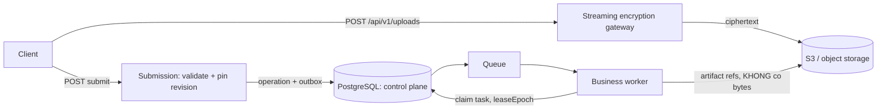
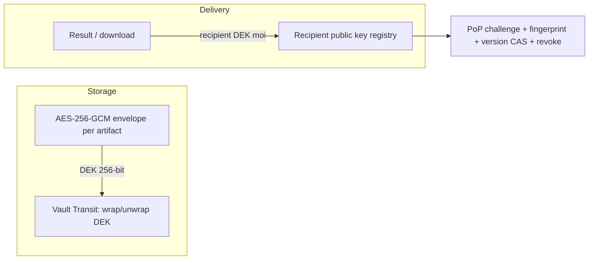

# System architecture — đường dữ liệu đã hiện thực (ARCH-DOC-01, snapshot 2026-09-28)

> **Tài liệu này mới tạo trong cycle ARCH-DOC-01.** Số `09-` đã thuộc [09-queue-sdk.md](09-queue-sdk.md) (queue protocol + SDK interface); tên packet là `09-system-architecture.md`, **không có file đó trong cây**. Nội dung dưới đây là **đường dữ liệu đã materialize**, không lặp lại kiến trúc mục tiêu (xem [02-architecture.md](02-architecture.md)).
>
> **Mọi bằng chứng ở đây là OFFLINE.** Không có live S3 / PostgreSQL thật / Redis thật / Vault thật / browser thật. Không mục nào ở trạng thái ACCEPTED.

## 0. Tổng quan 3 đường — submit / ingest / result-delivery

```mermaid
flowchart TB
  subgraph Submit["1 — Submit (client → durable)"]
    C1[Client] --> GW[Streaming encryption gateway<br/>AES-256-GCM + Vault DEK]
    GW -->|ciphertext| S3A[(S3)]
    C1 --> SUB[Submission<br/>validate + pin revision<br/>422 UNSUPPORTED_STORAGE_BACKEND]
    SUB --> PG1[(PostgreSQL<br/>operation + outbox + audit)]
    PG1 --> Q[(Queue<br/>BullMQ / Valkey)]
    Q --> W1[Business worker<br/>claim + leaseEpoch]
  end
  subgraph Ingest["2 — Ingest (worker ↔ artifact)"]
    W1 -->|artifact refs| S3B[(S3 bytes)]
    W1 -->|local| LP[Native parse / split]
    W1 -->|reference| CX[Connector → OCR / vision / LLM]
    CX -.->|Δ48 fetch chưa CM| S3B
    W1 --> PG2[(PostgreSQL<br/>checkpoint + step state)]
  end
  subgraph Delivery["3 — Result delivery (storage → recipient)"]
    S3B --> DEC[Storage decrypt<br/>Vault unwrap DEK]
    DEC --> ENC[Recipient re-encrypt<br/>HPKE / RSA-OAEP + AES-256-GCM]
    ENC --> RES[GET /operations/{id}/result<br/>200 JSON plain / encrypted wrapper]
    ENC --> DL[GET /artifacts/{id}/download<br/>200 raw bytes / encrypted JSON]
    RES --> C2[Client / Tenant]
    DL --> C2
  end
  Submit --> Ingest --> Delivery
```

> Đồng bộ với [02-architecture.md](02-architecture.md) (kiến trúc mục tiêu 3 tầng) và [12b-deployment-guide.md](12b-deployment-guide.md) (topology compose). Khi ADR HTTP/UI framework chốt, cả 02 và file này phải cập nhật cùng lúc — nếu không, ma trận mục 6 sẽ lại thành lịch sử.

## 1. Đường submit: input từ client đến artifact durable



- **Bytes đi qua đường mã hóa, không đi qua control plane.** Job payload không chứa file bytes, raw prompt lớn, provider secret hay signed URL dài hạn ([09-queue-sdk](09-queue-sdk.md)).
- **PostgreSQL giữ metadata, reference, outbox, usage, audit** — không giữ file bytes.
- Submission từ chối `sourceUrl` khi backend không phải S3: **422 `UNSUPPORTED_STORAGE_BACKEND`**, zero DB write, trước mọi row ([docs/06](06-public-api.md); test fail-closed 7/7.
- Worker dùng bounded stream + validate size/SHA-256 + timeout/abort; finalize gắn **task/lease-epoch**; checkpoint artifact giữ role `intermediate`, **không** lộ ra làm public result.

## 2. Đường ingest: native parse/split và OCR/vision

| Đường | Chủ thể | Trạng thái |
|---|---|---|
| `parse` / `split` | **local trong document-core** | Không gọi Connector; không tính provider usage |
| `ocr` / `vision` | **qua Connector** | Worker gửi artifact **reference**, không gửi bytes hay boolean placeholder |

**Pin gate (đã sửa ở [Qwen Platform Mục 22](../coordination/reports/qwen-platform.md#L2101)):** task có pin phải được kiểm khi **có pin**, phân biệt *artifact sai* (SOURCE_PIN_MISMATCH) và *chưa READY* (INGESTION_SOURCE_UNRESOLVED); task có pin **không được thỏa** bằng `input.text` nội tuyến. Đây là **TIGHTENING fail-closed**, breaking cho task URL dùng inline text (Δ52).

**Mục 23 (W-DATA-03-ORCH-VERIFY) vừa bổ sung một lớp gate phía Orchestrator:** `claimTask` từ chễi `PENDING_INGESTION` là `STATE_CONFLICT` **trước khi cấp lease** — nên claim bị từ **không lấy lease, không tăng attempt, không ghi last_delivery_id**. Dispatcher không dispatch row gate-ingestion **không đủ là boundary** — cánh claim mới là ranh giới thật.

**Còn mở:** **Δ48** — connector chưa được chứng minh FETCH ĐƯỢC artifact và truyền bytes thật cho provider; **Δ53** — chưa có live multi-container. Document-core full **46 suites / 542 tests** Exit 0. **Mục 23 vừa bổ sung một lớp gate phía Orchestrator: `claimTask` từ chễi PENDING_INGESTION là STATE_CONFLICT **trước khi cấp lease** — nên claim bị từ chối không lấy lease, không tăng attempt, không ghi last_delivery_id. Cổ dispatcher không dispatch row gate-ingestion không đủ là boundary; cánh claim mới là ranh giới thật. ([Mục 21](../coordination/reports/qwen-platform.md#L2018), [Mục 22](../coordination/reports/qwen-platform.md#L2101)).

## 3. Đường lưu trữ: S3 durable bytes và PostgreSQL metadata

| Lớp | Vai trò | Bằng chứng |
|---|---|---|
| S3 | **File bytes durable** | [DATA-01 independent](../coordination/reports/tester.md#L8350): 3 suites / 35 tests, tsc 0 |
| PostgreSQL platform | Metadata, ref, outbox, usage, audit | Control plane; không giữ file bytes |
| PostgreSQL bytea | **Pilot có kiểm soát** | [DATA-05 independent](../coordination/reports/tester.md#L8461): 20/20; fallback **bắt buộc** `migrationWindow: true` |

**Migration backfill (DATA-05) fail-closed ở mọi bước:** chỉ hoàn tất khi hết reference chưa resolve, hết orphan row, hết S3 READY chưa pin, và mọi integrity check pass. Backfill verify size/SHA-256 cả hai bên, chỉ **pin sau khi validate**, giữ bytea backup, **idempotent khi retry**.

## 4. Đường mã hóa



- **Storage envelope:** DEK 256-bit độc lập mỗi artifact; Vault Transit bọc DEK; **không** lưu master key hay plaintext DEK ở DB/S3/log. Schema: [ENC-01](../coordination/reports/tester.md#L8350); provider: [ENC-02](../coordination/reports/tester.md#L7831); facade: [ENC-03](../coordination/reports/tester.md#L7916).
- **Recipient delivery:** server **giải mã lớp storage rồi mã hóa lại** bằng DEK mới cho public key của tenant; private key **không** vào Vault/app. Registry có PoP challenge, fingerprint, version CAS, revoke: [ENC-06](../coordination/reports/tester.md#L7875). Policy **server-side**, không có query param/header bypass: [ENC-07](../coordination/reports/tester.md#L7938).
- **Cipher suite:** HPKE RFC 9180 (ưu tiên) hoặc RSA-OAEP-SHA256 (tương thích), payload AES-256-GCM.

## 5. Đường trả kết quả: contract đã freeze

| Route | Plain | Encrypted |
|---|---|---|
| `GET /operations/{id}/result` | **200 JSON** strict v1 `ResultEnvelope` | **200 JSON** strict v1 `{schemaVersion, encrypted, delivery}` |
| `GET /artifacts/{id}/download` | **200 raw bytes** + artifact MIME | **200 JSON** `{schemaVersion, encrypted, delivery, artifactId, mimeType}` |

**302 đã bị loại khỏi contract** — catalog [docs/06](06-public-api.md) đã đồng bộ. Nguồn: [RESULT-WIRE-01](../coordination/reports/tester.md#L8245) (contracts build 0, 19 suites / 427 tests; delivery-encryption 22/22; tsc 0).

## 6. Ma trận target / current / verified

| Hạng mục | Target | Current | Verified offline | Còn thiếu |
|---|---|---|---|---|
| Submit + admission | Admission fail-closed | Có | 422 UNSUPPORTED_STORAGE_BACKEND, 7/7 | — |
| Artifact bytes S3 | S3 durable | Adapter + facade | [DATA-01](../coordination/reports/tester.md#L8350) 35/35 | Live S3 |
| Public upload gateway | Mã hóa trước S3 | Có | [ENC-05](../coordination/reports/tester.md#L8102) 41/41 | Live S3/PG/Redis |
| Worker streaming | Bounded + epoch fence | Có | [DATA-04](../coordination/reports/tester.md#L8438) 311/542 | Live storage, Redis |
| Ingest reference | Worker gửi reference thật; task chưa READY không claim | Có, pin gate + **claim gate** | [INGEST-WIRE-01 Muc 21](../coordination/reports/qwen-platform.md#L2018) 542/542; [Mục 23](../coordination/reports/qwen-platform.md#L2184) | **Δ48** connector fetch, **Δ53** live |
| Storage envelope + Vault | AES-256-GCM + Transit | Có | [ENC-01/02/03](../coordination/reports/tester.md#L8350) | Vault thật |
| Recipient delivery | Per-tenant public key | Có | [ENC-06](../coordination/reports/tester.md#L7875) 8/8, [ENC-07](../coordination/reports/tester.md#L7938) 22/22 | External decrypt thật |
| Result wire | 200 JSON, không 302 | Có | [RESULT-WIRE-01](../coordination/reports/tester.md#L8245) | External client |
| PG blob migration | Backfill + rollback | Có | [DATA-05](../coordination/reports/tester.md#L8461) 20/20 | Live migration, restore |
| Metadata encryption | Control plane mã hóa | Có | [ENC-META-01](../coordination/reports/tester.md#L7955) 23/23 | Live byte-scan |
| Admin crypto config | UI + API + CSRF | Có, Δ112 đóng | [ENC-08 CSRF](../coordination/reports/qwen-admin.md#L3280) 47/47 + 79/79 | **Δ110**, **Δ113** |
| Log schema | Shared JSON + redaction | Có | [LOG-01](../coordination/reports/tester.md#L8265) 23/23 + 21/21 | Live collector |

**Gate `G-DATA`, `G-ENC`, `G6` đều NO-GO. Task row vẫn `[~]`.**

## 7. Snapshot 20/09

Các snapshot cũ ngày 20/09 là **lịch sử**. [docs/03](03-project-structure.md) ghi khác biệt framework/DB **cần ADR**. Khi ADR HTTP/UI framework chốt, file này và [02-architecture.md](02-architecture.md) phải đồng bộ cùng lúc — nếu không, ma trận ở mục 6 sẽ lại thành lịch sử.
