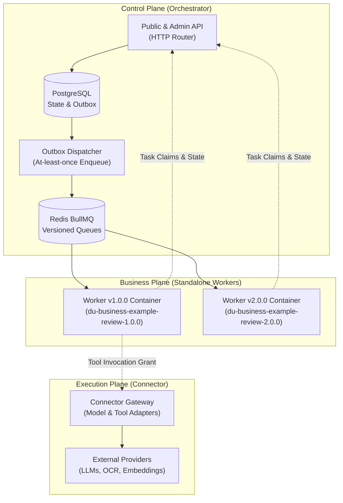
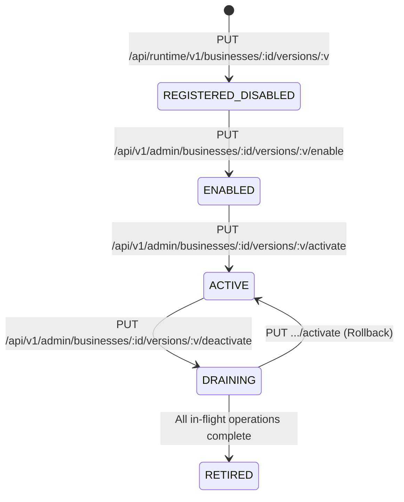
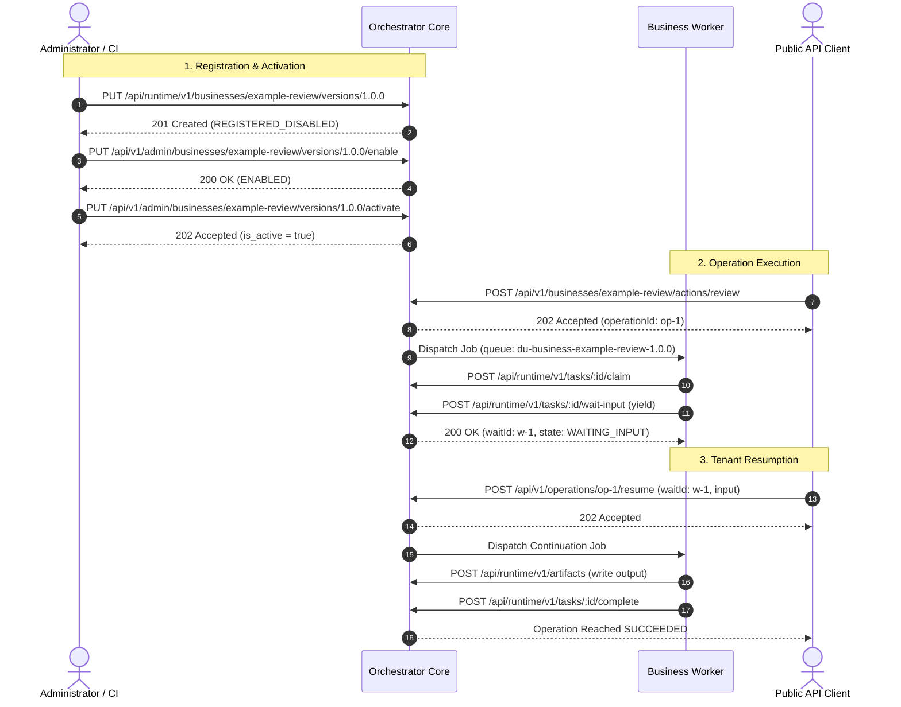

# Document Understanding (DU) Platform — Extension Developer Guide & Multi-Worker Specification

- **Specification ID**: `DU-SPEC-16-EXT-DEV-GUIDE`
- **Related Phase**: P7 Business Extension Proof (`tasks/P7-extension-proof.md`)
- **Conformance Gates**: `G5 (Extension Independence)`, `EXT-01`, `RUN-04..07`, `VER-01`
- **Reference Implementation**: `businesses/example-review` (`@du/example-review`)
- **Published Date**: 2026-09-22

---

## 1. Executive Overview & Architecture Principles

The Document Understanding (DU) Gateway enables developers to author and deploy domain-specific business extensions (such as document review, loan underwriting, invoice matching, compliance auditing) **without modifying any platform core code**.

The platform enforces a strict three-plane decoupled architecture:



### The "Zero Platform Code Change" Invariant (G5 / EXT-01)
To add or upgrade a business extension on DU Gate:
1. **Zero source edits** to `services/orchestrator/**`, `services/connector/**`, or shared platform libraries.
2. **Zero platform rebuilds**: Image digests for the Orchestrator and Connector remain 100% bit-identical.
3. **Public Contract Dependencies Only**: The business implementation must depend exclusively on public SDK packages (`@du/contracts` and `@du/worker-sdk`) and Node.js built-ins.
4. **Dynamic Registration via APIs**: New businesses and versions are registered, enabled, and activated dynamically at runtime via authenticated HTTP endpoints.

---

## 2. Business Extension Concepts & Wire Conventions

### A. Business Identifier & Versioning
- **`businessId`**: Stable, lowercase alphanumeric slug with hyphens (e.g. `example-review`, `invoice-proc`).
- **`version`**: Exact Semantic Version string (e.g. `1.0.0`, `2.0.0`). Every code or schema change must bump the version.
- **Queue Isolation**: Every business version is bound to a dedicated BullMQ queue named:
  ```text
  du-business-${businessId}-${version}
  ```
  *Example*: `du-business-example-review-1.0.0` and `du-business-example-review-2.0.0`.
  Jobs for version `1.0.0` are never consumed by workers for `2.0.0`, ensuring absolute isolation.

### B. Business Lifecycle States
A business version progresses through the following platform states:



1. **`REGISTERED_DISABLED`**: The manifest is stored and validated. No operations may be accepted.
2. **`ENABLED`**: Permitted for operator configuration and profile binding.
3. **`ACTIVE`** (`is_active = true`): Selected by the Orchestrator as the target for all fresh public submissions.
4. **`DRAINING`** (`is_active = false`): New submissions fail-closed with HTTP 404 `NOT_FOUND`. In-flight operations continue processing to completion.
5. **`RETIRED`**: Version is deprecated; zero in-flight operations or human waits remain.

---

## 3. Authoring the BusinessManifest (v1 Specification)

The `BusinessManifest` is the formal contract declaring your business metadata, actions, schemas, connector slots, and capabilities.

### Manifest Schema Reference
```typescript
import { BusinessManifest, WIRE_CONTRACT_VERSION } from '@du/contracts';

export const exampleReviewManifest: BusinessManifest = {
  contractVersion: WIRE_CONTRACT_VERSION, // '1'
  businessId: 'example-review',
  version: '1.0.0',
  displayName: 'Example Review Business',
  description: 'Multi-artifact document review with bounded child tasks and approval wait.',
  imageDigest: 'sha256:d470b00cbfe2008556f343fcb79829567ed5e2ff702fc58e18f3e5640de48540',
  runtime: {
    wireVersion: '1',
    handlerKinds: ['review', 'review-item', 'root'],
  },
  capabilities: {
    cancel: true,
    resume: true,
    parallel: true,
  },
  actions: [
    {
      name: 'review',
      displayName: 'Review Documents',
      description: 'Reviews 1..10 document artifacts with optional reasoning and human approval.',
      inputSchema: {
        type: 'object',
        properties: {
          reviewId: { type: 'string', minLength: 1, maxLength: 128 },
          artifacts: {
            type: 'array',
            minItems: 1,
            maxItems: 10,
            items: {
              type: 'object',
              properties: {
                artifactId: { type: 'string', minLength: 1 },
                fileName: { type: 'string', minLength: 1 },
              },
              required: ['artifactId'],
              additionalProperties: false,
            },
          },
          checks: {
            type: 'object',
            additionalProperties: { type: 'boolean' },
          },
          requireApproval: { type: 'boolean' },
          enableReasoning: { type: 'boolean' },
        },
        required: ['reviewId', 'artifacts'],
        additionalProperties: false,
      },
      outputSchema: {
        type: 'object',
        properties: {
          approved: { type: 'boolean' },
          reviewsRef: { type: 'string' },
          reviewId: { type: 'string' },
          itemCount: { type: 'integer', minimum: 1, maximum: 10 },
          failedChecks: { type: 'array', items: { type: 'string' } },
          summary: { type: 'string' },
        },
        required: ['approved', 'reviewsRef', 'reviewId', 'itemCount'],
        additionalProperties: false,
      },
      profileSchema: {
        type: 'object',
        properties: {
          enableReasoning: { type: 'boolean' },
          maxParallelItems: { type: 'integer', minimum: 1, maximum: 10 },
          autoApprovePassed: { type: 'boolean' },
        },
        additionalProperties: false,
      },
      connectorSlots: [
        {
          name: 'reasoning',
          required: false,
          acceptedCapabilities: ['chat-completion', 'structured-output'],
        },
      ],
      artifactPolicy: {
        minFiles: 1,
        maxFiles: 10,
        acceptedMimeTypes: [
          'application/json',
          'text/plain',
          'application/pdf',
          'application/octet-stream',
        ],
      },
      capabilities: {
        cancel: true,
        resume: true,
      },
      defaultLimits: {
        maxParallelTasks: 4,
        timeoutSeconds: 300,
      },
    },
  ],
};
```

### Manifest Rules & Constraints
1. **JSON Schema Draft 2020-12**: All `inputSchema`, `outputSchema`, and `profileSchema` definitions must be valid JSON Schema.
2. **No Network `$ref`**: External network URI references are rejected by platform admission guards.
3. **Connector Slot Isolation**: Declare logical slot names (`reasoning`, `ocr`, `classify`). Do **NOT** embed provider credentials, endpoints, or model names in the manifest. These are configured through profile bindings by platform administrators.

---

## 4. Worker Implementation Patterns (`@du/worker-sdk`)

A business extension worker runs as an autonomous Node.js service connecting to the Orchestrator runtime and Redis.

### A. Task Handler Signature & Dispositions
Every task handler conforms to:
```typescript
import { TaskContext, TaskDisposition } from '@du/worker-sdk';

export type TaskHandler = (ctx: TaskContext) => Promise<TaskDisposition>;
```

A task returns one of three fundamental dispositions:
1. **`{ kind: 'completed', resultRef: string }`**: The task succeeded and produced a durable output artifact.
2. **`{ kind: 'waiting-children' }`**: The task spawned child tasks and yielded its worker slot.
3. **`{ kind: 'waiting-input', waitId: string }`**: The task yielded to wait for external tenant/human intervention.

---

### B. Durable Step Checkpoints (`ctx.step.run`)
For crash resilience and idempotency, long-running steps should be wrapped in `ctx.step.run`:

```typescript
const evalResult = await ctx.step.run(
  `evaluate-doc:${docId}`,
  inputHash, // deterministic hash of the step input
  async () => {
    // Heavy compute, parsing, or preliminary validation
    return performEvaluation(docData);
  }
);
```
- **Replay Behavior**: If a worker crashes or restarts mid-task, previously completed checkpoints are restored from the database; the closure is **not** re-executed.
- **Idempotency Guard**: Checkpoint generation is immutable. Identical input hashes ensure byte-identical results.

---

### C. Multi-Document Fanout & Child Task Spawning (`RUN-05`)
When processing multiple documents or chunks in parallel, spawn bounded child tasks rather than blocking a worker thread with `Promise.all`:

```typescript
const children = input.artifacts.map((art, idx) => ({
  taskKey: `item-${idx}-${art.artifactId}`,
  kind: 'review-item',
  payloadRef: {
    artifact: art,
    checks: input.checks,
    itemIndex: idx,
  },
  payloadHash: createHash('sha256').update(JSON.stringify(art)).digest('hex'),
}));

// Parent yields its worker slot immediately!
return ctx.spawn.spawnAndWait(children, 'all-success', `review://${input.reviewId}`);
```

#### Invariants:
1. **Parent Slot Freedom**: `ctx.spawn.spawnAndWait` yields `{ kind: 'waiting-children' }`. The parent does **not** occupy a worker thread while children are running.
2. **Concurrency = 1 Deadlock Freedom**: Because the parent yields its execution slot, a worker configured with `concurrency: 1` will execute child tasks sequentially and then resume the parent without deadlocking.
3. **Atomic Join Reconciliation**: When the last child reaches `SUCCEEDED`, the Orchestrator atomically reconciles the join, merges child results into `joinSummary`, and enqueues the parent continuation task.

---

### D. Human-in-the-Loop (HITL) Wait & Resumption (`RUN-06`)
To pause an operation for human review or tenant input:

```typescript
// 1. Yield for human input
if (input.requireApproval) {
  return ctx.wait.waitForInput(
    'manager-approval',
    {
      type: 'object',
      properties: {
        approved: { type: 'boolean' },
        note: { type: 'string' },
        approver: { type: 'string' },
      },
      required: ['approved'],
      additionalProperties: false,
    },
    { contextRef: `review://${input.reviewId}` }
  );
}
```

#### Resumption Handling:
When the tenant submits an approval decision via the Public API, the Orchestrator dispatches a resumption task to the business queue. The handler inspects `ctx.input.resumeInput` (or `ctx.waitResponse`):

```typescript
if (ctx.input && (ctx.input as Record<string, unknown>).resumeInput !== undefined) {
  const resumeInput = (ctx.input as Record<string, unknown>).resumeInput;
  const approval = parseApprovalResponse(resumeInput);

  // Retrieve prior checkpoint data and finalize output
  const aggregate = aggregateReviews(reviewId, items, reviewsRef, approval);
  const outputArtifact = await ctx.artifacts.write(
    JSON.stringify(aggregate, null, 2),
    `${reviewId}.review.json`,
    'application/json',
    'output'
  );

  return {
    kind: 'completed',
    resultRef: `artifact://${outputArtifact.artifactId}`,
  };
}
```

---

### E. Fencing and Cancellation Safety (`RUN-07` / `P2-06`)
Workers must respect lease expiry and tenant cancellation signals at all side-effect boundaries:

```typescript
function assertActive(ctx: TaskContext): void {
  if (ctx.signal?.aborted) {
    if (ctx.cancelRequested || ctx.signal.reason === 'cancel') {
      throw new Error('Task execution cancelled by tenant');
    }
    throw new LeaseLostError(ctx.taskId);
  }
}
```
- **Fail-Closed Resumption**: If an operation is cancelled while in `WAITING_INPUT`, the `human_waits` record is marked `CANCELLED`. Any subsequent call to `/resume` is rejected with HTTP 409 `STATE_CONFLICT`.

---

## 5. End-to-End Orchestrator API Protocol

Below is the complete sequence of HTTP interactions between an operator, the Orchestrator, and the business worker.



### API Endpoint Specification Table

| Endpoint | Method | Role | Payload / Purpose | Status Code |
|---|---|---|---|---|
| `/api/runtime/v1/businesses/:id/versions/:v` | `PUT` | Runtime | Upload `BusinessManifest`. Registers version. | `201` Created / `200` Replay |
| `/api/v1/admin/businesses/:id/versions/:v/enable` | `PUT` | Admin | Enables a registered version. | `200` OK |
| `/api/v1/admin/businesses/:id/versions/:v/activate` | `PUT` | Admin | Sets active version for new submissions. | `202` Accepted / `200` Replay |
| `/api/v1/admin/businesses/:id/versions/:v/deactivate` | `PUT` | Admin | Drains version; new submissions fail-closed. | `202` Accepted / `200` Replay |
| `/api/v1/admin/profile-bindings` | `POST` | Admin | Binds tenant API key to connector slots. | `201` Created |
| `/api/v1/businesses/:id/actions/:action` | `POST` | Public | Submits new operation against active version. | `202` Accepted (`404` if drained) |
| `/api/v1/operations/:id` | `GET` | Public | Polls operation state (`WAITING_INPUT`, `SUCCEEDED`). | `200` OK |
| `/api/v1/operations/:id/resume` | `POST` | Public | Resumes human wait (requires CAS `stateVersion`). | `202` Accepted / `200` Replay |
| `/api/v1/operations/:id/cancel` | `POST` | Public | Cancels operation; closes waits to `CANCELLED`. | `202` Accepted / `200` Replay |
| `/api/v1/operations/:id/result` | `GET` | Public | Retrieves result envelope with `resultRef`. | `200` OK |

---

## 6. Multi-Worker Coexistence, Drain & Rollback (`VER-01`)

The platform supports zero-downtime blue/green version upgrades, Canary testing, and instant rollback.

### A. Concurrent Version Coexistence
- Both Worker `1.0.0` and Worker `2.0.0` can run concurrently in the same cluster.
- Each worker listens exclusively to its versioned BullMQ queue (`du-business-example-review-1.0.0` vs `du-business-example-review-2.0.0`).
- **Observable Version Markers**: Output artifacts emit explicit version metadata:
  ```json
  {
    "reviewId": "rev-123",
    "version": "2.0.0",
    "summary": "[2.0.0] Review rev-123 approved",
    "approved": true
  }
  ```

### B. In-Flight Version Pinning Invariant
When an operation is submitted:
1. Orchestrator records `operations.business_version` at submission time.
2. All continuation tasks, child tasks, and HITL resumption dispatches copy `operations.business_version`.
3. **Guaranteed Pinning**: Even if an operator activates version `2.0.0` while an operation is paused in `WAITING_INPUT` under `1.0.0`, the resumption task **always** dispatches to `du-business-example-review-1.0.0`. Worker `1.0.0` resumes and completes the job.

### C. Fail-Closed Version Drain
To drain a version before decommissioning:
1. Administrator calls:
   ```bash
   PUT /api/v1/admin/businesses/:id/versions/:v/deactivate
   ```
2. `business_versions.is_active` is set to `false`.
3. **Fail-Closed Behavior**: Any subsequent submission immediately returns:
   ```json
   {
     "type": "urn:du:error:not_found",
     "title": "not found",
     "status": 404,
     "code": "NOT_FOUND",
     "detail": "no active version for business example-review; activate one via the admin API"
   }
   ```
   Zero task rows and zero operation records are created.
4. Existing in-flight tasks continue processing normally until queues are completely drained.

### D. Instant Rollback
If version `2.0.0` exhibits defects, operators can roll back to `1.0.0` instantly:
1. Administrator calls:
   ```bash
   PUT /api/v1/admin/businesses/:id/versions/1.0.0/activate
   ```
2. The Orchestrator acquires ordered locks (`version ASC`) to avoid deadlocks and sets `1.0.0` as `is_active = true`.
3. All fresh submissions immediately route to Worker `1.0.0`.
4. Any in-flight work already accepted under `2.0.0` remains safely pinned to Worker `2.0.0`.

---

## 7. Testing & Verification Checklist for Developers

Before releasing a business extension, verify your implementation against these test categories:

| Test Category | Purpose & Invariant | Test File Reference in `@du/example-review` |
|---|---|---|
| **Package Boundary** | Verify zero internal platform imports (`@du/orchestrator`, DB). | [`tests/package-boundary.test.ts`](file:///D:/Git/dugate/du-rework/businesses/example-review/tests/package-boundary.test.ts) |
| **Manifest Integrity** | Verify manifest matches schema, valid SemVer, and queue derivation. | [`tests/manifest.test.ts`](file:///D:/Git/dugate/du-rework/businesses/example-review/tests/manifest.test.ts) |
| **Input Validation** | Validate boundary conditions, schema constraints, and edge cases. | [`tests/input-validation.test.ts`](file:///D:/Git/dugate/du-rework/businesses/example-review/tests/input-validation.test.ts) |
| **Durable Checkpoints** | Verify step execution caching and idempotency across replay. | [`tests/example-review.test.ts`](file:///D:/Git/dugate/du-rework/businesses/example-review/tests/example-review.test.ts) |
| **Fanout & Join** | Verify child task spawning, all-success join, and item aggregation. | [`tests/fanout-and-join.test.ts`](file:///D:/Git/dugate/du-rework/businesses/example-review/tests/fanout-and-join.test.ts) |
| **HITL & CAS Guard** | Verify `waitForInput`, stale CAS rejection (409), and invalid schema (422). | [`tests/approval-wait.test.ts`](file:///D:/Git/dugate/du-rework/businesses/example-review/tests/approval-wait.test.ts) |
| **Concurrency = 1** | Verify fanout/join progresses under single worker slot without deadlock. | [`tests/example-review-continuation.integration.test.ts`](file:///D:/Git/dugate/du-rework/businesses/example-review/tests/example-review-continuation.integration.test.ts) (Case 7) |
| **Worker Restart** | Verify replacement worker claims queued continuation after crash. | [`tests/example-review-continuation.integration.test.ts`](file:///D:/Git/dugate/du-rework/businesses/example-review/tests/example-review-continuation.integration.test.ts) (Case 8) |
| **Duplicate Resume** | Verify second resume call returns HTTP 200 `{ replayed: true }` without duplicate jobs. | [`tests/example-review-continuation.integration.test.ts`](file:///D:/Git/dugate/du-rework/businesses/example-review/tests/example-review-continuation.integration.test.ts) (Case 4) |
| **Version Coexistence** | Verify concurrent v1 and v2 execution with observable markers. | [`tests/example-review-continuation.integration.test.ts`](file:///D:/Git/dugate/du-rework/businesses/example-review/tests/example-review-continuation.integration.test.ts) (Case 9) |
| **Drain & Rollback** | Verify fail-closed drain (404), rollback activation, and pinned continuation. | [`tests/example-review-continuation.integration.test.ts`](file:///D:/Git/dugate/du-rework/businesses/example-review/tests/example-review-continuation.integration.test.ts) (Case 10) |

---

## 8. Platform Boundaries & Technical Limitations

1. **Finite Schema Widgets in UI**: The generic Admin and submission UI supports standard JSON Schema primitives (strings, booleans, numbers, arrays, and basic nested objects). Custom UI rendering for complex binary structures is not supported.
2. **Single-Business Scope**: The Orchestrator coordinates tasks within a single business scope. Arbitrary cross-business directed acyclic graphs (DAGs) are not supported at the worker wire level.
3. **Provider UNKNOWN Semantics**: If a Connector call returns `INVOCATION_UNKNOWN`, workers must **never** execute blind retries, as external model calls may have consumed financial credit or triggered side effects. Handlers must fail the step or record the ambiguous status.
4. **Artifact Retention**: Raw task input/output artifacts are stored in the platform blob storage. Large binary files (>100MB) must be streamed rather than buffered in memory.

---

## 9. Container Packaging & Deployment Quickstart

### Dockerfile Pattern
```dockerfile
FROM node:20-alpine AS builder
WORKDIR /app
COPY package.json pnpm-lock.yaml ./
RUN npm install -g pnpm && pnpm install --frozen-lockfile
COPY . .
RUN pnpm --filter @du/example-review build

FROM node:20-alpine AS runner
WORKDIR /app
ENV NODE_ENV=production
COPY --from=builder /app/node_modules ./node_modules
COPY --from=builder /app/businesses/example-review/dist ./dist
COPY --from=builder /app/businesses/example-review/package.json ./package.json

ENTRYPOINT ["node", "dist/index.js"]
```

### Environment Variables
| Variable | Description | Example |
|---|---|---|
| `RUNTIME_URL` | Base URL of Orchestrator Runtime API | `http://orchestrator:3000/api/runtime/v1` |
| `RUNTIME_TOKEN` | Bearer token for runtime authorization | `rt-secret-token` |
| `REDIS_URL` | Redis connection URL for BullMQ | `redis://redis:6379` |
| `CONCURRENCY` | Maximum concurrent task processing slots | `4` |
| `WORKER_ID` | Unique identifier for this worker instance | `worker-review-01` |
