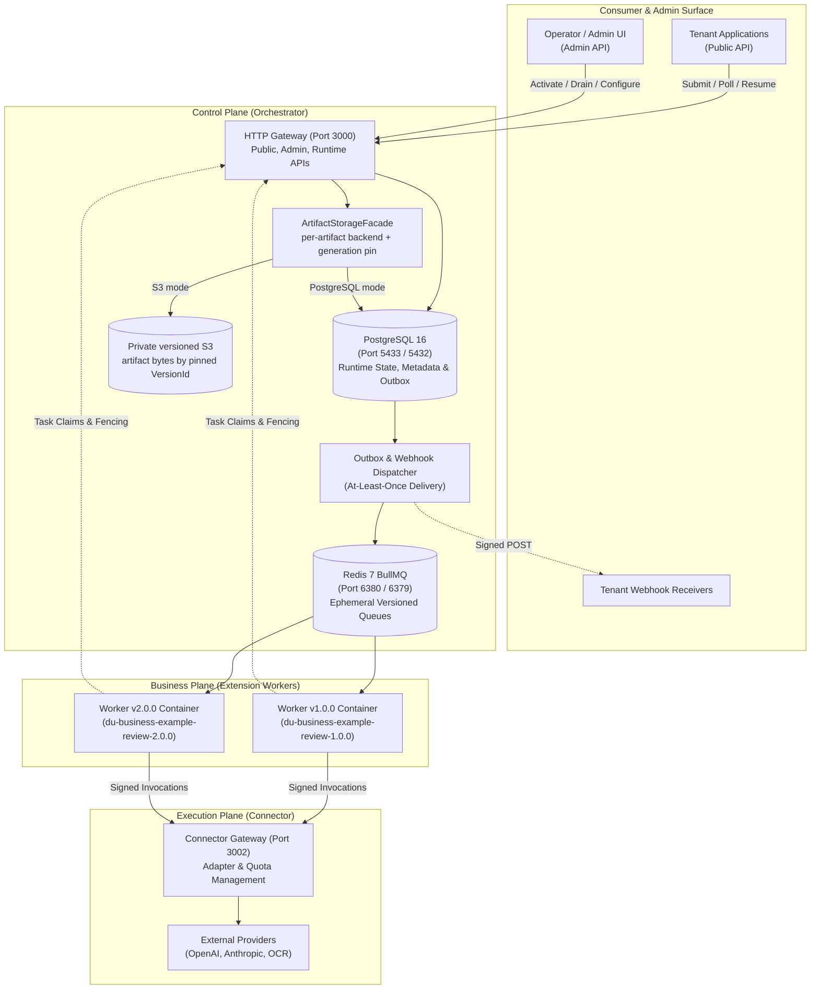
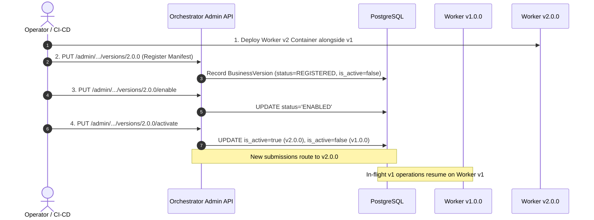

# Document Understanding (DU) Platform — Operational Runbooks & Failure Recovery Guide

> **2026-09-25 status: DRAFT — NOT ACCEPTED for operational execution.** This revision replaces unsafe manual state edits with service-owned recovery steps and records current capability gaps. Alert names/budgets in the catalog are not evidence that alerts are deployed. The snapshot has no operator-facing state-changing action for `UNKNOWN` reconciliation and no cross-bucket S3 locator-remap/failover tool. Recovery drills, production credential delivery, and backup/restore rehearsal remain required before approval. Do not run a mutating procedure without its change/incident authorization and service owner.

- **Specification ID**: `DU-OPS-17-RUNBOOKS`
- **Related Phase**: P8 Release Readiness (`tasks/P8-release-readiness.md`, Task P8-07)
- **Conformance Gates**: `OPS-02..08`, `RUN-02..07`, `ART-02/03`, `CON-01..05`, `VER-01`, `G6`
- **Target Audience**: Site Reliability Engineers (SRE), Systems Operators, On-Call Engineers
- **Status**: Draft — not accepted for operational execution
- **Published Date**: 2026-09-22

---

## 1. Executive Summary & Operational Topology

The Document Understanding (DU) Platform operates as a high-throughput, fault-tolerant asynchronous document processing pipeline. The architecture is decomposed into three decoupled planes:



This is a logical topology, not a deployment receipt. `infra/docker-compose.yml`
is a local test fixture with one Redis service and no Sentinel. Orchestrator,
Connector, and Worker SDK currently accept a single `REDIS_URL`; no Sentinel
discovery/quorum configuration is wired in this source snapshot. A production
managed Redis endpoint may provide failover externally, but the selected
provider endpoint and failover telemetry still need an environment-specific
rehearsal. Do not claim native Redis Sentinel support from a successful Redis
ping.

Artifact bytes are selected by `ARTIFACT_STORAGE_BACKEND` (`postgres` by
default or `s3`); metadata/grants remain in PostgreSQL and each artifact row
pins its backend and storage generation. S3 requires a private versioned
bucket. `ARTIFACT_STORAGE_MIGRATION_WINDOW=true` is a bounded DATA-05 migration
mode, not an outage failover switch; `false` is the S3-only cutover behavior.
The app health route checks PostgreSQL/Redis but does not probe artifact I/O.

---

## Connector Compose Health and Shutdown Contract

The Compose file under `infra/` is an isolated test stack. Running
`docker compose -f infra/docker-compose.yml up -d` starts only PostgreSQL and
Redis. The opt-in `connector` profile builds one Connector replica and binds
its port 8081 to loopback; this profile is not a production deployment plan.

### Preconditions

- Use disposable test data or an explicitly approved database window with a
  recovery point. Connector startup calls the SQL migration runner before it
  listens, so `up` may apply pending migrations. The Tester run request in
  `docs/29-run-request-queue.md` owns the migration procedure and evidence.
- Set three distinct base64-encoded 32-byte secrets in the shell environment:
  `CONNECTOR_SERVICE_IDENTITY_SECRET`,
  `CONNECTOR_INVOCATION_GRANT_SECRET`, and `CONNECTOR_ENCRYPTION_KEY`. Do not
  commit them or copy production values into this local fixture.
- `DRAIN_TIMEOUT_MS` defaults to 30000 ms. Compose gives the container 40
  seconds to stop so the process can finish its HTTP and usage-outbox drain.

### Local Fixture Commands

From the `du-rework` directory, after setting the secrets:

```sh
export CONNECTOR_SERVICE_IDENTITY_SECRET="$(openssl rand -base64 32)"
export CONNECTOR_INVOCATION_GRANT_SECRET="$(openssl rand -base64 32)"
export CONNECTOR_ENCRYPTION_KEY="$(openssl rand -base64 32)"
docker compose -f infra/docker-compose.yml --profile connector config --quiet
docker compose -f infra/docker-compose.yml --profile connector up -d --build connector
curl --fail http://127.0.0.1:8081/health/live
curl --fail http://127.0.0.1:8081/health/ready
docker compose -f infra/docker-compose.yml --profile connector ps
docker compose -f infra/docker-compose.yml --profile connector stop -t 40 connector
docker compose -f infra/docker-compose.yml --profile connector down
```

The first health route is process liveness. The readiness route is 200 only
when PostgreSQL and Redis respond; dependency loss returns 503. On SIGTERM the
listener stops accepting new connections immediately while accepted work is
drained. Since readiness reports dependency health rather than drain state,
withdraw the instance from upstream routing before sending SIGTERM. The Compose
healthcheck uses the same readiness route, and `depends_on: service_healthy`
gates Connector startup on both backing services. The exec-form entrypoint
forwards container stop signals to Node. Shutdown stops new invocation
acceptance, drains accepted request handlers and usage delivery under one
deadline, and force-closes HTTP connections if the deadline expires before
closing clients.

`down` stops the isolated services and preserves their test data. Do not add
`--volumes` unless the volume owner confirms the data is disposable. This local
profile has not been started as part of this review; the health, signal, and
migration paths above are documented contracts, not a live rehearsal receipt.

For a production deployment, provide an orchestrator-level readiness removal
before sending SIGTERM, keep the stop grace above the configured drain timeout
plus client-close margin, and inject secrets from the approved secret store.
The current Connector entrypoint runs migrations during startup; a controlled
one-shot production migration gate is not implemented by this local profile
and must be designed and reviewed before scaling Connector replicas. Production
procedures also require a backup/restore rehearsal.

### Core Invariants for Operators
1. **PostgreSQL is the runtime/control-state record**: task, operation, invocation, metadata and outbox state are durable there. Artifact bytes are durable in the per-artifact backend recorded by `storage_backend`/`storage_version_id` (PostgreSQL `artifact_blobs` or the exact versioned S3 object). Redis/BullMQ are delivery/control caches, not the durable task ledger. If Redis loses state, the system reconstructs work from PostgreSQL via `sweepExpiredLeases` and MM-05 `sweepQueueIntegrity` (docs/38 §3): dispatched-but-never-claimed deliveries whose BullMQ job is gone are re-armed on the ORIGINAL outbox row by a single-statement CAS, then republished. `POST /api/v1/admin/operations/sweep-deadlines` is an ESCAPE HATCH, never step 1; durable recovery status is the `queueIntegrity` field on `GET /health` (OK/RECONSTRUCTING/SUSPECT, docs/38 §6). This recovery contract does not imply that Sentinel is configured.
2. **Zero Silent Work Loss**: Every operation reaches a deterministic terminal state (`SUCCEEDED`, `FAILED`, `CANCELLED`, `TIMED_OUT`) or remains explicitly paused in `WAITING_INPUT` with an identifiable lease or wait owner.
3. **Fencing via Incremental Epochs**: Workers are leased on tasks with `lease_epoch`. Late reports, stale progress, or expired heartbeats return HTTP 409 `LEASE_LOST` and are rejected at the database level.
4. **Idempotent Ingestion & Continuation**: Duplicate submissions or resumes with identical keys return cached responses (`replayed: true`), preventing duplicate billing and duplicate child tasks.

---

## 2. BullMQ Queue Age & Worker Drain

**Alert status:** `QueueWaitingBeyondBudget`, `ExpiredTaskLeaseNotRecovering`,
`TaskDispatchOutboxStalled`, and related names are defined in the
[P8-07 alert catalog](ops/p8-07-dashboards-alerts.md), not proof of deployed
alert rules. If the selected Redis service uses Sentinel or managed failover,
use its own quorum/leader/failover telemetry; the application readiness ping
does not report Sentinel state.
Use the approved `QUEUE_WAIT_BUDGET` and lease budget for the environment; do
not treat historical sample values in this document as an SLO.

### 2.1 Triage

1. Record the environment, queue name, business ID/version, oldest-job age,
   waiting/active/delayed/failed/stalled counts, enqueue/completion rates, and
   last healthy timestamp. BullMQ queue APIs or the approved queue dashboard
   are authoritative for queue states. Raw Redis `LLEN` commands are not a
   reliable substitute for BullMQ state inspection.
2. Check Orchestrator `GET /api/v1/health`. Review `db`, `redis`, `activeLeases`,
   and `queueIntegrity`; a 200 response can still carry a degraded body when
   queue integrity is `SUSPECT`. The endpoint does not report per-queue age or
   prove a compatible worker is listening.
3. Confirm the queue mapping, image digest, manifest, and worker instance for
   the exact business/version. Operations remain pinned to their submitted
   version; a healthy worker on a different version cannot consume this work.
4. Use a read-only database role to inspect a small task sample. Do not select
   `payload_ref`, input bodies, artifact URLs, or result content:

   ```sql
   SELECT t.id AS task_id, o.business_id, o.business_version, t.state,
          t.attempt, t.lease_epoch, t.leased_by, t.lease_expires_at,
          t.due_at, t.updated_at
   FROM tasks t
   JOIN operations o ON o.id = t.operation_id
   WHERE o.business_id = $1 AND o.business_version = $2
     AND t.state NOT IN ('SUCCEEDED', 'FAILED', 'CANCELLED', 'TIMED_OUT')
   ORDER BY t.updated_at ASC
   LIMIT 50;
   ```

5. Classify the fault: DB/Redis unavailable, queue mapping mismatch, no worker
   for the pinned version, worker crash/OOM, event-loop stall, provider/quota
   backpressure, or a repeated poison task. If dashboard timestamps are stale,
   restore monitoring before concluding the queue is empty.

### 2.2 Recovery and controlled worker drain

- **Dependency or dispatcher unhealthy:** restore DB/Redis and Orchestrator
  capacity first. Preserve jobs and rows. Queue-integrity and expired-lease
  recovery are separate background sweeps; let them run after dependencies
  return. Do not flush Redis, delete BullMQ keys, or change lease columns.
- **Worker missing or wrong version:** deploy/scale the compatible image using
  the environment's release controller. Verify that it consumes the exact
  queue and reports healthy heartbeats before scaling down any replacement.
- **Drain a version during rollout:** if a compatible replacement is ready,
  activate it with the audited Admin API `PUT
  /api/v1/admin/businesses/{businessId}/versions/{version}/activate`. This
  changes the active pointer for new submissions; existing work remains pinned
  to its original version. `PUT
  /api/v1/admin/businesses/{businessId}/versions/{version}/deactivate` prevents
  new submissions to that version but does not cancel or stop its in-flight
  work. Use the approved Admin client, record the response/correlation ID, and
  do not call the route if no safe active version should receive new work.
- **Drain a worker process:** its application shutdown hook must call the
  Worker SDK handle's `close(graceMs)`, which stops the consumer and waits for
  in-flight handlers. The SDK does not install a process signal handler for the
  application. Verify the deployed entrypoint invokes this hook and set the
  platform stop grace for the longest permitted task. If the process is
  force-killed, leave the lease intact; `sweepExpiredLeases` recovers expired
  work and the incremented `lease_epoch` fences late writes from the old
  worker. Never force-expire a lease with SQL.
- **Orchestrator shutdown:** Orchestrator `close()` separately stops the task
  dispatcher, blocks new claims, and waits up to its configured drain timeout
  for running leases. This is not a replacement for draining business worker
  consumers.
- **Repeated poison task:** pause rollout and use the task's supported runtime
  failure/retry policy with the business owner. Do not alter the BullMQ job ID,
  task attempt, or lease epoch to bypass a failure.

### 2.3 Verification, rollback, and escalation

Recovery is verified when the oldest queue age returns below its approved
budget, the exact queue's completion rate resumes, ready/delayed counts trend
down, Orchestrator health is not `SUSPECT`, and the pinned tasks reach valid
states without duplicate provider effects. Before removing an old worker
version, confirm its nonterminal task count is zero; `WAITING_INPUT` and
`WAITING_CHILDREN` work still requires that version. If the new worker build
caused the incident, route new submissions back to a known-compatible enabled
version and retain the old compatible consumer for already pinned work. Page
Platform for DB/Redis/queue-integrity faults; page the business owner for a
single version; page Connector for provider 429 or UNKNOWN growth.

**Reference:** [BullMQ queue runbook](runbooks/bullmq-queue.md),
[alert catalog](ops/p8-07-dashboards-alerts.md),
`services/orchestrator/src/modules/runtime/runtime.ts`.

---

## 3. Outbox Dispatcher Stall & Delivery Recovery

### 3.1 Symptoms & Alert Triggers
| Alert Identifier | Severity | Trigger Condition | Operator Impact |
|---|---|---|---|
| `TaskDispatchOutboxStalled` | **PAGE** | Eligible task-outbox age exceeds the configured `TASK_DISPATCH_BUDGET`, or backlog is positive with no dispatch progress | Tasks committed in PostgreSQL are not reaching BullMQ |
| `WebhookDeliveryLag` | **WARNING** | Pending count or oldest due age exceeds the configured `WEBHOOK_DELIVERY_BUDGET` | Callback notifications to tenants are delayed |
| `WebhookMaxRetriesExceeded` | **CRITICAL** | `webhook_deliveries.status = 'FAILED'` (`attempts >= max_attempts`) | Tenant fails to receive terminal operation notification |
| `WebhookEndpoint5xxRate` | **WARNING** | Tenant-endpoint HTTP 5xx rate exceeds the configured `WEBHOOK_5XX_BUDGET` over its alert window | Tenant endpoint unhealthy or failing HMAC validation |

These alert names are a catalog, not proof of provisioned monitoring. Set
task-dispatch, webhook, and usage budgets per environment.

---

### 3.2 Identify the affected outbox

Do not treat every table containing “outbox” as the same delivery system:

| Stream | Durable table | Dispatch/retry behavior | Recovery boundary |
|---|---|---|---|
| Task delivery | Orchestrator `outbox` | Default poll every 2 seconds, batch up to 50; stable `delivery_id` job IDs; an enqueue error defers the row for 30 seconds | Restore Orchestrator/DB/Redis and let the dispatcher or queue-integrity sweep retry the original row |
| Webhook | Orchestrator `webhook_deliveries` | Pending delivery with backoff; default maximum 5 attempts | Callback failure does not change the operation's terminal state; no verified manual redrive route |
| Usage | Connector `connector_usage_outbox` | Event-ID idempotency; backoff; after 8 attempts it defers for about 24 hours and continues retrying | Restore the usage sink path; preserve the same event ID |

Task dispatch is an at-least-once transaction across PostgreSQL and BullMQ.
`delivery_id` creates a deterministic job ID; a retry that finds that job
already present marks the original row dispatched. A separate queue-integrity
sweep can re-arm the same original outbox row if Redis lost a job after the
dispatch stamp. Neither path requires creating a new delivery.

### 3.3 Task dispatch outbox stall

1. Check Orchestrator `GET /api/v1/health` for DB/Redis readiness and
   `queueIntegrity`; check database connectivity, Redis availability, and the
   currently deployed Orchestrator release. Health does not expose outbox lag.
2. Using a read-only DB role, measure eligible due rows and age without
   selecting payloads:

   ```sql
   SELECT count(*) FILTER (
            WHERE dispatched_at IS NULL AND due_at <= now()
              AND (claim_until IS NULL OR claim_until <= now())
          ) AS eligible_due_rows,
          max(now() - due_at) FILTER (
            WHERE dispatched_at IS NULL AND due_at <= now()
              AND (claim_until IS NULL OR claim_until <= now())
          ) AS oldest_eligible_age,
          count(*) FILTER (
            WHERE dispatched_at IS NULL AND claim_until > now()
          ) AS deferred_rows,
          max(attempts) FILTER (WHERE dispatched_at IS NULL) AS max_attempts
   FROM outbox;
   ```

   For a bounded sample, select only `id`, `aggregate_id`, `due_at`,
   `claim_until`, and `attempts`; never select `payload`. Compare queue state
   for the mapped business/version and confirm the expected worker is online.
3. If `claim_until` is in the future, wait through the 30-second enqueue
   backoff and observe the next poll. Confirm production `autoDispatch` was not
   disabled by the deployed configuration. Do not call a test-only
   `dispatchOnce` seam or update `dispatched_at`, `claim_until`, or `attempts`.
4. Restore DB/Redis connectivity or roll out a healthy Orchestrator instance
   with dispatch enabled using the deployment controller. Dispatcher polling
   is safe across instances through the transaction row lock. If queue
   integrity is `RECONSTRUCTING`, allow the sweep to verify and re-arm missing
   jobs. If it becomes `SUSPECT`, preserve evidence and page Platform.
5. For a webhook `FAILED` row, confirm the tenant endpoint and ask the owning
   service for a supported, audited redelivery action. The current snapshot
   does not provide one. For usage, restore Connector-to-Orchestrator ingest;
   preserve the event ID so the receiver can deduplicate.

6. Verify the eligible backlog and oldest age fall below their budgets,
   dispatch progress resumes, the target queue's tasks advance, and no duplicate
   operation/provider effect appears. For usage, verify the same event ID is
   acknowledged exactly once by the projection. For webhook, verify delivery
   through the supported path; do not equate a terminal operation with webhook
   delivery.

7. If an Orchestrator release caused the stall, roll back to the last compatible
   image/config using the deployment controller. Keep all durable rows and
   Redis jobs intact. Escalate a persistent DB lock, queue mapping mismatch,
   `SUSPECT` integrity state, or exceeded delivery budget to Platform.

### 3.4 Webhook Delivery Engine Architecture (`P2-08`)
The Orchestrator writes a `webhook_deliveries` row transactionally inside the same PostgreSQL transaction that transitions an operation to a terminal state (`SUCCEEDED`, `FAILED`, `CANCELLED`, `TIMED_OUT`). Delivery failures **never** alter the terminal operation outcome.

Key table columns (`0007_webhook_deliveries.sql`):
- `delivery_id`: UUID primary key.
- `operation_id`: UUID reference to `operations(id)`.
- `status`: `PENDING`, `DELIVERED`, `FAILED`.
- `attempts`: Current retry attempt counter.
- `max_attempts`: Maximum retry threshold (default 5).
- `next_at`: Timestamp for next scheduled delivery attempt.
- `last_error`: Text message of last connection or HTTP failure.

---

### 3.5 Webhook Triage & Recovery

#### Step 1: Query Failing Webhooks
Inspect failing or exhausted webhook rows:
```sql
SELECT 
  delivery_id,
  operation_id,
  event_type,
  terminal_state,
  status,
  attempts,
  max_attempts,
  next_at,
  last_error
FROM webhook_deliveries
WHERE status IN ('PENDING', 'FAILED')
ORDER BY next_at ASC
LIMIT 25;
```

#### Step 2: Categorize Error Signatures
- **`ECONNREFUSED` / `ENOTFOUND`**: Destination tenant host is down or DNS resolution failed.
- **`ETIMEDOUT` / Socket Hangup**: Tenant endpoint took longer than default 10,000ms timeout.
- **`HTTP 401 Unauthorized` / `HTTP 403 Forbidden`**: Tenant webhook secret mismatch or expired signature.
- **`HTTP 500 Internal Server Error`**: Unhandled exception in tenant webhook consumer logic.

#### Step 3: Verify the receiver without leaking credentials
Use the tenant's approved synthetic endpoint or receiver-side health/log
evidence. Do not copy the webhook HMAC secret into shell history, command
arguments, tickets, or this runbook. A fabricated callback must not be sent to
the production business endpoint as a “ping.”

#### Step 4: Handle exhausted deliveries
The current snapshot has no verified single-row or batch manual webhook
redelivery route. Do not reset `FAILED` rows or attempts with SQL. Preserve the
delivery ID and terminal operation state, confirm the receiving tenant is
ready, and request a service-owner-approved redelivery capability with an
audit record. If no such capability is available, keep the incident open and
escalate; do not imply that a database edit is a supported recovery.

---

### 3.6 Webhook Verification & Health Audit
```sql
SELECT 
  status,
  count(*) AS count,
  min(next_at) FILTER (WHERE status = 'PENDING') AS earliest_pending
FROM webhook_deliveries
GROUP BY status;
```
Use read-only status counts to confirm delivery progress. Do not require
`FAILED = 0` where exhausted deliveries lack a supported redrive path; resolve
each such delivery through the approved owner workflow before closing.

---

## 4. UNKNOWN Provider Response-Loss Recovery

### 4.1 Trigger and invariant

`INVOCATION_UNKNOWN` is an ambiguous provider outcome, not a retryable failure.
The request may have reached the provider even if the Connector lost the
response. The Connector returns HTTP **409** for `INVOCATION_UNKNOWN`; replay
with the same invocation ID remains fenced. Never send a second provider call
or assign a new invocation ID just to bypass this state.

The alert catalog's `ProviderInvocationUnknown` and
`ProviderRateLimitSpike` are proposed monitoring rules. Configure their rate
and age budgets per environment; do not infer a deployed alert from this page.

### 4.2 Triage

1. Open an incident and record UTC/environment, invocation/operation/task/step
   IDs, connector ID/revision, error code, and provider request ID when present.
   Do not attach request/result bodies, signed grants, source files, or API keys.
2. Use the Connector ledger through an approved read-only path. Inspect only
   state and identifiers; never select `request` or `result` JSON into a ticket:

   ```sql
   SELECT invocation_id, operation_id, task_id, step_key, state,
          error_code, provider_request_id, next_poll_at, created_at, updated_at
   FROM connector_invocations
   WHERE invocation_id = $1;
   ```

   For a bounded incident list, filter `state = 'UNKNOWN'`, order by
   `updated_at`, and limit results. Confirm this is `UNKNOWN`, not `PENDING`:
   a PENDING invocation with `next_poll_at` continues through its bounded poll
   lease/restart recovery path and must not be manually reclassified.
3. Query the provider's approved console/API or support channel using the
   provider request ID, account alias, and permitted time window. Use the
   provider's protected credential tooling; do not put a provider key in curl
   arguments or shell history. Preserve the provider evidence reference and
   lookup timestamp, not the raw prompt/result.
4. Treat “not found” as inconclusive until the provider's retention, indexing
   delay, and idempotency guarantees establish that the request was not
   accepted. If the provider is still processing, schedule the next lookup
   under the provider's documented interval and leave the incident open.

### 4.3 Decision, recovery, and rollback

| Provider evidence | Operator action |
|---|---|
| Completed with an authoritative result | Preserve provider evidence and page the Connector owner. Current snapshot has no operator reconciliation endpoint to safely attach result/usage to the durable ledger. Do not update SQL. |
| Definitively rejected/not accepted | Preserve evidence and ask Connector/runtime owner to authorize a retry through the supported task path. Do not mutate the ledger or resend the same logical call manually. |
| Processing, lookup unavailable, or evidence ambiguous | Keep `UNKNOWN`, prevent blind replay, schedule another lookup, and escalate to Connector plus business owner if the decision budget is exceeded. |
| Provider confirms completion but output is unavailable | Keep `UNKNOWN`; do not invent a successful result or usage record. Escalate for provider support/recovery. |

There is no supported rollback that turns UNKNOWN into SUCCEEDED/FAILED in this
snapshot. A compatible application release rollback may address a regression,
but it must preserve the invocation ledger and cannot change the provider's
effect. The Redis quota implementation has lease expiry; never `DECR`, delete,
or edit a quota key manually. Allow the owner-fenced lease to expire or be
released by Connector code.

Close only after a supported recovery action establishes one durable outcome,
usage is reconciled exactly once, the operation resumes through its normal
runtime path, and provider duplicate-effect/billing checks pass. If no supported
reconciliation tooling exists, leave the incident escalated and record that
capability gap.

**Reference:** [UNKNOWN reconciliation detail](runbooks/unknown-reconciliation.md),
`services/connector/src/invoke.ts`,
`services/connector/src/db/repository.ts`.

---

## 5. S3 Artifact Outage & Failover

### 5.1 Trigger and current capability

Page on sustained upload/read/finalize failures (`STORAGE_UNAVAILABLE`), a
READY artifact returning missing bytes, or size/hash/version verification
failure. `ArtifactBackendFailure` is listed in the alert catalog, but this
document does not prove an S3 probe or alert is deployed. Orchestrator health
checks DB and Redis and does not probe artifact I/O.

Configure `ArtifactBackendFailure` as a page when storage read/write/finalize
errors exceed the environment budget or an integrity check fails. The alert
catalog is proposed monitoring; verify the alert rule and notification route
in the monitoring system before relying on it.

The code has PostgreSQL and S3 facades and stores each artifact's backend and
pinned `storage_version_id`; the S3 facade requires bucket versioning and reads the
exact object version. The current service configuration selects one bucket,
region, and optional endpoint. The `G-DATA` production environment verification
and cross-bucket failover/restore drill remain open. There is no automatic
secondary-bucket selection or operator endpoint that rewrites artifact
locators. This is a supported incident triage and hold procedure; it is not a
claim that cross-bucket failover is ready.

The process selects its write backend with `ARTIFACT_STORAGE_BACKEND` and
requires `ARTIFACT_S3_BUCKET` when set to `s3`. With S3 selected,
`ARTIFACT_STORAGE_MIGRATION_WINDOW=true` enables the bounded DATA-05 dual-read
behavior for legacy PostgreSQL rows; if unset, the source also defaults to
dual-read compatibility. Set it explicitly to `false` only after migration
inventory is clear to enable S3-only behavior that fails closed on unresolved
legacy references. Switching to PostgreSQL-only mode does not make existing S3-backed
rows readable. See the [artifact storage runbook](runbooks/artifact-storage.md)
for per-backend outage handling and the [DATA-05 migration runbook](runbooks/data-05-s3-migration-runbook.md)
for migration/rollback steps.

### 5.2 Triage without changing artifact state

1. Record incident time, environment, release/config revision, affected
   operation/task/artifact IDs, failure code, and request correlation ID. Do
   not attach object keys, signed URLs, tenant filenames, artifact bytes, or
   storage credentials to the ticket.
2. Check `GET /api/v1/health` for DB/Redis state, then separately check the
   approved cloud status, network path, IAM role, KMS permissions, bucket
   versioning, and S3 request/error metrics. A green Orchestrator health result
   does not demonstrate that S3 works.
3. With an approved read-only DB role, inspect aggregate backend/state counts:

   ```sql
   SELECT storage_backend, state, count(*) AS artifacts,
          min(updated_at) AS oldest_updated_at
   FROM artifacts
   GROUP BY storage_backend, state
   ORDER BY storage_backend, state;
   ```

   For one incident artifact, inspect only its ID, state, backend, pinned
   version ID, size, and hash. Keep key/version locator details in the
   restricted operator console; do not paste them into general logs or chat.
4. Classify the response. `STORAGE_UNAVAILABLE` points to the storage path;
   missing/non-versioned object or metadata mismatch is an integrity incident;
   checksum/size mismatch means do not serve the bytes as valid. Preserve DB
   metadata and all bucket versions while the cause is unresolved.

### 5.3 Recovery and failover decision

- **Transient service/network/IAM issue, same bucket remains authoritative:**
  restore the approved role/network/service path through the infrastructure
  change process. Do not change artifact rows. Run a canary upload → finalize
  → authorized read through the application and compare the returned size/hash
  with the expected fixture before reopening artifact-dependent traffic.
- **S3 versioning suspended or a pinned version is missing:** stop writes that
  could create more inconsistent artifacts and page Data/Storage. Restore
  versioning/configuration and recover the exact pinned generation from the
  approved backup or recovery source. A `null` version is not accepted by this
  facade. Do not fabricate a version ID, update the hash, or mark an artifact
  READY to clear an alert.
- **Primary bucket/region unavailable and an alternate bucket is proposed:**
  stop at the failover gate. Changing the global bucket/endpoint does not
  remap persisted object keys or version IDs, and switching the global backend
  to PostgreSQL does not fall back existing rows marked `storage_backend='s3'`.
  Require the approved DR procedure/tool to copy and verify exact generations,
  transactionally map metadata, and prove authorized reads before cutover. That
  cross-bucket remap and rehearsal are not present in this snapshot. Preserve
  affected work and escalate to the G-DATA owner; do not edit `artifacts` or
  copy objects ad hoc.
- **Rollback:** restore the previous storage config only when the previous
  bucket still contains every referenced pinned version and an application
  canary confirms reads. Config rollback cannot recover deleted/missing bytes.
  Keep the incident open if any READY reference remains unreadable.

### 5.4 Recovery verification and cleanup hold

Confirm a canary grant/upload/finalize/scoped-read succeeds, size and SHA-256
match, ownership is enforced, and affected READY artifacts are readable from
their recorded backend/version. Monitor write/read errors and queue age through
one alert window. Do not run orphan cleanup by age: the snapshot has no
production orphan sweeper proven to preserve active operation/checkpoint
references. Any cleanup needs a dry-run, complete reference check, audit, and
separate rehearsal.

**References:** [Artifact storage runbook](runbooks/artifact-storage.md),
[G-DATA storage plan](../tasks/DEPLOY-STORAGE-LOGGING-2026-09-24.md),
`services/orchestrator/src/modules/artifacts/s3-storage-facade.ts`.

---

## 6. Active Version Coexistence, Drain & Zero-Downtime Rollback

### 6.1 Architectural Principles of Versioning (`VER-01`)
- **Isolated Queues**: Every registered version listens on a distinct queue: `du-business-${businessId}-${version}`.
- **Active Version Pointer**: Exactly one version per business is marked `is_active = true`. New submissions route exclusively to the active version.
- **In-Flight Pinning**: When an operation is submitted, `operations.business_version` is pinned permanently. All continuations, child tasks, and resumes dispatch exclusively to that version's queue.

---

### 6.2 Zero-Downtime Deployment Runbook (v1.0.0 -> v2.0.0)



#### Step-by-Step Commands:
1. **Deploy Worker v2 Container**:
   Launch Worker v2 alongside Worker v1. Verify both containers are running healthy:
   ```bash
   docker ps --filter "name=worker"
   ```
2. **Register Version v2.0.0 Manifest**:
   ```bash
   curl -i -X PUT http://localhost:3000/api/v1/admin/businesses/example-review/versions/2.0.0 \
     -H "Authorization: Bearer $ADMIN_KEY" \
     -H "Content-Type: application/json" \
     -d @manifest-v2.0.0.json
   ```
3. **Enable Version v2.0.0**:
   ```bash
   curl -i -X PUT http://localhost:3000/api/v1/admin/businesses/example-review/versions/2.0.0/enable \
     -H "Authorization: Bearer $ADMIN_KEY"
   ```
4. **Activate Version v2.0.0**:
   ```bash
   curl -i -X PUT http://localhost:3000/api/v1/admin/businesses/example-review/versions/2.0.0/activate \
     -H "Authorization: Bearer $ADMIN_KEY"
   ```
   *Expected Response*: HTTP 202 `{ "businessId": "example-review", "version": "2.0.0", "active": true }`.
5. **Verify Routing**:
   Submit a test operation via Public API. Verify that the resulting task executes on queue `du-business-example-review-2.0.0` with version marker `[2.0.0]`.

---

### 6.3 Emergency Drain & Rollback Runbook (v2.0.0 -> v1.0.0)

If version v2.0.0 exhibits defects in production, execute an immediate zero-downtime rollback:

#### Phase 1: Drain v2.0.0 (Stop Inflow)
Deactivate v2.0.0 to immediately prevent new submissions from hitting the bad version:
```bash
curl -i -X PUT http://localhost:3000/api/v1/admin/businesses/example-review/versions/2.0.0/deactivate \
  -H "Authorization: Bearer $ADMIN_KEY"
```
*Validation*: New submissions immediately fail-closed with HTTP 404 `NOT_FOUND` (`no active version for business example-review; activate one via the admin API`). Zero orphan tasks are created.

#### Phase 2: Reactivate v1.0.0 (Rollback Pointer)
Re-activate the stable v1.0.0 version:
```bash
curl -i -X PUT http://localhost:3000/api/v1/admin/businesses/example-review/versions/1.0.0/activate \
  -H "Authorization: Bearer $ADMIN_KEY"
```
*Validation*: New submissions immediately resume and route to Worker v1.0.0 with version marker `[1.0.0]`.

#### Phase 3: Monitor Drain of In-Flight v2.0.0 Work
**DO NOT shut down Worker v2 yet!** Any operation that started under v2.0.0 or paused in `WAITING_INPUT` will resume specifically on Worker v2.
Query remaining in-flight v2 operations:
```sql
SELECT 
  count(*) AS in_flight_v2_tasks
FROM tasks t
JOIN operations o ON o.id = t.operation_id
WHERE o.business_id = 'example-review'
  AND o.business_version = '2.0.0'
  AND t.state IN ('READY', 'RUNNING', 'WAITING_INPUT', 'WAITING_CHILDREN');
```
Once `in_flight_v2_tasks` reaches `0`, the Worker v2 container can be safely decommissioned.

---

## 7. Credential Rotation and Revocation

### 7.1 Tenant Public API Key Rotation (`OPS-04`)
API keys are stored as SHA-256 hashes; raw keys are not stored. In this
snapshot the admin view is display-only and the Orchestrator does not expose a
verified API-key create/revoke route. Do not provision or revoke keys with
direct SQL, and do not treat a UI status change as proof of enforcement.

For a planned rotation, keep the change open and escalate to the Orchestrator
owner for an audited, supported create-and-revoke path. A secure overlap
procedure requires an operator-visible one-time secret delivery, tenant
confirmation, traffic evidence by key prefix, and an authenticated revocation
receipt. Those controls are not available in this snapshot, so API-key
rotation is a release-readiness gap rather than an executable runbook.

For suspected compromise, open a security incident, preserve the key ID and
prefix (never the raw key), and page the Orchestrator/security owner. If an
approved edge control can block the affected tenant, use its normal audited
change process while service-side revocation is arranged. Verify an attempted
request with the affected key is rejected before reporting it revoked. Do not
claim containment based only on an audit entry or manual database edit.

---

### 7.2 Connector Provider Credential Rotation (`CON-04`)
Provider credentials are encrypted in `secret_versions` using
`CONNECTOR_ENCRYPTION_KEY`. The management rotation route is internal and
requires Connector service identity with `connector:manage`. Rotation writes
a new version for the connector's current credential reference; subsequent
invocations select the newest non-revoked version. The old provider key may
remain valid upstream during the planned overlap.

#### Planned rotation

1. Open an approved change. Record connector IDs/revisions, credentialRef
   scope, provider account alias, actor, overlap window, canary criteria, and
   rollback owner. Use the privileged management view to identify every
   connector sharing the credential reference; do not log secret values.
2. Confirm the provider supports overlap and issue the replacement through the
   provider's secure console/secret manager. Deliver it only through the
   approved secret-aware internal client to
   `POST /connectors/{connectorId}/credentials/rotate` with
   `connector:manage` identity. The request body contains the new secret; do
   not put it in curl arguments, shell history, tickets, CI output, or this
   document. A successful request returns HTTP 204 with no secret body.
3. Run a low-risk canary invocation through the normal signed-grant runtime
   path. Confirm provider authentication, expected response, quota behavior,
   usage event, and no increase in `CREDENTIAL_INVALID`, provider 401, or
   UNKNOWN outcomes. `POST /connectors/{id}/test` only checks that the revision
   and adapter are present; it does not authenticate against the provider.
4. Keep the old key active through the approved overlap and maximum in-flight
   request window. After the new key is confirmed on every affected connector,
   revoke the old key at the provider and watch auth failures/UNKNOWN through
   one alert window. Record the provider revocation receipt and metadata-only
   Connector audit evidence.

#### Emergency revocation / rollback

- **Suspected compromise:** revoke the provider key first using the provider's
  approved control plane. Then block new calls by invoking the authenticated
  `POST /connectors/{connectorId}/disable` management action for every affected
  connector ID; this disables all revisions for each ID and returns 204. It
  does not cancel an already-running request, so classify any lost response
  under the UNKNOWN runbook. Do not use SQL or the internal repository's
  non-exposed `revoke()` method as an operator API.
- **Canary failure, old key safe and still valid:** stop rollout. Use the same
  secret-aware rotation path to install the old key as a new latest version,
  then run a canary. There is no API to select a previous version in place.
  Never restore a key suspected of compromise.
- **After disable:** the current surface has no verified re-enable route.
  Connector/Orchestrator owners must establish a supported replacement revision
  and grant binding before traffic resumes. Do not edit `connector_revisions`
  or `secret_versions` directly.
- Do not rotate `CONNECTOR_ENCRYPTION_KEY` as part of provider-key rotation.
  The snapshot has no key-versioned dual-read/reencryption migration; changing
  this environment key alone can make stored credentials undecryptable.

Close the change only after a successful canary on the intended revision,
provider-side revocation confirmation for the old key, stable auth/UNKNOWN
rates, correct usage deduplication, and an audit record with no raw secret.

---

## 8. Incident Triage Summary & On-Call Cheat Sheet

| Symptom / Error Code | Primary Suspect | First Command to Run | Immediate Remediation |
|---|---|---|---|
| HTTP 409 `LEASE_LOST` | Task leased elsewhere or worker missed heartbeat | `SELECT lease_expires_at FROM tasks WHERE id='...'` | Do not retry from stale worker; allow new worker to claim |
| HTTP 404 `no active version` | Version deactivated without replacement | `SELECT version, is_active FROM business_versions WHERE business_id='...'` | Call `PUT .../versions/:version/activate` via Admin API |
| HTTP 409 `INVOCATION_UNKNOWN` | Provider response lost after dispatch | Read identifiers/state from `connector_invocations`; do not select request/result | Query provider through approved tooling; no ledger SQL patch or blind retry |
| HTTP 409 `STATE_CONFLICT` | Outdated CAS token on resume | `SELECT status FROM human_waits WHERE operation_id='...'` | Refresh operation snapshot; retry with latest `concurrencyToken` |
| Webhook status `FAILED` | Tenant receiver outage / retry budget exhausted | Read delivery ID/status/attempts with an approved DB role | No manual redrive route is verified; resolve through service-owner workflow |
| Task outbox age growing | Dispatcher or DB/Redis dependency stall | Read eligible due age from `outbox`; inspect Orchestrator health | Restore dispatcher/dependency; never edit or recreate outbox rows |
| Queue age growing | Worker pool starved, wrong pinned version, or dependency fault | Approved BullMQ per-queue dashboard and Orchestrator health | Restore matching worker; drain by version, preserve leases and jobs |
| S3 artifact `STORAGE_UNAVAILABLE` | S3/network/IAM/KMS or pinned object version unavailable | Orchestrator health plus approved S3 telemetry (health does not probe S3) | Preserve metadata; no cross-bucket failover until locator remap is rehearsed |
