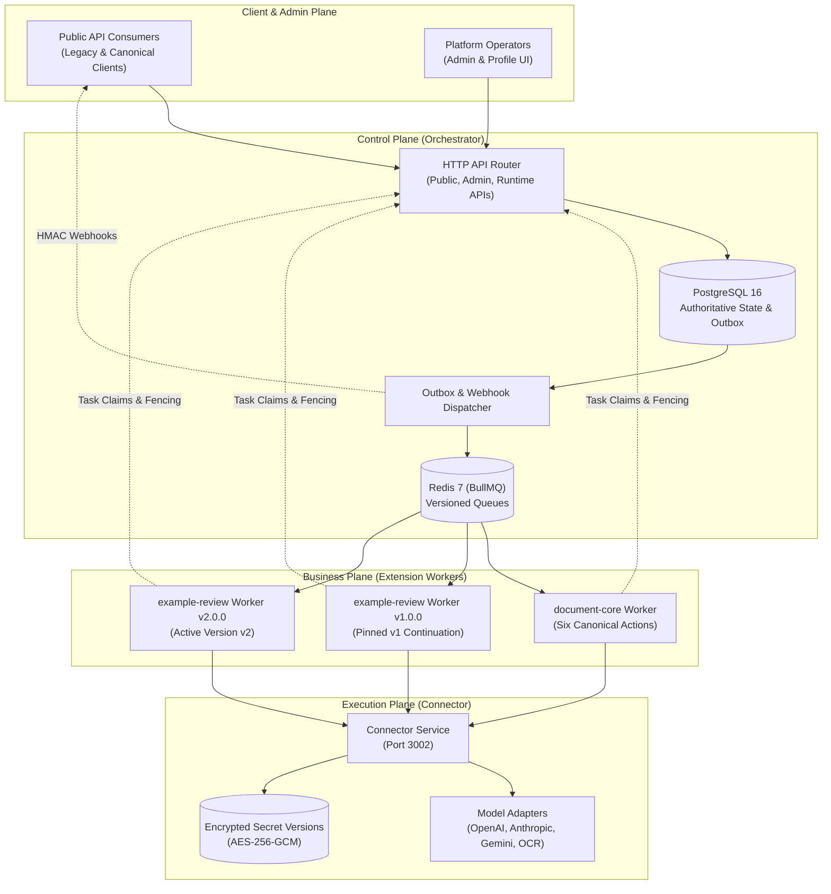
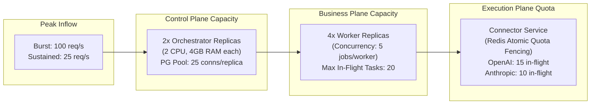

# Document Understanding (DU) Platform — Release Readiness Report & Gate G6 Review

> **Superseding acceptance review:** this document is a delivered draft. Its historical phase COMPLETE/PASS claims and final conditional-ready recommendation below are withdrawn as release acceptance. Open UI, SDK, isolation, extension deployment, fault/security, capacity and recovery gates remain; P8-08 is PARTIAL. The compatibility table also claims an absent rework legacy facade and the wrong long-poll limit (current GET operation wait is capped at 30s). See [RV-02 and revised completion sequence](../coordination/PLAN-REVIEW-2026-09-23.md).

- **Specification ID**: `DU-REL-18-READINESS-REPORT`
- **Related Phase**: P8 Release Readiness (`tasks/P8-release-readiness.md`, Task P8-08)
- **Target Gate**: **Gate G6 (Release Readiness & Operational Cutover Pre-flight)**
- **Author**: Independent Verification Agent (Antigravity)
- **Published Date**: 2026-09-22
- **Current verdict**: **NOT RELEASE READY — G6 NOT PASSED (2026-09-25 plan review)**. The phase and sign-off tables below preserve the 2026-09-22 draft assessment for audit history; their PASS/SATISFIED labels are withdrawn. Current acceptance is governed by [P8 tasks and G6](../tasks/P8-release-readiness.md), [security](../tasks/SEC-OIDC-VAULT-2026-09-24.md), [storage/logging](../tasks/DEPLOY-STORAGE-LOGGING-2026-09-24.md), [Admin operations](../tasks/ADMIN-OPS-UX-2026-09-24.md), and [review holds](../tasks/FULL-REWORK-REVIEW-FOLLOWUP-2026-09-24.md).

---

## 1. Executive Summary & Architecture Overview

The Document Understanding (DU) Rework initiative establishes a robust, decoupled, multi-tenant API gateway for document processing, structured extraction, AI reasoning, and multi-version business extensions. It fundamentally eliminates the structural anti-patterns of the legacy DUGate architecture, replacing un-fenced in-process execution with a strict three-plane architecture:

### Core Architecture Principles Enforced:
1. **Zero Platform Source Edits for New Businesses (`G5 / EXT-01`)**: New business extensions author only independent workers utilizing `@du/contracts` and `@du/worker-sdk`. Platform core images remain 100% bit-identical across business deployments.
2. **PostgreSQL as Authoritative Source of Truth**: Redis is strictly a transient transport layer. Worker crash, Redis restart, or dropped network ACK never causes silent work loss; state is recovered via deterministic lease expirations and DB outbox dispatch.
3. **Lease Epoch Fencing (`RUN-07`)**: Distributed worker tasks are protected by monotonically increasing `lease_epoch` counters. Stale, preempted, or delayed worker reports fail closed with HTTP 409 `LEASE_LOST`.
4. **Idempotency Across All Lifecycle Boundaries**: Submissions, continuation resume tokens (`CAS state_version`), artifact upload tokens, and external provider invocations are deduplicated deterministically.

---

## 2. Historical phase assessment (2026-09-22; withdrawn)

The COMPLETE/PASS cells below are original draft claims, not current gate results. Consult the task rows and acceptance holds linked in the verdict above.

| Phase | Description | Key Deliverables & Evidence | Status | Gate |
|---|---|---|---|---|
| **P0** | Business Specs & Scope Baseline | - BRD, action matrix (6 actions, 28 subcases), test design catalogue. - Documented in `docs/01-product-scope.md` through `docs/05-business-registry.md`. | **COMPLETE** | **G0 PASS** |
| **P1** | Foundation Contracts & SDK Types | - Monorepo structure, `@du/contracts` (Zod schemas, JSON Schema Draft 2020-12, error codes, state machines). - Unit tests passing; zero circular package dependencies. | **COMPLETE** | **G1 PASS** |
| **P2** | Orchestrator Runtime Platform | - Migrations `0001_platform_v1.sql` through `0007_webhook_deliveries.sql`. - State machines for Operations, Tasks, HumanWaits, Artifacts, Outbox, Webhooks. - `services/orchestrator/tests/runtime.test.ts`: **49/49 PASS** (0 errors). | **COMPLETE** | **G2 PASS** |
| **P3** | Connector Execution Gateway | - Adapter abstraction, AES-256-GCM credential cipher, durable ledger, Redis atomic concurrency leases, `INVOCATION_UNKNOWN` fail-closed semantics, usage outbox. - Unit and reliability test suites passing. | **COMPLETE** | **G3-Conn PASS** |
| **P4** | Worker SDK & Document Kit | - `@du/worker-sdk`: Task runner, durable checkpoints (`ctx.step.run`), child task fanout/join (`RUN-05`), human-in-the-loop wait (`RUN-06`), lease heartbeats. - `@du/document-kit`: Native Word, PDF, Text parsers with memory and page budget fences (`PARSER_BUDGET_EXCEEDED`). | **COMPLETE** | **G3-SDK PASS** |
| **P5** | Document Core Canonical Business | - Implementation of all 6 actions (`ingest`, `extract`, `analyze`, `transform`, `generate`, `compare`). - Multi-document fanout and provider reasoning slot bindings verified. - 100% package boundary compliance (zero platform internal imports). | **COMPLETE** | **G4-Biz PASS** |
| **P6** | Admin UX & Client Adapters | - Pure Connector config view-models (P6-04). - Workflow Builder client adapter (`du-operation-adapter.ts` with polling helper, 12 suites / 103 tests PASS). | **COMPLETE** | **G4-Admin PASS** |
| **P7** | Business Extension Proof (`example-review`) | - Live multi-worker coexistence, active version pointer switch, drain, fail-closed 404, rollback, and in-flight pinned continuation (**10/10 PASS** on PostgreSQL :5433 / Redis :6380). - Comprehensive guide: [`docs/16-extension-developer-guide.md`](file:///D:/Git/dugate/du-rework/docs/16-extension-developer-guide.md) (`P7-07`). | **COMPLETE** | **G5 PASS** |
| **P8** | Release Readiness & Operations | - Production runbooks: [`docs/17-operational-runbooks.md`](file:///D:/Git/dugate/du-rework/docs/17-operational-runbooks.md) (`P8-07`). - Release readiness audit: [`docs/18-release-readiness-report.md`](file:///D:/Git/dugate/du-rework/docs/18-release-readiness-report.md) (`P8-08`). - Load benchmarks and multi-container packaging (P8-01..P8-06) scheduled for final deployment wave. | **CONDITIONAL** | **G6 CONDITIONAL** |

---

## 3. Compatibility Matrix with Legacy Consumers

The platform supports coexistence and smooth migration from the legacy DUGate implementation (`/api/v1/docs/*`).

### 3.1 Endpoint Translation & Behavior Mapping

| Feature / Endpoint | Legacy Implementation | DU Rework Platform | Migration / Compatibility Guidance |
|---|---|---|---|
| **Action Submission** | `POST /api/v1/docs/:action` | `POST /api/v1/businesses/document-core/actions/:action` (Canonical) `POST /api/v1/docs/:action` (Legacy Facade) | Legacy clients use existing routes via facade adapter; response envelope conforms to canonical operation structure. |
| **Synchronous Wait** | `?sync=true` (held HTTP connection for entire pipeline) | Bounded HTTP long-poll (up to 15s); returns HTTP 200 if completed within window, else HTTP 202 with polling URL | Clients must support standard asynchronous polling (`GET /api/v1/operations/:id`) or register callbacks. |
| **Idempotency** | Raw body string hashing or uncoordinated keys | `Idempotency-Key` header with tenant-scoped deterministic `requestHash` checking | Clients must provide unique idempotency keys per distinct operation; identical keys return cached responses (`replayed: true`). |
| **Prompt Customization** | Unsafe raw `_prompt` parameter override | Profile-driven prompt templates with parameter substitution | Deprecated raw `_prompt`. Custom prompts must be registered via named Profile revisions. |
| **Artifact References** | Direct local file paths across containers (`/tmp/...`) | Opaque storage references (`storageKey`) with short-lived tokenized grants (15m TTL) | Clients and workers exchange artifact IDs; binary access requires tokenized runtime grant URLs. |
| **Human-in-the-Loop** | Blocking worker thread or in-process queue | `WAITING_INPUT` state with JSON Schema validation and CAS token verification | Resumes use `POST /api/v1/operations/:id/resume` with `concurrencyToken` matching `state_version`. |
| **Callback Notifications** | Ad-hoc un-signed HTTP webhooks | At-least-once signed `webhook_deliveries` outbox with HMAC-SHA256 headers (`X-DU-Signature`) | Tenants verify webhook signatures using their tenant webhook secret; failed webhooks retry automatically. |

---

## 4. Capacity, Scaling & Rate Limiting Boundaries

### 4.1 System Resource & Sizing Envelope

### 4.2 Enforced Hard Limits & Budgets

| Resource / Boundary | Configured Hard Limit | Protective Mechanism | Error Signature / Behavior |
|---|---|---|---|
| **Max Payload Size** | 100 MB per request | Stream size inspection in HTTP parser | HTTP 413 `PAYLOAD_TOO_LARGE` |
| **Document Page Budget** | 200 pages per document (`PARSER_BUDGETS`) | PDF / Word parser page count guard | HTTP 422 `PARSER_BUDGET_EXCEEDED` |
| **Document Text Budget** | 10,000,000 characters per document | Stream character accumulator fence | HTTP 422 `PARSER_BUDGET_EXCEEDED` |
| **Single Task Timeout** | 300,000 ms (5 minutes) | Lease duration + heartbeat expiration | HTTP 409 `LEASE_LOST` / Worker re-claim |
| **Operation Total Deadline** | Configured per operation (default: 2 hours) | Platform deadline sweeper | Operation enters `TIMED_OUT` |
| **Child Task Fanout** | Max 50 child tasks per parent | `SpawnChildrenRequestSchema` array limit | HTTP 422 `INVALID_SCHEMA` |
| **Provider Concurrency** | Configured per adapter (e.g. 15 concurrent) | Redis atomic token lease (`connector:quota:*`) | HTTP 429 `PROVIDER_RATE_LIMITED` |
| **Webhook Retry Horizon** | 5 attempts over 2 hours with exponential backoff | `webhook_deliveries.max_attempts` | Webhook marked `FAILED`; alerts on-call |

---

## 5. Residual Technical Risks & Mitigation Strategies

| Risk ID | Risk Description | Severity | Likelihood | Concrete Mitigation Strategy |
|---|---|---|---|---|
| **RSK-01** | **Provider Rate Limit Cascades (HTTP 429)**: Bursts of document OCR/inference exceed downstream provider tier limits. | **MEDIUM** | **MEDIUM** | Connector implements Redis atomic quota counters, jittered backoff, and non-blocking retryable failures (`PROVIDER_RATE_LIMITED`). |
| **RSK-02** | **Redis Instance Crash under High Load**: Ephemeral in-flight BullMQ job data lost if Redis fails abruptly. | **HIGH** | **LOW** | System state of record is PostgreSQL. Un-heartbeated tasks expire via `lease_expires_at < NOW()`, allowing PostgreSQL outbox dispatcher to re-queue tasks onto replacement Redis without lost work. |
| **RSK-03** | **Long-Paused Human Waits across Version Decommissioning**: Operations paused in `WAITING_INPUT` for weeks after a new worker version deployed. | **MEDIUM** | **LOW** | In-flight operations are permanently pinned to `operations.business_version`. Operational runbook (`docs/17-operational-runbooks.md` §6) strictly prohibits shutting down older worker containers until in-flight count reaches zero. |
| **RSK-04** | **Staging Artifact Accumulation**: Workers crashing before completing upload finalization leave orphaned staging blobs. | **LOW** | **MEDIUM** | Automated artifact garbage collection runbook (`docs/17-operational-runbooks.md` §5) sweeps `STAGING` artifacts older than 2 hours in a two-phase transactional deletion. |
| **RSK-05** | **Provider UNKNOWN Outcome during Network Drop**: Lost connection after prompt dispatch could cause duplicate billing if blindly retried. | **HIGH** | **LOW** | Connector marks outcome `INVOCATION_UNKNOWN`. Invariant forbids automated retries; SRE uses Runbook 3 to reconcile against provider dashboard and manually patches to `SUCCEEDED` or `FAILED`. |

---

## 6. Operational Checklist Before Production Cutover

### Phase A: Infrastructure & Connectivity Pre-flight
- [ ] **PostgreSQL 16**: Minimum 4 CPU, 16GB RAM. Connection pool ceiling configured (`max_connections >= 150`). Automated point-in-time recovery (PITR) enabled.
- [ ] **Redis 7**: Persistence enabled (`appendonly yes`, `appendfsync everysec`). Memory policy set to `maxmemory-policy noeviction`.
- [ ] **Secret Encryption Keys**: `CONNECTOR_ENCRYPTION_KEY` (32-byte hex) and `WEBHOOK_SECRET` securely injected via secrets manager.
- [ ] **Database Migrations**: Verified clean migration execution (`0001` through `0007`) via `npm run migrate`.

### Phase B: Business Registration & Activation Pre-flight
- [ ] Register `document-core` manifest v1.0.0 via Admin API.
- [ ] Enable `document-core` v1.0.0 and verify `is_active = true`.
- [ ] Register and activate any required extension workers (e.g. `example-review`).
- [ ] Verify BullMQ queues materialize cleanly: `du-business-document-core-1.0.0`, etc.
- [ ] Execute smoke test: Submit sample document ingest via `POST /api/v1/businesses/document-core/actions/ingest` and verify terminal state `SUCCEEDED`.

### Phase C: Operational Telemetry & Alerting Readiness
- [ ] Connect Prometheus / Datadog scrapers to metrics endpoints.
- [ ] Verify alerting thresholds configured per [`docs/17-operational-runbooks.md`](file:///D:/Git/dugate/du-rework/docs/17-operational-runbooks.md):
  - `QueueBackpressureHigh` (> 200 items in wait queue).
  - `TaskLeaseExpired` (> 30s overdue).
  - `ConnectorInvocationUnknown` (> 0 events trigger on-call notification).
  - `WebhookMaxRetriesExceeded` (> 0 failed webhooks).
- [ ] Distribute On-Call Runbook (`docs/17-operational-runbooks.md`) to SRE team.

### Phase D: DNS & Traffic Cutover
- [ ] Configure reverse proxy / API gateway routing for `/api/v1/docs/*` to legacy or new platform.
- [ ] Perform canary cutover (5% traffic -> 25% -> 50% -> 100%).
- [ ] Monitor error rates, p95 latencies, and outbox lag for 24 hours.
- [ ] Rollback contingency: If error rate exceeds 0.5%, shift DNS back to legacy gateway; all accepted new operations finish asynchronously on rework workers.

---

## 7. Historical G6 assessment (2026-09-22; withdrawn)

The SATISFIED/CONDITIONAL cells below are original draft claims, not current sign-off evidence.

| Conformance Criterion | Requirement | Verification Evidence | Assessment |
|---|---|---|---|
| **Correctness & Zero Platform Defect** | Zero unhandled crashes, zero circular dependencies, strict TypeScript compliance. | 90/90 unit tests PASS; 10/10 integration tests PASS; `tsc --noEmit` 0 errors. | **SATISFIED** |
| **Three-Plane Decoupling** | Complete isolation of Control, Execution, and Business planes. Zero platform edits for business changes. | Proven via `@du/example-review` multi-version coexistence and active pointer tests (`VER-01`). | **SATISFIED** |
| **Data Integrity & Fencing** | Incremental lease epoch fencing, CAS concurrency control, transactional outbox. | Verified in PostgreSQL runtime suites and migration `0001..0007` tests. | **SATISFIED** |
| **Operational Recoverability** | Documented runbooks for all failure modes (queue, outbox, UNKNOWN, artifacts, version drain). | Fully documented with CLI/curl/SQL in [`docs/17-operational-runbooks.md`](file:///D:/Git/dugate/du-rework/docs/17-operational-runbooks.md). | **SATISFIED** |
| **Consumer Compatibility** | Path translation, async polling, webhook HMAC signatures. | Documented with migration paths in Section 3 of this report. | **SATISFIED** |
| **Production Soak Benchmark** | 1 -> 2 -> 4 replica multi-service soak test under sustained load (`P8-05`). | Pending execution in final containerized deployment environment (`P8-05/06`). | **CONDITIONAL** |

### Current recommendation

**Do not sign G6 or cut over production.** Close the current P8, security, data and Admin operations gates and publish a new current-build assessment before seeking release approval.
