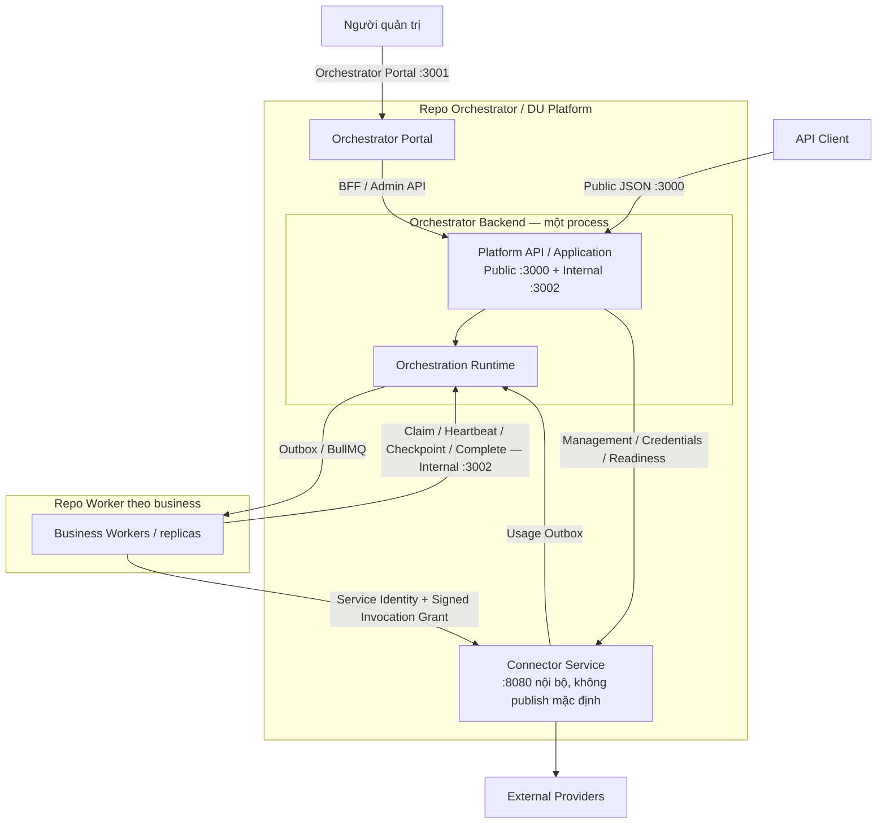

# DU Platform: kiến trúc repo và service

## Secrets / Callback API snapshot — SC-04, CB-05, PM-M07 (2026-10-06)

OpenAPI [21-openapi.json](21-openapi.json) được regenerate bằng [generator](../tools/openapi/gen_openapi.py), model Secrets/Callback lấy trực tiếp canonical contract source qua [projection helper](../tools/openapi/catalog_callback_schemas.cjs). Portal `/admin/api/secrets*` là cookie-session BFF tại **3001**, proxy sang Internal JSON **3002**; Connector vẫn service riêng **8080**. Generator hỗ trợ `DU_OPENAPI_PORTAL_ORIGIN` bên cạnh Public/Internal/Connector origins. Không publish internal listeners hoặc bật Try it out để dùng docs.

Boundary hiện hành: Secrets BFF list/rotate/disable/test đã có nhưng upstream `/api/v1/admin/secrets*` chưa triển khai; create POST hiện unreachable do method gate 405. Catalog metadata không plaintext readback/resolve; literal write-only và immutable secretId reference không thay đổi quyền tenant/purpose/service. Secret backend encryption/resolution thuộc SC/SEC owners, không được chứng minh chỉ từ schema.

Callback models bao phủ hai modes, auth refs, approved destinations, bounded result/artifact receiver projection và admission snapshot. Editor `policy.callbackPolicy` chưa có canonical profile/admission plumbing; dispatcher có offline implementation nhưng admission writer/production resolver/live verification còn OPEN. Callback managed-secret refs và catalog secret_ref UUID chưa có consumer mapping hoàn chỉnh. Models không tạo platform/Connector endpoints mới. Xem [API/security semantics](08-connector-api.md#sc-04--cb-05--secrets-và-callback-contracts-2026-10-06) và [sync receipt](../coordination/reports/sc-04-cb-05-openapi-sync-2026-10-06.md) cho evidence/remaining gaps. Docs/spec sync không đóng migration hoặc release acceptance.

Quyết định người dùng ngày 2026-10-05: mô tả lại kiến trúc, lập migration cho agent; tối đa ba loại repo cơ bản. Mặc định dùng hai loại repo: `orchestrator` và `worker`. Connector nằm trong repo Orchestrator; repo Connector độc lập là lựa chọn thứ ba cho tương lai.

## Repo không đồng nghĩa service

DU Platform là nhóm kiến trúc, gồm **Orchestrator Portal** (UI/BFF), **Orchestrator Backend** (Platform API/Application + Orchestration Runtime trong cùng một process), **Connector Service** và các **Business Workers**. Tên chuẩn này được người dùng chốt ngày 2026-10-06; rename source/UI đầy đủ thuộc packet PLAT-MIG-08, không phải blanket-replace mọi chuỗi `admin`. Một repo Orchestrator chứa source của Portal, Backend và Connector Service; Connector vẫn có process/image/config và khả năng scale riêng. API và Runtime tiếp tục chạy cùng process trong migration này. Không đổi toàn bộ backend thành App Portal.

Loại repo Worker là template cho một business; Document Core, Example Review và LC Checker có thể là các repo riêng cùng loại. Giới hạn là hai hoặc ba **loại** repo, không phải gom mọi business vào một runtime hay bắt buộc chỉ có một repo Worker thực tế.



## Ranh giới trách nhiệm

| Thành phần | Sở hữu |
|---|---|
| Orchestrator Portal | UI/session-facing BFF, quản trị, hiển thị capability; không giữ provider secret trong browser |
| Orchestrator Backend — Platform API/Application | Public API, API-key/tenant admission, registry/profile/policy, execution snapshot, truy vấn operation/artifact, admin authorization/audit và management proxy |
| Orchestrator Backend — Orchestration Runtime | Durable task/operation state, leases/fencing, checkpoint, child/dependency/wait, dispatch/recovery, invocation grants và usage ingest |
| Connector Service | Adapter/config revisions, credential resolution, provider protocol, invocation ledger/dedup/UNKNOWN, quota và usage outbox |
| Business Workers | Parser/conversion, prompt/pipeline, business schemas, business resume semantics |

Connector nhận invocation từ worker và management/probe từ platform backend; không phải chỉ có worker được gọi toàn service. Scope `connector:invoke` và `connector:manage` tách biệt. Browser quản trị đi qua Platform API/BFF. Signed grant giới hạn tenant/task/step/input/artifact/revision; service identity không thay invocation grant.

PostgreSQL là nguồn trạng thái durable; BullMQ là delivery transport. Business completion do Runtime chấp nhận qua durable transaction. Artifact đi qua storage facade/S3 theo policy deployment, không đưa bytes vào queue. Đổi cấu trúc repo không thay operation IDs, queue names, tenant ownership, pinning hay encryption policy.

## Layout đích

```text
orchestrator-repo/
  apps/orchestrator-portal/   # Orchestrator Portal (MIG-08 target; working tree hiện còn apps/admin-web/ tới MIG-08C)
  services/orchestrator/     # vai trò Platform API + Runtime + admin backend
  services/connector/        # service riêng trong cùng repo
  contracts/                 # authority và export bundle (layout theo RPK ADR)
  deployment/                # images, compose/ingress, migrations, runbooks
  development/               # worker reference, guides, pinned bundles

worker-repo/                 # một template, nhiều business instances
  src/business/
  src/platform/              # runtime/clients/crypto/egress local theo RPK
  src/contracts/             # bản consumer pin version/digest
  src/document/              # subset cần dùng
  package.json
  lockfile
  Dockerfile
  tests/
```

Layout là đích, chưa phải source đã migrate. Repo Orchestrator vẫn gọi `orchestrator`; `Orchestrator Backend` là tên vai trò của process chứa Platform API + Orchestration Runtime, `Orchestrator Portal` là tên sản phẩm frontend (target folder `apps/orchestrator-portal/`, MIG-08). Không bắt buộc rename folder/package hiện có sang `platform-api` chỉ để đổi thuật ngữ; wire `/admin/*`, `/api/v1/admin/*`, env `DU_ADMIN_WEB*`, session/CSRF/RBAC giữ nguyên. Owner chốt exact layout trong inventory, giữ compatibility cho deployment consumers. Không di chuyển raw receipts/history bằng blanket text replacement.

Worker build context tự đủ, không COPY/import sibling source trong repo Orchestrator. Theo quyết định RPK hiện có, contracts chuẩn do Orchestrator sở hữu, consumer giữ subset pin version/digest; runtime/document/client helpers local theo worker, có provenance/patch tracking. Connector cùng repo vẫn không truy cập trực tiếp bảng nghiệp vụ Orchestrator thay cho API. Có thể dùng chung hạ tầng PG/Redis với ownership và credentials phân quyền rõ.

## Shared lib, SDK và tích hợp API

Yêu cầu bổ sung người dùng ngày 2026-10-05: kiểm kê shared lib/SDK đang dùng và đưa source chuẩn về cùng repo; ưu tiên API integration và skill đưa helper vào worker thay vì build SDK riêng. Repo sở hữu source chuẩn là **Orchestrator**; không thêm repo Shared/SDK thứ tư. Server modules dùng chung, contracts authority, worker/client/document reference, vectors, guides và skills cùng được quản lý/version tại repo này. Worker giữ bản local cần thiết cho runtime, pin nguồn/version/hash và patch inventory; đó là consumer copy, không phải authority thứ hai.

| Nhóm hiện tại | Phân bố đích |
|---|---|
| contracts | Authority/schema/semantic vectors ở Orchestrator; export bundle bất biến; worker giữ validators/types subset đã pin |
| worker-sdk | Domain/runtime server về service owner; worker loop/lease/heartbeat/checkpoint/continuation/crypto helpers thành reference có version trong Orchestrator, materialize source local qua Worker template/skill |
| connector-client | Worker gọi Connector API bằng client local mỏng từ reference/skill; giữ grant/hash/replay/poll/cancel/deadline/UNKNOWN semantics, không build/publish SDK riêng |
| document-kit | Parse/conversion chạy local worker; source reference chuẩn ở Orchestrator, subset cần dùng đưa vào worker với provenance; không chuyển parse thành remote API chỉ để xóa lib |
| egress / observability | Canonical modules/vectors ở Orchestrator; server dùng trong repo, worker materialize phần cần; giữ DNS pin/TLS/redirect/redaction/correlation invariants |

Skill là công cụ phát triển/scaffold/upgrade, không phải runtime dependency. Runtime code cần thiết phải tồn tại trong worker source/image và build cùng worker. Không tải skill/source `latest` lúc build/boot. Thư viện bên thứ ba vẫn có thể là dependency được pin; yêu cầu bỏ build SDK nội bộ không có nghĩa bỏ mọi dependency.

Agent phải kiểm manifest và **imports thực tế** ở production/tests/tooling/CI/Docker, direct/transitive dependencies, duplicate invokers và server imports từ worker-sdk. Chọn API/thin helper, worker-local runtime, server-domain module hoặc local document utility theo chức năng; không thay security/runtime algorithm bằng prose.

Acceptance: worker scratch repo build với sibling SDK/libs/reference source không hiện diện, không cần build/publish/install/link `@du/*` SDK riêng, giữ API contract và lease/checkpoint/crypto/egress behavior. Skills pin bundle/reference, upgrade giữ custom patches và security advisory có owner từng consumer. RPK-00 sequencing vẫn giữ; bước inventory có thể thực hiện read-only trước gate.

## API và ingress

Public API được expose từ Platform API service: canonical `/api/v1/businesses/...`, operations/result, artifacts/uploads, usage; compatibility `/api/v1/docs/{six-actions}`, operations/services/billing giữ wire hiện tại. Admin dùng Portal/BFF và `/api/v1/admin/*`; Runtime `/api/runtime/v1/*` chỉ cho worker/service. Một số shared read routes chấp nhận admin auth theo contract hiện hành.

Theo [spec PM-M02 đã được duyệt](../coordination/reports/codex-arch-pm-m02-ingress-spec-2026-10-05.md), Platform API và Runtime giữ **cùng một process Orchestrator Backend**, dùng hai listener JSON. Orchestrator Portal/BFF giữ listener riêng; không tạo thêm service Runtime.

| Listener / service | Container port | Surface và boundary | Publish ra host mặc định |
|---|---:|---|---|
| Orchestrator Public JSON | 3000 | Public `/api/v1/*` trừ admin; health hiện có. Chặn admin/runtime/internal sớm trước đọc body, tạo context và dispatch handler, kể cả khi caller có token hợp lệ | Loopback `127.0.0.1`; binding public có thể cấu hình |
| Orchestrator Internal JSON | 3002 | Giữ route public, admin và runtime cho BFF/workers/services, với auth/tenant/business policy hiện có | Không |
| Orchestrator Portal / BFF | 3001 | UI/session/OIDC và BFF allowlist; không làm proxy tùy ý tới internal API | Loopback `127.0.0.1`; binding Portal có thể cấu hình |
| Connector service | 8080 | Root-path API và health của service riêng | Không |

Audience do listener nhận request xác lập; không lấy từ `Host`, forwarding headers hay header audience do caller gửi. Internal listener giữ public read routes vì BFF cần operations/usage ngoài admin JSON; nó không bypass authentication. BFF mặc định gọi origin của listener internal thực sự đã bind, còn public artifact/upload URLs vẫn dùng public origin theo contract.

Runtime URL mặc định của **Document Core, LC Checker và Example Review** trong topology đích là `http://orchestrator:3002/api/runtime/v1`. Worker có token đúng mới được dùng Runtime; Connector URL vẫn là `http://connector:8080`. Usage sink của Connector, khi bật, gửi tới `http://orchestrator:3002/api/runtime/v1/usage-events` với identity riêng. Các override `RUNTIME_URL` cũ cũng phải migrate; không fallback sang runtime trên port public 3000.

Connector root paths hiện có `/invocations`, `/connectors`, `/capabilities`, `/health/live`, `/health/ready` là internal surface. Đồng bộ docs theo wire root này; không tự thêm `/internal/v1`. Internal 3002 và Connector 8080 không được publish trong stack mặc định; debug local chỉ opt-in bằng overlay bind literal `127.0.0.1`, xem [Deployment Guide](12b-deployment-guide.md#11-pm-m02-ingress-matrix). Bỏ host mapping không tạo east-west isolation: peer trên network chung vẫn tới được listener và phải qua auth. Không bật `internal: true` trên network dùng chung khi chưa kiểm nhu cầu outbound.

Đây là topology **SPECIFIED**. Working tree 2026-10-06 đã materialize phần chính: route fence audience (`services/orchestrator/src/http/ingress-guard.ts`); `compose/orchestrator.yml` map Public 3000 + Portal 3001 qua `${BIND_ADDRESS:-127.0.0.1}` và không map 3002; `compose/connector.yml` không còn host mapping cho 8080; `compose/local-debug.yml` là overlay opt-in bind literal `127.0.0.1`; worker fragments mặc định `RUNTIME_URL=http://orchestrator:3002/api/runtime/v1`. [Audit INGRESS-AUDIT-907](../coordination/reports/ingress-audit-907-2026-10-05.md) là snapshot trước migration (một JSON listener 3000, publish Connector, Runtime URL cũ) và đã được thay thế bởi working tree nêu trên. PM-M02 vẫn **OPEN**: full verifier 2026-10-06 dừng ở host TCP check vì một container `nginx-ui` không liên quan chiếm host 8080 (project test không publish 8080); cần chạy lại trong môi trường không va chạm port và hoàn tất firewall probe bằng client tách biệt trước khi đóng.

Readiness chỉ chứng minh service/dependencies; provider test là thao tác quản trị riêng. Public readiness proxy cần tenant/binding authorization trước outbound probe. Offline tests dùng mock, không inference có tính phí.

## Migration và trạng thái

Plan: [DU-PLATFORM-MIGRATION-2026-10-05.md](../tasks/DU-PLATFORM-MIGRATION-2026-10-05.md). SPECIFIED; chưa khẳng định đã tách repo/build/deployment. Boot/ingress fixes có thể thực hiện trong plan hiện tại theo lease; source redistribution/extraction reuse RPK sau RPK-00, giữ sequencing đã chốt. Coordinator hiện hành là single dispatcher, không tạo coordinator/timer thứ hai.

### Trạng thái triển khai local (2026-10-06)

- **Ingest và Extract PASS trên Docker stack** namespace `arch-phase-b-20261006` (PostgreSQL 16 + Valkey 8 + Orchestrator + Connector Service + ba Business Workers):
  - Ingest: operation `64edc168-c736-4e9f-aebb-71b5aed722cd` SUCCEEDED, 1 task / 2 checkpoints, `/result` + download HTTP 200, idempotency replay 200 cùng operation ID ([phase-b-live-summary](../coordination/reports/phase-b-live-summary-2026-10-06.json)).
  - Extract: operation `3191692e-ff4b-479d-9b7b-686e530ba45b` submit 202 → SUCCEEDED, 1 task / 3 checkpoints, đúng 1 provider call (mock `json-http`), `/result` + download 200 khớp fixture (`INV-ARCH-PHASE-B-MOCK-001`, total `4250`) ([run-summary](../coordination/reports/raw/phase-b-extract-resume-prep-2026-10-06/run-summary.json); [LIVE-STACK-DEPLOY-E2E follow-up](../coordination/reports/live-stack-deploy-e2e-2026-10-06.md#follow-up-live-extract-window---arch-phase-b-20261006)).
  - Đây là **scoped live-local PASS**, không phải production cutover hay VFY acceptance: Extract dùng mock provider; stack không gồm MinIO/Vault/external model provider; real-provider, negative/compatibility cases, PM-M02 full acceptance và các gate CR06/security còn OPEN.
- Node 24 LTS baseline cho Orchestrator Backend/Portal build, Connector Service và Business Workers là **SPECIFIED** (2026-10-06); candidate MIG-04 build isolated Node 24.21.0 PASS, parity toàn bộ workers/template và scan gate còn OPEN.

Migration hoàn tất khi từng repo build/deploy tự đủ, wire/runtime/security invariant giữ nguyên, independent verification và review đạt acceptance. Production cutover/commit/push/DB/window vẫn theo authorization packet tương ứng.
