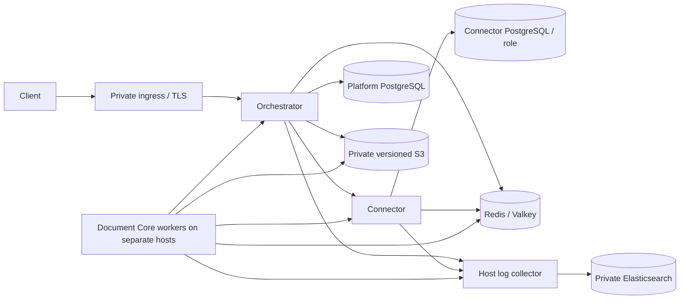

# Deployment architecture proposal (P8-06 / OPS-08)

Status: architecture and operator tooling only. This is not production deployment evidence; P8-06 remains open. Do not use the legacy root DUGate compose for the `du-rework` services or perform a production cutover from this document.

## Target topology



- Keep the Orchestrator and Connector in separate containers and use distinct database names/roles and service credentials. Workers run on a separate host group and receive no database credentials.
- Publish only the Orchestrator through a private ingress with TLS. Keep Connector, PostgreSQL, Redis/Valkey, S3, and Elasticsearch private. The mock provider belongs to test profiles only.
- Private, versioned S3 is the durable source for artifact bytes and checkpoints. PostgreSQL stores metadata and ownership; Redis stores queue/control state. Redacted JSON logs go to stdout and a host collector with a bounded disk buffer, then to private Elasticsearch over verified TLS.
- Use immutable image digests and environment-scoped secret references. Do not put `.env`, customer files, or credentials in image layers. A Compose pilot must bind the Orchestrator only to the host/private ingress and must not publish Connector, PostgreSQL, or Redis ports.

RDS and ElastiCache are independent backend options. A self-managed PostgreSQL/Redis pilot is also possible, with encrypted storage and tested backup/recovery. Choose one option for the smoke rehearsal and record its TLS, IAM/security group, persistence, and failover settings; architecture text alone is not evidence. Current applications accept a single `REDIS_URL`; native Redis Sentinel discovery/quorum options are not wired through Orchestrator, Connector, or Worker SDK. If the selected target uses Sentinel, treat client configuration and multi-service failover rehearsal as a blocker. A managed service's stable failover endpoint is a separate topology and still needs provider-side failover evidence.

## Compose and packaging boundary

`infra/docker-compose.yml` is an isolated test fixture for PostgreSQL and Redis only. It hardcodes a test password, publishes ports 5433/6380, and has fixed container names. Keep it out of production profiles. The root `docker-compose.yml` belongs to the legacy DUGate application and includes mock-service, default seed credentials, and boot-time schema push; it is not a `du-rework` deployment.

There is not yet a production Compose file for this topology. Orchestrator now has `src/main.ts`, `npm start` (`node dist/main.js`), and a SIGTERM/SIGINT shutdown owner; production image packaging, private deployment wiring, and process/health rehearsal remain unverified. The current Connector image starts through its service entrypoint and performs database migrations during service startup. Worker and Connector images exist, but a complete immutable image set and cross-host deployment proof do not.

Build an eventual production Compose/host deployment from immutable Orchestrator, Connector, and worker images. Keep PostgreSQL, Redis/Valkey, S3, and Elasticsearch as explicitly configured private endpoints; do not add production mock services or publish stateful-service ports. Keep the separate-host worker deployment in its own host/Compose unit rather than relying on Docker Compose to span hosts.

## Startup, health, and shutdown contract

1. Provision private network paths, secrets, storage, log collector, and database backups before application rollout.
2. Take a database recovery point. Run exactly one explicit migration owner per database, then run read-only schema verification before serving traffic. Orchestrator has `migrate`, `status`, and `verify` CLI commands. Connector currently migrates on each process start and has no separate one-shot command; this must be resolved before claiming serialized migrations or safely scaling Connector replicas.
3. Start Connector and Orchestrator, wait for readiness, then start workers. Keep worker hosts unable to connect to either database. Validate worker heartbeat/version registration before admitting jobs.
4. Use `/health` or `/api/v1/health` on Orchestrator as dependency readiness (PostgreSQL + Redis). Connector `/health/live` is process liveness and `/health/ready` checks PostgreSQL + Redis. Worker readiness is its runtime registration/heartbeat; it has no HTTP health endpoint. A health check should not restart all replicas solely because a provider is unavailable.
5. On termination, stop ingress/admission first. Allow Orchestrator's active-lease drain (default 30 seconds), Connector's request/outbox drain (default 30 seconds), and Document Core's worker stop (default 15 seconds) to complete before the container kill deadline. Set Orchestrator `SHUTDOWN_BUDGET_MS` and container stop grace explicitly; verify the process signal/drain behavior before rollout. The Orchestrator health route is dependency readiness, not independent liveness, and it does not probe S3.

The Connector currently requires service-identity authorization on non-health routes, while the Document Core connector invoker sends neither Authorization nor an identity token. Treat worker-to-Connector invocation as a release blocker until the service contract is reconciled and an integration run proves it.

## Migration and rollback policy

- Keep migrations out of web process startup. Use a one-shot migration job, capture its image digest and exit result, then run read-only verification before opening ingress.
- Use expand/contract migrations and deploy backward-compatible code before destructive schema changes. No down-migration or destructive rollback is assumed; roll back to a compatible image/profile and retain the forward-compatible schema.
- Keep Orchestrator and Connector databases/roles distinct. Connector needs a dedicated one-shot migration mode or another serialized owner before multi-replica production rollout.

## Backup, restore, and rehearsal

`scripts/backup-postgres.sh` writes one PostgreSQL custom-format dump and a SHA-256 sidecar with restrictive default file permissions. `scripts/restore-postgres.sh` requires an explicitly named `du_restore_*` target, matching typed confirmation, and a matching checksum; it restores transactionally and does not drop objects. Both use a protected libpq service file (`PGSERVICEFILE`) so the password is not placed in process arguments. Run each against the Platform and Connector database independently.

Example operator invocations (use a protected service file and an isolated restore database):

```sh
PGSERVICEFILE=/etc/du/pg_service.conf \
PGSERVICE=platform \
BACKUP_DIR=/mnt/du-encrypted-backups \
bash scripts/backup-postgres.sh

PGSERVICEFILE=/etc/du/pg_service.conf \
RESTORE_PGSERVICE=platform_restore \
RESTORE_EXPECTED_DATABASE=du_restore_platform_20260924 \
CONFIRM_RESTORE_DATABASE=du_restore_platform_20260924 \
BACKUP_FILE=/mnt/du-encrypted-backups/postgres-20260924T120000Z.dump \
bash scripts/restore-postgres.sh
```

The dump is database-only. Store it on an approved encrypted backup mount and copy it to a separate protected failure domain. PostgreSQL and S3 storage facades are implemented, but production bucket configuration, object version retention, and a matching restore rehearsal are not yet verified; artifact-object backup/versioning must cover the same recovery window. These scripts alone do not constitute application-consistent recovery. Redis persistence is useful for queue recovery but is not the source of task/business truth; Sentinel, if selected, is an external topology until client support and failover are proven. After restore, reconcile operations, leases, invocation outcomes, usage/outbox, and object references before re-enabling dispatch. Do not replay provider work blindly.

OPS-08 evidence still requires a restore rehearsal against an isolated target: record source image/schema revision, backup age and checksum, recovery point, object recovery, migration verification, restored counts/reference checks, synthetic operation, measured RPO/RTO, and an operator-approved recovery decision. The proposed RPO ≤5 minutes and RTO ≤60 minutes in the operations architecture remain targets, not measured commitments.

## Release blockers before production Compose can be accepted

- Build and pin the production Orchestrator image/Compose or host unit around `dist/main.js`; verify validated runtime configuration, signal handling, readiness/liveness wiring, drain deadlines, and secret injection.
- Reconcile Connector service identity with worker SDK calls and prove the authorized invocation path.
- Move Connector schema application behind a single explicit migration owner and read-only boot verification.
- Verify private versioned S3 artifact configuration, IAM/KMS access, matching PostgreSQL/S3 backup recovery, and Elasticsearch collector/log delivery required by the deployment plan.
- Build and pin the full service image set, then run multi-container health, migration, shutdown, backup/restore, and recovery rehearsals on the selected backend topology.
