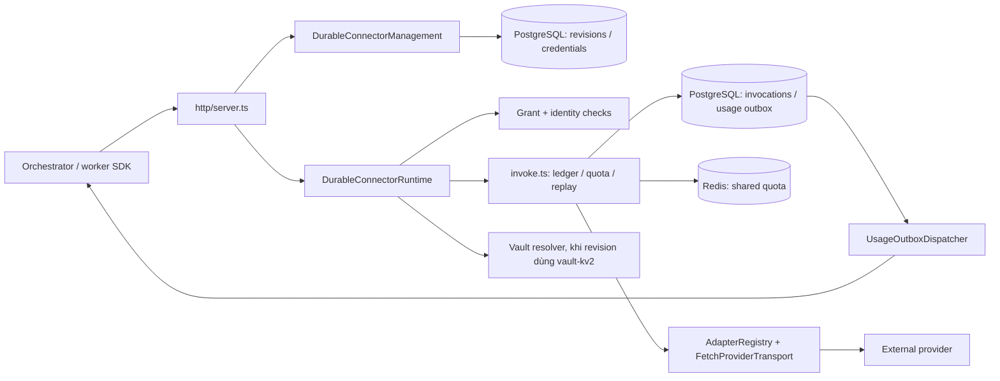

# Sơ đồ cấu trúc code: Connector

> Phạm vi: `du-rework/services/connector`, đối chiếu mã nguồn ngày 2026-10-02. Đây là bản đồ **code hiện có**, không phải chứng nhận mức sẵn sàng triển khai. `dist/`, `node_modules/` và log sinh ra khi chạy không thuộc cây nguồn.

## Vai trò và ranh giới

Connector là cổng gọi provider. Orchestrator cấp invocation grant và quản lý cấu hình connector qua HTTP; Connector tự xác thực service identity và grant, lấy revision/credential, giữ ledger invocation trong PostgreSQL, kiểm soát quota bằng Redis, gọi provider qua adapter, rồi lưu và chuyển usage event. Không có business workflow hay hàng đợi BullMQ trong service này.



`entrypoint.ts` đọc môi trường và tạo các bộ xác thực/khóa. `composition.ts` nối PostgreSQL, Redis, HTTP server, runtime, management và lifecycle; đây là composition root. `lifecycle.ts` sở hữu start, readiness, ngừng nhận request và drain khi shutdown. `index.ts` chỉ xuất public API của package.

## Cây thư mục nguồn

```text
connector/
├── src/
│   ├── entrypoint.ts                 # tiến trình chạy độc lập, env và signal
│   ├── composition.ts                # lắp dependency và start/shutdown
│   ├── lifecycle.ts                  # vòng đời HTTP và usage dispatcher
│   ├── index.ts                      # package exports
│   ├── services.ts                   # management, runtime, mã hóa credential
│   ├── invoke.ts                     # state/replay/poll của provider invocation
│   ├── ledger.ts                     # giao diện ledger invocation
│   ├── quota.ts, quota-redis.ts       # giao diện và Redis quota
│   ├── redis-client.ts               # Redis client adapter
│   ├── usage.ts, usage-dispatcher.ts  # usage record và outbox delivery
│   ├── grants.ts, contract-grants.ts  # kiểm tra grant và contract grant
│   ├── identity.ts                   # service identity
│   ├── contracts.ts                  # chuyển đổi request/response wire
│   ├── config.ts                     # cấu hình/revision và redaction
│   ├── artifact-content.ts           # nội dung artifact trong request
│   ├── webhook.ts                    # xử lý webhook/callback provider
│   ├── hash.ts                       # hash đầu vào cho idempotency
│   ├── errors.ts, types.ts           # lỗi và kiểu miền
│   ├── adapters/
│   │   ├── registry.ts              # đăng ký JSON và multipart adapter
│   │   ├── http.ts, mapping.ts       # tạo request, ánh xạ response
│   │   └── transport.ts, pinned-fetch.ts # fetch có giới hạn và kiểm soát mạng
│   ├── db/
│   │   ├── pg-client.ts, sql.ts       # kết nối SQL và trợ giúp truy vấn
│   │   ├── repository.ts             # revisions, credentials, invocation ledger
│   │   ├── usage-outbox.ts           # usage events chờ gửi
│   │   └── migrations/001..008*.sql # schema connector và tiến hóa revision
│   ├── http/server.ts                # route HTTP và body bounds
│   └── vault/
│       ├── resolver.ts               # resolve credential source từ Vault
│       └── token-renewal.ts          # duy trì token Vault
├── tests/                            # unit, boundary, functional, integration
│   └── mock-provider/                # provider giả cho kiểm thử
├── docs/                             # ADR async polling và protocol matrix
├── Dockerfile, docker-compose.yml, entrypoint.sh
├── jest.config.cjs, jest.unit.config.cjs, tsconfig.json
├── package.json
└── README.md
```

## Thành phần và đường đi chính

| Thành phần | Trách nhiệm trong code | Phụ thuộc chính |
|---|---|---|
| `http/server.ts` | Route `/health/*`, `/capabilities`, `/connectors*`, `/invocations*`; xác thực service identity, giới hạn body, đổi lỗi sang HTTP. | `services.ts`, `identity.ts`, `contracts.ts` |
| `services.ts` | `DurableConnectorManagement` quản lý revision/credential; `DurableConnectorRuntime` xác thực grant và binding, chọn revision/adapter, gọi invocation; `AesCredentialCipher` mã hóa credential lưu DB. | repository, grants, Vault, adapter, `invoke.ts` |
| `invoke.ts` | Claim idempotent, quản lý trạng thái và poll bất đồng bộ, quota lease, retry/replay và deadline. | invocation ledger, quota, provider transport |
| `adapters/` | Adapter JSON/multipart tạo request và chuẩn hóa kết quả; transport dùng fetch có giới hạn response và chính sách host/network. | provider HTTP bên ngoài |
| `db/` | Lưu revision, credential, invocation ledger và usage outbox; migration SQL nằm cạnh adapter DB. | PostgreSQL |
| `quota-redis.ts` | Quota dùng chung giữa các instance Connector. | Redis |
| `usage-dispatcher.ts` | Đọc outbox bền vững và POST usage event sang sink được cấu hình, có retry. | PostgreSQL, Orchestrator usage endpoint |
| `vault/` | Phân giải credential source `vault-kv2` và gia hạn token; chỉ được sử dụng khi runtime được cấp resolver. | Vault |

Luồng invocation: `POST /invocations` → kiểm tra service identity và signed grant → lấy revision/credential theo binding → `invokeAdapter` claim ledger và quota → adapter gọi provider → ghi kết quả/usage outbox → dispatcher gửi usage. Các trạng thái mơ hồ hoặc đang poll được giữ trong ledger để lần gọi lại không tự ý phát thêm provider request.

## Nhận xét cấu trúc

- Ranh giới HTTP, orchestration và persistence nhìn thấy rõ qua `http/`, `services.ts`, `invoke.ts`, `db/` và `adapters/`. Dependency được lắp tập trung ở `composition.ts`, thuận tiện thay bằng stub trong test.
- `services.ts` và `http/server.ts` đang chứa nhiều nhánh management/runtime và route trong cùng file; khi mở rộng, đây là hai điểm cần theo dõi về kích thước và khả năng review.
- Revision dùng Vault cần `SecretResolver`; `composition.ts` hiện tạo `DurableConnectorRuntime` mà không truyền resolver. Vì vậy cấu hình standalone hiện không thể thực hiện invocation cho revision `vault-kv2` (runtime sẽ từ chối theo nhánh fail-closed trong `services.ts`). Đây là giới hạn wiring cần kiểm tra khi hoàn thiện Vault deployment.
- `tests/` chứa cả test offline và test cần PostgreSQL/Redis; xem `README.md` để chạy đúng điều kiện môi trường. Tài liệu này chỉ rà soát tĩnh, không chạy test dịch vụ.

## Liên kết liên service

Connector dùng `@du/contracts`, `@du/egress`, `@du/observability`; nhận grant/cấu hình từ Orchestrator và gửi usage qua `USAGE_SINK_URL`. Contract và worker SDK nằm ở `du-rework/packages/`, ngoài phạm vi cây nguồn Connector.
