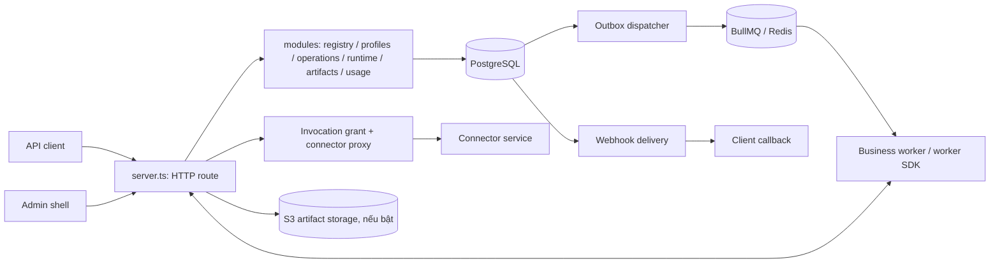

# Sơ đồ cấu trúc code: Orchestrator

> Phạm vi: `du-rework/services/orchestrator`, đối chiếu mã nguồn ngày 2026-10-02. Bản đồ này mô tả code hiện có; trạng thái kiểm thử và release xem task board của `du-rework`. Bỏ qua `dist/`, `.cache/`, `node_modules/` và log sinh ra khi chạy.

## Vai trò và ranh giới

Orchestrator là API và bộ điều phối bền vững của nền tảng. Nó nhận public/admin/runtime API, lưu operation/task/manifest/artifact trong PostgreSQL, phát task từ outbox sang BullMQ/Redis, cấp lease và grant cho worker, theo dõi usage, webhook và audit. Worker thực thi business workflow nằm ở `businesses/*`; Connector gọi provider là service riêng. `@du/contracts` và `@du/worker-sdk` là package dùng chung, không nằm trong cây nguồn này.



`main.ts` là entrypoint production: đọc env, chuẩn bị OIDC/encryption, gọi `createApp` và gắn shutdown. `server.ts` là composition root **và** HTTP route table: dựng DB, Redis, S3, service modules, background sweeps, admin shell và các nhóm route. `index.ts` xuất API package; các CLI migration/logging là entrypoint riêng.

## Cây thư mục nguồn

```text
orchestrator/
├── src/
│   ├── main.ts, shutdown.ts             # boot tiến trình và graceful shutdown
│   ├── server.ts                       # createApp, dependency wiring, HTTP routes
│   ├── index.ts                        # package exports
│   ├── migrate-cli.ts                  # migration runner
│   ├── migrations-local-users-cli.ts   # quản trị local admin user
│   ├── storage-migration-cli.ts        # chuyển artifact blob sang storage mới
│   ├── log-collector.ts                # thu thập log
│   ├── http/
│   │   ├── ingress.ts                  # đọc body có giới hạn, JSON/binary
│   │   └── errors.ts                   # lỗi HTTP và problem response
│   ├── db/
│   │   ├── db.ts                       # PostgreSQL pool/transaction
│   │   └── migrations.ts               # apply/verify migration
│   ├── app/admin/
│   │   ├── shell-server.ts, shell-router.ts, shell-render.ts
│   │   ├── shell-auth.ts, oidc-flow.ts, oidc-boot.ts
│   │   ├── *-section-data.ts           # nạp dữ liệu cho từng màn hình
│   │   ├── *-section-renderer.ts       # HTML/render từng màn hình
│   │   ├── *-view-models.ts            # biến đổi dữ liệu hiển thị
│   │   ├── crypto-config-*.ts          # cấu hình mã hóa trong admin
│   │   └── index.ts, types.ts, view-models.ts, shell-types.ts
│   ├── compat/
│   │   ├── legacy-http-mount.ts, legacy-host-adapter.ts
│   │   ├── legacy-action-router.ts, legacy-operations.ts
│   │   ├── legacy-wire-decoders.ts, legacy-input-decoders.ts
│   │   ├── legacy-form-bridge.ts, legacy-multipart.ts
│   │   ├── legacy-envelope.ts, legacy-operation-serializers.ts
│   │   └── legacy-headers.ts, legacy-public-artifact.ts
│   └── modules/
│       ├── admin-actions/              # dispatcher và RBAC của mutation admin
│       ├── artifacts/                  # artifact, multipart, storage, integrity
│       ├── audit/                      # audit ledger
│       ├── auth/                       # OIDC, session, local admin auth
│       │   ├── admin-local/            # credential reader/repository/password
│       │   └── local-primitives/       # login guard, authenticate, session
│       ├── connector-credentials/      # Vault rotation workflow + HTTP store
│       ├── connectors/                 # proxy quản lý Connector
│       ├── encryption/                 # key provider, metadata/artifact crypto
│       ├── grants/                     # invocation grant cho Connector
│       ├── idempotency/                # key/hash/replay cho mutation
│       ├── lifecycle/                  # operation lifecycle/deadline
│       ├── operations/                 # submit, view, ingestion gate/consumer
│       ├── profiles/                   # profile binding/config
│       ├── public-api/                 # delivery crypto, upload gateway
│       ├── queue/                      # transactional outbox → BullMQ
│       ├── registry/                   # business/version registry
│       ├── runtime/                    # claim, lease, checkpoint, worker identity
│       ├── usage/                      # usage event, budget, reservation
│       └── webhooks/                   # webhook outbox delivery
├── migrations/                        # 0001..0024 SQL schema evolution
├── tests/                             # unit, offline functional, DB/Redis/live
│   ├── fixtures/                      # golden data và fixtures
│   └── stubs/                         # test doubles
├── Dockerfile, docker-compose.yml
├── jest.config.cjs, jest.unit.config.cjs
├── tsconfig.json, tsconfig.pg-tests.json, tsconfig.live-tests.json
├── package.json
└── README.md
```

## Thành phần và trách nhiệm

| Nhóm code | Trách nhiệm và dữ liệu đi qua |
|---|---|
| `server.ts`, `http/` | Nhận request; route `/api/v1/*`, `/api/runtime/v1/*`, `/api/v1/admin/*`, `/health`; kiểm tra ingress, auth, lỗi và trả wire response. `createApp` lắp các dependency và timer. |
| `app/admin/` | Admin shell render phía server. Mỗi section có data fetcher, view model và renderer; shell xử lý router, cookie và OIDC flow. |
| `compat/` | Chuyển đổi legacy `/api/v1/docs/{action}` và các wire shape liên quan vào service canonical qua host adapter; parse multipart, decode input, serialize legacy response. |
| `db/`, `migrations/` | Kết nối/transaction PostgreSQL và tiến hóa schema; boot mặc định verify migration, CLI áp dụng migration. |
| `modules/registry`, `profiles`, `operations` | Đăng ký business/version, chọn profile, nhận submission, giữ trạng thái operation và xử lý ingestion source. |
| `modules/queue`, `runtime` | Outbox phát task sang BullMQ; worker claim/heartbeat/checkpoint/complete/fail với lease và worker identity; recovery/queue integrity sweep. |
| `modules/artifacts`, `public-api`, `encryption` | Blob PostgreSQL hoặc S3, multipart/upload, pin/verify, download và các đường mã hóa artifact/metadata. |
| `modules/grants`, `connectors`, `connector-credentials` | Cấp invocation grant; proxy quản lý Connector; workflow ghi credential Vault rồi tạo/activate revision. |
| `modules/usage` | Nhận usage event từ Connector, tính tổng và đánh giá budget/reservation. |
| `modules/auth`, `admin-actions`, `audit`, `idempotency` | Session/OIDC/local auth, RBAC cho mutation admin, audit bền vững và replay an toàn. |
| `modules/lifecycle`, `webhooks` | Chuyển trạng thái/deadline operation và gửi callback từ hàng đợi bền vững. |

Luồng submission chính: public API → `operations/submission.ts` → PostgreSQL operation/task/outbox → `queue/dispatcher.ts` → BullMQ → worker SDK gọi runtime claim/checkpoint/complete → result/artifact được đọc qua public API. Khi nguồn cần ingest, `operations/ingestion-consumer.ts` xử lý gate trước khi dispatcher phát business task. Connector usage đi vào route runtime riêng, sau đó `usage/usage.ts` lưu và tổng hợp.

## Nhận xét cấu trúc

- Các module nghiệp vụ được tách theo domain và thường nhận `Db` hoặc port từ `createApp`, tạo điểm kiểm thử độc lập. `app/admin/` và `compat/` cũng có ranh giới riêng cho UI và legacy wire.
- `server.ts` hiện khoảng 4.100 dòng, vừa tạo dependency vừa chứa route table. Đây là điểm tập trung lớn nhất và có nhiều nhóm API cùng sửa; cần chú ý va chạm khi thay đổi route, auth hoặc startup.
- `app/admin/` dùng renderer HTML và data fetcher trong cùng service; đây là server-rendered admin shell, không phải frontend Next.js độc lập.
- `migrations/` nằm ở gốc service, còn `src/db/` chứa runner; khi xem schema phải đọc cả hai. Test nằm tại `tests/`, gồm nhiều loại môi trường; tài liệu này chỉ rà soát tĩnh, chưa chạy suite.
- Các tích hợp ngoài process là PostgreSQL, Redis/BullMQ, S3 (theo cấu hình), Connector HTTP, Vault và webhook receiver. `main.ts` chỉ bật một số khả năng khi env/credential tương ứng được cung cấp; không nên suy ra tất cả nhánh đều hoạt động trong mọi deployment.
