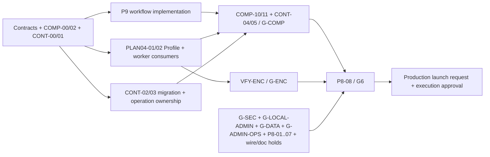

# Bổ sung plan sau review DU rework — 2026-10-04

> **Đợt cuối sau completion — 2026-10-05:** [Shared packages redistribution, RPK-00..21](SHARED-PACKAGES-REDISTRIBUTION-2026-10-05.md) chỉ triển khai sau required scope hiện tại ACCEPTED/P8-08/G6 và closure receipt RPK-00. Không đổi paths/contracts/build/skills hoặc dependency của packet đang chạy; không dùng refactor này để chặn completion hiện tại. Đây là backlog DEFERRED cho contracts authority Orchestrator và worker source/build độc lập, không gate hoặc dispatch mới cho release hiện tại.

> **Bổ sung theo yêu cầu đối chiếu Admin ở root:** [CFGADM-00..11](ADMIN-LEGACY-CONFIG-PARITY-2026-10-04.md) chốt mapping 17 settings và chức năng quản trị legacy required; config phải có UI save/test/apply/runtime-use/rollback thật. CONT-01 phải import/map các defaults, storage generation, user grants và schema/mapping revisions trong bổ sung đó; CONT-04 rehearsal cả hành trình Admin, không chỉ public submit. PLAN04-01/02 vẫn là prerequisite no-secret snapshot/consumer; không mở dispatch hoặc tick gate từ tài liệu.

**Trạng thái acceptance của parent: SPECIFIED, chưa nghiệm thu; snapshot Wave 1 lúc 18:07 theo topology giữ lịch sử.** Người dùng yêu cầu cập nhật plan sau review năm finding: snapshot lộ secret Profile, thiếu worker consumer, live evidence vượt phạm vi, thiếu continuity khi cutover và dependency P9 ngược. Tài liệu này bổ sung acceptance cho các parent hiện có; không tạo release gate mới. Hai tick P763 tại §17 chỉ áp dụng offline leg theo A4, không cho phép truy cập production/chuyển traffic. CFGADM/P730 là sub-packets; coordinator đã dispatch 5/6 P730 prep/slice, không tự dispatch từ việc sửa plan. Current status và dependencies xem §19 update805b; snapshot proposal §7 và refresh §§8–18 giữ lịch sử.

Đây là nguồn chung cho các bổ sung bên dưới. [Roadmap](README.md), [Profile field-level](ORCHESTRATOR-CONFIG-PROFILE-CONNECTOR-DETAIL-2026-10-02.md), [AWEB](ADMIN-WEB-DELIVERY-2026-10-04.md), [COMP](API-COMPAT-DUGATE-2026-09-28.md), [VFY](DETAILED-BUSINESS-VERIFICATION-2026-10-01.md) và [P8](P8-release-readiness.md) tham chiếu cùng task/evidence, không nhân đôi acceptance. Plan Profile cá nhân `C:/Users/Gem/.claude/plans/typed-discovering-wall.md` là nguồn task `T-*`; các bổ sung cần thiết được lưu ở đây để worker không phụ thuộc file ngoài repo.

## 1. Task, owner và dependency

Owner trong bảng là vai trò đề xuất. Command Code coordinator duy nhất cấp packet/lease và kiểm tra active ledger; Qwen/Codex implement; Codex Tester độc lập verify; Claude Code chỉ review/plan theo directive hiện hành; Antigravity review UI theo build. [Topology](../coordination/COORDINATION-TOPOLOGY.md) đã được phê duyệt redistribution 17:58 và dispatch Wave 1 lúc 18:07; bổ sung plan không mở hold riêng W1b/W1c/W3 hoặc tự cấp lease. [Checkpoint 730](../coordination/reports/plan-review-730-2026-10-04.md) là đề xuất packet năm chu kỳ tiếp theo.

| ID / trạng thái | Parent; owner | Dependency và phạm vi ghi dự kiến | Đầu ra / điều kiện đóng |
|---|---|---|---|
| PLAN04-01 `[ ]` | ORCH-PAR-12, ACUI-04, ENC-META-01, T-SUB-02; Orchestrator profile/admission + contracts owner | Freeze DTO trước; `modules/profiles/**`, `modules/operations/submission.ts`, runtime claim, `packages/contracts/src/runtime.ts`; migration qua lease riêng nếu cần | Snapshot bền vững và claim không chứa raw Profile credential; sentinel negatives, xử lý dữ liệu đã ghi và review security theo mục 2. |
| PLAN04-02 `[ ]` | ORCH-PAR-12/13, T-PROM-02, T-SUB-03/04, P4/P5; SDK + document-core + acquisition owners | Sau contract PLAN04-01; `packages/worker-sdk/src/{worker,task-context,types}.ts`, document-core pipeline/worker modules, Orchestrator source acquisition; Connector chỉ qua packet riêng nếu đổi wire | Producer → claim → SDK context → business → Connector/acquisition thực sự dùng policy đã pin; không chỉ field tồn tại trong DTO; ma trận mục 3 pass. |
| PLAN04-03 `[ ]` | LIV-11, ENC-INT-01, SEC-INT-01, ACUI-10, P8-08; evidence/docs owner + Tester live/browser | Có build digest và namespace cô lập; chỉ test/harness/receipt và evidence mapping, sửa sản phẩm qua owner riêng | Đối soát từng acceptance với raw evidence; receipt đỏ mới hơn giữ hold; thêm test thật ở mục 4, Reviewer APPROVED trước acceptance. |
| PLAN04-04 `[ ]` | COMP-00/10/11, ORCH-PAR-00, P9-05, P8-06/08; migration/API architect + Qwen/Codex migration owner | CONT-00..05 ở mục 5; dry-run trên export/fixture được cấp quyền, không dùng DB legacy chung | Client identity/config/operation continuity, rehearsal và rollback có receipt; gate mapping mục 5, không tự chuyển traffic. |
| PLAN04-05 `[ ]` | tasks index, P9, ARCH-DOC-01, P8-08; docs/contracts owner | Tài liệu roadmap/compatibility/evidence | Graph và release scope nhất quán P9 → G-COMP → G6; link/task IDs không trùng; document validation. Chỉnh tài liệu không chứng minh G6. |

## 2. Secret Profile và snapshot

**Expected:** `fileUrlAuthConfig` và Profile secret ghi AES-256-GCM trong DB; plaintext chỉ có trong memory của acquisition path được cấp quyền. Credential Connector/provider tiếp tục dùng Vault. Không đưa raw secret vào operation/task/outbox/checkpoint, claim, Admin/public DTO, URL/log hoặc queue payload.

**Source mismatch khi review:** `profiles.ts` giải mã trong `decodePolicy`, `submission.ts` dùng `JSON.stringify(profile.policy)` để ghi `operations.profile_policy_snapshot`, runtime contract cho phép raw `fileUrlAuthConfig`. Owner đọc lại symbol trên build nhận packet; vị trí dòng lịch sử không là acceptance.

- T-SUB-02 dùng DTO snapshot chuyên biệt đã runtime-validate, không serialize nguyên `EffectiveProfilePolicy`. Snapshot lưu non-secret effective policy và ref bất biến `(tenantId, profileId, profileRevision)` tới credential mã hóa của revision đã pin; DTO chỉ có trạng thái configured cần thiết cho UI, không có token/header/query secret. Giữ format DB `iv:tag:ciphertext` đã chốt; không thay bằng raw JSON hay yêu cầu chuyển Profile key sang Vault.
- Acquisition service resolve ref theo tenant và operation đã xác thực, đọc đúng revision, giải mã sát lúc fetch bằng egress guard hiện hữu. Worker không nhận raw credential qua claim. Nếu acquisition hiện ở worker, thêm mediated acquisition contract/owner trước integration; không đưa secret vào TaskContext để lấp gap.
- Ref thiếu/sai tenant, ciphertext hỏng, sai key hoặc key không sẵn sàng phải fail closed trước network; khác biệt giữa "không cấu hình auth" và "auth cấu hình nhưng decrypt lỗi" phải typed rõ. Legacy plaintext read chỉ dành cho import/migration có giới hạn và được ghi nhận; không trở thành mặc định production.
- Giữ credential revision cũ cho operation/HITL/retry còn dùng; định nghĩa retention cùng artifact/operation retention. Backup/restore phải khôi phục ciphertext và key material/version cần thiết qua kênh secret được phép, có negative wrong-key test; không xuất key vào report.
- Inventory snapshot đã có plaintext bằng công cụ không in secret. Packet sửa phải có dry-run/count, idempotent rewrite sang ref đúng revision, rollback và receipt scan; giữ input/connector pin có cùng ý nghĩa. Không xóa/mutate lịch sử để làm test xanh.

**Acceptance PLAN04-01:** sentinel trong token/header/query không xuất hiện ở profile read, operation snapshot, tasks/outbox/queue, claim response, checkpoints và logs; source acquisition tới mock host được allowlist dùng đúng credential trong memory; wrong-tenant/key/tag fail trước fetch. Chạy live PostgreSQL và production-equivalent boot, không chỉ pure encrypt/decrypt test. Parent còn mở tới independent verify + review.

## 3. Worker và policy consumer đầy đủ

- T-PROF-03 publish/rollback/CAS là dependency explicit của T-PROF-05/T-SUB trước khi pin active revision; không bỏ qua task này trong Phase 2. T-AUD-01 là phần của transaction mutation ngay khi ship API, không hoãn tới phase test cuối. Audit actor phải là principal ID thật kèm role/tenant, không chỉ `shell:<role>`.
- T-PROM-02 resolve key-4 một lần khi admission, pin prompt nội dung/revision và connection/step mapping đã được validate trong snapshot được bảo vệ theo ENC-META policy. Prompt có nội dung nhạy cảm phải được mã hóa ở bền vững; không nhét vào outbox/queue. CRUD repository chưa là implementation của consumer.
- PLAN04-02 mở rộng typed SDK context từ claim, gồm non-secret policy/prompt snapshot và connection step mapping; runtime-validate trước handler. Document-core dùng mapping đó khi thực hiện step/invoke, giữ semantics `captureSession/injectSession`, precedence Code > Profile > Connector default và `_default` fallback. Không tự merge policy lần hai hoặc query live profile.
- `allowedFileExtensions` giữ CSV semantics đã chốt; enforce upload, sourceUrl/file_urls acquisition và Test Endpoint. Không bỏ sót top-level `sourceUrl`; không dựa duy nhất filename client, kiểm source metadata theo file policy hiện hành. Priority 20/10/1 vào BullMQ ở enqueue/retry/child path cần theo contract frozen, không tự áp một weight mới.
- Child task, retry/restart và HITL resume giữ pin của operation gốc; revoke/outage xử lý theo security policy đã freeze. `connectionsOverride` phải chuyển từ slug/step sang revisioned binding đã được validate trước khi worker gọi Connector.

**Acceptance PLAN04-02:** dùng mock provider quan sát request để kiểm từng key/step, prompt precedence/fallback, capture/inject session, deny invalid/missing binding, extension trên đủ ba path. Submit dưới revision A, publish/rollback B, rồi chạy/restart/resume parent+child: invocation vẫn dùng snapshot A; operation mới dùng active revision. Kiểm decrypt outage fail trước upstream, replay không tạo row mới và no-secret sinks của PLAN04-01. VFY-REG phủ SDK/document-core; VFY-COMP kiểm canonical + legacy cùng admission seam.

## 4. Đối soát và bổ sung live evidence

Các report `live-test-minio-vault-browser-receipt-2026-10-03.md` và bản tóm tắt ngày 04 là lịch sử chạy test; đề xuất GO trong đó chưa đủ đóng gate. `liv05b-vault-scope-2026-10-04.md` ghi Transit deny với service identities. Test `vault-live.test.ts` hiện dùng cùng token cho encrypt/decrypt/rewrap; test browser hiện mở trang, còn E2E inline-text bật migration window. Không suy ra machine-identity separation, CRUD journey hoặc toàn bộ encryption chain từ các pass này.

| Gate / parent | Evidence cần bổ sung | Hold không được bỏ qua |
|---|---|---|
| G-SEC / LIV-05, SEC-INT-01 | Orchestrator writer + Connector reader theo identity/policy triển khai thật; KV CAS conflict/version pin, tenant/account negatives, rotate/revoke/reconcile; OIDC/local tests theo SEC/LOCAL | Transit encrypt/decrypt quyền đúng role, negative chéo role; root-token pass không thay machine auth. Fix policy qua owner rồi test lại; không mở quyền wildcard để lấy pass. |
| G-ENC / LIV-06, ENC-INT-01 | Upload file → encrypted S3 → actual worker/Connector → encrypted output → result/download; S3 byte sentinel/tag/manifest, DB sinks, recipient decrypt, key rotation/outage/tamper | Acceptance run đặt `ARTIFACT_STORAGE_MIGRATION_WINDOW=false`; unsealed output phải bị chặn. Inline-text smoke không thay file input/provider/output test hoặc recipient delivery. |
| G-ADMIN-OPS / LIV-08..10, ACUI-10 | local/oidc/both theo mode đã chọn; issue/copy-once/reload/rotate/revoke; credential save/test + Vault side effect; operation detail/cancel/resume/download + audit; 2 tenant, role/CSRF/CAS negatives | Chạy đúng route/build React khi cutover AWEB; screenshot/breadcrumb/token login không thay mutation, local/OIDC hay UI_APPROVED. |
| G-DATA / DATA, P8-06/07 | Version pin/delete/multipart/retention/migration/restore và log collector → Elasticsearch theo parent scope; outage/limits | S3 5/5 không chứng minh logging, deployment hoặc backup restore. Mock xanh không thay live acceptance tương ứng. |

Receipt reconciliation có từng task/test ID, expected invariant, producer/consumer, fixture version, commit + working-tree/build digest (HEAD đơn lẻ không đủ khi cây dirty), command/cwd/env/namespace, passed/failed/skipped, exit/raw path, independent verifier và reviewer verdict. Các kết quả mới hơn/mâu thuẫn phải dẫn tới finding + owner + rerun cần thiết; không cộng rerun thành coverage. Test không phát hiện suite hoặc tất cả skipped không đạt acceptance.

LIV-11 chỉ tổng hợp contribution/remaining holds theo bảng này và parent requirements. PLAN04-03 không tự đánh dấu GO, VERIFIED hoặc ACCEPTED cho product; còn HIGH/MEDIUM chưa đóng thì giữ acceptance/release hold theo AGENTS.md.

## 5. Continuity của client trước cutover

Continuity là acceptance bổ sung của COMP/PAR/P9/P8 hiện có. Viết tool và rehearsal trên fixture/export được cấp quyền nằm trong scope plan; thao tác export/import production, đổi DNS/traffic hoặc chạy cleanup production là bước thực thi riêng. Không dùng database/migration của legacy trực tiếp cho rework và không copy `.env`, DB dump hay private document corpus vào repo.

| ID / trạng thái | Owner; dependency | Deliverable / acceptance |
|---|---|---|
| CONT-00 `[ ]` | Product/API architect/security + consumer owner; COMP-00, ORCH-PAR-00 | Register consumer hiện dùng: key/hash/prefix/status, tenant/grants/assignment, profile/prompt/connection/schemaSlug, polling IDs/cursors/download/webhook/billing, operations/HITL/UNKNOWN còn sống. Chọn mapping và coexistence/rollback policy cho từng row; missing consumer info giữ blocker, không tự retire. |
| CONT-01 `[ ]` | Migration/contracts + auth/profile owners; CONT-00 | Versioned export/import schema, mapping ID/tenant/revision và manifest digests, integrity validation; import/map AI/prompt defaults, storage generations, user grants và workflow schema/mapping revisions theo CFGADM; bảo toàn API-key hash tương thích để raw key hiện hữu tiếp tục xác thực (không cần đọc/ghi lại raw key). Secret được re-encrypt hoặc chuyển reference qua kênh được cấp quyền, không log; incompatible hash/provider/identity phải có approved migration path. |
| CONT-02 `[ ]` | Migration Qwen/Codex + namespace owner; CONT-01 | Tool dry-run và idempotent import key/profile/prompt/connection/schema/assignment theo dependency; FK/unmapped/collision fail-closed, report chỉ counts/IDs an toàn. Repeat không nhân đôi revision/key/binding hoặc thay policy vô ý; counts + referential/semantic reconciliation pass. |
| CONT-03 `[ ]` | Runtime/API/traffic architect + workers; CONT-00, COMP-05..07/P9 contracts | Chọn một route ownership strategy cho operation cũ: drain/coexist và định tuyến polling/download/resume về hệ sở hữu, hoặc migration state/checkpoint có contract chứng minh. Bảo toàn IDs/cursor/URLs cần cho client, idempotency replay qua thời điểm chuyển, callback delivery/usage không double. Không route ngẫu nhiên operation write sang hai hệ. |
| CONT-04 `[ ]` | Codex Tester independent; CONT-02/03, COMP-10, VFY-P9 | Rehearsal dùng client fixture + raw key synthetic được cấp trước chuyển, không thêm header/config mới: submit/poll/download/lifecycle + 31 variants/workflows; pending/running/HITL/UNKNOWN, legacy cursor và replay cũ. Rehearsal cả hành trình Admin setup/edit/test/publish/apply/rollback của CFGADM, không chỉ public submit; kiểm defaults/storage-generation/grants/schema mapping continuity. Fault giữa import/cutover, restart/two replicas; verify no loss/duplicate effect/usage/webhook. |
| CONT-05 `[ ]` | Release/infra owner + Reviewer; CONT-04, P8-06 | Runbook có preflight, freeze/delta import hoặc quiescence, routing switch có hạn, go/no-go thresholds theo P0 capacity/SLO, stop condition/owner và rollback drill. Rollback giải quyết cả operation mới sinh trên rework, migration partially committed, key rotation và callback/usage; không chỉ đổi DNS. Restore/reconciliation có receipt; execution production vẫn riêng. |

CONT-00/01 là input của COMP-00/02 và ORCH-PAR-00; CONT-02/03 implementation có thể chuẩn bị song song sau freeze phù hợp. COMP-10 nhận CONT-04 consumer proof, COMP-11/G-COMP nhận CONT-00..04 + runbook CONT-05; P8-06/08/G6 nhận restore/rollback rehearsal. Không cần actual production cutover để đạt G6, nhưng phải chứng minh rehearsal và publish runbook. Chưa có consumer production export thì dùng synthetic data cho tool test và ghi phần consumer sign-off còn thiếu.

## 6. Thứ tự thực thi và gate

1. Contract/decision: PLAN04-01 snapshot DTO, PLAN04-02 mapping, CONT-00/01 continuity register; chốt owner/lease. Shared contracts/migrations/OpenAPI một writer. Chuẩn bị Tester fixture song song; không thêm vòng inventory nếu không tháo blocker.
2. Implementation: Profile owner hoàn tất T-PROF-03 + PLAN04-01/admission; SDK/business/acquisition owners hoàn tất PLAN04-02 sau DTO freeze. API/AWEB và continuity tool triển khai ở write set riêng sau dependency; audit ship cùng mutation.
3. Verification: focused smoke trước; VFY-ENC/COMP/P9/LOCAL/REG và PLAN04-03/CONT-04..05 trên build ổn định, namespace cô lập. Fix qua owner, rerun affected cells trên build mới.
4. Review/acceptance: Claude Code review backend sau independent verify; Antigravity UI_APPROVED theo route/build; coordinator reconcile task/gate khi đủ parent acceptance. PLAN04-05 document check không thay gate này.

P9 không phụ thuộc G6 và không còn là optional trong scope compatibility hiện tại. API wire freeze có thể mở code module độc lập; chưa đủ continuity/live/browser evidence chỉ chặn acceptance/cutover, không đóng băng mọi implementation lane. Topology W1/W2/W3 phải bao phủ cả PLAN04-01/02 và publish/audit dependencies; mở thêm worker lease riêng thay vì coi chỉ sửa Orchestrator là hoàn tất T-SUB-04.

## 7. Checkpoint 730 — sub-packet cho năm chu kỳ tiếp theo

[Receipt review 730](../coordination/reports/plan-review-730-2026-10-04.md) đối chiếu W1 audit/cc_2 với topology đã được user duyệt 17:58; cc_1 graph receipt còn pending lúc lấy input. Các row dưới đây ghi **proposal tại checkpoint 730**; đến checkpoint 735, coordinator đã dispatch 5/6 prep/slice (SDK/API/acquisition/cURL/CONT), LPG-DECISION chưa dispatch. SDK/API/acquisition prep receipts còn pending; cURL owner-reported slice done và CONT read-only draft không tick full-task acceptance PLAN04/CONT/LPG/CFGADM. Trạng thái mới xem §8 và refresh receipt; coordinator kiểm actual writer/digest rồi cấp exact lease. Không sửa source/ledger từ plan editor.

| ID / trạng thái | Parent; lane đề xuất | Mở được khi nào / đầu ra |
|---|---|---|
| P730-SDK-PREP `[ ]` | PLAN04-02/W1b; qwen_2 | Có thể mở ngay read-only product, write receipt riêng; map claim→SDK→business→provider, exact consumer files/fixture vectors. Implementation W1b chờ checkpoint (a) strict DTO freeze và read-only contract boundary. |
| P730-API-PREP `[ ]` | W3, ACUI-04, T-API/T-AUD; qwen_3 | Có thể mở ngay read-only product; route/actions/CAS/audit transaction + real principal map. W3 integration chờ (b) publish/CAS/snapshot invariant và named file release; T-AUD không thuộc lease W1. |
| P730-ACQ-PREP `[ ]` | PLAN04-01/02/W1c; qwen_4 | Có thể mở ngay read-only trong W1c approved; source-ref→decrypt→safe fetch + exact shared file handoff. Implementation chờ (b) và serialize release; security/Transit scope mở rộng vẫn không được tự cấp. |
| P730-CURL-IMPORT `[ ]` | CFGADM-07, ORCH-PAR-14, ACUI-06/AWEB-05; qwen_5 | Có thể mở ngay trên new isolated UI leaves nếu không active writer; parser/preview có bounded safe validation/tests, không fetch/execute shell/store secrets, không router/shared contracts/lockfile. Chưa nối backend thì không full Connector acceptance. |
| P730-CONT-PREP `[ ]` | PLAN04-04/CONT-00/01; qwen_5 sau handoff hoặc cc_2 inventory-only | Authorized synthetic schema/identity/config/storage-generation draft; không actual import/migration hoặc reopen R-16 N/A. Freeze/tool/ownership strategy chờ COMP/PAR signed decisions. |
| P730-LPG-DECISION `[ ]` | ORCH-LPG-01/02; architect/plan owner + coordinator | Read-only decision vectors tenant/ENC/ref lifecycle và scoped WTV lease; LPG-02 implementation chờ release SDK claim-loop W1b + register permission. Không gỡ dirty/decision hold chỉ để phủ roster. |

Lịch sử đề xuất 731–735 (current backlog xem §8): chu kỳ 731 mở prep/cURL độc lập; 732 nhận checkpoint (a) mở SDK consumer; 733 nhận (b) chuyển named files mở acquisition/API+audit; 734 verify producer→consumer→Admin; 735 hội tụ/review/next checkpoint. Đây là conditional priority, không hứa checkpoint sẽ đạt theo thời gian. W2-A/LIVE-prep/05a/b tiếp tục task đã cấp; W2-B và live chỉ chạy đúng implemented slice/window. Nếu checkpoint chưa đạt thì preparation/decision/harness tiếp tục, không giả implementation hoặc acceptance.

## 8. Checkpoint 735 — backlog 736–740

[Refresh receipt 736–740](../coordination/reports/plan-refresh-736-740-2026-10-04.md) là snapshot lịch sử checkpoint 735; current dependencies/backlog xem §9, delta này khi đó bổ sung §7, gồm exact proposed leases, acceptance và open questions. Không tạo thêm task definitions hoặc đổi checkbox từ dispatch/slice DONE.

| Input / lane | Trạng thái và prerequisite thực tế | Handoff / acceptance còn cần |
|---|---|---|
| W1 producer / PLAN04-01 | Audit source/receipt: 6/6 findings + 2/2 T-SUB claims supported; lease PASS, không re-run tests | W2-B đã land: orchestrator 8 pass/3 fail P2 ref mismatch, SDK 3 pass/1 todo; producer DONE không thay full consumer/secret/live acceptance |
| T-PROF-03 CLOSURE | `task_f0014eff828a`, qwen_1; CLOSURE owner receipt mới 25/25, three focused runs xanh; (b) chờ coordinator đối chiếu evidence/handoff | Publish.ts 0 product diff theo owner; offline decision/SQL lock-order khác real PG serialization/FK/contention. DD-05 createRevision insert+pin atomic chưa test, DD-06 client revision type giao scoped W3/Profile follow-up; F-3 observation không tự refactor |
| SDK-CONSUME / W1b | Mở theo (a) frozen strict DTO/current digest + consumer lease, không cần chờ (b) | Actual claim→TaskContext→document-core→Connector pinned policy/prompt/steps; contracts/submission read-only, runtime write cần lease riêng |
| ACQUIRE / W1c; ADMIN-MUTATE / W3 | Integration chờ CLOSURE (b) confirmation + named file release; acquisition thêm P2 ref-bind fix verified; prep độc lập tiếp tục | Immutable ref resolve/decrypt trước safe fetch; real actor + atomic audit cùng mutation; không dual writer publish.ts/submission/dispatcher |
| DD03 / W2-B | DD03 2/2 offline fail-closed claim tests, exit 0; W2-B 8 pass/3 fail exit 1 (semantic identity mismatch), SDK 3 pass/1 todo exit 0 | Proposed P730-REF-BIND-FIX: runtime.ts exclusive lease, compare ref tuple với pinned operation trước lease/state commit; independent rerun three negative cells + valid/DD03 controls. Live count-only inventory/PG riêng; missing SDK/acquisition báo GAP |
| UI-INTEGRATE / CFGADM-07 | cURL parser/preview owner-reported implemented, unmounted; Playwright chưa chạy/SKIP | New existing-Connectors-screen lease, mounted browser evidence; Q1 malformed/URL support, Q2 unknown-form-secret masking, Q3 onApply draft scope còn OPEN; không giả save/test/activate nếu backend thiếu |
| CONT / LPG / WTV | CONT schema draft có 15 decisions chưa freeze; LPG decision + SDK collision holds; WTV-07 mở | User/consumer sign-off trước import strategy/tools; scoped synthetic prep được phép, production execution riêng; Δ-DEV-03 `/admin/workflows` tiếp tục USER-GATED |

| Chu kỳ | Ưu tiên implementation / handoff | Verification / exit điều kiện |
|---|---|---|
| 736 | CLOSURE evidence/handoff rồi proposed runtime REF-BIND-FIX P2; SDK-CONSUME theo (a); API/audit và acquisition prep; UI mount/fixture prep trên existing route | W2-B P2 fix→rerun/valid controls; DD03 live-count checklist; fold N1–N4, no global HOLD |
| 737 | CLOSURE được coordinator xác nhận (b) + named release thì mở W3; W1c thêm ref-bind verified; SDK tiếp tục độc lập; UI mount khi lease đủ | Independent closure probe; publish.ts không có hai writer; owner cho atomic audit/ref-read seam |
| 738 | Real SDK/business/provider consume, safe fetch, real Admin actions/BFF/audit và preview→editable draft; save/test khi backend thật | Observed-request + negative tests; browser chạy mounted build, SKIP vẫn missing evidence; live đúng window |
| 739 | Fix/re-run affected cells, acquisition coupling rerun W1; UI secret/RBAC/error/keyboard/320px; CONT concrete decision choices | Claude backend/Antigravity đúng implemented+verified build; cc_2 re-scan docs; user chưa chốt thì không freeze CONT/route |
| 740 | Reconcile producer/closure/SDK/W1c/W3/UI: implemented vs independently verified vs accepted, digest và gaps | Next five-cycle checkpoint; giữ CONT/LPG/WTV-07/route holds, không tick release gate từ plan |

Đây là conditional priorities, không hứa prerequisite sẽ đạt theo thời gian. Nếu prep receipt chưa land, coordinator nudge exact artifact/handoff và dùng narrow source inventory đủ để cấp implementation lease, không bắt mọi lane lặp audit. Late W2-B/closure receipts đã fold, không nâng offline owner evidence thành independent VERIFIED. Exact proposed paths, hot-file exclusions, three cURL reviewer questions và live-only limitations nằm trong refresh receipt. Mọi shared-contract/runtime/server/dispatcher/migration/lockfile writes vẫn theo single-writer; đổi frozen DTO cần re-freeze và rerun consumers bị ảnh hưởng.

## 9. Checkpoint 740 — backlog 741–745

**Lịch sử checkpoint 740; current dependencies/evidence xem §10 checkpoint 745.**

[Refresh receipt 741–745](../coordination/reports/plan-refresh-741-745-2026-10-04.md) supersede trạng thái/dependencies ở snapshot §8; rows/task checkbox vẫn giữ nguyên. **(b) MET 19:30 theo coordinator** là điều kiện mở implementation, không release/parent acceptance. W1c cần thêm P2-FIX verified + ACQ release list; W3 cần API-PREP settle và exclusive server/mount window.

| Input / lane | Đã implement / evidence input | Verify / acceptance còn cần |
|---|---|---|
| W1 producer + T-PROF-03 CLOSURE | W1 audit 6/6 + 2/2 claims supported, lease PASS; CLOSURE owner 25/25 x3 exit 0, combined 51/51; (b) MET theo 19:30 specs | Offline decision/SQL lock order không real PG serialization/FK; Part 2 verdict pending lúc đọc, scope producer + publish/rollback/CAS, không full PLAN04-01/02 |
| Claude Part 1 | Read-only review, không acceptance verdict; MEDIUM-1 parameters.value z.unknown có thể mang secret; MEDIUM-2 ref tuple; LOW-1 empty bearer; LOW-2 passthrough ngoài W1 | MEDIUM-2/P2 ưu tiên runtime semantic binding, không đổi frozen DTO từ khuyến nghị uuid đơn lẻ. MEDIUM-1 còn cần Part 2 fix scope/threat-model/product policy; không tự coi admin-trusted hoặc retire parameters. LOW findings nhận disposition theo scope |
| DD-05 → P2-FIX | DD-05 staged qwen_1 profiles.ts/new invariant test; P2-FIX task_6d21a84909fd sau DD-05, runtime.ts only; receipt mới chưa land | Insert+pin same tx, injected pin failure rollback, three focused runs; P2 mismatch tenant/profile/revision reject trước claim lease/state commit. Independent rerun W2-B 11/11 + SDK/secret/sourceUrl/DD03 controls; không sửa ba test đỏ của Tester |
| SDK-CONSUME / W1b | (a) đủ để cấp disjoint implementation; SDK-PREP/current qwen_2 receipt còn pending | Finalize exact consumer handoff, actual claim→TaskContext→document-core→Connector pinned policy/prompt/steps; runtime.ts read-only trong P2-FIX window; claim DTO parse 3 pass/1 todo không consumer proof |
| ACQ-PREP / W1c | ACQ-PREP read-only receipt đã land, không implementation; (b) MET, nhưng W1c thêm P2-FIX verified và named release | Coordinator spec đặt acquisition-ref-resolver.ts; prep đề xuất source-credential.ts/index.ts export không tự grant lease. SDK source-acquisition/index shared phải serialize với W1b; query-auth/redaction, redirect auth scope, file_urls download-leg và Test Endpoint gaps nhận owner/review |
| API/Admin / W3 | 19:30 named spec có action leaf/dispatcher/Profile BFF; API-PREP receipt pending; server window chưa cấp | Real actor + atomic mutation/audit/outbox, tenant/CSRF/CAS/idempotency/read-after-write; publish.ts read-only; DD-06 client expectedRevision numeric alignment cần UI-client writer window, scoped USER chờ VFY-LOCAL |
| UI-INTEGRATE p1 | Coordinator báo đang chạy, receipt/build chưa land lúc đọc; Q1 fail-closed/Q2 heuristic + per-field mask/unmask/Q3 onApply accept-only đã chấp nhận 19:45 | Phase1 chỉ paste→preview→transient editable draft; backend save/test/activate GAP. Browser runner SKIP vẫn missing evidence; no UI_APPROVED trước mounted build/browser review; Δ-DEV-03 user-gated |
| LIVE-READY-PREP2 | Offline script/runbook/role matrix đã có; syntax/help exits 0, no-run guard exit 2 expected; live scan chưa chạy | User/Coordinator window, namespace/build/readonly DB role/protected configs/non-root Vault role/auth prerequisites còn mở; không live side effects hoặc production census từ prep |
| Docs / CONT / LPG / WTV | N1–N4 independent FIXED; L2 target bốn file FIXED + Q pointers 2/2 verified. Recheck còn 58 bare refs ở bốn parent docs ngoài scope | Proposed next doc packet sweep parent refs, không block source lanes/gate. CONT draft chưa freeze/user sign-off; LPG tenant/ENC/ref lifecycle + SDK collision hold; WTV-07 open |

| Chu kỳ | Implementation / prerequisite | Verify, review và exit điều kiện |
|---|---|---|
| 741 | qwen_1 DD-05 handoff rồi P2-FIX exclusive runtime; qwen_2 finalize exact receipt/SDK-CONSUME; qwen_3 API prep; qwen_4 ACQ release reconcile; qwen_5 p1 + Q2 toggle | W2-B giữ 8 pass/3 fail đến khi fix; receipt + digest cần trước independent 11/11 rerun. Part 2 pending; (b) MET không bypass ref-binding hold |
| 742 | P2-FIX implemented thì Tester rerun 11/11 + controls; pass + ACQ releases thì mở W1c; W3 sau API prep + server window riêng; SDK tiếp tục disjoint | DD-05 focused same-tx/rollback, Part 2 verdict → từng finding/closure condition/owner. UI typecheck/build + mounted browser thử harness hiện hữu; SKIP còn GAP. L2 parent sweep chỉ packet doc được cấp |
| 743 | Actual SDK/document-core observed provider requests; W1c ref resolve/decrypt sát fetch; W3 actual mutation/actor/audit, DD-06 numeric DTO; UI p1 hoàn tất | Negative wrong tuple/key/tag/tenant trước network, retry/child/HITL old pins; API CAS/permission/fault atomicity. Browser paste/mask/unmask/accept/keyboard/custom secrets, không giả backend save |
| 744 | Fix findings Part 2/Tester/UI theo named lease, rerun affected cells; chuẩn bị CONT concrete decisions, live prereqs | Antigravity chỉ review đúng mounted route/build có browser proof. LIVE chỉ khi user/Coordinator window và namespaces đủ; nếu chưa thì prep tiếp, không dùng root/plaintext bypass. CONT chưa sign-off không import/freeze |
| 745 | Reconcile W1/DD-05/P2/SDK/W1c/W3/UI implemented vs verified vs accepted + hashes/remaining findings; next five-cycle checkpoint | Gate holds theo actual verdict, consumer/browser/live/CONT gaps; LPG/WTV-07/Δ-DEV-03 giữ nguyên khi chưa có quyết định. Không tick hoặc commit từ doc-only refresh |

Chu kỳ là conditional priority, không hứa dependency đạt theo đồng hồ. Exact leases, ACQ proposal-vs-spec reconciliation, P1 findings và reviewer/live limits nằm trong receipt. Thiếu artifact không chứng minh agent chết; coordinator kiểm actual attempt và nudge finalize narrow handoff, không redispatch writer hoặc cho lane sửa contracts/server/migration/lockfile ngoài window.
## 10. Checkpoint 745 — backlog 746–750

**Lịch sử checkpoint 745; current status/carry-forward xem §11 checkpoint 750. Sáu P745 row dưới vẫn là task definitions mở, không duplicate tại §11.**

[Refresh receipt 746–750](../coordination/reports/plan-refresh-746-750-2026-10-04.md) và [coordinator checkpoint 745](../coordination/reviews/2026-10-04-2037-coordinator.md) supersede current status ở §9; §§7–9 giữ lịch sử. Dispatch plan-editor: `task_7241b33964d9` / `ctx_adeed45ae58f`. **(b) MET 19:30** vẫn là implementation dependency, không parent/release acceptance. **L2 CLOSED** theo independent final recheck: 44 docs, bare PAR=0, PAR-XA 18 giữ nguyên; không cần packet sweep lặp.

| Input / lane | Trạng thái có evidence tại checkpoint 745 | Điều kiện còn mở / handoff |
|---|---|---|
| W1 / T-PROF-03 / DD-05 | Producer audit PASS 6/6 + 2/2, lease PASS; CLOSURE owner 25/25 x3; DD-05 settled, owner invariant 14/14 x3 và combined 65/65 offline | [Part 2](../coordination/reports/w1-review-part2-2026-10-04.md) **APPROVED-WITH-CONDITIONS**, chỉ producer + decision layer; không full W1b/W1c/live. Bốn điều kiện: P2 hard closure; MEDIUM-1 threat-model/policy; MEDIUM-2 UUID optional, không sửa frozen DTO; real PG/FK/concurrency/atomicity live riêng |
| P2-FIX / W2-B | `task_6d21a84909fd` vẫn stream-issue; coordinator đã compact 20:36, chưa có fix receipt/independent 11/11 mới | Runtime so ref tenant/profile/revision với operation đã pin trước lease/state commit; giữ ba negative tests của Tester, valid/DD03 controls. Nếu vẫn kẹt, coordinator xác minh attempt cũ dừng + handoff/digest + thu hồi writer trước đề xuất reassign qwen_4 **đúng P2 scope**, không cấp thêm security/acquisition scope |
| SDK-CONSUME / W1b | SDK-PREP settled; qwen_2 implementation in-flight, consumer receipt chưa land | SDK pass-through non-secret policy/prompt/steps từ claim, không query live Profile. Giữ execution-pin variant/slot tests; Code > Profile > Connector default + _default ở consumer. Producer promptRevisions đang {} là GAP riêng; giữ invoke, runConnectorStep/captureSession/injectSession là GAP riêng, không tuyên bố PLAN04-02 đầy đủ |
| W3 / API + audit | API-PREP settled; qwen_3 đang implement. **Δ7 = (A)**: migration 0028 profile_name + unique key; ApiKeyRefSchema transform non-breaking, wire apiKeyHash cũ vẫn parse, giữ (business,version,name), leaf SELECT resolve trước ghi | Lease contracts + Δ8 rbac.ts/session-store.ts/audit.ts/migration additive-only, single-writer + LEASE-ANNOUNCE; fallback admin:<role> cũ giữ. Δ10 client.ts chỉ một dòng expectedRevision numeric. Actual principal/role/tenant + mutation/audit cùng transaction, read-after-write/tenant/CSRF/CAS/idempotency; Δ-DEVIATION + independent verify + Claude closure. Mount đã có: server.ts chỉ cần window nếu chứng minh phải sửa, không là prerequisite bắt buộc |
| W1c / acquisition | (b) MET và ACQ-PREP/audit settled, chưa consumer implementation/acceptance | P2-FIX independently verified + named shared-file release trước ref use; qwen_4 security scope vẫn USER-GATED. Δ2 đã chốt cấm raw secret trong URL query acquisition request: deny hoặc xử lý redact theo quyết định, không coi log masking/URL encoding là đã loại secret khỏi request. Không chọn thêm wire policy từ plan; auth redirect/egress/file_urls/Test Endpoint phải có owner và negative tests |
| UI-INTEGRATE p1 / CFGADM-07 | [Owner receipt](../coordination/reports/p730-ui-integrate-2026-10-04.md): p1 mounted existing ConnectorsScreen; typecheck/build/SSR checks x3 xanh. Paste→preview→accept-only transient editable draft đã implement; save/test/activate disabled, chưa backend thật | Q1/Q2/Q3 design đã chốt 19:45. **Q2 toggle mask/unmask chưa implement**; Playwright 16 tests authored nhưng **SKIP**, runner UNRESOLVED, không UI_APPROVED. Mở Q2 follow-up + browser evidence và Connector backend wire task; không giữ nhầm unmounted/p1-pending |
| MEDIUM-1 / live / continuity / parity | qwen_5 MEDIUM-1-PREP read-only in-flight; LIVE-READY-PREP2 done offline; N1–N4 independent FIXED; L2 CLOSED | parameters secret retention cần threat-model rồi policy sign-off, không tự chọn admin-trusted; live window/tester_live, qwen_4 security scope, Δ-DEV-03 /admin/workflows user-gated. CONT sign-off, LPG tenant/ENC/ref-lifecycle + SDK collision và WTV-07 giữ hold; 17-key Settings/save/test/apply/runtime-use/rollback vẫn required |

### Task bổ sung để đóng GAP — proposal, chưa dispatch

Các row mới chỉ là slice của parent hiện có, không tạo gate mới hay duplicate acceptance. Coordinator cấp exact lease sau kiểm active writer; sáu row mới đều mở, các checkbox cũ giữ nguyên.

| ID / trạng thái | Parent; owner đề xuất | Lease / prerequisite đề xuất | Acceptance |
|---|---|---|---|
| P745-PROMPT-PRODUCER `[ ]` | PLAN04-01/02, T-PROM-02; Profile/admission owner | Sau SDK handoff + producer lease riêng: services/orchestrator/src/modules/operations/submission.ts và modules/profiles/prompt-overrides.ts; contracts/snapshot shape chỉ qua reviewed re-freeze nếu cần, không mở rộng P2-FIX | Resolve/pin prompt key-4 và _default từ admission, promptRevisions không hardcoded {}; provider observed request dưới revision A giữ A sau publish B/retry/child/HITL; sensitive prompt theo ENC-META, no-secret sinks; independent verify + review |
| P745-SESSION-CONSUME `[ ]` | PLAN04-02, ORCH-PAR-13; SDK/business + Connector owner | Sau SDK-CONSUME release; packages/worker-sdk/src/task-context.ts và Connector/business exact invocation leaves do handoff chỉ rõ; protocol/contracts chỉ sau decision/lease riêng. Current SDK packet giữ invoke | Real captureSession/injectSession và step-bound revision chạy qua actual Connector seam; tenant/step isolation, missing binding fail-closed, child/retry/resume pin, observed request evidence. Field tồn tại trong context không đủ |
| P745-UI-MASK `[ ]` | CFGADM-07, AWEB-05, UI-INTEGRATE Q2; UI owner | Existing ConnectorsScreen/state + apps/admin-web/src/features/connectors/curl-import-preview.tsx; lease nối sau p1 handoff, không router/client/contracts | Heuristic default + operator toggle mask/unmask từng form-field row kể cả tên secret không chuẩn; raw headers vẫn ẩn; keyboard/accessible control, cancel/reset không lưu secret; onApply chỉ transient draft. Tests + browser đúng build, không giả backend |
| P745-UI-BROWSER `[ ]` | PLAN04-03, ACUI-10, CFGADM-07; independent browser Tester / Antigravity | Read mounted current build + isolated browser fixtures; harness/spec hiện hữu, thay runner/dependency/lockfile chỉ qua lease riêng. Sau UI-MASK để đóng full Q2 journey | Chạy thật paste→preview→toggle→Apply→editable form, custom secret/keyboard/320px/error/cancel; report discovered/passed/failed/skipped + route/build digest; 16 authored tests không là 16 pass. Antigravity UI_APPROVED theo evidence, SKIP giữ hold |
| P745-CONNECTOR-WIRE `[ ]` | CFGADM-07, AWEB-05, ORCH-PAR-14; Connector/API + UI owner | Theo backend config/Vault/tenant contracts đã approved; coordinator tách backend action/BFF/Connector leaves rồi UI writer, không cấp broad lease từ row này | Operator save/read masked/test/apply/activate thật, revision CAS/RBAC/CSRF/audit/tenant negatives; observed provider invocation dùng config đã lưu và rollback đúng revision. UI draft/p1 không thay acceptance; còn thiếu runtime backend thì giữ disabled honest |
| P745-PARAMETER-POLICY `[ ]` | PLAN04-01, Part 2 condition (2), MEDIUM-1; admission/security owner | MEDIUM-1-PREP receipt + explicit threat-model/policy sign-off trước implementation. Boundary paths đã verify: packages/contracts/src/connector.ts:70 và usage-metrics.ts:168/171 là passthrough observations; producer parameters là scope riêng, không sweep strict toàn repo | Map public/admin ingress→validation→SQL snapshot/outbox/log; keys/length/__proto__/unknown secrets/retry pins có disposition và negative tests. Chọn schema/sanitize/deny theo accepted policy, không tự retire parameters/admin-trust hoặc thay frozen DTO. Independent review, live-only cells riêng |

### Bảng backlog 746–750 — điều kiện từng chu kỳ

| Chu kỳ | Mở ngay / tiếp tục theo lease hiện hữu | Chỉ mở khi prerequisite đạt | Verify / exit điều kiện |
|---|---|---|---|
| 746 | Theo dõi W3 Δ7(A)/Δ8/Δ10 và SDK-CONSUME; qwen_5 finalize MEDIUM-1-PREP; đề xuất UI-MASK sau p1 release, browser harness prep read-only | Nếu P2 vẫn stream fail, coordinator kiểm termination/release rồi mới reassign narrow P2-FIX; qwen_4 security scope không tự mở. Không cho SDK ghi contracts trong W3 window | P2 còn đỏ thì giữ W2-B 8 pass/3 fail và W1c hold; lấy actual lease/build digest; L2 đã CLOSED không sweep lại. MEDIUM-1 chỉ prep chưa policy approval |
| 747 | SDK observed provider/old-pin tests; W3 migration/API compatibility + principal/audit same-tx probes; UI-MASK thực thi khi được grant | P2 fix receipt/digest land → independent W2-B 11/11 + valid/DD03 rerun; W1c chỉ sau green + named release + confirmed approved scope. Prompt/session follow-up cần lease tách khỏi SDK/P2 | Migration 0028 compatibility/identity/CAS, legacy apiKeyHash parse hai chiều, fault rollback/no audit orphan; source/query-auth negatives giữ riêng, không bypass user gate |
| 748 | UI-MASK xong thì independent mounted browser journey; Connector config backend handoff/implementation nếu contracts/lease đủ; SDK/W3 fixes theo findings | W1c integrate khi đủ ref-binding/scope; MEDIUM-1 implement sau accepted policy; live chỉ sau user window + namespace/role/build đầy đủ | Browser runner còn UNRESOLVED/SKIP thì report GAP; no UI_APPROVED từ SSR/build. SDK {} promptRevisions và unused session là open cells tới follow-up có evidence; full 17-key config journeys không giảm |
| 749 | Independent rerun affected cells, Claude P2 hard closure + Δ7 contract/audit review; Antigravity review browser-proven build; CONT concrete choices/read-only LPG prep | CONT tool/rehearsal sau user/consumer sign-off; LPG source sau tenant/ENC/ref lifecycle/register/WTV + SDK lease release; không switch traffic/live production | Part 2 conditions được đối soát riêng: P2, parameters policy, optional UUID disposition, real PG live. ACCEPTED chỉ theo parent scope/verdict; WTV-07 commit/push ngoài packet |
| 750 | Reconcile W1/DD-05/P2/SDK/W1c/W3/UI + sáu slice mới: proposed/dispatched/implemented/independent verified/reviewed và gaps; checkpoint %5 kế tiếp | Dependency chưa đạt thì carry đúng task/owner/lease/hold sang backlog mới, không hứa ngày đóng hoặc redispatch active writer | Validator links/IDs/17-key + bare PAR=0, receipt/diff literal; giữ live/qwen_4 security/Δ-DEV-03/CONT/LPG/WTV holds chưa chốt. Không tick/source/commit từ plan refresh |

Chi tiết lease và lịch sử superseded nằm trong receipt mới. W3 nhận shared contracts/migration window không cho phép sửa operation snapshot DTO vô cớ; nếu schema consumer bị ảnh hưởng phải re-freeze version/digest và rerun affected SDK/API tests. DD-07 real createRevision contention/serialization là live-only follow-up cần owner/window, không suy ra real PG pass từ transaction fake hoặc tự thêm khóa SQL trong doc-only packet.
## 11. Checkpoint 750 — skeleton backlog 751–755

**Lịch sử checkpoint 750; current evidence/status xem §12 update 763.**

[Receipt checkpoint 750](../coordination/reports/plan-chkpt-750-2026-10-04.md) theo [coordinator turn 750](../coordination/reviews/2026-10-04-2112-coordinator.md): `task_91ef59873b8e` / `ctx_26aae789ad3f`, run `run_069ecd6957cd`. Đây là current dependency/status; §§7–10 giữ lịch sử. Skeleton là thứ tự có điều kiện, không hứa lane xong theo đồng hồ hoặc tự cấp lease.

### Delta 20:49 → checkpoint 750

| Packet / scope | Đã code / verify / accept có evidence | Dependency và next owner |
|---|---|---|
| VFY-REFRESH-746-750 | [cc_2 receipt](../coordination/reports/verify-refresh-746-750-2026-10-04.md) **VERIFIED** docs-only: byte-identical validator exit 0, 6/6 P745 rows, 5/5 notices, 44-doc bare PAR=0, pins/write set khớp | Áp snapshot 20:53–21:00 của refresh 745, không product acceptance hoặc independent verify cho delta 750. Validator/pins mới ở receipt này; coordinator có thể gọi recheck read-only sau handoff |
| W2B-P2-FIX | Coordinator đã abandon old dispatch `ctx_dfe38abe356a`, stand-down qwen_1; task `task_6d21a84909fd` reassign **qwen_4**, new dispatch `ctx_ee8fc052b95b` đang chạy | [Review 746](../coordination/reviews/2026-10-04-2043-coordinator.md) xác nhận chuyển owner; không còn proposal reassign. Command exit 0 ở terminal 21:10 chưa là fix receipt/11/11 independent PASS. Receipt đích qwen4.md §W2B-P2 FIX; runtime.ts-only + own test nếu cần, giữ ba Tester negatives |
| SDK-CONSUME / W1b | qwen_2 in-flight/test phase; receipt mới chưa land ở snapshot đọc | Observed request + old pins/variant/slot/child/retry/HITL cần independent verify; producer promptRevisions {} và actual capture/inject session tiếp tục GAP riêng. Contracts read-only trong W3 window; không mở producer/session lease từ SDK progress |
| W3 / Δ7(A), Δ8, Δ10 | qwen_3 in-flight contracts + actor seam. Δ7(A) migration **0028** profile_name/unique key + **ApiKeyRef non-breaking**, wire apiKeyHash cũ parse; Δ8 additive rbac/session-store/audit/migration lease giữ; Δ10 client numeric một dòng giữ | **LEASE-ANNOUNCE + single-writer**, fallback admin:<role> cũ giữ. Migration/API identity + two-way legacy compatibility, SELECT resolve, actual principal/role/tenant + same-tx audit, tenant/CSRF/CAS/idempotency/read-after-write + independent/Claude closure. Wrong filter 0 tests/exit 1 ở 21:10 là runner discovery gap; đổi runner không được ghi PASS khi chưa discover tests |
| MEDIUM-1-PREP | qwen_5 in-flight; resume thành công 21:03 rồi empty-stream lần 2, coordinator retry receipt ngắn ≤40 dòng có TODO | Partial receipt/TODO không là policy sign-off. Nếu lỗi lặp lần 3, **coordinator proposal** reassign read-only PREP sang cc_1 sau fence/stand-down, không hai writer; giữ P745-PARAMETER-POLICY chờ threat-model/decision |
| W1 / Profile / W1c / live | W1 audit/CLOSURE/DD-05 đã settled, **(b) MET 19:30** giữ; Part 2 APPROVED-WITH-CONDITIONS producer-only; W1c chưa full consumer evidence | **HARD (1): P2-FIX receipt + independent W2-B 11/11**, ba tuple negatives và valid/DD03/affected controls trước ref use; sau đó named ACQ release + approved narrow scope. Live/tester_live và qwen_4 security scope mở rộng vẫn user-gated; P2 ownership không mở security/Transit scope |
| UI / parity / docs | UI p1 settled/mounted/owner offline green; Q2 toggle chưa implement, 16 browser tests authored/SKIP, runner UNRESOLVED, backend Connector save/test/activate GAP; **L2 CLOSED** giữ | Giữ full 17-key Settings + required Admin config/runtime-use/rollback journeys. Δ-DEV-03 /admin/workflows, CONT sign-off và live user-gated; LPG tenant/ENC/ref-lifecycle/claim-loop + WTV-07 hold. Không coi docs VERIFIED/L2 CLOSED là đóng gate sản phẩm |

### Carry-forward task và file-lease register

Không tạo row mới ở checkpoint 750: sáu open P745 slices tại §10 đã bao phủ gap; runner discovery, handoff/verify và retry là acceptance/dispatch condition của task hiện hữu. Không tick hoặc đổi ID/parent. [Coordinator 747 hold-list](../coordination/reviews/2026-10-04-2052-coordinator.md) là input current, các lease dưới là proposal khi chưa grant:

| Task / owner kế tiếp | Hold hiện hành / chỉ mở khi | File-lease và acceptance tối thiểu |
|---|---|---|
| P745-PROMPT-PRODUCER / Profile-admission owner | Producer serialization hold với P2-FIX; chờ runtime handoff + producer lease riêng. SDK pass-through không lấp {} | submission.ts/prompt-overrides.ts theo §10; không thêm runtime.ts writer từ row này. Prompt key-4/revision + _default resolve/pin thật, ENC-META/no-secret sinks, observed invocation giữ A sau publish B; shared DTO change cần reviewed re-freeze |
| P745-SESSION-CONSUME / SDK + Connector owner | worker-sdk đang thuộc qwen_2, chờ SDK-CONSUME release + seam decision | Exact SDK/business/Connector leaves, không broad wildcard lease; actual captureSession/injectSession/runConnectorStep evidence và tenant/step/retry/HITL pins, current SDK giữ invoke |
| P745-UI-MASK / UI owner | Coordinator UI lane/Q2 implementation hold còn; design Q2 đã chốt 19:45, không mở lại design hoặc suy đã implement | Existing ConnectorsScreen/state/preview exact lease sau p1 release; per-field mask/unmask custom secret, keyboard/clear/cancel; header raw values ẩn, accept-only transient draft, no storage/autosave |
| P745-UI-BROWSER / independent Tester + Antigravity | Runner UNRESOLVED; Q2 journey cần UI-MASK implementation; không claim authored tests đã chạy | Existing harness/spec + current mounted build read-only; runner/dependency/lockfile mutation cần grant riêng. Discovered/executed/pass/fail/skip + route/build digest; UI_APPROVED chỉ sau real journey |
| P745-CONNECTOR-WIRE / backend + UI owner | Chờ approved design/contracts + exact backend/UI leases; chưa save/test/activate | Real persisted/Vault config + masked read/test/apply/activate/rollback/runtime-use, tenant/RBAC/CSRF/CAS/audit negatives; keep disabled honest tới backend thật |
| P745-PARAMETER-POLICY / admission-security owner | MEDIUM-1-PREP đang chạy; còn threat-model/product decision; không chọn admin-trusted từ reviewer recommendation | Public/admin ingress→SQL snapshot/outbox/log + revision pins; accepted schema/sanitize/deny disposition cho unknown/secret/length/prototype keys. Passthrough LOW observations ở connector/usage-metrics không cho phép blanket strict sweep |

### Skeleton backlog 751–755 — điều kiện từng chu kỳ

| Chu kỳ | Tiếp tục ngay / packet đã có lease | Packet chỉ mở khi đủ điều kiện | Verify / exit |
|---|---|---|---|
| 751 | qwen_4 finalize P2-FIX runtime/test receipt + digest; qwen_2 SDK test/handoff; qwen_3 đúng runner + W3 LEASE-ANNOUNCE; qwen_5 PREP receipt ngắn/TODO | P2 receipt land thì coordinator dispatch Tester offline rerun ba negatives + full W2-B 11/11/controls; MEDIUM-1 retry fail lần 3 thì coordinator fence rồi mới reassign PREP cc_1 | Không infer completion từ spinner/exit 0; 0 discovered/all skipped giữ gap. cc_1/cc_2 có thể narrow read-only artifact/doc checks nếu cấp packet; chưa gọi review từ artifact chưa land |
| 752 | Independent verify SDK/W3 slices khi owner receipts đủ; fix failed tests về owner; MEDIUM-1 threat-model options/decision handoff | W1c mở sau P2 independent green/HARD closure + named shared-file release + approved scope; UI-MASK sau UI lease release, UI-BROWSER sau runner/Q2 prerequisite | Giữ contracts W3 exclusive, SDK/P2 read-only; W3 wire backwards compatible và same-tx actor/audit/fault rollback. P2 rerun chưa xanh thì W1c còn hold, không giao trùng runtime writer |
| 753 | Actual acquisition/observed SDK provider/Admin actions sau prerequisites; UI masked draft/browser khi build/harness đủ; Connector design/lease handoff | Prompt producer/session follow-up sau own lease release; parameters implementation sau policy chốt; live chỉ khi user window + isolated namespace/roles/build đủ | Wrong tuple/key/tag/tenant fail trước network, old pins/child/retry/HITL; browser executed journey/custom secrets/keyboard/320px. UI/backend/live gaps không được thay bằng SSR/mock/receipt docs |
| 754 | Independent rerun affected cells rồi Claude P2 hard closure/SDK/W3 Δ7 contract+audit review; Antigravity theo browser-proven build; CONT/LPG decision prep read-only nếu được dispatch | CONT freeze/tool/rehearsal chờ consumer/user sign-off; LPG source chờ tenant/ENC/ref-lifecycle/register/WTV + SDK release; no production traffic/live action từ plan | Đối soát bốn Part 2 conditions riêng; MEDIUM-2 UUID chỉ optional disposition, frozen DTO không tự sửa. Docs/L2 green không full Profile/consumer/UI acceptance |
| 755 | Reconcile actual receipts, digests, active owner/lease và P745 hold-list; checkpoint %5 kế tiếp và carry unfinished tasks | Chưa có quyết định live/qwen_4 security/Δ-DEV-03/CONT thì giữ đúng hold; WTV-07 commit/push ngoài doc-only. Không tạo new dispatch/gate từ skeleton | Re-run links/IDs/17-key/bare PAR validator + diff literal, current notices đồng bộ; ghi implemented/independent verified/accepted tách biệt. Task cũ/open slice không tick từ docs |

Ưu tiên rerun tập trung trước; không lặp producer audit hoặc L2 sweep đã đóng. VFY-REFRESH verdict cũ giữ nguyên theo snapshot cũ; thay đổi shared docs ở lượt này cần pins/validation mới, không sửa receipt lịch sử để giả byte-identical current. Việc coordinator đã reassign P2 có record fencing/stand-down; plan editor chỉ phản ánh, không điều khiển worker hoặc state.
## 12. PLAN-UPDATE-763 — Part 3/4 closure và commit plan

**Lịch sử update763; current carrier/roster/backlog status xem §14 update780. Task definitions/commit baseline bên dưới giữ nguyên.**

[Receipt update 763](../coordination/reports/plan-update-763-2026-10-04.md) theo [coordinator Part 4 settle](../coordination/reviews/2026-10-04-2304-coordinator-nudge-response.md): `task_39784a756996` / `ctx_baf9d6fd7bb8`. Đây là current status; §§7–11 giữ lịch sử. **Coordinator đã tick W3/W1c ở phạm vi APPROVED offline**; plan editor chỉ phản ánh quyết định, không đổi checkbox cũ hoặc release gate. L2 CLOSED giữ nguyên; full PLAN04/CFGADM/T-PROM-02/live/browser acceptance chưa được suy ra từ offline slices.

### Evidence và điều kiện đã đóng / còn mở

| Slice | Đã implement / independently verify / reviewer | Closure / phạm vi còn mở |
|---|---|---|
| P2-FIX / HARD (1) | [Part 3](../coordination/reports/w1-review-part3-2026-10-04.md) APPROVED offline; owner 11/11 x3, Tester 2x11/11 + DD03 2/2, test digest không đổi | **HARD (1) CLOSED offline**, không tiếp tục dùng P2 như blocker logic của W1c. Live PG mismatch phải 422 và rollback lease/state thật còn mở; tuple check dùng throw trong cùng transaction, không suy SQL UPDATE chưa được gọi |
| SDK-CONSUME / W1b | Part 3 APPROVED-WITH-CONDITIONS: claim→TaskContext→internal-context implemented/verified-offline; keep NULL, no live Profile query/second merge | Full prompt/provider-use còn chờ producer content + action wiring; default document-core fixture/typecheck standing-red theo owner khác. Current invoke giữ, session integration nhận parent/task riêng |
| W3 / VERIFY-W3 | [Part 4](../coordination/reports/w1-review-part4-2026-10-04.md) **APPROVED offline**, coordinator tick slice; independent contracts 39 + Orchestrator 215 tests, mỗi set x3 exit 0, hashes matched; VERIFY-W3 CONFIRMED | Δ-DECOMP đã endorse: **0028 profile_names registry** unique identity, không unique name trên append-only profile_bindings; 0029 actor principal columns, additive seam. Actual actor + same-tx audit/tenant/CAS/idempotency offline proved. Real PG/FK/unique-race/idempotency race vẫn live; rollback CAS optional là LOW policy question, không tự đổi contract |
| W1c / VERIFY-W1C-PC | Part 4 **APPROVED offline**, coordinator tick slice; independent W1c 26 + URL regression 45 tests, PREFCONSUME set 45: **9 suites / 116 pass / 0 fail**, CONFIRMED; worker-sdk unchanged | Resolver + ingestion-consumer seam đã wired trong leaf path, **production composition chưa có** ở snapshot verdict. Query-auth explicit QUERY_AUTH_FORBIDDEN; cross-origin credentials stripped. Fetch-spy zero-call trực tiếp chỉ query denial; các class khác typed tests + shared pre-network path. W1C-COMPOSITION đã dispatch cc_1; real PG/MinIO/observed header live còn mở |
| PREFCONSUME | Part 4 **APPROVED-WITH-CONDITIONS (AW-C)**, core resolver approved offline; owner focused 45 x3 và independent 45 x1; execution-pin test hash nguyên, không sửa assertions | **T-PROM-02 chưa đóng**: Δ-PC-1 sealed content carrier design → producer pin content → wiring **6 sites** → independent observed provider request + live. Resolver leaf merge sớm an toàn, không call-site/behavior change; marker-only không thay content carrier |
| T-API-01 closure | [Owner receipt](../coordination/reports/tapi01-closure-2026-10-04.md) DONE: detail real active revision/apiKeyId, route→dispatcher upsert→re-read **rev2→3**, registry không nhân đôi; 134 tests x3, mới 7/7, contracts 40 pass, tsc 0; không migration | Owner closure sau Part 4 là evidence riêng, chưa gán independent/Claude verdict từ W3 cũ. Δ-UI-1 thiếu detail apiKeyId→save/publish/rollback UI body/signature; P745-UI-KEYS đã dispatch cc_2. PG/browser còn mở; docs/OpenAPI stale routed note chờ docs owner |
| PRODUCER-IMPL step 1 | [Receipt](../coordination/reports/p745-producer-impl-2026-10-04.md) DONE owner offline: **17/17 x3**, tsc 0; migration **0030_prompt_revisions_pin.sql**, non-secret markers từ admission, strict claim parse | P2-a marker-only: key **connectionId::stepId**, revision sha256 digest connectionId\|stepId\|content; NULL legacy→{}, malformed→INVALID_SCHEMA. Hardcoded {} đã thay cho pinned rows có seam; legacy/feature-dark NULL vẫn {}. **Content chưa pin**, business chưa dùng marker để substitute prompt; P2-b Δ-PC-1/ENC-META decision còn mở. br12 red A/B byte-exact pre-existing, không tính toàn regression green |

Semantics PREFCONSUME đã chốt: Code > Profile > Connector; bucket producer pre-scoped tenant/apiKey/endpoint; exact cleared **không hồi sinh _default**; connector default apply:false giữ prompt cũ byte-identical. Δ-PC-2 chọn substitution tại payload construction trước ctx.connector.invoke, không widen InvocationInputSchema từ plan. Composite marker đã chốt; không tiếp tục báo key-format còn pending từ receipt lịch sử. Δ-PC-1 vẫn cần slot/encryption/claim-access/retention decision, không gửi raw sensitive prompt qua durable snapshot/outbox/queue để lấp gap.

### Task mới / handoff cho phần chưa vận hành end-to-end

Các row mới là sub-slice parent, đều mở; không duplicate gate hoặc tự cấp source lease. Hai packet đầu đã được coordinator dispatch, chưa có completion receipt tại snapshot fold; row thứ ba là proposal sau carrier. P745-PROMPT-PRODUCER giữ mở cho full content pin dù marker step 1 done.

| ID / trạng thái | Parent; current owner | Dependency / exact lease đề xuất hoặc handoff | Acceptance |
|---|---|---|---|
| P763-W1C-COMPOSE `[x]` | PLAN04-01/02, W1c Δ-composition; cc_1, dispatched task_ae17f82ce77d / ctx_07fbdcb5e9f8 | create-app.ts/main.ts composition exact window; serialize với marker step1 bootstrap hunks/CONV baseline. Leaf resolver/SDK read-only trừ packet riêng | **Tick offline-leg theo user authorization 03:36 và REVIEW-801 V1 APPROVED-WITH-CONDITIONS: verified tại `5913db5e`; hunk additive W1C sau đó giữ nguyên tại `ae7e29ce`.** Independent VERIFY-COMPOSITION + reviewer leg; mock allowlisted header/deny-before-fetch/no-secret chỉ đủ offline. Parent T-PROM-02 + provider-use + live giữ mở. Ba điều kiện: live cells PG thật **chưa mở**; boot thật thiếu ENCRYPTION_KEY **chưa mở/chưa chạy**; tick-note hai digest **đã ghi**, điều kiện reviewer/coordinator đối chiếu note **chưa đóng**, không suy full acceptance từ tick |
| P745-UI-KEYS `[ ]` | CFGADM-02, AWEB-04, T-UI/T-API-01 Δ-UI-1; cc_2, dispatched task_769a4f3d6ee1 / ctx_9992cd00e835 | Admin Web types.ts/profiles-screen.tsx và API client signatures/body exact lease của packet mới; không suy broad lease từ Δ10 một dòng cũ | Detail apiKeyId typed→profile.upsert/publish/rollback đều gửi apiKey đúng; /new chưa identity có trạng thái/save prerequisite rõ. Browser read→edit→save→re-read rev mới, publish/rollback/CAS/RBAC/errors; no hash/cipher on wire; independent BFF/UI verify + Antigravity |
| P763-PROMPT-WIRING `[x]` | PLAN04-02, T-PROM-02, PREFCONSUME; document-core owner proposal | Sau accepted Δ-PC-1 + producer content + typed delivery handoff; exact actions/{ingest,extract,analyze,transform,generate,compare}/index.ts 6 build-prompt sites, resolver read-only; shared DTO nếu cần chỉ reviewed re-freeze | **Tick A4 chỉ cho offline leg** theo [TICK-PROPOSAL-2](../coordination/reports/tick-proposal-2-2026-10-05.md), independent VERIFY-B2 và [review B2 APPROVED-WITH-CONDITIONS](../coordination/reports/w1-review-b2-2026-10-05.md); điều kiện live và parent T-PROM-02 giữ mở. resolveStepPrompt và apply ? prompt : existingDefault trước actual invoke; observed provider request đủ 6 sites/key-4/exact/_default/cleared/null semantics, A pin giữ qua publish B/child/retry/HITL. Independent + live evidence và reviewer trước full T-PROM-02; không count pure resolver test như provider-use |

### Commit plan Part 3 + Part 4 — 1→6

Đây là **plan stage/review**, không authorization để lượt doc-only thực hiện git add/commit. Coordinator/lane owner chuẩn bị từ exact hunk/digest; source dirty hiện tại đã có marker 0030, T-API-01 closure và các lane khác sau reviewed baseline, nên không stage nguyên file/whole worktree rồi gọi là bisect sạch.

| Commit | Nội dung reviewed baseline | Pre-commit acceptance / exclusion |
|---|---|---|
| c1 — contract freeze | packages/contracts/src/profile-policy.ts + contracts/runtime.ts exports và focused pins; **profile-commands.ts + test** bổ sung theo Part 4 (ApiKeyRef transform non-breaking) | Build exports/DTO pins, legacy id/hash wire parse và strict unknown negatives; current ProfileDetail apiKeyId closure hunks chỉ kèm đúng follow-up atomic nếu chốt, không gộp tùy tiện. Mọi import/export/test dependency cần thuộc staged tree |
| c2 — producer | W1 submission.ts builder/no-secret snapshot/sourceUrl gate + w1-sub02/w1-sub03 tests, dependency migrations/profile helpers cần cho baseline | Focused snapshot/extension/F-PP1 và tsc trên tree staged; không nhét marker 0030/content phase 2 hoặc unrelated edits chỉ vì chung submission.ts |
| c3 — claim + P2 | runtime.ts T-SUB-04 strict claim/non-secret snapshot + tuple comparison trong transaction; focused P2/DD03 controls | 11/11 P2 + valid/DD03/affected SDK controls + tsc. Giữ P2 logic khi tách later marker parser/SELECT hunks; migration/column dependency của staged SELECT phải đã tồn tại |
| c4 — W3 atomic slice | 0028/0029 + profile-actions.ts + dispatcher + rbac/session-store/audit additive seam + bff/profiles.ts + client.ts Δ10 one line + p730-admin-mutate và 3 pin-shape tests | c1 prerequisite, whole seam/leaf/migrations một unit; independent focused sets + tsc staged. Registry unique ở profile_names, bindings vẫn append-only; lifecycle reds recorded/pre-existing, không claim full suite green |
| c5 — W1c leaf/consumer | acquisition-ref-resolver.ts + ingestion-consumer.ts và 2 p730-acquire tests | **Chưa composition**; 26 focused + 45 URL regressions + tsc; deny query/cross-origin/no-secret sinks. Không sửa worker-sdk/file-url-auth ngoài owner lease |
| c6 — PREFCONSUME leaf | prompt-precedence.ts + p730-prefconsume.test.ts | Leaf chưa call-site, có thể merge sớm an toàn; focused 45 + execution-pin immutable + tsc. Không giả production substitution hoặc T-PROM-02 closure |

Trước **mỗi** commit: focused set và **tsc --noEmit** trên **đúng tree sẽ commit** (isolated index/tree/check-out do committer chuẩn bị), build contracts khi cần, dependency/migration/import closure đầy đủ; verify hash/receipt. Kiểm từng prefix c1→c6 để giữ bisect sạch, không suy từ full dirty tree xanh. Nếu thiếu baseline migration/helper/bootstrap đã có ở untracked CONV files, committer phải liệt kê prerequisite/hunks trước staging, không add cả file của lane khác. **config.ts và worker-sdk/crypto-storage.ts thuộc lane khác, không gộp vào c1..c6.**

Follow-ups đã DONE ngoài baseline: T-API-01 route/read helper + additive detail contract/test là unit riêng; marker step1 **0030 + submission/runtime parser/SELECT + producer bootstrap + 17 tests** là unit riêng cần coherent columns/helpers ở cả producer/claim. Test marker roundtrip import cả hai sides không được split vào c2 khi c3 helper chưa tồn tại. Composition sau c5 trong lease/commit riêng; prompt wiring sau carrier/content; UI keys sau detail contract. Actual partition do coordinator/committer validate, không tự thêm commit execution từ receipt plan này.

### Next acceptance path

1. Finish dispatched W1C-COMPOSITION + UI-KEYS, collect build/digest → independent verify → Claude/Antigravity đúng scope.
2. Decide Δ-PC-1 sealed ENC-META carrier (design/security + exact leases), producer content pin rồi P763-PROMPT-WIRING 6 sites; observed provider request + live trước đóng T-PROM-02.
3. Reconcile MEDIUM-1 policy, session/Connector config required, full 17-key Settings/operator journeys, browser/live/CONT/LPG/WTV-07 holds. Offline W3/W1c ticks không full G-ADMIN-OPS/G6; Δ-DEV-03 /admin/workflows user-gated.
## 13. PLAN-UPDATE-770 — carrier chốt, roster và backlog 766–770

[Receipt update 770](../coordination/reports/plan-update-770-2026-10-04.md) theo [coordinator 769 carrier rulings](../coordination/reviews/2026-10-04-2336-coordinator.md) và [770 settle/roster/LOW-1](../coordination/reviews/2026-10-04-2344-coordinator.md); `task_8c2c33df8fde` / `ctx_59622d4e75e4`. **Lịch sử update770; current status xem §14 update780.** §§7–12 giữ lịch sử. Không thay checkbox cũ; các tick W3/W1c/UI-KEYS là **coordinator decisions đã có**, không full live/release acceptance.

### Δ-PC-1 — bảy adjudications đã SPECIFIED

Design receipt [P745-CARRIER-DESIGN](../coordination/reports/p745-carrier-design-2026-10-04.md) là proposal lịch sử; cả bảy item đã được coordinator chốt, không tiếp tục đặt carrier/form/key-format pending. **Implementation và T-PROM-02 acceptance vẫn còn mở.**

| Item | Quyết định đã chốt | Invariant / acceptance cho IMPL-A hoặc B |
|---|---|---|
| 1a — **Form A** | operations.prompt_overrides_ref jsonb NULL, migration **0031_prompt_overrides_ref.sql**, slot mới operations.prompt_overrides_ref | Sealed ENC-META envelope; AAD tenant/slot/operationId đúng, không tái dùng operations.input_ref; cross-slot/cross-tenant/cross-operation replay fail-closed |
| 1b — **cross-check ON** | Claim đối chiếu exact marker/carrier multiset và recompute revision từ content | Non-null carrier thiếu/thừa/duplicate/sai revision/content phải INVALID_SCHEMA; typed/static secret-free errors và rollback claim tx, không fallback về live override |
| 1c — **NULL + markers** | Không có metadata crypto seam thì carrier NULL, markers vẫn pin; tuyệt đối không ghi plaintext | NULL khác []; legacy NULL giữ connector default. Có seam nhưng seal/key-provider lỗi phải fail-closed trước durable writes, không biến failure thành no-seam/dark fallback |
| 1d — **caps 64 / 16 KiB / 256 KiB + 422** | ≤64 rows, ≤16 KiB mỗi row, ≤256 KiB tổng; vượt → 422 **PROMPT_CARRIER_TOO_LARGE** | Không truncate; owner pin byte-size calculation và tests boundary/exceed, gồm UTF-8 nhiều byte, trước INSERT/queue/outbox; không log prompt |
| 1e — **decrypt Orchestrator-side** | Claim mở sealed carrier; substitution business-side trước ctx.connector.invoke | Worker không nhận key/Vault access; content chỉ transient worker-auth claim + RAM/provider-use, không raw DB/outbox/queue/checkpoint/log. Retry/restart/HITL đọc pinned column, không live table |
| 1f — **Δ-CONTRACTS** | Field additive **pinned.promptOverrides**, contracts lease cấp cho IMPL-A | Chốt optional/nullable/legacy parse behavior + strict unknown cases bằng tests, rebuild/re-freeze digest rồi handoff SDK. Câu “không đổi contracts” chỉ còn đúng cho substitution call-site, không delivery field |
| 1g — **tên promptOverrides** | pinned.promptOverrides, không promptContents; dọn dead ProfileSnapshot.promptOverrides ở **packet B** | SDK/context/internal forward dùng cùng tên; cleanup dead field chỉ trong lease B, không xóa marker promptRevisions hoặc đổi operation pin semantics |

Composite marker **connectionId::stepId** đã chốt từ phase 1, không đổi theo Form A. Bucket pre-scoped producer tenant/apiKey/canonical action; Code > Profile > Connector và exact/_default/null behavior theo PREFCONSUME đã review.

**MISMATCH-CLEAR — cần test/adjudicate trước full T-PROM-02:** Form A design dùng content-bearing filtered rows chung với marker step1; cleared rows bị loại. Part 4 PC-5 lại yêu cầu **cleared exact không hồi sinh _default**. Nếu exact tombstone mất trong carrier, consumer chỉ thấy thiếu exact + _default có content và có thể chọn _default. Đây là candidate gap giữa producer representation và consumer semantics, chưa có provider failing test ở lượt doc-only; không tự sửa Form A hoặc đảo PC-5. Carrier owner + packet B phải pin vector cleared-exact + nonempty _default từ admission→claim→actual invoke, nêu representation/disposition được coordinator chốt nếu red; cross-check và pure resolver pass không thay vector này. Rider gắn P745-PROMPT-PRODUCER/P763-PROMPT-WIRING hiện có, không tạo task trùng.

### Đã code / đã verify / đã accept và timeline

| Slice / packet | Trạng thái tại fold | Evidence / hold |
|---|---|---|
| W3 + W1c leaf | Part 4 APPROVED offline, coordinator tick; **VERIFY-W3 / VERIFY-W1C-PC PASSED/CONFIRMED**, HARD (1) CLOSED offline | Giữ đúng digest/scope; W3 39+215 x3, W1c/PC 116 tests, không cộng rerun thành coverage. Real PG/FK/MinIO/provider/browser/live vẫn riêng |
| W1C-COMPOSITION | Owner DONE; **VERIFY-COMPOSITION PASSED**, settled turn 770 | Independent 3 rounds x **76 tests** (26 acquire + 5 composition + 45 URL) exit 0, create-app digest khớp và unchanged. S3-only compose, Postgres-only không tạo consumer; legacy/no-auth/missing seam tương thích. Missing-key configured cipher fail-closed được code-path review, chưa full boot test tháo key riêng; live còn mở |
| P745-UI-KEYS | **UI_APPROVED**, coordinator **ticked UI slice** turn 767 | [UI review](../coordination/reports/uirev-p745-ui-keys-2026-10-04.md): DTO/command body + CAS/identity mapping, owner Playwright 8x3 + build/typecheck. Đây là pure mapping/static guard suite chạy bằng Playwright, **không** mounted live button journey; live DB seed/harness env GAP |
| CURL-SPEC-FIX / UI-MASK | CJS load fix DONE, **16/16 x3**; collection **72 tests/9 files** sạch. UI-MASK qwen_5 running, chưa Q2 implementation completion | 16 là parser/static guards, không modal-click browser. Không giữ nhầm runner “không load/SKIP” cũ; full-dir run vẫn cần harness env. Q2 custom-secret toggle/keyboard/modal journey cần receipt/build/UI review sau implement |
| P745-CARRIER-IMPL-A | **running** cc_1, task_0aa4370bf6bf / ctx_d5cc950504ae, dispatch turn 769 | Core contracts + 0031 + slot + producer + claim + T1–T4; chưa final receipt/independent verify/Claude approval. Single-writer runtime/submission/metadata-crypto/contracts/migration; existing P2 tuple and sourceUrl no-secret guards giữ |
| Packet B / P763-PROMPT-WIRING | **chưa dispatch**, dependency IMPL-A settle + frozen contract/digest + named release | SDK types/worker/task-context → document-core context/6 build-prompt sites + dead-field removal, exact leases phải serialize với qwen_2 SESSION-CONSUME. T5 SDK carrier pass-through khác packet P745-CONNECTOR-PASSTHROUGH được gọi “T5” trong ledger; không coi một packet phủ cả hai |
| Other running | PARAMETER-POLICY qwen_1, SESSION-CONSUME qwen_2 (giữ invoke), AUDIT-EXT cc_2, CONNECTOR-PASSTHROUGH cc_3; VERIFY-TAPI01 codex_worker_1 | Scope PARAMETER-POLICY đã chốt C+A-lite+admin-trusted pin (không đổi DTO), chưa completion. VERIFY-TAPI01 receipt mới ghi offline PASS 134x3 + contracts40; coordinator settlement/review còn theo ledger. Không gán full UI/live acceptance |

**LOW-1 đã disposition:** rollback expectedRevision **optional giữ nguyên**, publish vẫn **required CAS**. UI-KEYS chủ động gửi detail.revision cho rollback không làm server optional trở thành required. Note hardening tương lai nếu muốn require rollback CAS cần packet/decision/test compatibility riêng; không đổi slice hoặc mở lại W3 verdict từ plan.

### Roster hiện hành — 13 thành viên active

−qwen_3 (term_f8d68e4d), −qwen_4 (term_f1996f34): terminals đã đóng, không dispatch tiếp bằng handle lịch sử. +**cc_3 term_4954d39e**, +**codex_worker_1 term_37c6cebe**. Tên **codex_3** trong review/ledger là alias lịch sử của codex_worker_1, không phải lane thứ 14. [Topology §1](../coordination/COORDINATION-TOPOLOGY.md#1-mô-hình-điều-phối-single-dispatcher) là canonical roster:
1 coordinator + 1 Claude reviewer + 1 Antigravity + **4 Codex** (2 testers, worker_1, arch) + **3 CC** + **3 Qwen** (1/2/5) = **13 active**. Active là membership; lane có thể running/standby/gated theo packet, không suy 13 concurrent jobs. Model/mode/dispatch/lease vẫn do coordinator/user quản lý.

### Backlog 766–770 — trạng thái thực tế

| Chu kỳ | Đã settle / đã dispatch | Carry-forward / exit |
|---|---|---|
| 766 — [23:13](../coordination/reviews/2026-10-04-2313-coordinator.md) | UI-KEYS + W1C-COMPOSITION DONE owner; dispatch Antigravity §5 UI review + CURL CJS fix | UI verdict/independent composition verify còn pending tại snapshot đó, không full acceptance từ owner |
| 767 — [23:25](../coordination/reviews/2026-10-04-2325-coordinator.md) | UI_APPROVED/tick UI slice; CURL fix 16x3/collection72; update763 docs PASS; carrier DESIGN + VERIFY-COMPOSITION dispatch | T-PROM-02 critical path carrier; modal/live journey không được thay bởi static tests |
| 768 — [23:35](../coordination/reviews/2026-10-04-2335-coordinator-nudge-response.md) | Recovery qwen_1/2/5; redirect qwen_2 khỏi PREFCONSUME đã xong; PARAMETER-POLICY + UI-MASK dispatch | Không dual writer/reimplement approved leaf; wait clean ack rồi SESSION packet |
| 769 — [23:36](../coordination/reviews/2026-10-04-2336-coordinator.md) | DESIGN settled, 7 adjudications chốt; IMPL-A + SESSION-CONSUME dispatch; composition verifier đang ghi | A running; B sau A settle/refreeze/release, no implicit lease từ design |
| 770 — [23:44](../coordination/reviews/2026-10-04-2344-coordinator.md) | VERIFY-COMPOSITION PASSED settle; roster −2/+2; CONNECTOR-PASSTHROUGH cc_3 + VERIFY-TAPI01 worker_1 + AUDIT-EXT resend; LOW-1 giữ | update770 doc-only; A/parameters/session/UI-mask/audit/connector đang chạy; collect receipts + affected verify/review. Không tạo backlog 771–775 hoặc tick parent từ bảng lịch sử |

Tiếp theo: IMPL-A receipt/freeze → independent T1–T4 + security-sensitive Claude review → packet B T5–T7/observed invocation → live đúng window. Commit plan 1→6 tại §12 vẫn reviewed baseline, A/B/0031/contract changes là follow-up atomic units cần focused + tsc trên tree sẽ commit. L2 CLOSED, full 17-key operator settings/config/runtime-use/rollback, CONT/LPG/WTV-07 và Δ-DEV-03 /admin/workflows/live user holds giữ nguyên; membership thay đổi không tự mở scope security hoặc production.

## 14. PLAN-UPDATE-780 — checkpoint %5: carrier verdicts, UI page-level tick và backlog 776–780

[Receipt update 780](../coordination/reports/plan-update-780-2026-10-05.md) theo [coordinator nudge 00:30 + phân bổ %5 (0036)](../coordination/reviews/2026-10-05-0036-coordinator.md) và [cycle 781 settle BR12/UI-MASK + Δ-B2 adjudication (0044)](../coordination/reviews/2026-10-05-0044-coordinator.md); task `task_df847128ecc0` / ctx gốc `ctx_eb4e6d7f9e55` (codex_arch, terminal user-occupied) **reassign cc_3 `ctx_8b0d50eb22a7`** turn 782. Snapshot 2026-10-05 00:53–01:0x +07. **Lịch sử update780; current evidence/status xem §15 update795.** Đây là current status; §§7–13 giữ lịch sử. Không thay checkbox cũ; mọi tick/verdict dưới đây là **kết quả settle đã có trong ledger**, không tự tick gate/live.

### Page-level UI tick + PLANE-A (nominal 46 → thực 43, chạy đủ 43/43)

| Item | Kết quả | Bằng chứng / giới hạn |
|---|---|---|
| PLANE-A-RUN (tester_live) | DONE — 43 `test(...)` trong 6 spec file chạy đủ trên Chromium thật, PASS 100%, build/final Playwright exit 0; 53 PNG evidence; harness processes/listeners sạch sau shutdown | Δ-DEVIATION: runbook ghi 46 nominal nhưng collection thực tế 43 (diff per-file); runner `.ps1` §5.2 không có trên đĩa → dùng manual procedure; `harness.json` bị auto-policy xóa→restore (chỉ harness tokens). Không phải Plane B/live |
| UI-FULLPAGE (antigravity) | **UI_APPROVED page-level** — 5 màn (Overview / Profiles / API Keys+Connectors / Operations+Business / Security+Identity+Settings) + shell; 53 PNG SHA-256; đủ Loading/Ready/Empty/Error/Denied, honest absence, 320px không tràn, light/dark, 0 console error | Count reconciliation: **43/43 spec thật (100%); “46” là nominal estimate của runbook** theo bảng per-file. Page-level integrated evidence, không mounted live button journey/DB seed |
| Coordinator tick | **Tick page-level UI_APPROVED** (5 màn, 43/43, 53 PNG) @ 00:24:18 | `UI-PAGE-LEVEL` trong coordinator-state; live gate `DU_LIVE_INFRA` giữ nguyên |

### Carrier verdicts + CAPFIX + VERIFY-CAPFIX

| Slice | Verdict / evidence | Còn mở |
|---|---|---|
| DESIGN-REVIEW-CARRIER (claude) | **APPROVED-WITH-CONDITIONS** — Form A đúng; AAD timingSafe trước decrypt; cross-check single-bucket đủ mạnh; caps hợp lý. Conditions: debug-log caution; `step_checkpoints` không duplicate carrier; B NULL→connector default (`apply:false`) | conditions chuyển tiếp vào B2 |
| IMPL-REVIEW-A (claude) | **APPROVED-WITH-CONDITIONS** — **1a–1g ALL PASS**; sentinel/0-write verified; fail-closed classes distinct; lease compliant | 2 gaps → VERIFY-IMPL-A **CONDITIONAL** (claim chưa mirror caps; tag-tamper test sửa ciphertext thay vì tag) |
| IMPL-A-CAPFIX (cc_1) | **DONE** — claim caps `64/16 KiB/256 KiB` + **422 `PROMPT_CARRIER_TOO_LARGE` trước marker cross-check**; tag-tamper thật (sửa 1 ký tự `envelope.tag`, ciphertext nguyên) → `AUTHENTICATION_FAILED` + **0 committed writes**; single-bucket giữ; T2 9/9, focused 117×3, tsc 0 | — |
| VERIFY-CAPFIX (tester_offline) | **PASSED** — limits đúng vị trí/thứ tự, constants khớp producer, real tag-tamper đúng, 0 writes; T2 9/9; focused **117×3**; tsc 0; post-run hashes `runtime.ts 52effa49…`, T2 `c7835756…` | — |
| CARRIER-IMPL-B1 (cc_1) | DONE — SDK forward `pinned.promptOverrides` (null→null / absent→undefined / rows key-4 / startWorker real wiring); SDK 35×3 + full 691; ORCH 11/115×3; tsc 0; **deviation `.optional()` duyệt** | — |
| CARRIER-IMPL-B2 (qwen_2) | **in-flight (adjudicated)** — T6 forward done; T7 wiring 1/6 (`extract`); Δ-B2-1..4 chốt @781: xóa field chết + sửa 2 dòng literal execution-pin; substitution tại adapter chokepoint `worker.ts:392-400` (thiếu context → skip + GAP); format `connectorId@revision` xác nhận; duyệt dist rebuild | B2 completion → VERIFY-B2 → Claude review → T-PROM-02 offline path; Δ-B2-2 5 site còn lại |

### Các settle khác trong cửa sổ

| Packet | Settle | Bằng chứng / giới hạn |
|---|---|---|
| BR12-FIX (cc_2) | **DONE** — hướng (a) fixture `inputSchema` (test-side, **0 source delta**); br12 baseline 1 failed → **18/18×3**; sanity submission-metadata 42; **standing-red bớt 1** | fixture mô hình hoá trạng thái không tồn tại (manifest required `inputSchema`); không phải source seam |
| UI-MASK-PW (qwen_5) | **DONE** — spec browser thật `p745-ui-mask.spec.ts` 2 case ×3; masked-by-default + click-reveal + click-hide + header no-reveal proven; 4 PNG; **GAP UI-MASK chính thức đóng**; 0 production change | harness stubs (không live Vault/S3/PG); UI_APPROVED từ trước giữ nguyên vì test-only |
| CONNECTOR-WIRE-A (cc_1) | **DONE** — backend core: store/routes + 5 action admin-only/CSRF/503-trước-side-effect; boot compose fail-closed; contracts view strict; 23 test ×3 exit 0; regressions green (1 suite SKIP window-gated); Δ1–Δ5 duyệt (placeholder honest-degraded, test no-audit, headers additive, DTO strict, credentialWorkflow config-injected) | Packet B (BFF/UI) chưa làm; live round-trip/Vault thật/window + credential writer production = packet riêng |
| SESSION-LEG (qwen_1) | **DONE** — forward đã có sẵn, thiếu evidence: 19 test ×3 + mutation probe (3/3 RED đúng chỗ); regression 83; full connector 322; tsc 0; Δ-1/2/3 recorded (json custom-mapping drop, adapter asymmetry, contract silent) | **provider-session semantics còn mở** (mock provider 0 xử lý `sessionRef`); live/mock-provider session thật = riêng |
| VERIFY-T5 (codex_worker_1) | **CONFIRMED** — allowlist schema kín; 18/2/5 test ×3 exit 0; tsc 3 package 0; hashes chain khớp owner; vault-policies pre-existing (A/B) | T5 lease-tension đã duyệt @777; không dùng live provider |

### Backlog 776–780 — trạng thái thực tế

| Chu kỳ | Đã settle / đã dispatch | Carry-forward / exit |
|---|---|---|
| 776 — (coordinator-state turn 776) | PARAMETER-POLICY + AUDIT-EXT-2 settle (deferrals đúng); B1/T5 đang chạy; testers VERIFY-IMPL-A/PLANE-A | — |
| 777 — [00:14](../coordination/reviews/2026-10-05-0014-coordinator.md) | B1 + T5 settle (2 deviations duyệt); B2 dispatch qwen_2; claude nudge viết 2 receipt | claude receipt chưa ra đĩa tại snapshot đó |
| 778 — [00:24](../coordination/reviews/2026-10-05-0024-coordinator.md) | 4 settle: design AWC; impl AWC 1a–1g PASS; VERIFY-IMPL-A CONDITIONAL (2 gaps); PLANE-A 43/46; dispatch CAPFIX + UI-FULLPAGE | gaps phải đóng trước khi nhận carrier; B2 9m |
| 779 — (coordinator-state turn 779) | UI-FULLPAGE settle (**page-level tick; 43 đúng**); CAPFIX settle → VERIFY-CAPFIX dispatch; B2 12m | — |
| 780 — [00:36 (nudge + %5)](../coordination/reviews/2026-10-05-0036-coordinator.md) | VERIFY-CAPFIX PASSED settle; phân bổ 6 packet: CW-A (cc_1), BR12-FIX (cc_2), SESSION-LEG (qwen_1), UI-MASK-PW (qwen_5), VERIFY-T5 (codex_worker_1), PLAN-UPDATE-780 (arch→cc_3 reassign turn 782) | holds: testers (VERIFY-B2), claude (B2 review), antigravity (UI-MASK-PW test-only, không cần re-approve) |

Tiếp theo: **B2 completion → VERIFY-B2 → Claude review → T-PROM-02 offline acceptance**; CONNECTOR-WIRE packet B (BFF/UI) kế tiếp cho CW-A. Commit plan 1→6 tại §12 vẫn reviewed baseline; follow-up atomic B1/CAPFIX/0031/contracts giữ điều kiện focused + tsc trên tree sẽ commit. Live/browser/config/CONT/LPG/WTV-07/Δ-DEV-03 holds không thay đổi.

## 15. PLAN-UPDATE-795 — fold wave 781–795 (checkpoint %5)

[Receipt update 795](../coordination/reports/plan-update-795-2026-10-05.md) theo coordinator packet 02:30 + [settle/verify 02:06](../coordination/reviews/2026-10-05-0206-coordinator.md), [cycle 02:15](../coordination/reviews/2026-10-05-0218-coordinator.md) và ledger turn 781–795 (`coordination-state.json`). Snapshot 2026-10-05 01:00–02:35 +07 · HEAD `b088eec`. **Lịch sử update795; current evidence/status xem §16 update800.** §§7–14 giữ lịch sử. Không thay checkbox cũ; mọi tick/verdict dưới đây là settle đã có trong ledger, không tự tick gate/live.

### 15.1 Fold wave 781–795 — kết quả và giới hạn

| Input / slice | Kết luận tại fold | Acceptance limit / còn mở |
|---|---|---|
| [W-REVIEW-B2](../coordination/reports/w1-review-b2-2026-10-05.md) + VERIFY-B2 (tester.md §13211) | **T-PROM-02 OFFLINE CHAIN CLOSED** tới mocked invoke boundary — AW-C; B2-1..4 ALL PASS (T6 forward, adapter chokepoint `apply ? prompt : assembled`, 11 call site, dead-field removal, 2-literal approved); VERIFY-B2 17/17×3 + focused 38×3 + DELTA-A 10/10; hash execution-pin nguyên | Provider-side observed request + carrier-null live + claim live + worker-kill immutability; no-log assertion và step_checkpoints no-duplicate assertion → live window |
| [CONNECTOR-WIRE-B-BFF](../coordination/reports/connector-wire-b-bff-2026-10-05.md) (dsh_1) | DONE — 2 route BFF mới (`/admin/api/connectors`, `/capabilities`) + fence platform-admin tại chỗ (401/403 trước upstream); 17/17×3; regression BFF 76/76; **G1 reconcile: STALE** (routes có thật) | Live round-trip connector thật; packet C (live prep) riêng |
| [CONNECTOR-WIRE-B-UI](../coordination/reports/connector-wire-b-ui-2026-10-05.md) + [UI-REVIEW](../coordination/reports/uirev-cw-b-ui-2026-10-05.md) | DONE + **UI_APPROVED** (tick @795) — fail-closed capability gating, dual-shape (platform ledger / degraded projection), zero secret; 43 passed real (16+19+8); build digest `6148de23c282f0d5`; typecheck/build 0 | G4 harness stub gap (STUB-EXT tiếp); live stack + Vault thật |
| [UI-KEYS-JOURNEY](../coordination/reports/p745-ui-keys-journey-2026-10-05.md) (qwen_5) | DONE — browser thật ×3: upsert/publish/rollback mang `apiKey:{apiKeyId}` từ detail; wire bodies assert exact; harness additive | Live DB seed GAP (fixture harness; không claim live journey) |
| [SHELL-RED-FIX](../coordination/reports/shell-red-fix-2026-10-05.md) + [FIX-2](../coordination/reports/shell-red-fix-2-2026-10-05.md) + [NAV-DEDUPE](../coordination/reports/nav-dedupe-2026-10-05.md) | **Standing-red shell ĐÓNG** — 9/11 suite PASS sau FIX-1; session-lifecycle sửa test-side (NODE_ENV pin + stdout structured capture) → FIX-2 103×3 exit 0; NAV-DEDUPE single-source `ALL_NAV_ITEMS=getCanonicalNavItems()` 118×3 + bộ 6-suite 376×3 + sweep 10 passed/1 skipped/0 failed | `auth-dispatch.ts` 0 dòng; seam additive `cookiePolicy` test-side; view-models role aligned theo fixtures |
| ENCMETA pair: [RESULTREF-IMPL](../coordination/reports/encmeta-resultref-impl-2026-10-05.md) (cc_1) + VERIFY-ENCMETA (tester_offline) + [SCHEMA-IMPL](../coordination/reports/encmeta-schema-impl-2026-10-05.md) (qwen_1) + V-SCHEMA-IMPL | RESULTREF: seal 2 cột `tasks.result_ref`/`operations.result_ref` (envelope JSON text; R1/R2/R3; Δ-LEASE 3-file đã ratify; 10/10×3; regression 61 + SDK 691). SCHEMA: Option C documented exemption + 5 wire-boundary guards + 1 slot regression; 10/10×3; **0 product diff**; verify PASS @795 | PG/Vault thật + backfill window thật; SDK fan-out R4 không đổi (pre-existing parse) |
| [CREDWORKFLOW](../coordination/reports/credworkflow-impl-2026-10-05.md) (cc_1) + VERIFY-CREDWORKFLOW (tester_live) | IMPL DONE — writer KV2 thật + compose refuse-boot typed + `connector.bootstrap` action; 12/12×3 + regression 89; sentinel 0 leak (response/audit/SQL/connector body); D1–D5 áp dụng. **V-CREDWORKFLOW PASS** | Vault/connector service thật + connector-side reader (D5) còn "later"; direct-route idempotency 503 giữ |
| [MEDIUM-2](../coordination/reports/medium-2-2026-10-05.md) (qwen_2) | DONE — `credentialRef.tenantId` → `uuid()`; 1 fixture sửa; contracts rebuild 0; worker-sdk 691; p730 141; non-breaking (DB cột uuid) | Δ-M2-1 revision bump **DEFER** (thuộc commit plan 1→6); Δ-M2-2 tenantId family chưa đồng nhất = backlog note riêng |
| [DOC-SYNC-TAPI01](../coordination/reports/doc-sync-tapi01-2026-10-05.md) (cc_2) | DONE — openapi routed + property `apiKeyId` + bỏ x-absent entry (10→9); comment line-ref `:314`; rerun 2 suite 21/21 | Doc-only; không thay acceptance |
| [LIVE-PLAN-REFRESH](../coordination/reports/live-plan-refresh-2026-10-05.md) (cc_2) | DONE — live-test-plan append §4 +5 item (LIV-CW-01 credworkflow Vault chain · LIV-EM-01 ENCMETA result_ref window · LIV-CM-01 connector round-trip · LIV-SS-01 session provider-side · LIV-PC-01 carrier observed request); byte-proof 334 dòng cũ nguyên (sha16 khớp pre) | Live window vẫn user-gated theo [live-test-prep 8 câu hỏi](../coordination/reports/live-test-prep-2026-10-04.md) |
| STUB-EXT (dsh_2) | **running** — harness stub management paths + browser management journey (đóng G4) | Chưa receipt; settle ở chu kỳ sau |

### 15.2 Roster hiện hành — 15 active (update795)

User bổ sung `dsh_1`/`dsh_2` (deepseek TUI) turn 783; canonical roster = [Topology §1](../coordination/COORDINATION-TOPOLOGY.md#1-mô-hình-điều-phối-single-dispatcher).

| Lane | Handle | Trạng thái tại fold |
|---|---|---|
| Coordinator | `term_58db0267` | active / dispatcher duy nhất |
| qwen_1 | `term_7cb640ae` | ENCMETA-SCHEMA-IMPL DONE (V-SCHEMA-IMPL PASS); free/hold |
| qwen_2 | `term_4bca69af` | MEDIUM-2 DONE (bump defer); free/hold |
| qwen_5 | `term_822128f8` | UI-KEYS-JOURNEY DONE (browser thật; live seed GAP) |
| codex_tester_offline | `term_2ea0ce2e` | VERIFY-B2 + V-ENCMETA + V-SCHEMA-IMPL xong; hold verify wave kế |
| codex_tester_live | `term_3adb7228` | PLANE-A + VERIFY-CREDWORKFLOW PASS; hold live window |
| codex_worker_1 | `term_37c6cebe` | VERIFY-CW-A + VERIFY-CWB-BFF + SHELL-RED-FIX-2 (103×3) DONE; free (codex_3 alias) |
| codex arch | `term_43f85ccc` | user-occupied (DeepSeek CLI) |
| Claude Code | `term_19edcad8` | W-REVIEW-B2 AW-C DONE → T-PROM-02 offline closed; standby review |
| Antigravity | `term_ae2d7e42` | UI-FULLPAGE + UI-REVIEW-CW-B-UI **UI_APPROVED** (tick @795) |
| cc_1 | `term_c03791d1` | CONNECTOR-WIRE-A + ENCMETA-RESULTREF + CREDWORKFLOW DONE |
| cc_2 | `term_ee7e9f33` | DOC-SYNC + LIVE-PLAN-REFRESH DONE; PLAN-UPDATE-795 (packet này) |
| cc_3 | `term_4954d39e` | PLAN-780 + SHELL-RED-FIX + NAV-DEDUPE DONE |
| dsh_1 | `term_a85c47f2` | CONNECTOR-WIRE-B-BFF DONE (G1 closed) |
| dsh_2 | `term_bac0ad06` | CONNECTOR-WIRE-B-UI UI_APPROVED; STUB-EXT running |

### 15.3 Backlog 781–795 — trạng thái thực tế

| Chu kỳ | Đã settle / đã dispatch | Carry-forward / exit |
|---|---|---|
| 781 | BR12-FIX + UI-MASK-PW settle; B2 partial → adjudication Δ-B2-x | — |
| 782 | CW-A + SESSION-LEG + VERIFY-T5 settle; PLAN-780 reassign cc_3 | — |
| 783 | User bổ sung `dsh_1`/`dsh_2`; CONNECTOR-WIRE-B tách 2 nhánh (BFF dsh_1 / UI dsh_2); roster 15 | — |
| 784 | B2 settle (partial + gap honest) → B2-WIRING; phân bổ VERIFY-CW-A/CREDWORKFLOW-PREP/DOC-SYNC/ENCMETA-PREP | — |
| 785 | PLAN-780 settle (validator supersede chain) | — |
| 786 | 5 settle (B2-WIRING; CREDWORKFLOW-PREP; ENCMETA-PREP; VERIFY-CW-A; DOC-SYNC) → CREDWORKFLOW-IMPL + VERIFY-B2 dispatch | — |
| 787 | update780-check: content landed; 3/6 pin drift do update780 lane viết sau pin snapshot (0 foreign writer); roster 13→15 cần fold | roster/plan fold = turn này |
| 788 | CREDWORKFLOW-IMPL settle (12×3, sentinel 0 lọt) → V-CREDWORKFLOW + ENCMETA-RESULTREF-IMPL dispatch | — |
| 789 | V-B2 PASSED → W-REVIEW-B2; ENCMETA-IMPL settle (Δ-LEASE ratify) → VERIFY-ENCMETA; dispatch LIVE-PLAN/SCHEMA-PREP/UI-KEYS-JOURNEY/MEDIUM-2 | — |
| 790 | Không receipt mới; CW-B chạy ~40m | — |
| 791 | CW-B-BFF + SCHEMA-PREP + LIVE-PLAN settle → dispatch V-CWB-BFF/SHELL-RED-FIX/ENCMETA-SCHEMA-IMPL | — |
| 792 | 4 settle (V-CREDWORKFLOW PASS; V-CWB-BFF PASS; V-ENCMETA pass+limits; UI-KEYS-JOURNEY DONE) | — |
| 793 | 5 settle (**B2-review AW-C → T-PROM-02 offline CLOSED**; CW-B-UI; **SHELL-RED-FIX 9/11**; MEDIUM-2; SCHEMA-IMPL); G1 reconcile STALE → dispatch UI-REVIEW-CWB-UI/SHELL-RED-FIX-2/V-SCHEMA-IMPL | — |
| 794 | 3 lane chạy (UI review/FIX-2/V-SCHEMA-IMPL); dispatch STUB-EXT + NAV-DEDUPE; hold có lý do (live/commit user-gated) | — |
| 795 (%5) | **UI-REVIEW-CW-B-UI UI_APPROVED (tick)**; NAV-DEDUPE + SHELL-RED-FIX-2 (103×3) + V-SCHEMA-IMPL settle; PLAN-UPDATE-795 (packet này) | STUB-EXT running; next checkpoint 800 |

### 15.4 Skeleton backlog 796–800 — điều kiện từng chu kỳ

| Chu kỳ | Tiếp tục ngay / packet đã có lease | Chỉ mở khi đủ điều kiện | Verify / exit |
|---|---|---|---|
| 796 | STUB-EXT settle + browser management journey review đúng build mới (Antigravity nếu build đổi); fold V-SCHEMA-IMPL đã settle | UI review chỉ trên build có browser evidence; không tick CW-B parent từ stub | G4 đóng khi journey chạy thật (stub harness OK, ghi rõ không live) |
| 797 | Commit plan 1→6 **pre-flight** (focused + tsc trên exact staged tree, dependency closure) — chỉ chuẩn bị, không stage/commit | User GO cho commit/push; Δ-M2-1 revision bump chốt số | Bisect sạch per-prefix; không gộp lane khác |
| 798 | Carrier/provider live prep theo [live-test-plan §4](LIVE-TEST-PLAN-MINIO-VAULT-BROWSER-2026-10-03.md) (LIV-CW/EM/CM/SS/PC) — chỉ prep read-only/runbook | User cấp window + namespace + role matrix (8 câu hỏi) | Không live action khi chưa có window |
| 799 | Live cells đúng window (nếu mở): Vault chain, result_ref window, connector round-trip, session provider-side, carrier observed request | 8 câu hỏi được trả lời; build/digest + namespace chốt | Receipt mỗi cell + independent verify; no-secret sinks |
| 800 (%5 kế tiếp) | Reconcile wave 796–800 + carry holds; validator + pins; skeleton 801–805 | Dependency chưa đạt → carry đúng task/owner/lease, không hứa ngày | Không tick/commit từ docs |

### 15.5 User-gated (không tự mở)

1. **Live window + 8 câu hỏi** — danh sách đầy đủ tại [live-test-prep-2026-10-04.md](../coordination/reports/live-test-prep-2026-10-04.md) dòng 175–182 (window/stack/build digest; Vault auth + role matrix; isolation namespace; auth modes/2-tenant credentials; G-ENC recipient + migration window; G-ADMIN-OPS matrix; G-DATA retention/ES; receipt layout). Ledger: `user_decisions` = "live window + 8 cau hoi".
2. **Commit plan 1→6 (§12)** — go/no-go; không stage/commit/push trước quyết định user.
3. **Δ-DEV-03 route `/admin/workflows`** — user quyết route vs Business tab; không mở router từ plan.

## 16. PLAN-UPDATE-800 — fold wave 796–800 (checkpoint %5)

[Receipt update 800](../coordination/reports/plan-update-800-2026-10-05.md) theo coordinator packet 02:42 + addendum 02:48, [nudge/settle 02:36](../coordination/reviews/2026-10-05-0236-coordinator.md), [cycle 02:50](../coordination/reviews/2026-10-05-0250-coordinator.md) và ledger turn 796–800. Snapshot 2026-10-05 02:35–03:05 +07 · HEAD `b088eec`. **Current status tại checkpoint 800;** §§7–15 giữ lịch sử. Không thay checkbox cũ; mọi tick/verdict dưới đây là settle đã có trong ledger, không tự tick gate/live.

### 16.1 Fold wave 796–800 — kết quả và giới hạn

| Input / slice | Kết luận tại fold | Acceptance limit / còn mở |
|---|---|---|
| [COMMIT-PLAN-PREP](../coordination/reports/commit-plan-prep-2026-10-05.md) (cc_1) | DONE 02:24 — 15 nhóm commit (c1–c6 + u7/u9/u12–u15; u10 gộp u9; u8/u11 xếp sau) + hunk-map `git add -p` cho 11 file dùng chung + NOT-GROUP list; dry-run `git add -n` literal từng nhóm; **`git diff --cached --stat` RỖNG — 0 staged**; 6 lưu ý treo | **Go/no-go thuộc user**; dist bị ignore ⇒ rebuild contracts trước mỗi tsc/test consumer; client.ts defer sang unit AWEB (committer chốt) |
| VERIFY-SHELL-FIX (cw1) | **PASS** — FIX-2 103/103 ×3 (raw SHA-256 từng vòng) + P6-01/nav fixtures 235 pass; hash session-lifecycle khớp FIX-2 receipt; nav single-source identity + role projections xác nhận (tester.md:13397) | Không live/browser; chỉ shell suites + fixtures |
| [DOCS-CONNECTOR-WIRE](../coordination/reports/docs-connector-wire-2026-10-05.md) (cc_2) | DONE — openapi +3 path connector family + `x-bff-map`; `12b §3.2` env; `04-data-state` ENC-09 note; stale sweep 0 | Doc-only; `.env.example` đóng ở packet dưới |
| [ENV-EXAMPLES-SYNC](../coordination/reports/env-examples-sync-2026-10-05.md) (cc_2) | DONE — +3 env Vault vào `.env.example` (ví dụ JSON hợp lệ qua đúng validator compose); `connectorManagementHeaders` xác nhận **không phải env** → không thêm; mtime guard 0 foreign writer | Env khác của main.ts chưa có trong template = gap pre-existing (ứng viên full sync riêng) |
| [LIVE-SPEC-EXT](../coordination/reports/live-spec-ext-2026-10-05.md) (qwen_2) | DONE — `live-admin-web.spec.ts` 5→**9 test** (connectors/profiles apiKeyId thật/operations detail/security); `--list` = `Total: 9 tests in 1 file` exit 0; offline **9 skipped** exit 0 | Δ selector best-effort tới khi live run; không live acceptance; CJS-safe `__dirname` |
| [CFGADM-UI-INVENTORY](../coordination/reports/cfgadm-ui-inventory-2026-10-05.md) (qwen_5) | DONE read-only — phân loại **3 legacy-working / 1 scaffold / 7 UI-missing** + matrix route→DTO→action→owner→test; ACUI cross-view (28 CFG-ORCH rows deployment-only, không mutation route) | Class theo snapshot tree; re-read screen để nâng hạng = follow-up; porting wave 7 UI-missing thuộc skeleton 801–805 |
| [TICK-PROPOSAL-2](../coordination/reports/tick-proposal-2-2026-10-05.md) (cc_3) | READ-ONLY — đề xuất **TICK offline-leg cho cả 2 P763 rows** (W1C-COMPOSE, PROMPT-WIRING) kèm 3 điều kiện (review-leg W1C; digest-note; scope offline) + alt NO-TICK tới live; hash continuity 7 MATCH + 1 doc-nit chuỗi digest ở VERIFY-B2; **không tick** | Quyết định tick thuộc coordinator/user; nếu strict theo văn bản row ⇒ NO-TICK tới live |
| [orchestrator-app-core-review](../coordination/reports/orchestrator-app-core-review-2026-10-05.md) (review lane user/arch) | **CHANGES_REQUIRED** — 4 HIGH: **RCR-01** HTTP invalid-Host/malformed URL làm uncaught reject (create-app.ts:584/589), **RCR-02** spawn/wait thiếu lease-expiry fence (runtime.ts:949/1110/1185), **RCR-03** idempotency replay phụ thuộc config/version hiện tại (submission.ts:232/249/293), **RCR-06** legacy download mất bytes (legacy-http-mount.ts:597/public.ts:294); 2 MED: **RCR-04** saveStep bỏ schema/default (500 thay vì 422), **RCR-05** sessionRef checkpoint bị bỏ khi save/claim. File:line + probe evidence (scripted DB/loopback, không PG/live). Fix đã dispatch: **RCR-HTTP** cc_1 `task_0a7e017eb66e` (01/03/06) + **RCR-RUNTIME** dsh_1 `task_fa1463127729` (02/04/05); verifier follow-up sau (cw1/tester) | Findings đúng snapshot 02:36 — owner sửa file sau receipt phải **re-check**; chưa live; không thay verdict reviewer hiện hành |
| Fleet-check 799 | 7 ACTIVE xác nhận bằng log thật; 2 settle (V-SHELL-FIX, DOCS-CW); idle có lý do; antigravity + arch user-directed | Roster snapshot, không phải membership change |
| Đang chạy tại snapshot | LIVE-READY-PREP3 (tester_live — runbook v2), ENCMETA-BACKFILL-PREP (qwen_1 — design backfill result_ref + window timeline + rollback), STUB-EXT (dsh_2 ~63% — harness management journey) | Chưa receipt → settle chu kỳ sau; V-STUB-EXT slot giữ cho tester_offline |

### 16.2 Roster 15 — trạng thái tại fold 800

| Lane | Handle | Trạng thái |
|---|---|---|
| Coordinator | `term_58db0267` | dispatcher; user-directed items đang tăng (RCR/review) |
| qwen_1 | `term_7cb640ae` | ENCMETA-BACKFILL-PREP running |
| qwen_2 | `term_4bca69af` | LIVE-SPEC-EXT DONE (9 test collect/offline skip) |
| qwen_5 | `term_822128f8` | CFGADM-UI-INVENTORY DONE (3/1/7) |
| codex_tester_offline | `term_2ea0ce2e` | hold slot V-STUB-EXT (chờ STUB-EXT land) |
| codex_tester_live | `term_3adb7228` | LIVE-READY-PREP3 running (runbook v2) |
| codex_worker_1 | `term_37c6cebe` | VERIFY-SHELL-FIX PASS; free/verify wave kế |
| codex arch | `term_43f85ccc` | user-directed (orchestrator-app-core-review CHANGES_REQUIRED) |
| Claude Code | `term_19edcad8` | standby review (không artifact product mới cần verdict) |
| Antigravity | `term_ae2d7e42` | user-directed (user đang dùng trực tiếp) |
| cc_1 | `term_c03791d1` | COMMIT-PLAN-PREP DONE; **RCR-HTTP running** `task_0a7e017eb66e` |
| cc_2 | `term_ee7e9f33` | DOCS-CW + ENV-SYNC DONE; PLAN-UPDATE-800 (packet này) |
| cc_3 | `term_4954d39e` | TICK-PROPOSAL-2 DONE; hold tick sau |
| dsh_1 | `term_a85c47f2` | **RCR-RUNTIME running** `task_fa1463127729` |
| dsh_2 | `term_bac0ad06` | STUB-EXT running (~63%) |

### 16.3 Backlog 796–800 — trạng thái thực tế

| Chu kỳ | Đã settle / đã dispatch | Carry-forward / exit |
|---|---|---|
| 796 | PLAN-795 settle; RPK DEFERRED notice vào README/PLAN (`SHARED-PACKAGES-REDISTRIBUTION` — không dispatch, không prerequisite mới); CW-B UI/UI-REVIEW đã settle ở 795 | — |
| 797 — [02:36](../coordination/reviews/2026-10-05-0236-coordinator.md) | Nudge vs sự thật 1/9 sai + 1 thiếu → phân bổ **6 packet thật**: PREP3/V-SHELL-FIX/DOCS-CW/BACKFILL/SPEC-EXT/CFGADM-INV | Hold có lý do (tester_offline, cc_3, claude, dsh_1) |
| 798 — [02:50](../coordination/reviews/2026-10-05-0250-coordinator.md) | **COMMIT-PLAN-PREP settle** (15 nhóm + hunk-map; 0 staged; pending_user_go ghi state) | 6 packet mới đang chạy |
| 799 | Fleet-check toàn roster bằng **log thật** (7 ACTIVE; 2 settle mới V-SHELL-FIX + DOCS-CW); dispatch **ENV-SYNC (cc_2)** + **TICK-PROPOSAL-2 (cc_3)**; arch user-directed | Idle còn lại có lý do; không việc giả |
| 800 (%5) | **PLAN-UPDATE-800** (packet này) + **orchestrator-app-core-review CHANGES_REQUIRED** (RCR-01..06) → dispatch **RCR-HTTP (cc_1)** + **RCR-RUNTIME (dsh_1)** | RCR fixes + verify là wave kế; STUB-EXT/PREP3/BACKFILL carry |

### 16.4 Skeleton backlog 801–805 — điều kiện từng chu kỳ

| Chu kỳ | Tiếp tục ngay / packet đã có lease | Chỉ mở khi đủ điều kiện | Verify / exit |
|---|---|---|---|
| 801 | **RCR-HTTP + RCR-RUNTIME fixes** land → independent verify từng finding (cw1/tester, probe-style re-run); STUB-EXT settle → **V-STUB-EXT** (tester_offline giữ slot) | Verifier phải re-derive từ source (không echo receipt); regression trên vùng đã sửa | Mỗi RCR có verify độc lập + regression; fix không hạ yêu cầu test để xanh |
| 802 | PREP3 v2 runbook + BACKFILL-PREP receipt settle; **P763 tick decision** (theo TICK-PROPOSAL-2, kèm tick-note scope offline nếu tick); CFGADM-UI **porting wave 7 UI-missing** prep (lane đề xuất, không tự cấp lease) | Tick quyết định thuộc coordinator/user; porting theo CFGADM-UI-INVENTORY matrix + AOPS reuse | Tick-note đúng scope; porting wave chia packet ≤ lease; không tick parent từ prep |
| 803 | **Commit execution 1→6→u\*** — chạy đúng checklist commit-plan-prep (focused + tsc trên **exact staged tree**, prefix c1→c6; rebuild dist contracts trước consumer) | **User GO** (pending_user_go trong state); không stage trước quyết định | Bisect sạch per-prefix; 6 lưu ý treo phải xử lý/ký nhận |
| 804 | **Live window** theo LIVE-TEST-PLAN §1–§4 + live-spec-ext 9 test + PREP3 runbook; ENCMETA backfill **impl** (khi owner/window) | **User cấp window + 8 câu hỏi được trả lời** (namespace/roles/build) | Receipt mỗi cell + independent; no-secret sinks; không live action ngoài window |
| 805 (%5 kế tiếp) | Reconcile wave 801–805 + carry holds; validator + pins; skeleton 806–810 | Dependency chưa đạt → carry đúng task/owner/lease | Không tick/commit từ docs |

### 16.5 User-gated (không tự mở)

1. **Commit plan 1→6 (commit-plan-prep READY)** — go/no-go; 0 staged tới khi user chốt.
2. **Live window + 8 câu hỏi** — [live-test-prep 2026-10-04](../coordination/reports/live-test-prep-2026-10-04.md) dòng 175–182 (danh sách đầy đủ).
3. **Δ-DEV-03 route `/admin/workflows`** — user quyết route vs Business tab.

RCR fixes (801) **không** user-gated — đang chạy theo dispatch; commit/live vẫn chờ §16.5.

## 17. PLAN-UPDATE-805 — fold wave 796–802 và skeleton 803–810

**Current handoff của PLAN-801**, task `task_e9b996b83fde` / dispatch `ctx_a80031d035fb`. [Receipt và validator](../coordination/reports/plan-update-805-2026-10-05.md). Authority: [WAVE-801](../coordination/dispatch-specs/2026-10-05-0305-WAVE-801.md), ledger turn 801 và quyết định coordinator generation 2. §§15–16 là lịch sử; kết luận dưới đây supersede trạng thái running/proposed tick của update800. Snapshot intake 2026-10-05 03:33 +07: ledger vẫn turn 801, chưa có receipt settle cycle 802. Fold 802 ghi carry-forward, không suy việc đã xong từ lịch hoặc skeleton.

### 17.1 Fold evidence — đã code / đã verify / đã accept

| Packet | Đã code / deliverable | Đã verify | Đã accept / hold |
|---|---|---|---|
| [COMMIT-PLAN-PREP](../coordination/reports/commit-plan-prep-2026-10-05.md), [PLAN-UPDATE-800](../coordination/reports/plan-update-800-2026-10-05.md) | Commit prep READY: c1–c6 + follow-up units, 15 nhóm và shared-hunk map; update800 docs-only đã fold 796–800 | Validator update800 và dry-run là evidence theo snapshot của chúng; không phải staged-tree verification | Commit **user go/no-go 1→6**; không tự stage/commit. RCR/0032 là delta sau prep, cần hunk/atomic-unit reconciliation trước execution |
| [STUB-EXT](../coordination/reports/stub-ext-2026-10-05.md) | Connector screen bootstrap session/CSRF trước capabilities; owner sửa file trong lease, A1 chấp nhận delta | Owner: management 5 case ×3; full browser harness **92 passed / 9 live skipped**; package browser tsc có red pre-existing được receipt ghi rõ. VFY-801 độc lập vẫn pending tại snapshot | [UI re-review R2](../coordination/reports/uirev-cw-b-r2-2026-10-05.md) **UI_APPROVED** trên JS `index-CqyHzg0b.js` / `0b8ed8ed715bbd16`, CSS `index-HHyOtXdi.css` / `2edb802939854314`; verdict CW-B cũ `6148de23c282f0d5` STALE. Không thay backend/live acceptance; build đổi tiếp phải verify/review lại |
| [LIVE-READY-PREP3](../coordination/reports/live-ready-prep3-2026-10-05.md), [LIVE-SPEC-EXT](../coordination/reports/live-spec-ext-2026-10-05.md) | Runbook v2, isolation/identity/boot hazards và LIV-CW/EM/CM/SS/PC cells chuẩn bị; live spec 9 cases | Offline prep/listing; **9 skipped không phải 9 pass**. Historical LIV03–LIV11 chỉ dùng đúng assertions/build/namespace đã đo | **User-gated live window + 8 câu hỏi**; chưa chạy live. Không dùng dev-live cleanup hoặc migration trên shared stack như shortcut |
| [ENCMETA-BACKFILL-PREP](../coordination/reports/encmeta-backfill-prep-2026-10-05.md) | Design inventory → lock/CAS → seal → verify-readback → commit/restore; chỉ test MemoryPayloadStore, thiếu PG-backed store và result_ref kind tại receipt prep | A3: runtime openMetadata hardcode readStored(..., true), các readStoredText paths cũng cho plaintext; thiếu window switch. VFY-ENCMETA-801 completed: 16 focused cases x3 and SDK 20 cases pass, but R4 camelCase/result_ref mismatch and Admin detail unopened result_ref remain findings; not full reader acceptance | **BLOCKER A3 còn mở**. ENCMETA-ENC09-KIND có lease riêng ngoài runtime; window design → verify-before-edit → lease mới → implementation/test trước cutover fail-closed |
| [RCR user packet](../coordination/reports/rcr-luna-user-packet-2026-10-05.md), [HTTP](../coordination/reports/rcr-http-luna-2026-10-05.md), [runtime](../coordination/reports/rcr-runtime-luna-2026-10-05.md) | Sáu findings có fix; HTTP base cc_1 + policy follow-up Luna; dsh_1 release 0 edits, Luna sửa runtime/schema/session; migration **0032**; mọi product lease đã release | [Independent verification](../coordination/reports/rcr-luna-verification-2026-10-05.md): **7 suites / 229 passed / 0 skipped**, exit 0; tsc 0; runtime hash `ACB476FD3079E6F3FDBF4B81BB54F5FE0B5B2F07679BB72AB47C73664BC09138`. Open-handle warning ghi trong raw, không dùng forceExit | A2 lease CLOSED, **RCR ACCEPTED offline theo coordinator reply msg_b93b6f668437**. REVIEW-801 **V5 APPROVED**, coordinator **RCR ACCEPTED offline**; live PG/Vault/storage/restart + rollout 0032 vẫn mở. Source edit sau release phải re-verify tương ứng |
| [TICK-PROPOSAL-2](../coordination/reports/tick-proposal-2-2026-10-05.md), [B2 review](../coordination/reports/w1-review-b2-2026-10-05.md) | A4 ban đầu một tick; continuation cho phép cả hai offline ticks: **P763-PROMPT-WIRING offline leg only** | VERIFY-B2 + reviewer APPROVED-WITH-CONDITIONS; evidence tới mocked invoke boundary, không gọi pure resolver test là observed provider-use | Parent **T-PROM-02 và live giữ mở**: provider-observed key-4/exact/_default/cleared/null, A pin qua publish B/child/retry/HITL, no-log/no-duplicate và LIV-PC-01 conditions còn cần. **P763-W1C-COMPOSE tick offline-leg** theo user continuation/coordinator reply; verified `5913db5e`, additive W1C preserved `ae7e29ce`; live PG, boot missing ENCRYPTION_KEY and tick-note review conditions remain open |
| [DOCS-CONNECTOR-WIRE](../coordination/reports/docs-connector-wire-2026-10-05.md), [ENV-EXAMPLES-SYNC](../coordination/reports/env-examples-sync-2026-10-05.md), VERIFY-SHELL-FIX | Docs/env DONE; shell fix/nav DONE theo update800 | Shell **103/103 ×3 + 235 fixtures**, không cộng rerun thành cases độc lập; env JSON validators theo receipt. VFY-801 kiểm chéo env/plan/tick còn pending | Không nâng umbrella Admin/security/live gate từ các slices này |
| Wave 801 đang chạy | REVIEW-801 V1–V5; UI port P1/P2/P3; ENCMETA-ENC09-KIND/WINDOW-DESIGN; TRACE-SYNC-801; VFY-801/VFY-ENCMETA-801; ADMINWEB-MAP; PLAN-801 | Chỉ ghi kết quả có receipt; design/map/prep không phải product verification | Các packet còn pending được carry sang 802–810, coordinator giữ dispatch/lease. Không tạo dispatch từ plan |

### 17.2 Adjudications A1–A6

| Quyết định | Disposition hiện hành | Điều kiện/owner tiếp theo |
|---|---|---|
| **A1 — STUB-EXT delta và digest** | Session/CSRF delta accepted là in-lease; verdict CW-B cũ stale. R2 UI_APPROVED đúng build mới, coordinator đóng A1 UI slice | Tester VFY-801 xác minh độc lập cùng digest; REVIEW-801 V2 APPROVED-WITH-CONDITIONS; R2 re-sign satisfied and coordinator CW-B offline-accepted; live remains open. Verdict UI không đóng full G-ADMIN-OPS |
| **A2 — RCR source lease** | dsh_1 RELEASED 0 edits → Luna sole editor → candidate/hash/independent receipt → **mọi product lease RELEASED**, coordinator đóng A2 | Không fleet lane nào tự chạm runtime/routes/metadata slot/0032; coordinator cấp lease mới rõ paths. REVIEW-801 V5 APPROVED; coordinator ACCEPTED offline, live remains open |
| **A3 — metadata window switch** | Blocker chưa đóng; không có switch fail-closed cho legacy plaintext tại prep snapshot | ENCMETA-WINDOW-DESIGN receipt trước; verify-before-edit trên digest sau RCR; mới cấp runtime lease. Giữ session_ref slot, full-generation AAD và latest-first claim ordering; no-touch runtime cho các lane khác |
| **A4 — P763 tick** | Hai tick **offline leg only**: P763-PROMPT-WIRING theo B2; P763-W1C-COMPOSE theo user continuation/ủy quyền 03:36 sau REVIEW-801 V1 | W1C verified tại `5913db5e`, hunk additive giữ nguyên tại `ae7e29ce`; live PG, full boot thiếu ENCRYPTION_KEY và đối chiếu tick-note chưa đóng. Parent T-PROM-02 + provider-use + LIV-PC-01/live giữ mở |
| **A5 — shared Admin router owner** | Chỉ **dsh_2** được ghi router.tsx, lib/api/client.ts, lib/api/types.ts trong UI port wave | P1 qwen_5 settings, P2 worker_1 identity gửi route-registration request; không tự ghi shared files. Mỗi build cần browser + Antigravity UI review đúng digest |
| **A6 — user-gated** | Commit go/no-go **1→6**, **live window + 8 câu hỏi**, **DEV-03** deployment route giữ nguyên | Không suy GO từ prep, doc tick, receipt pass hoặc thời gian reset; không mở `/admin/workflows` deployment từ UI scaffold |

### 17.3 Wave 796–802 — lịch sử và carry-forward

| Chu kỳ | Bằng chứng/fold | Carry-forward |
|---|---|---|
| 796 | PLAN-795 settle; RPK DEFERRED notice; COMMIT-PLAN-PREP dispatch | Shared redistribution triển khai sau current completion/P8-08/G6 và RPK-00 closure |
| 797 | Nudge/confirm các packet thực: STUB-EXT, PREP3, BACKFILL, DOCS-CW, LIVE-SPEC-EXT, CFGADM inventory | Receipt prep/owner không thay independent verify |
| 798 | COMMIT-PLAN-PREP READY, hunk map và 0 staged tại receipt | User GO; staged tree hiện tại phải kiểm lại tại execution |
| 799 | Fleet-check và VERIFY-SHELL-FIX/DOCS-CW settle; ENV-SYNC/TICK-PROPOSAL-2 | Không suy fleet membership là số việc concurrent đã complete |
| 800 | Update800 validator/fold; review RCR-01..06 CHANGES_REQUIRED → HTTP/runtime fix packets | Verdict lịch sử superseded bởi candidate/229 offline evidence, backend acceptance còn riêng |
| 801 | Coordinator mới gen 2; STUB/PREP3/BACKFILL/tick/plan settle; WAVE-801 12 packets; R2 UI_APPROVED và RCR completed/released → A1/A2 lease closed; A4 initial one-tick decision superseded by authorized two offline ticks after V1; V5 APPROVED | A3 design/implementation; REVIEW-801 V1-V4 APPROVED-WITH-CONDITIONS, V5 APPROVED; coordinator RCR/CW-B accepted offline. Port wave/trace/VFY-801/map pending unless their receipts land; ENCMETA reader findings/A3 remain open |
| 802 | **Chưa có cycle-802 settlement receipt tại intake turn 801**; fold các handoff RCR/R2 và quyết định đã nhận, carry các packet chưa có kết quả | Không ghi 802 DONE. Coordinator cập nhật receipts/verdicts mới rồi verify drift trước đợt fold kế |

Roster snapshot gen 2: **13 agent lanes + 1 plain shell**, 14 live terminals ở kiểm kê 03:12. Coordinator `term_6904d82c`; thêm dsh_3 `term_273952b5`; CC coordinator/cc_1/cc_2/cc_3 đã operator_close và nằm deactivated roster. 15-member roster trong update800/topology notice là lịch sử, không dùng làm số concurrent hiện tại. Native Luna user sub-agents không phải các lane Orca bổ sung trong kiểm kê này. Coordinator là single dispatcher; plan editor không sửa active ledger/watch-state.

### 17.4 Skeleton 803–810 — điều kiện trước hành động

| Chu kỳ | Việc có thể tiếp tục | Điều kiện/owner | Exit và phần giữ mở |
|---|---|---|---|
| 803 | Thu REVIEW-801 V1–V5, VFY-801/ENCMETA và ADMINWEB-MAP receipts; reconcile source/build drift | Reviewer/tester chỉ đúng candidate. W1C-COMPOSE offline tick authorized after V1; parent/provider-use/live remain open | Findings trả owner; không đóng RCR ACCEPTED khi thiếu APPROVED; giữ live |
| 804 | Chốt A3 window design; ENC09 kind + PG store ngoài runtime lease; chuẩn bị switch implementation | Design receipt + RCR release + verify-before-edit + **lease mới của coordinator**; all read seams, default/cap/rollback/test criteria cụ thể | Offline fail-closed/window/rollback tests và independent verify; không chạy backfill DB thật hoặc switch live ngoài window |
| 805 (%5) | Reconcile 796–802 và outcomes 803–805 nếu đã có; validator, literal diff, pins và carry list | Source/receipt chưa đủ thì ghi pending, không tự sửa spec để hợp thức hóa lỗi | Hai offline ticks có scope notes; user gates giữ nguyên; không tick parent từ docs |
| 806 | UI port P1 settings, P2 users/roles, P3 wizard/workflows/docs; route-registration handoffs | A5 sole router/client owner; writers/capabilities chưa shipped → controls fail-closed với reason; DEV-03 vẫn gated | Tsc/build/browser mỗi state và Antigravity review đúng digest; không suy scaffold là full legacy parity |
| 807 | Review/reverify các backend/metadata/connector/credential slices sau khi source đổi | Exact hash + raw results; sửa findings theo lease không giao nhau | Trace docs/inventory synced; RCR 229 chỉ áp dụng candidate đã pin; full security/admin/data/ENC gates còn thiếu phải carry |
| 808 | Commit execution theo prep **1→6**, rồi follow-up atomic units đã review | **User GO**; reconcile RCR/0032 hunks sau prep; verify exact staged tree per prefix, rebuild contracts trước consumer | Bisect/prefix checks và receipt từng unit; không stage/commit khi chưa GO |
| 809 | Live cells LIV-CW/EM/CM/SS/PC và Admin/security/data/worker restart/0032 rollout | **User window + 8 câu hỏi đã trả lời**, exact isolated namespace/roles/build, Transit/identity blockers xử lý | Sanitized raw evidence theo cell, skipped ≠ pass; không ad hoc cleanup/SQL writes/shared Vault rotation |
| 810 (%5) | Reconcile mới nhất; phân biệt implemented / independently verified / accepted; carry release blockers và cập nhật skeleton kế | Reviewer APPROVED + đủ acceptance đúng phạm vi mới tick parent; CONT/LPG/WTV và user gates theo quyết định thực | RPK cuối vẫn DEFERRED sau required current completion/P8-08/G6; không lấy offline pass thay release readiness |

### 17.5 User-gated và acceptance holds

1. **Commit go/no-go 1→6**: prep READY không phải GO; kiểm staged tree tại execution. PLAN-801 không stage/commit/push.
2. **Live window + 8 câu hỏi**: [danh sách gốc](../coordination/reports/live-test-prep-2026-10-04.md#questions-to-resolve-before-running-live), [runbook v2](../coordination/reports/live-ready-prep3-2026-10-05.md). Window/target/build; Vault auth/roles; isolation/cleanup; Admin modes/two tenants; G-ENC recipient/contract/window false; Admin actions/audit; retention/restore/Elasticsearch; raw receipts/run-ID. Chưa có đáp án được phép suy từ env/service lịch sử.
3. **DEV-03 `/admin/workflows`**: user quyết deployment route vs Business tab; UI disabled-with-reason không tự mở route gate.

Parent **T-PROM-02** và LIV-PC-01/provider-use giữ mở dù offline row tick. **P763-W1C-COMPOSE tick offline only** after REVIEW-801 V1; verified `5913db5e`, additive W1C preserved `ae7e29ce`. Conditions still open: real-PG live cells; actual boot without ENCRYPTION_KEY; tick-note confirmation (note recorded, not a gate closure). A3 metadata window switch vẫn blocker; RCR REVIEW-801 V5 APPROVED and coordinator ACCEPTED offline; live/migration 0032 gates remain open. G-SEC/G-ENC/G-DATA/G-ADMIN-OPS/G6, CONT/LPG/WTV và các hold hiện hữu không được nâng từ packet doc-only. Đây là skeleton điều kiện, không lịch hành động tự động hay lời xác nhận release.

### 17.6 Latest receipt reconciliation

[REVIEW-801](../coordination/reports/claude.md#review-801--claude-independent-review-wave-2026-10-05-offline-read-only): V1/V2/V3/V4 APPROVED-WITH-CONDITIONS; V5 APPROVED. Coordinator reply `msg_b93b6f668437` authorizes both offline ticks and records RCR/CW-B offline-accepted. V3 retains timeout, override-precedence and SQL-bind capture limits. Cycle 802 settlement remains unclaimed.

[VFY-ENCMETA-801](../coordination/reports/tester.md#vfy-encmeta-801--independent-encmeta-verification-2026-10-05): verification complete with findings. R4 expected actual `resultRef` wire consumption; SDK reads only `result_ref` and yields null (fan-out.ts:590-605 versus runtime.ts:1169-1212). Admin detail expected opened opaque pointer; public.ts:455 / operations/mappers.ts:38-94 project stored envelope directly. SDK/API owners need coordinator leases and actual-wire/encrypted-detail tests before full reader acceptance. A3 window switch remains blocked; no product edits in PLAN-801.

## 18. Wave 802 — tám packet cụ thể và route-registration handoff

Task `task_2426c3a8540c` / dispatch `ctx_636eeaafa3bc`, doc-only. [Receipt](../coordination/reports/wave-802-packets-2026-10-05.md). Các ID W802 dưới đây là **proposal chờ coordinator dispatch/lease**, không phải attempt đã chạy, không thêm parent gate hay checkbox. §17.4 là skeleton lịch sử; các packet dưới đây cụ thể hóa công việc cho wave 802 và ánh xạ sang 803–810. Không hứa hoàn thành theo số chu kỳ. A1–A6 tại §17.2 vẫn áp dụng, không tick thêm row, không sửa source/commit.

### 18.1 Đóng loop đăng ký route CFGADM

Snapshot source: `apps/admin-web/src/router.tsx` **đã** đăng ký child `identity` → IdentityRoute → IdentityScreen tại `/admin/web/identity`. [P2 receipt](../coordination/reports/cfgadm-port-p2-2026-10-05.md) xác nhận UI đã implement và browser intercepted-contract pass; phần chưa đăng ký là BFF read/write, không phải route UI. Không suy live identity CRUD từ intercept. Workflow screen đã có scaffold disabled; route workflows/docs chưa có trong router tại snapshot này. Không suy P3 complete khi chưa có receipt/build.

| Thứ tự / slice | Route và handoff chính xác | Owner / gate | Exit đo được |
|---|---|---|---|
| 1 — CFGADM-08 identity | Giữ child `identity` và `/admin/web/identity`; P2 gửi safe DTO cùng request `GET /admin/api/identity`, `POST /admin/api/identity/users`, `PATCH /admin/api/identity/users/:id` | **dsh_2 sole owner** `apps/admin-web/src/router.tsx`, `src/lib/api/client.ts`, `src/lib/api/types.ts`. Backend BFF/repository cần lease riêng W802-02; A5 không cấp quyền backend chỉ từ frontend lease | dsh_2 xác nhận nhận handoff, ghi methods/DTO/revision vào receipt, P2 chuyển adapter sau typed client sẵn sàng. GET trả safe users/capabilities/auth; writer absent → `userWriter:false`; missing/malformed capability và unavailable route → disabled-with-reason |
| 2 — CFGADM-09 workflows | Đề xuất child `workflows` → `/admin/web/workflows` chỉ là **disabled explanation route** trong shell. Nav disabled có reason, direct deep-link trả cùng reason. Không mở deployment endpoint `/admin/workflows`, không tự chọn Business tab hay tạo workflow API | dsh_2 đăng ký stub/route wrapper theo P3; **DEV-03 vẫn user-gated** dù backend capability báo true. Reason phải nói chờ user quyết định deployment route/Business tab; backend availability là điều kiện riêng, không được tự mở sau backend ship | Browser direct URL/back/refresh/keyboard thấy gate reason; không GET/list/import/publish/run hoặc mutation network. Không gọi disabled scaffold là workflow parity; capability writer/policy còn thiếu phải ghi GAP |
| 3 — CFGADM-11 docs | Đề xuất child `docs` → `/admin/web/docs`, wrapper/features/docs với link API docs và test workbench; API URL/schema source lấy từ frozen contract hiện có, không bịa endpoint | dsh_2 cùng sole shared lease; read-only docs có thể ship, Try/Test chỉ bật khi session/tenant/capability/admission thật có. Writer absent/malformed → disabled-with-reason, secret input transient/write-only | Nav + deep-link + refresh; loading/empty/error/unavailable/success; bounded test đi public admission theo tenant, CSRF cho BFF writes, safe error/result, không secret trong URL/storage/log; unsupported test giữ disabled |

Loop: P2 request → coordinator giao W802-01/W802-02 với disjoint leases → dsh_2 ack typed registration và backend owner ack writer/read contract → P2 consumer rebind/re-read → independent browser/BFF verification → Antigravity đúng build + Claude backend → coordinator quyết định slice acceptance. Handoff thiếu ack/source/consumer test giữ pending. Không claim loop đã integrated từ plan này. P3 đang sở hữu shared files thì **extend/reuse authoritative attempt**, không dispatch editor thứ hai.

### 18.2 Tám packet đề xuất

Tất cả lease dưới đây là write set đề xuất để coordinator kiểm active attempt trước khi cấp. Test filenames mới có prefix W802 riêng; owner không sửa test của lane khác. Source hash/build thay đổi phải pin lại và verify đúng candidate. Consumer chain được ghi để tránh owner-only acceptance.

| ID / lane nền đề xuất | Mục tiêu và dependency | Write lease đề xuất / no-touch | Acceptance đo được và consumer bị ảnh hưởng |
|---|---|---|---|
| **W802-01 ROUTE-REGISTER** — dsh_2, tiếp P3; P2 worker_1 là consumer | Thực hiện thứ tự identity typed client → workflows disabled stub → docs route trong §18.1; thu ACK route request P2. Chờ receipt P3 đang chạy, không duplicate editor | `apps/admin-web/src/router.tsx`, `src/lib/api/client.ts`, `src/lib/api/types.ts`, route wrappers identity/workflows/docs và features/workflows/docs; nav hunk chính xác `src/app-shell/**` chỉ sau coordinator mở rộng lease; `tests/browser/admin-web/w802-route-registration.spec.ts`. No backend/source runtime | Typecheck/build exit 0; browser 3 routes direct/nav/refresh và missing-capability/error/role states; DEV-03 luôn disabled kể cả capability true, zero workflow network; docs Test fail-closed; P2 adapter handoff rõ. Consumer: Admin shell → typed client → BFF; Antigravity re-review digest mới (A1 verdict cũ không reusable) |
| **W802-02 SETTINGS-WIRE-BASE** - existing ready `task_0f77d71cabd1`, implementation lane coordinator assigns (qwen_5 after P1 release is a proposal) | P1 has no Settings DTO/read wire/writer action; create frozen safe settings-read DTO and GET /admin/api/settings, disabled writer contract only. AI defaults, five prompt slots, storage secret presence/region/TTL/cache/retention; expose real values only. No storage/deployment adapter invention | Proposed new `packages/contracts/src/settings.ts` plus exact index export; `services/orchestrator/src/app/admin/bff/settings.ts` and handle.ts settings hunks; new `tests/w802-settings-wire.test.ts`. Actual BFF path differs from the draft src/http/bff shorthand: coordinator must reconcile before granting lease. Serialize handle.ts with any identity backend owner; no frontend shared edits | DTO validation, strict secret omission, anonymous 401/unauthorized 403, capabilities missing/malformed false, writer absent disabled with honest reason, no write side effect; 5xx relay folds to 502 UPSTREAM_ERROR, writes CSRF-before-role when a frozen disabled writer route is registered. Rebuild contracts before consumers. UI real read/re-read browser evidence requires wire + dsh_2 typed-client/route ACK; mutation acceptance still waits actual writer. Consumer: settings screen -> client -> BFF -> frozen effective projection; deployment adapter ACUI-M06/connectorBaseUrls remains GAP |
| **W802-03 ENCMETA-WINDOW** — dsh_1, tiếp A3 design; qwen_1 ENC09 store dependency | Hoàn tất design receipt trước, reconcile ENC09-kind/store receipt, sau đó mới implement bounded switch trên mọi open seam. A2 released không tự cấp runtime lease; metadata default/14-day cap/zero-unresolved proof/rollback phải freeze trước code | Sau **new coordinator lease**: `services/orchestrator/src/modules/runtime/runtime.ts` openMetadata/getChildren/join exact hunks, `src/http/routes/public.ts` readStoredText allowance, crypto/config/compose surface chỉ exact approved hunks; new `tests/w802-metadata-window.test.ts`. qwen_1 giữ legacy-payload-migration.ts riêng; no 0032/session slot changes | Offline fake-clock/store: default/cap/expiry, open/closed plaintext refusal, sealed/null compatibility, all seam propagation, unresolved rows forbid close, cross-tenant/slot deny, rollback reopening bounded/audited không bypass; session generation AAD/latest ordering preserved. Consumer: API/runtime → metadata crypto → ENC09 inventory/store → SDK/worker/Admin; DB backfill/cutover chỉ live window |
| **W802-04 RESULTREF-READERS** — existing codex_worker_1 SDK + qwen_2 Admin-detail attempts; no new editor | Sửa hai findings VFY-ENCMETA-801: SDK camelCase `resultRef` mismatch và Admin detail stored envelope; không thay spec hợp thức hóa snake-only fixture | `packages/worker-sdk/src/fan-out.ts` parser + `tests/w802-child-wire.test.ts`; Orchestrator `src/modules/operations/mappers.ts` + exact `src/http/routes/public.ts` Admin-detail seam, new `tests/w802-admin-resultref.test.ts`. **public.ts active Admin-detail lease first; W802-03 waits for its release and verifies the new digest**, no runtime.ts lease cho reader packet | Actual runtime child JSON → SDK giữ opened opaque ref/null; explicit legacy shape compatibility nếu contract cho phép; encrypted Admin detail mở theo trusted tenant + operations.result_ref/id, opaque pointer equality, AAD mismatch/failure fail-closed, no serialized envelope leak; /result regression. Consumer: runtime child list → SDK fan-out; Admin detail → UI/client. Source change invalidates prior slice evidence; independent verify/review required |
| **W802-05 CRED-LIMITS** — qwen_5 sau P1 release, test-focused; credential owner nếu test phơi bug | Rút **V3 ba limits** thành evidence: real abort timeout, injected+env precedence, SQL text **và binds** capture. Không chờ live để viết offline regression; live persistence vẫn giữ riêng | `services/orchestrator/tests/w802-credential-limits.test.ts` + new packet-local harness. `src/modules/connector-credentials/vault-kv2-writer.ts`, `compose.ts` hoặc bootstrap chỉ source lease mới khi có failing characterization; no BFF/public/runtime/shared UI | AbortSignal-waiting harness thật nhận abort trong bounded deadline; injected config thắng khi env cũng present và absent/incomplete cases rõ; representative writes/audit SQL+binds capture **non-empty**, sentinel absence asserted trên cả hai, không vacuous []. Pin fixtures/fake versus real; consumer: bootstrap → credential workflow → Vault writer/store/audit → connector. Real Vault/PG/binds/persistence remains user window |
| **W802-06 V1-CONDITIONS** — tester_offline + Claude read-only follow-up; tester_live gated leg | Rút **V1 ba điều kiện**: (1) real-PG live cells + real fetch header; (2) actual full boot thiếu ENCRYPTION_KEY; (3) digest tick-note confirmation `5913db5e` → additive W1C preserved `ae7e29ce`. Tick note đã ghi, reviewer confirmation còn mở | New `services/orchestrator/tests/w802-w1c-missing-key-boot.test.ts` và packet-local raw/receipt only; đọc bootstrap/resolver/consumer, no product edits/tick. PG execution chỉ sau user window/8 answers | Offline full app boot bỏ key, configured cipher path fail-closed/no upstream/no secret, shutdown sạch; missing-key phải actual boot, không pure code inspection. Claude đối chiếu original hunk/digest + current additive drift, explicit note verdict. Real PG row + observed mock header/deny cell chỉ chạy approved isolated window, otherwise OPEN/not pass. Consumer: boot composition → acquisition/ingestion → worker/provider; parent T-PROM-02/provider-use/live vẫn mở |
| **W802-07 VERIFY-REVIEW** — tester_offline, tester_live offline tranche; Claude backend, Antigravity UI sau receipts | Verify độc lập W802-01..06 trên đúng candidates; preparation song song implementation, execution sau source/lease release. VFY-801 missing receipts và ADMINWEB-MAP giữ pending nếu chưa land | Packet-local `coordination/reports` raw/receipts + uniquely named tests only; reviewers read-only; no source sửa, no tick/commit, không reuse UI digest cũ | Raw commands/cwd/hash/time/environment + pass/fail/skip/exit; direct UI routes và BFF contract real scripted adapter không chỉ intercepted green, tenant/CSRF/no-secret/security negatives; rerun targeted RCR regression khi shared source đổi. Claude verdict từng backend slice, Antigravity từng route/build; finding trả owner rồi reverify. Consumer: coordinator acceptance/trace/commit-prep, không nâng umbrella gate từ offline |
| **W802-08 RECONCILE-TRACE** — codex_arch plan; qwen_2 docs trace tiếp TRACE-SYNC-801, không trùng attempt | Thu route ACK/dependency map, receipts/verdicts W802; cập nhật implemented/verified/accepted, pending/user gates và skeleton 803–810. Reconcile RCR/0032 hunks với commit prep nhưng không stage | Architect `tasks/PLAN-COMPLETION-2026-10-04.md` và receipt riêng; qwen_2 `docs/19-traceability-audit-matrix.md`, `docs/28-test-inventory.md`, `docs/35-acceptance-baseline.md` sau TRACE-SYNC release. README chỉ nếu coordinator cấp lease mới | Validator + literal diff + pins; zero unauthorized checkbox/duplicate gate; actual route DTO/consumer/test linked; stage observed not mutated, commit GO 1→6 và live eight questions/DEV-03 unchanged. Consumer: dispatcher → reviewers/testers/committer/operator; RPK remains deferred after current G6 |

### 18.3 Thứ tự, điều kiện và điều còn mở

W802-01 reuse P3 trước khi P2 rebind; W802-02 backend contract có thể song song frontend nhưng chưa writer thì UI phải disabled. W802-03 design/ENC09 proof trước new runtime lease; W802-04 SDK độc lập có thể chạy song song, Admin-detail public.ts existing qwen_2 lease first, W802-03 window implementation waits for release. W802-05 và W802-06 offline tranche độc lập. W802-07 fixtures/review prep song song nhưng verdict chỉ sau đúng candidate; W802-08 reconcile sau receipt, không chờ toàn bộ live để ghi blockers. Mỗi packet có thể được chia attempt theo file lease; coordinator là single dispatcher, lane đề xuất không phải authority.

Ánh xạ skeleton: 803 → route ACK/reader findings/W802-01/02/04; 804 → W802-03/05; 805 → W802-08 checkpoint; 806 → W802-01 UI integration; 807 → W802-07 + W802-06 offline boot/note; 808 commit và 809 live **không executable** tới user GO/window; 810 → W802-08 reconcile/carry. V1 live cells, missing-key actual boot và tick-note confirmation không đóng trong packet doc-only này. V3 timeout, precedence, SQL binds chưa được tăng từ source review thành measured pass. A1 fresh UI digest rule, A2 new source lease, A3 window blocker, A4 hai offline ticks scope, A5 dsh_2 sole shared editor, A6 commit 1→6/live eight questions/DEV-03 giữ nguyên. Không tick row, không commit và không tự mở workflow deployment route.

### 18.4 Authoritative attempt reconciliation

Latest ledger note `coordinator_note_update_0400` records wave 802 at 03:49 +07; section 17 remains its earlier intake history. Read-only Orca dispatch checks confirm: dsh_2 P3 retry `task_3057f69f1012` / `ctx_ca5bfe6f4d7f`; qwen_2 Admin-detail fix `task_aac120f86260` / `ctx_1423c997ab4c`; worker_1 SDK fix `task_b26e9232f603` / `ctx_53190290a0e2` are dispatched, not completed. W802-01 and W802-04 are packaging/handoffs around those authoritative attempts, not duplicate dispatch proposals. W802-03 public.ts lease waits for qwen_2 release; its design can proceed now. Identity backend follow-up (separate future lease) follows worker_1 SDK release; W802-02 reuses existing SETTINGS-WIRE-BASE task, and qwen_2 trace work follows Admin-detail release. qwen_3/qwen_4 and cc_1/2/3 are deactivated; do not assign new packets to historical handles. Actual lifecycle settlement belongs to coordinator, not this doc-only plan.

### 18.5 P1 settings finding and SETTINGS-WIRE-BASE handoff

[P1 receipt](../coordination/reports/cfgadm-port-p1-2026-10-05.md) delivered an honest 17-key catalog with disabled controls, typecheck/build x3 and 6 browser catalog cases x3; it did not read or mutate effective settings. Independent `rg -n Settings packages/contracts/src` returned zero matches (exit 1 = no matches), matching the reported missing read DTO and writer action. CFGADM-01/02/03/04 remain OPEN. Existing UI `/admin/web/settings` is already mounted; what is missing is the frozen settings wire and BFF route, not a second UI route.

Coordinator-created **SETTINGS-WIRE-BASE `task_0f77d71cabd1`** is `ready` at the read-only task-list snapshot, owner not yet assigned; W802-02 packages it, not a duplicate task. Its read target is **GET /admin/api/settings**. Writer contract/route stays disabled and capability false until an actual approved writer exists; no deployment adapter or storage implementation in this base packet. New contract and BFF freeze -> dsh_2 sole client/types/router registration ACK under W802-01 -> qwen_5 settings consumer rebind -> independent browser read/re-read on composed wire -> backend/UI review on same candidate/build. Catalog browser green is not that real-wire evidence, and read evidence is not save/apply/rollback acceptance. P1 controls stay disabled until each real writer capability exists. Identity backend routes remain a distinct pending follow-up after worker_1 SDK release; dsh_2 frontend ownership does not grant a handle.ts backend lease.

## 19. PLAN-UPDATE-805b — wave 802 outcomes và UI backlog 803

Current doc-only fold: task `task_be94304b6c3a` / dispatch `ctx_b8703306e393`, [receipt/validator/diff](../coordination/reports/plan-update-805b-2026-10-05.md). Intake **04:16 +07**, [task/build/pin snapshot](../coordination/reports/plan-update-805b-2026-10-05.intake.json). §§17–18 và commit-prep802 là lịch sử theo thời điểm; pending statuses ở đó không thay actual snapshot dưới đây. Không thêm checkbox/task gate, không tick, không sửa source/commit/stage/push hoặc ledger. Verdict có scope, không cộng reruns thành unique tests hay dùng completion lifecycle thay acceptance.

### 19.1 REVIEW-802 S1–S4 và UI §5 cùng build

[Claude REVIEW-802](../coordination/reports/claude.md#review-802--claude-modulebackend-review-wave-802-2026-10-05-offline-read-only) là backend/module review; [Antigravity §5](../coordination/reports/uirev-cfgadm-port-2026-10-05.md) review **JS `index-Bs0p8VRI.js` / `8ccdbab15d44cca1`**, CSS `index-BffJF1YL.css` / `baf331d4ea62f327`. Intake assets match. Không chuyển UI verdict này cho build sau hoặc route khác chưa review.

| Slice | Backend verdict / đã code và verify | UI verdict trên build đã pin | Điều kiện còn mở / consumer-owner |
|---|---|---|---|
| **S1 FU-ENCMETA-ADMIN — APPROVED** | Mapper mở stored envelope theo operation tenant + `operations.result_ref` + operation id; public route đã truyền ctx, không sửa route/runtime. Owner focused21 ×3, tsc0, mutation probe old-copy fail đúng 1 case | Backend projection slice không tự cần verdict UI giả | A3 `allowPlaintext=true` còn mở, crypto/provider/live riêng; độc lập route/envelope acceptance không suy từ fake seam. APPROVED áp dụng mapper/test slice, không full G-ENC |
| **S2 CFGADM P1 — APPROVED** | Catalog17 keys + disabled reasons/secret hygiene, no inputs/value/read wire; typecheck/build ×3, catalog browser6 ×3 theo receipt | `/settings` **UI_APPROVED**, **catalog-only** | Không có settings read DTO/writer action tại reviewed snapshot; CFGADM-01/02/03/04 vẫn OPEN. SETTINGS-WIRE-BASE → dsh_2 typed/client/route ACK → consumer browser read/re-read trước functional evidence; save/test/apply/rollback chờ actual writer/storage/Policy/Vault adapters |
| **S3 CFGADM P2 — APPROVED-WITH-CONDITIONS** | Safe adapter/role allowlist/OIDC metadata, session-first writer gate, success sau fresh readback; CRUD success browser dùng intercept | `/identity` **UI_APPROVED**, adapter/UI scope | (1) GET identity, POST users, PATCH users/:id BFF + composed/live CRUD proof; (2) server role policy sửa repository hardcoded admin. UI không infer grants. IDENTITY-ROLE-POLICY ưu tiên cao trước bật writer; IDENTITY-BFF-ROUTES riêng đúng lease |
| **S4 CFGADM P3 — APPROVED-WITH-CONDITIONS** | Router/workflows-disabled/docs catalog+workbench implemented; typecheck0/build ×3 owner. P3 lifecycle completed tại intake; không đồng nghĩa hết gaps | `/workflows` **UI_APPROVED disabled-only**; `/docs` **CHANGES_REQUIRED** | AI wizard không route/contract; workflows vẫn DEV-03 user-gated. Docs-screen thiếu bootstrap `client.getSession()` tại `:22,:66` nên POST `/admin/api/profiles/test-endpoint` thiếu `X-CSRF-Token`, actual BFF 403 CSRF_REJECTED. S4 module AW-C không override finding UI: docs acceptance HOLD tới fix + independent request-header/browser + re-review đúng build. BFF Test response không được lộ secret dù UI render JSON |

### 19.2 Hai HIGH reader fixes và ENC09 owner defects

| Finding / packet | Đã code / evidence có receipt | Verification/acceptance hold |
|---|---|---|
| HIGH Admin operation-detail trả serialized envelope | [Admin fix](../coordination/reports/encmeta-admin-projection-fix-2026-10-05.md): `mappers.ts` mở đúng tenant/slot/id, null/non-terminal giữ wire; task `task_aac120f86260` completed; REVIEW-802 S1 APPROVED | Không dùng fake seam projection để chứng minh true provider/PG/crypto; A3 vẫn mở. Không gộp fix mới vào RCR V5 đã reviewed |
| HIGH SDK R4 đọc snake-only/loại actual camelCase row | [SDK fix](../coordination/reports/encmeta-r4-sdk-fix-2026-10-05.md): `taskId`, `resultRef`, `errorCode` canonical ưu tiên; id/task_id/result_ref/error_code compatibility fallback. task `task_b26e9232f603` completed; fan-out21 ×3/tsc0 owner, no runtime/server edits | **VFY-ENC09-803 dispatched**: actual server-generated child DTO → SDK parse không drop task, giữ ref/null/error + canonical priority, không chỉ snake fixture. Owner offline-verified không tự full reader ACCEPTED |
| ENC09 bug 1: JOIN dùng `t.tenant_id` không tồn tại | [ENC09-kind receipt](../coordination/reports/encmeta-enc09-kind-2026-10-05.md) owner sửa generated SQL tasks JOIN operations lấy **`o.tenant_id`**; operations dùng own tenant. Hai result_ref kinds + ResultRefPgMigrationStore/codec đã implement | Fake PG SQL-shape proof không phải real planner/rollback. VFY-ENC09-803 phải đối chiếu schema/query và tests; live inventory/DB window còn riêng |
| ENC09 bug 2: composite refId seal ra envelope reader không mở được | Composite `<kind>:<rowId>` chỉ dùng store addressing; crypto context phải **row.id**, tenant/slot như runtime. Owner roundtrip + mutation composite→5 RED; window guard off→1 RED, restored. New14+old9 =23 ×3, regression39, tsc0 | Verify bằng runtime reader thật mở envelope do store seal (không tự codec roundtrip); window closed refusal. Store optional bounded window chưa wired, runtime switch A3 absent; no job entry point/live run. Existing legacy-payload-migration.test.ts +1/-1 ngoài named lease là **Δ-DEVIATION cần coordinator ratify-or-revert**, không tự hợp thức hóa |

### 19.3 Sáu packet UI 803 — proposal, dependency và measurable acceptance

Nguồn [ui-backlog-803](../coordination/reports/ui-backlog-803-2026-10-05.md). Các row dưới đây là decomposition hiện có, không dispatch mới/duplicate parent gate. Claims “100% port” hoặc tổng UI_APPROVED trong map không thay full CFGADM journeys, current backend gaps hay build-specific review. Shared files vẫn A5 dsh_2; coordinator serialize feature leases nếu trùng.

| Packet từ backlog | Lease đề xuất / dependency | Acceptance và hold |
|---|---|---|
| **803-01 FIX-DOCS-CSRF** | `features/docs/docs-screen.tsx` + uniquely named browser test; map vào actual CFGADM-DOCS-CSRF-FIX của dsh_2 **sau SETTINGS-WIRE-BASE receipt** theo coordinator task, không editor thứ hai | Session bootstrap trước writes, fail-closed missing session/permission/capability; request POST thật có nonempty x-csrf-token, deny path zero network, mọi write path giữ CSRF; typecheck/build/browser raw + Antigravity re-review `/docs` đúng digest. CHANGES_REQUIRED chưa đóng trong fold |
| **803-02 WORKFLOW-TREE-SCAFFOLD** | `features/workflows/{workflows-screen.tsx,types.ts,state.ts}`; chỉ kích hoạt chức năng khi **user quyết DEV-03** và có frozen read contract/capability | Safe schema list/detail/input/nodes read-only, intentional empty/error/missing capability, 320px/a11y; không bịa data/node-types. Disabled approved slice không cấp mở deployment route |
| **803-03 WORKFLOW-IMPORT-MODAL** | `features/workflows/{workflow-import-modal.tsx,workflow-parser.ts}` sau803-02, DEV-03 + approved import schema/node-type contract | Reject XXE/external entity và unsupported nodes, size/budget/invalid graph; local preview zero network, explicit accept draft không auto publish; import/publish/run/HITL/backend revision journeys vẫn cần producer/worker proof |
| **803-04 SETTINGS-EDITOR-WIRE** | `features/settings/{settings-screen.tsx,settings-editor.tsx}`; SETTINGS-WIRE-BASE frozen DTO/read route + dsh_2 client/registration ACK trước integration | AI/prompt5/storage grouped editors theo supported capabilities; secret Keep/Replace/Clear write-only, no DOM/storage/log leakage; actual writes cần writer contract/revision/idempotency+adapter tồn tại, không bật Apply chỉ vì read DTO land. Read/re-read browser riêng; full save/test/apply/runtime-use/rollback chưa accepted |
| **803-05 PROMPT-WIZARD-MODAL** | `features/profiles/prompt-wizard-modal.tsx`; **chưa có AI wizard BFF/contract**, cần owner freeze bounded input/output/policy/cost/tenant wire trước calls | Draft suggestion/diff/accept, preserve `{user_prompt}`/`{input_content}`, no auto publish/server-policy change; fail-closed missing capability/route, no invented successful provider response. CFGADM-06 remains partial; thiếu backend không defer required function bằng nhãn demo |
| **803-06 NAV-POLISH-A11Y-803** | `app-shell/app-shell.tsx`, `features/overview/overview-screen.tsx`; coordinator lease mở rộng cho dsh_2, reconcile real router và gated workflow visibility | Workflows/docs nav discoverable nhưng DEV-03 disabled reason không bypass; keyboard Tab/focus, correct role visibility, link/deep-link/refresh no404/320px; route/build independent UI review sau sửa, không dùng verdict cũ cho new build |

### 19.4 Actual tasks và ưu tiên kế tiếp

| Task coordinator đã tạo | Snapshot status / owner scope | Điều kiện thực hiện và exit |
|---|---|---|
| **IDENTITY-ROLE-POLICY — HIGH PRIORITY** `task_f0e2aca7ae99` | **ready**, implementation owner chưa gán. Repo/service local-user + new tests; không UI/registration | Xác minh hardcode admin, server enforce requested ADMIN/USER/VIEWER allowlist theo trusted caller; unauthorized privilege elevation/invalid role deny fail-closed. ADMIN→ADMIN allowed theo policy, USER/VIEWER không tạo/nâng ADMIN; no writer activation trước fix+independent verify/backend review |
| **IDENTITY-BFF-ROUTES** `task_42bb7c8166a1` | **ready**, dsh_2; backend lease riêng, frontend A5 không tự cấp source-wide quyền | GET `/admin/api/identity`, POST `/admin/api/identity/users`, PATCH `/admin/api/identity/users/:id`; tenant từ trusted session, CAS409/audit/idempotency/CSRF, unavailable writer/local-mode false. Role-policy dependency trước mutation; composed/live CRUD before CFGADM-08 closure. Draft `src/http/bff` phải reconcile actual `src/app/admin/bff` trước source lease |
| **CFGADM-DOCS-CSRF-FIX** `task_31b00c61a6c4` | **ready**, dsh_2, after SETTINGS-WIRE-BASE receipt | Same packet as803-01, không dispatch duplicate. Session/CSRF+capability guards rồi typecheck/browser/header proof, fresh UI re-review; docs stays CHANGES_REQUIRED đến actual verdict |
| **VFY-ENC09-803** `task_476b4e7b83b9` | **dispatched**, independent tester, no product edits | ENC09 inventory/triple/runtime-reader roundtrip/window refusal/2 owner bug regressions + SDK actual server child DTO/canonical priority/legacy compatibility; focused ×3/raw/hash/exit và offline-vs-live clear. Findings quay owner, không green-by-fixture; lease deviation decision giữ riêng |
| **SETTINGS-WIRE-BASE** `task_0f77d71cabd1` | **dispatched** tại intake, chưa completion receipt | Read DTO + GET settings + disabled writer contract; deployment adapter ACUI-M06/storage backend GAP. P1 chỉ catalog; freeze/registration/consumer tests trước functional UI evidence. Không suy wire shipped từ task dispatch |

### 19.5 Gates không đổi

A1 fresh UI verdict đúng route/build (docs red thắng module AW-C); A2 source release/new lease, RCR V5 APPROVED/ACCEPTED offline không mở live0032; A3 runtime metadata window switch còn blocker dù ENC09 store có guard; A4 **hai P763 offline ticks hiện có không đổi**, parent T-PROM-02 + provider-use/live vẫn mở; A5 **dsh_2 sole router/client/types owner**; A6 **commit go/no-go 1→6, live window + 8 câu hỏi, DEV-03** vẫn user-gated. [Commit prep802](../coordination/reports/commit-prep-802-2026-10-05.md) chỉ decision artifact, no GO implied. V1 missing-key full boot/PG/note confirmation, V3 timeout/precedence/SQL-binds và CONT/LPG/WTV/G-SEC/G-ENC/G-DATA/G-ADMIN-OPS/G6 holds giữ theo receipt đúng scope; không claim closure từ owner/new tests/raw file presence. RPK implementation vẫn DEFERRED sau current required completion/P8-08/G6.

## 20. PLAN-CHECKPOINT-805 — checkpoint 5% và 5 lượt tiếp theo

Task `task_e932395e81bf`, dispatch `ctx_f727ae7d3742`; [receipt/validator/literal diff](../coordination/reports/plan-checkpoint-805-2026-10-05.md). Đây là fold DOC-ONLY, không tick checkbox (kể cả hai P763 đã tick offline), không stage/commit/push. §§17–19 là lịch sử theo snapshot; trạng thái mới dưới đây có scope theo receipt, không lấy lifecycle DONE thay acceptance. Mọi kết quả sản phẩm dưới đây là **owner/reviewer/verifier transcribed**, không phải test/build/browser/live do codex_arch chạy ở checkpoint này.

### 20.1 Adjudications A7–A9 và incident

| Quyết định | Scope có hiệu lực / giữ nguyên gate |
|---|---|
| **A7 lease mở rộng cho dsh_2** | Sole editor `packages/contracts/src/settings.ts`, identity contract, index exports và `services/orchestrator/src/app/admin/bff/{settings.ts,identity.ts,handle.ts}` tại seam registration. A2 không giữ toàn bộ BFF/contracts. Không sửa runtime.ts, http/routes/runtime.ts, metadata-crypto.ts hoặc migration0032 trong packet này. A5 router/client/types admin-web vẫn dsh_2, chỉ rebind sau backend route tồn tại + ACK; lease BFF không tự mở writer/backend CRUD/deployment adapter. |
| **A8 bắt buộc cảnh báo REVIEW-803 mục 5** | Mọi claim ENCMETA/result_ref phải kèm: **encryption best-effort trong backfill window, legacy rows vẫn plaintext-readable**. Writers seal đúng context, readers vẫn đọc sealed và plaintext; legacy refs còn lộ cho người đọc DB cho tới backfill + policy/rollout/audit + switch + verify. Không tuyên bố bảo vệ toàn bộ dữ liệu lưu trữ trước PRE-SWITCH mục 3. **Không production caller** của ResultRefPgMigrationStore/backfillLegacyPayloads tại VFY-ENC09-803: bounded window **CHƯA enforce** trong production. [docs/04:102 đã sửa đúng một claim](../coordination/reports/a8-claim-fix-803-2026-10-05.md), không đổi crypto/source hoặc claim khác. |
| **A9 receipt lease tester** | tester_off / codex_tester_offline append [tester-off.md](../coordination/reports/tester-off.md); tester_live / codex_tester_live append [tester.md](../coordination/reports/tester.md). Sections cũ trong tester.md giữ nguyên, không chuyển/xóa. LEASE-AUDIT-803 đã phát hiện trùng file và coordinator xử lý; khác section không phải khác write lease. |
| **Incident composer qwen_2** | Composer chứa chỉ thị commit chưa được user/coordinator ủy quyền; lane bị cách ly, không nhận lease mới. Coordinator báo chưa submit/chưa có commit; read-only HEAD ở intake vẫn **b088eececcb5f3df0b4edbe073a29401dafda624** (`b088eec`). Không thực thi chỉ thị đó, không dùng incident để mở A6. LEASE-AUDIT-803 cũng ghi không có commit trong run; dirty worktree không tự xác định tác giả. |

A1–A6 giữ nguyên: fresh UI route/build, lease riêng, A3 window blocker, A4 hai P763 offline ticks giới hạn scope, A5 sole shared editor dsh_2, A6 user GO commit **1→6**, **8 câu hỏi live window**, **DEV-03**. A1–A5 của REVIEW-803 dưới đây là condition IDs trong review, không ghi đè adjudications A1–A5 của coordinator.

### 20.2 REVIEW-803 ACCEPTED-OFFLINE — sáu slice, không full acceptance

Nguồn [Claude REVIEW-803/804/805](../coordination/reports/claude.md). Cảnh báo A8 áp dụng cho toàn bộ sáu slice: **encryption best-effort trong backfill window, legacy rows vẫn plaintext-readable**; store-unit guard không chứng minh production window, không suy closure G-ENC.

| Slice theo REVIEW-803 mục 1 | Verdict có giới hạn |
|---|---|
| RESULTREF writer + R1/R2/R3 readers + G3/G5/G6 guards | ACCEPTED-OFFLINE: context/AAD + actual-crypto reader probe; chưa real PG/Vault/window-expiry. |
| SCHEMA Option-C + 5 wire guards + slot boundary | ACCEPTED-OFFLINE giữ V4, exemption được khai; không biến exempt plaintext thành bảo vệ đã hoàn tất. |
| ENC09-KIND registration + store + codec | ACCEPTED-OFFLINE mức module/fake-PG, 23/23 ×3 owner và verifier; không planner/rollback production. |
| Store closed-window refusal + zero-write | ACCEPTED-OFFLINE store-unit; chưa production caller supply window. |
| SDK R4 camelCase + actual route→SDK wire | ACCEPTED-OFFLINE: fan-out21/21 ×3 + route body agreement với scripted DB. |
| FU-ENCMETA-ADMIN projection | ACCEPTED-OFFLINE mapper triple + route handler probe, không full G-ENC. |

**REVIEW-803 full-ACCEPTED conditions vẫn mở:** A1 production backfill entrypoint + bounded window supply; A2 policy-gated reader switch tại bốn callers, đúng runtime lease; A3 cập nhật inventory assertion cũ trong runtime-encryption-metadata full suite rồi xanh ×3; A4 coordinator ratify-or-revert test deviation +1/-1 legacy-payload-migration; A5 sau A1+A2 rerun enc09/resultref/full runtime metadata/SDK ×3 + tsc0 + independent verifier. Không tự tick từ verdict offline.

**LIVE B1–B5 vẫn mở:** B1 PG thật planner/locks/CAS/rollback; B2 deployed metadataCrypto + Vault/key-provider thật; B3 backfill completion + leftovers trên rows thật; B4 G-ENC recipient và ARTIFACT_STORAGE_MIGRATION_WINDOW=false (seam S3/artifact riêng); B5 lease-timing/worker restart dưới encryption. PRE-SWITCH mục 3 bắt buộc: backfill + leftovers zero/known reviewed list → policy/default/outage/rotation + rollout/audit → flip → real-reader verify. Không flip chỉ vì store có guard. **G-ENC và phần live của ENCMETA fold giữ nguyên OPEN/NO-GO**, không thêm gate G-RESULTREF giả.

### 20.3 Evidence delta và UI digest hiện hành

| Packet / nguồn | Kết quả transcribed và phần chưa đóng |
|---|---|
| VFY-ENC09-803 / VFY-PLAN-805B — [tester](../coordination/reports/tester.md) | ENC09 23×3, SDK21×3, AES-GCM thật qua R1/R2 + route→SDK dưới scripted DB; không production backfill caller/window. Document verification 84 docs/621 links/56 anchors, zero checkbox edits, A1–A6 giữ nguyên. A8 warning áp dụng, không production crypto proof. |
| MIGRATION-VERIFY-TRAP-FIX — [receipt](../coordination/reports/migration-verify-trap-fix-2026-10-05.md), VFY-803 tester | Count/read mismatch + orphan guard, owner migration suites31×3; independent focused8×3 và disposable PG16 negative probes. **Vẫn không physical-schema introspection/down framework**; schema session_ref jsonb/nullable, backup/restore và deployed DB checks riêng. |
| IDENTITY-ROLE-POLICY — [receipt](../coordination/reports/identity-role-policy-2026-10-05.md), VFY-803 | createUser trusted caller vs requested role, bound role/admin→admin/user→operator/viewer→viewer, deny escalation trước side effects;5×3 independent. Legacy audit suite7/10 (3 stale bind-position failures) đã được verifier attribution; [LEGACY-AUDIT-TEST-FIX](../coordination/reports/legacy-audit-test-fix-803-2026-10-05.md) là follow-up riêng, cần verify candidate sau fix. BFF proxy không thay trusted server-role enforcement/platform CRUD. |
| CRED-LIMITS-801 — [receipt](../coordination/reports/cred-limits-801-2026-10-05.md), VFY-803 | Owner11×3; independent writer6/composition4/e2e5 mỗi suite×3, native loopback HTTP abort probe. Timeout/override/SQL detector có positive control; fake G7 chain zero SQL, không nhận là DB credential writes. Deployed Vault/provider/PG vẫn live-only. |
| REVIEW-804 typed denial — [owner](../coordination/reports/v1-boot-typed-denial-2026-10-05.md), Claude | **APPROVED-WITH-CONDITIONS**: missing-key/corrupt-cipher typed AUTH_DECRYPT_FAILED tại resolver; real consumer permanence proved, code đã có PERMANENT_CODES; warning once logic được test. **Còn một lần boot thật** entrypoint + disposable PG/Redis key-vắng trên candidate sau fix; mock createApp/listen không đóng điều kiện. Không đổi parent T-PROM-02/provider-use/live. |
| ADMINWEB-MAP — [map](../coordination/reports/adminweb-map-2026-10-05.md); GAP-INVENTORY-803 — [inventory](../coordination/reports/gap-inventory-803-2026-10-05.md) | Map producer→BFF/client→screen; gaps là journeys còn thiếu. REVIEW-805 yêu cầu refresh G1 path, G3 read/write, G5 route-disabled vs DEV-03, G6 proxy path vs backend CRUD; không hạ severity. Snapshot “zero Settings contract” lịch sử, không áp sau BFF packet. |
| DOCS-CATALOG-HONESTY / UI-CHECKLIST | Coordinator checkpoint báo **13/13 endpoint thật** (catalog count, không phải13 live tests), UI checklist settled. Chưa tìm thấy receipt riêng dưới tên task ở intake: giữ provenance coordinator-reported, yêu cầu durable locator/acceptance checklist trước full journey closure; không bịa receipt hoặc verdict. |
| TRACE-RECONCILE-803 — [receipt](../coordination/reports/trace-reconcile-803-2026-10-05.md); UI-BACKLOG-803 — [6 packets](../coordination/reports/ui-backlog-803-2026-10-05.md); UI-CONTRACT-MATRIX — [matrix](../coordination/reports/ui-contract-matrix-803-2026-10-05.md) | Trace/inventory/baseline append-only evidence, no fleet total/promotion; UI803 six proposals giữ dependencies: workflows DEV-03, settings real writer, AI wizard contract absent, nav/a11y/session/tenant/CSRF and same-build review. Matrix/checklist evidence cũ cần refresh sau docs fix, không dùng line cũ làm current failure proof. |
| BUILD-DIGEST-AUDIT — [audit](../coordination/reports/build-digest-audit-803-2026-10-05.md) | Tại audit UI verdict khớp **index-Bs0p8VRI.js /8ccdbab15d44cca1**: identity/workflows-disabled/settings-catalog approved, docs changes required. **Lịch sử**, không current sau source/build change; CSS BffJF1YL/baf331d4ea62f327 giữ hash. |
| CFGADM-DOCS-CSRF-FIX — [receipt](../coordination/reports/cfgadm-docs-csrf-fix-2026-10-05.md) | dsh_2 session bootstrap + role/disabled-reason/handler guard, owner tsc/build0; owner chưa browser test. Build mới **index-BZ2-Edjb.js /2296c26628f4a454**, cần review đúng digest. Coordinator note mới báo UI-REVIEW-DOCS-CSRF UI_APPROVED/đóng CHANGES_REQUIRED; chưa durable reviewer receipt được tìm tại intake, ghi rõ nguồn state và chưa tự nhận browser proof/whole-app acceptance. |
| BFF-SETTINGS-IDENTITY — [receipt](../coordination/reports/bff-settings-identity-2026-10-05.md) | A7 settings/identity DTO + BFF registered; settings read narrows schema strips unknown secrets (security deviation từ relay-verbatim cần review), writer503 SETTINGS_WRITER_DISABLED trước upstream. Identity session/CSRF/tenant/CAS proxy; frontend client ACK còn pending, upstream platform read/CRUD và deployment adapter không tự có từ proxy. Không ghi “settings wire hoàn chỉnh” hoặc bật Save chỉ từ route tồn tại. |

### 20.4 Tám task và thứ tự phụ thuộc

| Task coordinator tạo / owner lane | Next exit / dependency (không duplicate dispatch) |
|---|---|
| **BFF-SETTINGS-IDENTITY** `task_6fa1b100409c`, dsh_2 | Receipt mới đã land; backend contract/routes → independent security/tenant/CAS/disabled-writer review → dsh_2 client ACK/rebind → composed browser evidence. Serialize với IDENTITY-BFF-ROUTES `task_42bb7c8166a1`, không hai writers. Trusted identity-role policy/platform CRUD phải thật trước functional create claims. |
| **WINDOW-DESIGN-803** `task_b41da4599f3f`, dsh_3 | Chuyển từ dsh_1 sau3 provider errors; **dsh_1 nghỉ thử việc**, không giao lease mới. Design policy/source/default/expiry/outage/rotation, caller wiring và PRE-SWITCH evidence; design không flip runtime. Implementation waits explicit candidate/new runtime lease, live execution waits user window. |
| **SETTINGS-WRITER-DESIGN** `task_9cf1ec6660c6`, codex_worker_1 | Frozen read contract → desired/effective storage, revision/idempotency/audit/tenant, secret Keep/Replace/Clear và adapter acceptance. Writer remains disabled until approved implemented producer+consumer/runtime-use/rollback; storage policy decision chưa có thì dừng dependent writes. |
| **DEPLOYMENT-ADAPTER-DESIGN** `task_b8e6af746947`, qwen_5 | [Design receipt](../coordination/reports/deployment-adapter-design-803-2026-10-05.md) static→env→flagged DB source cho connectorBaseUrls; boot snapshot không phải dynamic read. Separate source/wiring/actual management projection/UI-last rollout, write platform-admin/audited; proposed DU_CONNECTOR_BASE_URLS không ghi như current runtime hỗ trợ. |
| **BACKFILL-LEFTOVER-COUNTER**, qwen_1 | Read-only/explicit lease counter by tenant/table/kind, malformed/sealed/plaintext/errors, safe aggregate no raw refs; reviewer-approved known leftovers và zero criteria. Coupled production entrypoint/window design; query SQL/disposable checks không chứng minh production leftover=0. |
| **UI-REVIEW-DOCS-CSRF**, Antigravity | Source/build pinned BZ2-Edjb; actual POST header+session loading/failed/denied guard, keyboard/320px. Coordinator reports approved; durable receipt/hash/browser trace needed to reconcile, old Bs0 verdict not reused. |
| **REVIEW-805**, Claude | Receipt now land: inventory correction G1/G3/G5/G6 and commit-prep A8 sentence before user relies on c3/§4/§72; no GO violation found, no severity downgrade. Corrections delegated to owners, this fold does not edit those receipts. |
| **LEASE-AUDIT-803** `task_5015268590d1`, tester_off | [tester-off receipt](../coordination/reports/tester-off.md): A9 duplicate tester file resolved, bounded worker_done paths present, no commit, HEAD b088eec. Audit current declared leases and stale attempts, not broad dirty-tree attribution. |

### 20.5 Kế hoạch năm lượt 806–810, ưu tiên và điều kiện dừng

| Lượt | Ưu tiên / dependency | Acceptance hoặc dừng tại user gate |
|---|---|---|
| **806** | Thu durable UI docs/catalog/checklist locators; resolve REVIEW-805 evidence/A8 corrections; independent BFF24 tests/security schema-narrowing and trusted identity role/backend path. V1 one real disposable boot sau build candidate. | Không dùng owner build-green làm browser approval; writer settings disabled. Đụng shared source ngoài A7/A5 phải chờ new lease. PG disposable local proof không mở operator live window. |
| **807** | WINDOW-DESIGN + LEFTOVER-COUNTER → reviewer freeze PRE-SWITCH policy/entrypoint/rollout; SETTINGS-WRITER + DEPLOYMENT-ADAPTER design đối chiếu upstream effective reads/runtime-use. | Design không mutate deployed settings/window. Thiếu storage/secret/retention policy user decision thì dừng dependent implementation, vẫn hoàn thành read-only spec/test plan. DEV-03 giữ disabled. |
| **808** | Sau backend freeze+ACK, dsh_2 client rebind settings/identity; full same-candidate role/tenant/CSRF/CAS/no-secret/readback browser checks và UI fresh build; inventory assertion/full metadata suite×3 sau đúng lease. | Save/test/apply chỉ khi real writer/adapter/capability; no wizard calls tới contract/BFF absent. Không tự close A3 hay G-ADMIN-OPS từ catalogs/proxies; affected UI verdict stale thì re-review. |
| **809** | Sau reviewer/independent receipts, refresh six commit groups/hunk ownership + A8 warning, migration physical-schema/backup/restore runbook và eight live-window answers; assemble concrete GO packet. | **STOP commit tại user go/no-go 1→6**; không stage/commit/push trước instruction. **STOP live tại8 answers + approved targets/window/keys/backups**, DEV-03 separate user decision; không auto grant theo elapsed time/green offline. |
| **810** | Chỉ khi user authorizes, chạy đúng selected bounded commit/live packet với owners; otherwise reconcile receipts/open blockers, carry incomplete gate và RPK deferred sau current completion. | B1–B5/G-ENC require actual live evidence; unauthorized production backfill/flip/DDL/provider use vẫn dừng. Không tick nếu thiếu reviewer/live/user evidence; no fleet total, no new duplicate gates. |

Thứ tự là kế hoạch, không automation grant: independent/doc/design có thể song song theo disjoint leases; implementation chỉ sau dependency và lease, review sau exact candidate. A1–A9, commit1→6/live8/DEV-03, G-ENC, parent T-PROM-02/provider-use/live và toàn bộ checkbox giữ nguyên tại checkpoint này.

## 21. DU Platform repo migration — yêu cầu người dùng 2026-10-05

**Bổ sung shared lib/SDK:** source chuẩn/contracts/reference/guides/skills cùng repo Orchestrator; worker ưu tiên Runtime/Connector API và materialize thin client/runtime/document helpers local qua pinned template/skill, không build SDK nội bộ riêng. MIG-00/RPK-01 inventory direct/transitive/call sites/test/tooling/CI/Docker, MIG-04/05 reuse RPK ownership/skills, VFY-MIG-06/RPK-01/05 scratch build chứng minh không SDK sibling và giữ lifecycle/security. Không thêm repo SDK; skill không thay executable runtime. RPK-00 sequencing giữ nguyên; inventory read-only được giao trước gate theo lease.

Decision/packet: [kiến trúc repo và service](../docs/40-du-platform-architecture.md) / [PLAT-MIG-00..07](DU-PLATFORM-MIGRATION-2026-10-05.md). Mặc định **hai loại repo**: Orchestrator chứa Admin Portal, Platform API + Orchestration Runtime cùng process, Connector service/image riêng; Worker template dùng cho từng business repo. Repo Connector độc lập là tùy chọn thứ ba. Không đổi toàn bộ backend thành App Portal, không yêu cầu rename repo Orchestrator hoặc tách Runtime service.

| Phase | Agent work / reuse | Exit |
|---|---|---|
| A — plan hiện tại | PLAT-MIG-00 freeze map; MIG-01 reuse DEPLOYMENT-ADAPTER-DESIGN-803/ACUI-M06 để wire URL/auth boot; MIG-02 ingress + tenant readiness; MIG-03 docs/root wire qua COMP owner | Named owner/lease + IMPLEMENTED receipts và independent slice verification; ready independent code không đợi RPK closure |
| B — source repo extraction | MIG-04 Orchestrator repo candidate, MIG-05 self-contained business Worker repos/template reuse RPK-00..21 | Giữ RPK-00 sequencing đã chốt; build context không siblings, contracts pin, images/config/tooling riêng; không tự coi source moved là release-ready |
| Verification/review | VFY-PLAT-MIG-06 exact candidate, REVIEW-PLAT-MIG-07 backend/UI khi cần | Evidence code / verified / accepted tách biệt; rollout theo authorization hiện hành |

Coordinator hiện hành intake vào Run/active ledger, kiểm terminal và lease thật, reuse owner/packet đang xử lý output tương ứng rồi phân bổ agent. Không tạo coordinator/timer/gate mới. State tại plan update: SPECIFIED; chưa source extraction, chưa independent migration verification hay acceptance. Không tick parent, không thay commit/live/window/DEV-03 holds. Scope repo migration này không cấp quyền production cutover.
