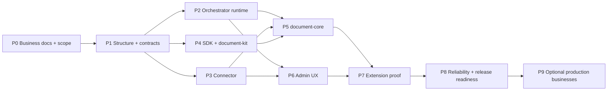

# Implementation roadmap và task index

**Trạng thái toàn bộ: TODO / chưa được thực thi.** Người dùng hiện chỉ yêu cầu plan. Các phase dưới đây dành cho lần triển khai sau; đọc task không phải quyền tự động triển khai toàn bộ.

## Phase graph

## Phase packets

| Phase | Nội dung | Prerequisites | Exit gate | Task file |
|---|---|---|---|---|
| P0 | BRD, action matrix, test design, scope assumptions | Planning baseline | G0 | [P0](P0-business-specs.md) |
| P1 | Workspace structure, interfaces/schema, function contracts, mocks | P0 | G1 | [P1](P1-foundation-contracts.md) |
| P2 | Registry/profile/API/runtime/outbox/state | P1 | G2 | [P2](P2-orchestrator.md) |
| P3 | Connector adapters/config/grants/quota/ledger | P1 | Connector part G3 | [P3](P3-connector.md) |
| P4 | Worker SDK/document-kit/artifact client | P1; P2/P3 stubs | SDK part G3 | [P4](P4-worker-sdk.md) |
| P5 | Six actions in document-core | P2/P3/P4 | G4 business | [P5](P5-document-core.md) |
| P6 | Dynamic Admin UI | P2/P3 | G4 UI | [P6](P6-admin.md) |
| P7 | New worker registration, parallel/HITL/version proof | P5/P6 | G5 | [P7](P7-extension-proof.md) |
| P8 | Fault/security/load/deploy/runbooks | P7 | G6 | [P8](P8-release-readiness.md) |
| P9 | Port business ngành/schema workflow theo ưu tiên | P8 + scope selection | Per-business gate | [P9](P9-business-backlog.md) |

P2/P3/P4 có thể giao agent khác nhau sau G1 bằng frozen contracts và consumer tests. Implementation integration phải chờ providers pass, không coi chạy với stub là hoàn thành end-to-end. P6 làm form against schema fixtures trong lúc P5 chạy. Không giao hai agent sửa root lockfile/contracts đồng thời.

## Workflow bắt buộc trong mỗi task implementation

1. **Business document:** xác định trigger, behavior, lỗi và phạm vi.
2. **Structure/interface:** thống nhất file ownership, DTO/schema, input/output, state transitions.
3. **Function design:** trách nhiệm, side effects, idempotency, timeout/cancel behavior.
4. **Test case:** fixture và assertions có ID; viết test trước logic cho behavior quan trọng.
5. **Implementation:** code trong du-rework, không kéo dependencies từ project cũ.
6. **Verification:** relevant unit/contract/integration/E2E, lint/typecheck, evidence.

Spec hiện tại đủ phân công baseline; phase owner vẫn cần materialize executable schemas/tests và action BRDs. Không biến TODO trong spec thành silent implementation assumption.

## Task status và handoff

Trạng thái hợp lệ: TODO → READY → IN_PROGRESS → REVIEW → DONE; BLOCKED có dependency/reason cụ thể. Các row hiện đều unchecked. Đổi trạng thái chỉ khi có evidence, không đánh dấu DONE chỉ vì file đã tạo.

Handoff mỗi packet gồm: task IDs, files changed, behavior, contract version, tests/commands/results, screenshots nếu UI, risks, follow-up IDs. Integration owner kiểm tra cross-project build/dependency rules. Agent được giao chỉ sửa paths ghi trong packet; nếu cần đổi contract gửi change proposal đến contract owner.

## Release boundary

P0–P8 là plan build và kiểm chứng platform mới. P9 là backlog rõ phạm vi, không phải điều kiện mặc định để hoàn tất release đầu. Không phase nào tự động deploy production, chuyển traffic hay migrate DUGate cũ.
