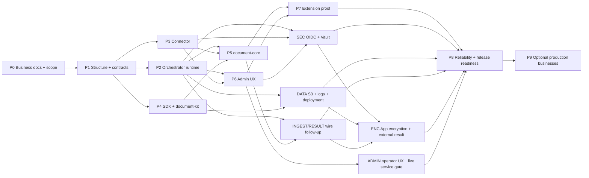

# Implementation roadmap và task index

> **Orchestrator review fixes 2026-10-02:** [RFX-01..16](ORCH-REVIEW-FIXES-2026-10-02.md) inventory từ lượt review đọc-kỹ `modules/{encryption,artifacts,public-api}` + entrypoints/HTTP/shutdown: delivery-GCM thiếu AAD, public multipart bypass encryption, gateway claim/manifest races, OOM collectStream, Host-header grant URL, dev-fallback seed ở production boot, stub heartbeat. Đây là sub-packet của ENC/CR28/DATA/SEC/COMP/P8, không tạo gate mới; 4 luồng review còn lại (DB sâu, compat legacy, admin/auth/billing, migrations/tests) sẽ bổ sung addendum vào cùng file. Các gate vẫn **NO-GO**.

> **Code convention review 2026-10-02:** [CONV-00..13](CODE-CONVENTION-LARGE-FILES-DUPLICATION-2026-10-02.md) kiểm kê 5 file mã >2.000 dòng, `shell-router.ts` cận ngưỡng và các nhóm hàm lặp có bằng chứng AST; packet tách theo owner/lease, giữ wire/crypto/test isolation. Đây là plan `SPECIFIED`, chưa dispatch hoặc xác nhận test/acceptance.

> **Admin control plane UI 2026-10-02:** [ACUI-00..10](ADMIN-CONTROL-PLANE-UI-2026-10-02.md) rà các màn Admin hiện có và bổ sung khả năng cấu hình OIDC/user/role, profile, API key, Connector, policy và deployment qua UI với trạng thái áp dụng thật. Đây là sub-packet của P6/PAR/LOCAL/OIDC/SEC/ENC/DATA, không tự nâng release gate.

> **Code review addendum 2026-10-01:** [CRX-01..05](CODE-REVIEW-ADDENDUM-2026-10-01.md) cập nhật các seam production còn hở sau patch boot/worker, ranh giới business `disbursement` so với P9, và trạng thái catalog 31 variant. Đây là sub-packet của RV01/ENC/COMP/P9; các release gate vẫn NO-GO.

> **Execution overlay 2026-10-01:** [Implementation-first coordination](IMPLEMENTATION-FIRST-COORDINATION-2026-10-01.md) ưu tiên giao code song song theo file lease; cho phép dev DB/Redis/S3 đồng thời khi cô lập namespace; tách kiểm thử nghiệp vụ chi tiết thành [5 packet `VFY-*`](DETAILED-BUSINESS-VERIFICATION-2026-10-01.md). Các snapshot và roster cũ bên dưới là lịch sử, không phải active dispatch. Release gates vẫn **NO-GO**.

> **Follow-up review 2026-10-01:** [RV01-01..08](CODE-REVIEW-FIXES-2026-10-01.md) ghi chi tiết các seam còn hở giữa production boot, metadata/worker artifact encryption, external legacy route/result, 31 variant + workflow, Admin local-user và một regression test đỏ. Đây là sub-packet acceptance của ENC/CR28/COMP/LOCAL/P9, **không** thay owner/gate hoặc tick parent; coordinator kiểm tra active dispatch và cấp shared-file lease trước khi giao. Các release gate vẫn **NO-GO**.

> **Orchestrator parity review 2026-10-01:** [ORCH-PAR-00..10](ORCHESTRATOR-LEGACY-FEATURE-PARITY-2026-10-01.md) đối chiếu Admin/control-plane/vận hành của DUGate cũ với rework: API key mutation, profile policy/locks, Connector lifecycle, workflow schema builder, local-user assignment, settings replacement, analytics, safe ops và API docs. Đây là backlog bổ sung, không lặp `COMP-00..11` public wire, LOCAL-00..06 hay P9 worker; task rows chưa là acceptance và trạng thái dispatch phải xem ledger/terminal hiện tại. PAR-00 quyết định item nào bắt buộc trước cutover; các item bắt buộc đi qua test độc lập và review trước G-COMP/G-ADMIN-OPS/P8-08/G6.

> **Scope chốt 2026-09-30 — backward-compatible external API:** [COMP-00..11](API-COMPAT-DUGATE-2026-09-28.md) yêu cầu sáu core API **và workflow API** cũ chạy không sửa client; legacy wire là mặc định trên method/path cũ trùng với rework, generic DTO trùng path chuyển sang surface/version mới hoặc opt-in. P9-01..05 trên đường găng cutover; `G-COMP` phải đạt trước P8-08/G6 cho scope release này. Còn quyết định URL generic, result/lifecycle/security bounds và consumer inventory; không tự tick COMP/P9/ENC từ việc sửa plan.

> **Admin local login 2026-09-30:** [LOCAL-00..06](ADMIN-LOCAL-AUTH-2026-09-30.md) bổ sung user/password local, `DU_ADMIN_AUTH_MODE=local|oidc|both`, shared session/RBAC và mode-switch security. `G-LOCAL-ADMIN` là điều kiện của G-SEC/G-ADMIN-OPS/P8-08 khi Admin local thuộc release; token login hiện hữu không phải local user. Chưa có full acceptance; xem ledger/terminal để biết dispatch thực tế, không cộng vào 16 SEC task cũ.

> **Code review follow-up 2026-09-28:** [CR28-01..06](CODE-REVIEW-FOLLOWUP-2026-09-28.md) ghi sáu mismatch production: giải mã read path, Worker→Connector auth, OCR/vision bytes, metadata submit plaintext, clean Docker build và 409 taxonomy. Đây là acceptance hold trên ENC/INGEST/P3-P5/DEP/P8, không tự đổi tick hoặc giao trùng owner; các test offline hiện có không đóng G-ENC/G-SEC/G-DATA/G6.

> **Yêu cầu mã hóa app — thêm 2026-09-27, cập nhật 2026-09-28:** [ENC-00..09, ENC-META-01 và ENC-INT-01](APP-ENCRYPTION-2026-09-27.md) là 12 task cho AES-256-GCM trước S3/DB, metadata submit/claim, Admin response policy và public-key delivery. `ENC-00..09` cùng `ENC-META-01` đang `[~]` với các slice code/offline receipt trong từng row; `ENC-INT-01` còn `[ ]`. Không row nào được suy thành full acceptance từ receipt cô lập. S3 production/DB pilot đã được chọn; quyết định wire/policy và live external decrypt còn cần đối chiếu. `G-ENC` vẫn mở trước P8-08/G6; không cộng task mới ngược vào snapshot 52 rows cũ.

> **Follow-up review 2026-09-27:** [INGEST-WIRE-01, RESULT-WIRE-01, ARCH-DOC-01](ARCHITECTURE-REVIEW-FOLLOWUP-2026-09-27.md) bổ sung kiểm thử OCR/digitize với file thật, khóa public result/download contract và đồng bộ hồ sơ kiến trúc. Đây là hold theo parent P5/P8/ENC, không tự đổi tick lịch sử hoặc tạo gate mới.

> **Architecture doc/code mismatch — 2026-10-02:** [DOC-SYNC-01..03, CODE-FIX-01..02](ARCHITECTURE-DOC-CODE-MISMATCH-2026-10-02.md) từ một lượt audit đọc-chỉ trên bộ `architecture/10`–`17` vừa viết sáng nay. Kết luận: **không có mismatch nào làm sai lệch bức tranh kiến trúc** — hai `CODE-ARCHITECTURE.md` đối chiếu 0 file thiếu, doc 13 không claim nào bị code phủ định. 11 phát hiện đều là thiếu sót cục bộ trong doc hoặc doc im lặng về lỗi code thật. Ba `DOC-SYNC` là doc-only; `CODE-FIX-01/02` **cố ý plan-only, không sửa code** (bỏ hướng dẫn trong Admin shell hay thêm route là quyết định scope). `DOC-SYNC-02` chạm `docs/` nơi nhiều lane cùng ghi — phải đếm mtime trước khi vá. Số 31-vs-28: code đã có 31 đúng nhưng quyết định scope vẫn của chủ sản phẩm, `GAP-11` không tự đóng. Cần Claude Code `APPROVED` trước khi tick `[x]`; audit không tạo bằng chứng runtime.

> **Release-gate audit — Turn 200 (2026-09-26):** [Reviewer audit](../coordination/reports/review.md#L1018) is the latest independent release-gate assessment; Turn 201 below is a narrower module review. Its **52 unaccepted task rows** counted 14 P0–P8 + 16 SEC + 8 Admin UX + 10 DATA/LOG/DEP + 4 COST, excluding the later ENC and architecture follow-up packets; this is a historical task-row inventory, not a readiness percentage. `G-ADMIN-OPS`, `G-SEC`, `G-DATA` and `G6` were NO-GO; new `G-ENC` is also open. Turn 200 retained the live `deadline_at` planner gate, T200-P1 packet typecheck correction and T200-D1 admission contract; use current task rows and newer receipts for individual packet status rather than promoting gates from this snapshot.

> **ORCH-OPS-0019 evidence reconciliation — Turn 201 (2026-09-27):** [Claude Code review](../coordination/reports/review.md#L1061) ended `CHANGES_REQUESTED` for `[REV-ORCH-0019-01]` and conditionally allowed coordinator acceptance after a prose fix + docs checker. [Owner receipt](../coordination/reports/qwen-docs.md#Muc-23) reports the fix and `BROKEN=0`; coordinator later recorded ACCEPTED. Theo quy tắc `AGENTS.md` yêu cầu verdict `APPROVED`, trạng thái module cần Claude Code xác nhận lại hoặc ghi rõ waiver được duyệt; không trình bày `CHANGES_REQUESTED` như `APPROVED`. Live `deadline_at` planner gate vẫn riêng và còn mở.

> **Reviewer 6/6 refresh — 2026-09-25 01:02 +07:** [W48-C1/O2/Q2-1 code and coordinator review](../coordination/reports/review.md) supersedes the 2026-09-24 snapshot below. Direct P0–P8 row count is **56 `[x]` / 4 `[~]` / 11 `[ ]` = 71**, not release readiness. W48-C1 audit ledger has 3×3/3 green tests, but tenant authorization and mutation/audit atomicity remain HIGH; W48-O2 production CSS has 30/30 browser receipt, but clipped table columns remain HIGH accessibility risk. R14 is a green defect-characterization suite, so P8-02 stays `[~]`. [Follow-up order](FULL-REWORK-REVIEW-FOLLOWUP-2026-09-24.md) holds ADM-BASE-01/ADM-UX-01/04/07, G-ADMIN-OPS, P8-02 and ART-02 acceptance without changing any task row.

> **Admin vận hành 2026-09-24:** [ADM-UX-00..07](ADMIN-OPS-UX-2026-09-24.md) bổ sung 8 task TODO về responsive/ít cuộn, search-filter có phân trang server-side, triage và browser/security evidence. `G-ADMIN-OPS` là gate riêng trước P8-08/G6 khi dùng Admin UI để vận hành; các task này ngoài mẫu số P0–P8 hiện có, không tự đổi tick P6 cũ hoặc đóng thay `G-SEC`/`G-DATA`.

> **Current code/plan review 2026-09-24:** [full review](../coordination/FULL-REWORK-REVIEW-2026-09-24.md) ghi 24 findings mới hoặc tái xác nhận, có file:line/repro/owner và phân biệt source-fixed. [Follow-up plan](FULL-REWORK-REVIEW-FOLLOWUP-2026-09-24.md) là thứ tự khắc phục và current acceptance holds; không dispatch hoặc sửa source trong lượt review. Đếm trực tiếp P0–P8 hiện tại: **51 `[x]` / 8 `[~]` / 12 `[ ]` = 71**; đây là historical row ticks, không phải release completion. 16 SEC và 10 DATA/LOG/DEP tasks ngoài mẫu số. G6 cần **G-SEC + G-DATA + current regression/deploy evidence**; các snapshot cũ bên dưới không còn là số liệu hiện tại.

> **Progress snapshot 2026-09-23, 18:12 +07:** P0-P8: **46 marked done / 5 partial / 20 open** (71 tasks); P9 adds 5 deferred open tasks. [Agent-by-agent reconciliation](../coordination/PROGRESS-RECONCILIATION-2026-09-23-EVENING.md) records CR-11 regression evidence, P6-02/P8-04 progress, SDK usage-limit blocker and disputed MM-13 closure. Counts are recorded row status, not full conformance. Mismatches remain notes; no new fixes or dispatch.

> **Full-flow conformance review (2026-09-23, 12:04 +07):** [13 plan/code mismatches](../coordination/PLAN-CODE-CONFORMANCE-2026-09-23.md) and [supplemental acceptance tasks](PLAN-MISMATCH-FIXES-2026-09-23.md). P7-03/04/07 and P8-02/03 remain PARTIAL at full-task acceptance despite useful slice passes. Active ownership and held SDK lane are unchanged.

> **Code review 2026-09-23:** added [13 supplemental fix tasks](REVIEW-FIXES-2026-09-23.md) (9 High / 4 Medium), backed by [source findings and offline reproductions](../coordination/CODE-REVIEW-2026-09-23.md). Affected parent acceptance must close these fixes; current dispatch/ownership remains unchanged.

> **Current acceptance review (2026-09-23):** see [plan review](../coordination/PLAN-REVIEW-2026-09-23.md). P6 is PARTIAL (accepted view models; UI gate open); P8-01/07/08 are reopened, and G6 has not passed. [Wave 39](../coordination/WAVE-39-ORCHESTRATOR-REALLOCATION.md) remains the current execution/ownership plan. Earlier phase summaries below are historical; consult task rows plus the review before dispatching.

> **Security scope added 2026-09-24:** [OIDC Admin + Vault provider credentials](SEC-OIDC-VAULT-2026-09-24.md) now has 16 separately trackable TODO tasks (including three Admin integration prerequisites), a dependency path and `G-SEC` acceptance gate before G6. The P0–P8 checklist counts above exclude this new work and are not a release-completion percentage. Existing P2/P3/P6 ticks do not certify OIDC or Vault. See the [service/UI review](../coordination/REVIEW-SEC-SERVICE-UI-2026-09-24.md) for why the prerequisites were added.

> **Deployment/data scope added 2026-09-24:** [S3 artifact migration + Elasticsearch log pipeline](DEPLOY-STORAGE-LOGGING-2026-09-24.md) tracks 10 TODO tasks and `G-DATA` before production. RDS PostgreSQL and ElastiCache Valkey are optional backend choices; private S3 file storage and centralized Elasticsearch logs are required. Existing P2/P4/P5/P8 ticks do not certify this migration. Counts above exclude these tasks.

> **SEC-00 packet ledger — 2026-09-26:** `W-SEC-ADR-SYNC-1` is **ACCEPTED** at its documentation/ADR scope, per Reviewer Turn 60 Independent Audit (claim-surface distinction in ADR-17 and shared `@du/contracts` claim-shape binding). This packet decision does not tick the SEC umbrella rows and does not close `G-SEC`; the Vault live chain (migration 008, deployed writer/reader policies, rotation/revoke/reconcile, and Admin → Orchestrator → Connector tenant/account negatives) remains required.
> **SEC packet ledger (bổ sung) — 2026-09-26:** `W-SEC-RBAC-SYNC-1` (OIDC-03) is **ACCEPTED** at its exact live-HTTP-matrix scope, per Reviewer Turn 60 (re-affirmed by Turn 70) and Tester [T-CODEX-TEST-20](../coordination/reports/tester.md): command `pnpm --filter @du/orchestrator test -- tests/admin-action-rbac-live.test.ts` at cwd `du-rework`, HEAD `7811298`, `DU_LIVE_INFRA=1`, **PostgreSQL localhost:5433/du_orchestrator_test** + **Redis localhost:6380**, literal ExitCode `0`, **12 passed / 0 failed / 0 skipped** (D1-D4, M1-M6, X1-X2) on the standardized `{items,limit,nextCursor,prevCursor,total}` envelope. The earlier 9/12 stale-`rows` receipt (T-CODEX-TEST-19) is superseded for this exact suite but retained as history. Lane task file: [SEC-OIDC-VAULT-2026-09-24.md](SEC-OIDC-VAULT-2026-09-24.md), row `OIDC-03` is now `[~]` with a packet journal. **Scope limit worth knowing before reading the ledger:** those 12 cells authenticate with the static `adminToken` / `tenantAdminTokens` map, so they do **not** exercise the OIDC claim-to-principal mapper (`mapOidcClaimsToPrincipal`), which still has offline evidence only. Packet-level acceptance does not close `G-SEC`: the Vault live chain (migration 008, deployed writer/reader policies, rotation/revoke/reconcile) and **browser-driver OIDC-04** evidence are still required; the proposed OIDC-04 browser scenario is B0-B5 in the SEC task file.
> **DATA packet ledger — 2026-09-26:** `W-DOC-ISOLATE-1` is **ACCEPTED** at its offline isolation scope, per Reviewer Turn 60 Independent Audit and Tester [T-CODEX-TEST-17](../coordination/reports/tester.md): command `pnpm --filter @du/document-core test` at cwd `du-rework`, HEAD `7811298`, literal ExitCode `0`, suites **42 passed / 0 failed / 0 skipped**, tests **506 passed / 0 failed / 0 skipped**; integration discovery returns exactly `tests/multi-container-e2e.integration.test.ts` without executing it; raw log `coordination/reports/T-CODEX-TEST-17-document-core-offline-green.log`. Owner receipt: [Qwen-DATA Mục 4](../coordination/reports/qwen-data.md). This packet decision does not tick any DATA row, does not close `G-DATA` or `G6`, and the excluded multi-container suite stays a separate live/integration gate — the Document-Core package is not end-to-end green.

**Trạng thái: implementation đang tiến hành, chưa release-ready.** Các mô tả phase cũ trong [implementation status](../coordination/IMPLEMENTATION-STATUS.md) là checkpoint lịch sử; dùng dòng task, current acceptance holds, evidence mới nhất và gate G6/G-SEC/G-DATA/G-ADMIN-OPS/G-COMP/G-LOCAL-ADMIN khi đánh giá hoàn thành. Admin UI là công cụ vận hành trong scope release hiện tại, nên G-ADMIN-OPS là điều kiện G6. Quyết định 2026-09-30 đưa **P9-01..05 cần cho workflow compatibility** vào phạm vi trước cutover; các câu cũ nói P9 ngoài release là lịch sử.

## Phase graph

## Phase packets

| Phase | Nội dung | Prerequisites | Exit gate | Task file |
|---|---|---|---|---|
| P0 | BRD, action matrix, test design, scope assumptions | Planning baseline | G0 | [P0](P0-business-specs.md) |
| P1 | Workspace structure, interfaces/schema, function contracts, mocks | P0 | G1 | [P1](P1-foundation-contracts.md) |
| P2 | Registry/profile/API/runtime/outbox/state | P1 | G2 | [P2](P2-orchestrator.md) |
| P3 | Connector adapters/config/grants/quota/ledger | P1 | Connector part G3 | [P3](P3-connector.md) |
| P4 | Worker SDK/document-kit/artifact client | P1; P2/P3 stubs | SDK part G3 | [P4](P4-worker-sdk.md) |
| P5 | Six actions in document-core | P2/P3/P4 | G4 business | [P5](P5-document-core.md) |
| P6 | Dynamic Admin UI | P2/P3 | G4 UI | [P6](P6-admin.md) |
| ORCH-PAR | DUGate cũ → rework Admin/control-plane/ops parity; PAR-00 phân loại scope, PAR-01..10 phát triển/verify | P2/P3/P6 + COMP/LOCAL/P9 contracts | Các item cutover-required đóng trong G-COMP/G-ADMIN-OPS/G-SEC và P8-08/G6; không tạo gate thay thế | [Orchestrator parity](ORCHESTRATOR-LEGACY-FEATURE-PARITY-2026-10-01.md) |
| P7 | New worker registration, parallel/HITL/version proof | P5/P6 | G5 | [P7](P7-extension-proof.md) |
| SEC | OIDC Admin login + Vault provider credential write/read/rotation; local Admin users là nhánh bổ sung | P2/P3/P6 boundaries; SEC-00 ADR; LOCAL-00 | G-SEC + G-LOCAL-ADMIN before G6 | [SEC task plan](SEC-OIDC-VAULT-2026-09-24.md), [local auth](ADMIN-LOCAL-AUTH-2026-09-30.md) |
| DATA | S3 bytes, URL acquisition, Elasticsearch logs và topology options | DATA-00 contracts; P2/P4/P5 integration | G-DATA before G6 | [DATA task plan](DEPLOY-STORAGE-LOGGING-2026-09-24.md) |
| ENC | App-layer AES-256-GCM for S3/DB + metadata, Vault keys, Admin policy, external public-key results | ENC-00 freeze; RESULT-WIRE-01; DATA/SEC boundaries | G-ENC before G6 | [Encryption task plan](APP-ENCRYPTION-2026-09-27.md) |
| ADMIN | Live operator journeys, responsive UI, scoped search và action evidence | P6; ADM-BASE/OIDC service boundaries | G-ADMIN-OPS before G6 | [Admin UX task plan](ADMIN-OPS-UX-2026-09-24.md) |
| P8 | Fault/security/load/deploy/runbooks | P7 + G-SEC + G-LOCAL-ADMIN + G-DATA + G-ENC + G-ADMIN-OPS + G-COMP + INGEST-WIRE-01/RESULT-WIRE-01/ARCH-DOC-01 cho scope release hiện tại | G6 | [P8](P8-release-readiness.md) |
| P9 | Ba workflow cũ + schema workflow + facade phục vụ external compatibility | P1–P7 contracts/business; COMP-00/01/02, không chờ G6 | Per-business gate + G-COMP before cutover/G6 | [P9](P9-business-backlog.md) |

SEC là phạm vi release bổ sung và chưa tính vào 71 dòng task P0–P8. `SEC-00` phải chốt provider API key so với tenant `x-api-key` trước khi giao implementation; `G-SEC` phải đạt trước khi P8-08/G6 có thể tuyên bố sẵn sàng phát hành với hai tính năng này.

DATA cũng là phạm vi bổ sung: file bytes production chỉ lưu private S3, không PostgreSQL/Redis; PG pilot/fallback trong ADR-18 không tự thay đổi gate production này. Logs đi qua bounded collector tới Elasticsearch. `G-DATA` phải đạt trước G6. RDS/ElastiCache chỉ provision khi được chọn; self-hosted PostgreSQL/Redis/Valkey có thể là topology pilot. Sửa security/error boundaries, test harness và dispatcher plumbing có thể bắt đầu trước khi các feature ADR hội tụ.

P2/P3/P4 có thể giao agent khác nhau sau G1 bằng frozen contracts và consumer tests. Implementation integration phải chờ providers pass, không coi chạy với stub là hoàn thành end-to-end. P6 làm form against schema fixtures trong lúc P5 chạy. Không giao hai agent sửa root lockfile/contracts đồng thời.

## Workflow bắt buộc trong mỗi task implementation

1. **Business document:** xác định trigger, behavior, lỗi và phạm vi.
2. **Structure/interface:** thống nhất file ownership, DTO/schema, input/output, state transitions.
3. **Function design:** trách nhiệm, side effects, idempotency, timeout/cancel behavior.
4. **Test case:** fixture và assertions có ID; viết test trước logic cho behavior quan trọng.
5. **Implementation:** code trong du-rework, không kéo dependencies từ project cũ.
6. **Verification:** relevant unit/contract/integration/E2E, lint/typecheck, evidence.

Spec hiện tại đủ phân công baseline; một số schema/tests/action BRD đã được materialize theo evidence matrix, còn row partial vẫn phải giữ acceptance chưa đạt. Không biến TODO trong spec thành silent implementation assumption.

## Task status và handoff

Trạng thái hợp lệ: TODO → READY → IN_PROGRESS → REVIEW → DONE; BLOCKED có dependency/reason cụ thể. `[x]` chỉ có nghĩa toàn bộ acceptance của row đã được chứng minh bởi command/test hoặc gate được dẫn trong [implementation status](../coordination/IMPLEMENTATION-STATUS.md). `[ ]` có thể là PARTIAL; không đánh dấu DONE chỉ vì file/source đã tồn tại.

Handoff mỗi packet gồm: task IDs, files changed, behavior, contract version, tests/commands/results, screenshots nếu UI, risks, follow-up IDs. Integration owner kiểm tra cross-project build/dependency rules. Agent được giao chỉ sửa paths ghi trong packet; nếu cần đổi contract gửi change proposal đến contract owner.

## Release boundary

P0–P8 là plan build và kiểm chứng platform mới. P9 là backlog rõ phạm vi, không phải điều kiện mặc định để hoàn tất release đầu. Không phase nào tự động deploy production, chuyển traffic hay migrate DUGate cũ.
