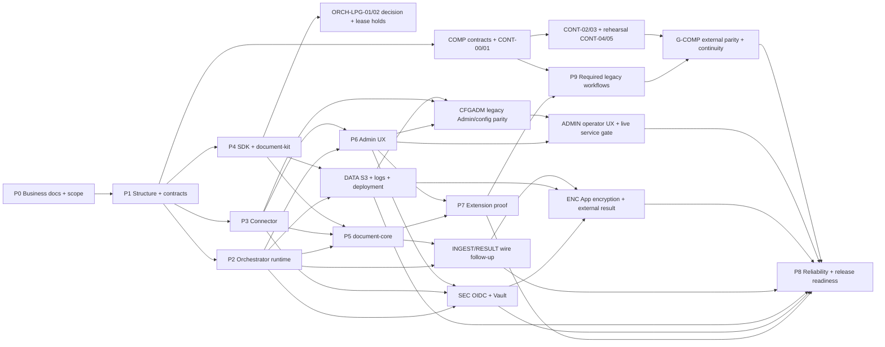

# Implementation roadmap và task index

> **Code review follow-up 2026-10-06:** [CR06-01..10](CODE-REVIEW-FOLLOWUP-2026-10-06.md) — 10 finding SPECIFIED từ đối chiếu trực tiếp code trên HEAD `b088eec` (2 HIGH: disbursement/doc-compare thiếu `promptStepId`, Vault KV2 dead code; 5 MEDIUM: session seam zero call-site, async-202 drop sessionRef, identityVerifier fail-open nhánh overrides, parameters `z.unknown()` copy verbatim, tri-state collapse; 3 LOW schema/caps/upload-mã-lỗi), 0/10 ACCEPTED. Sub-packet của T-PROM-02/P763/SEC/P745/PLAN04/ENC/DATA, không gate mới, không tick parent, không dispatch; thứ tự CR06-01 → CR06-02 → CR06-03+04 → CR06-05 → CR06-06+07 → LOWs.

> **Shared lib/SDK, API-first — bổ sung người dùng 2026-10-05:** [PLAT-MIG acceptance](DU-PLATFORM-MIGRATION-2026-10-05.md) và [RPK mapping](SHARED-PACKAGES-REDISTRIBUTION-2026-10-05.md) yêu cầu canonical source/reference/contracts/guides/skills cùng repo Orchestrator, không thêm repo SDK. Worker ưu tiên Runtime/Connector API, nhận client/runtime/document helpers local từ pinned template/skill, build cùng worker thay vì build SDK riêng. Inventory direct/transitive/imports/test/tooling/Docker và isolated scratch build là bắt buộc; RPK-00 sequencing giữ nguyên.

> **DU Platform / tối đa ba loại repo — yêu cầu người dùng 2026-10-05:** [PLAT-MIG-00..07](DU-PLATFORM-MIGRATION-2026-10-05.md) / [kiến trúc](../docs/40-du-platform-architecture.md). Mặc định hai loại repo: Orchestrator chứa Portal, Platform API + Runtime và Connector (service/image riêng); Worker template cho từng business. Repo Connector riêng tùy chọn. Boot/ingress/contract fixes vào plan hiện tại theo lease, source extraction reuse RPK sau RPK-00. Coordinator intake/dispatch reuse ACUI-M06/COMP/RPK, không trùng writer. SPECIFIED; chưa tách repo/VERIFIED/ACCEPTED, không đổi commit/live/release gates.

> **PLAN-CHECKPOINT-805 (current):** [checkpoint and next five turns](PLAN-COMPLETION-2026-10-04.md#20-plan-checkpoint-805--checkpoint-5-và-5-lượt-tiếp-theo) / [receipt](../coordination/reports/plan-checkpoint-805-2026-10-05.md): A7 dsh_2 settings/identity contracts + orchestrator BFF lease; A8 encryption best-effort trong backfill window, legacy rows van plaintext-readable; A9 tester_off -> tester-off.md, tester_live -> tester.md. REVIEW-803 six slices ACCEPTED-OFFLINE only; review conditions A1-A5/LIVE B1-B5 and G-ENC remain open. REVIEW-804 typed denial APPROVED-WITH-CONDITIONS, one actual post-fix boot pending. BFF packet receipt and docs-CSRF fix/build BZ2-Edjb landed; old Bs0p8VRI verdict is historical, new docs UI approval coordinator-reported pending durable receipt locator. No production backfill caller/window enforcement at verifier snapshot; settings writer disabled, wizard wire absent, DEV-03 disabled. Five-turn sequence 806-810 keeps commit GO 1-6 and eight live-window questions user-gated; no checkbox changes. Composer incident quarantined qwen_2, HEAD remains b088eec; no unauthorized commit.

> **Backlog cuối, sau completion hiện tại — 2026-10-05:** [RPK-00..21: phân bố lại shared packages](SHARED-PACKAGES-REDISTRIBUTION-2026-10-05.md). Contracts về Orchestrator; runtime/document/client modules local từng business worker, build/deploy/scale độc lập; guides/skills và patch tracking hỗ trợ duplicated source. Toàn bộ implementation chờ RPK-00 xác nhận required scope hiện tại ACCEPTED và P8-08/G6 đủ evidence/holds closure. DEFERRED, không prerequisite mới cho plan đang chạy, không dispatch hoặc thay code/lease/gate hiện tại.

> **Scale ngang worker + HA Orchestrator 2026-10-05:** [SCALE-01..08](SCALE-HA-2026-10-05.md) bổ sung phân tích chi tiết 8 điểm nghẽn scale/HA (DB pool, Redis HA, Connector migration owner, worker→Connector identity, LB health/drain/session, tách concurrency CPU/IO, autoscaling theo backlog, admission backpressure + dispatcher jitter + outbox index). Sub-packet của P8/DATA/DEP/P2/P3/P4, không gate mới, không tick parent; `P8-05`/`P8-06` đọc số đo từ packet này.

> **Yêu cầu Admin ưu việt hơn legacy 2026-10-05:** [AOPS-00..09](ADMIN-SYSTEM-OPERATIONS-SUPERSET-2026-10-05.md) bổ sung ma trận root → UI mới → acceptance, navigation theo tác vụ, Overview ca trực, Services/replicas, Workers & Queues, Incidents, Connector UNKNOWN reconciliation, maintenance jobs và desired/observed rollout. Full CFGADM parity và cải tiến vận hành là required; AOPS là sub-packet của AWEB/ACUI/ADM-UX/COST/P2/P3/P4/DATA/DEP/P8, không tạo gate mới, không dispatch hoặc tick parent. G-ADMIN-OPS/P8-07/P8-08/G6 nhận journeys và independent UI/backend/live evidence đúng build.

> **PLAN-UPDATE-805b (historical; superseded by checkpoint805):** [receipt](../coordination/reports/plan-update-805b-2026-10-05.md) / [wave802 outcomes + UI803](PLAN-COMPLETION-2026-10-04.md#19-plan-update-805b--wave-802-outcomes-và-ui-backlog-803): REVIEW-802 S1/S2 APPROVED, S3/S4 APPROVED-WITH-CONDITIONS; UI build `index-Bs0p8VRI.js` / `8ccdbab15d44cca1`: identity/workflows-disabled/settings-catalog UI_APPROVED, **docs CHANGES_REQUIRED (missing session/CSRF bootstrap)**. Two HIGH reader fixes implemented; ENC09 owner fixed wrong JOIN tenant column and composite crypto refId, independent VFY-ENC09-803 pending. Settings wire/AI wizard contract still missing at reviewed snapshot; CFGADM01..04 catalog-only. Six UI803 proposals + HIGH-priority IDENTITY-ROLE-POLICY, IDENTITY-BFF-ROUTES, DOCS-CSRF-FIX and VFY-ENC09-803 in current fold; active attempts in intake snapshot. **No checkbox changes**; A1-A6, commit GO 1→6, live eight questions, DEV-03 and parent T-PROM-02/provider-use/live remain open.

> **PLAN-UPDATE-805 (lịch sử, superseded bởi update805b):** [receipt](../coordination/reports/plan-update-805-2026-10-05.md) / [fold 796–802 + skeleton 803–810](PLAN-COMPLETION-2026-10-04.md#17-plan-update-805--fold-wave-796802-và-skeleton-803810): A1 R2 UI_APPROVED đúng build mới; A2 RCR sáu fixes/released + independent **229/229, 0 skipped, tsc 0**, REVIEW-801 V5 APPROVED offline; A3 window switch BLOCKER/design trước lease mới; A4 **P763-PROMPT-WIRING tick offline leg only**, W1C-COMPOSE tick offline-leg theo user/coordinator sau V1: verified `5913db5e`, additive W1C preserved `ae7e29ce`; live PG/boot missing ENCRYPTION_KEY/tick-note confirmation remain open; A5 sole router owner dsh_2; A6 commit GO **1→6**, live window **8 câu hỏi**, DEV-03 vẫn user-gated. Parent T-PROM-02/live và release gates giữ mở. Ledger intake turn 801: cycle 802 chưa có settlement receipt, không ghi DONE từ skeleton.

> **PLAN-UPDATE-800 (lịch sử, superseded bởi update805):** [receipt](../coordination/reports/plan-update-800-2026-10-05.md) / [§16 fold wave 796–800](PLAN-COMPLETION-2026-10-04.md#16-plan-update-800--fold-wave-796800-checkpoint-5): **COMMIT-PLAN-PREP READY** (15 nhóm + hunk-map; 0 staged — **chờ user go/no-go**); **VERIFY-SHELL-FIX PASS** (103/103×3 + 235 fixtures); DOCS-CW + ENV-SYNC DONE; **LIVE-SPEC-EXT** 9 test (offline skip); **CFGADM-UI-INVENTORY 3/1/7**; **TICK-PROPOSAL-2** đề xuất TICK offline-leg cho 2 P763 rows (chưa tick); **orchestrator-app-core-review CHANGES_REQUIRED (RCR-01..06)** → fix **RCR-HTTP (cc_1)** + **RCR-RUNTIME (dsh_1)** đang chạy. Skeleton 801–805: RCR verify, P763 tick decision, porting 7 UI-missing, commit execution + live window (user-gated). Không tick gate.

> **PLAN-UPDATE-795 (lịch sử, superseded bởi update800):** [receipt](../coordination/reports/plan-update-795-2026-10-05.md) / [§15 fold wave 781–795](PLAN-COMPLETION-2026-10-04.md#15-plan-update-795--fold-wave-781795-checkpoint-5): **T-PROM-02 offline CLOSED** (B2 AW-C; provider-observed/live còn); roster **15** (+dsh_1/dsh_2); **CW-B BFF/UI DONE + UI_APPROVED** (build digest verify); **shell-red ĐÓNG** (FIX-2 103×3 + NAV-DEDUPE single-source); **ENCMETA pair** (resultref seal + schema exemption/guards) + **CREDWORKFLOW impl/verify PASS**; MEDIUM-2 bump **DEFER**; UI-KEYS-JOURNEY real browser; LIVE-PLAN +5 item. Commit 1→6/live/route holds không đổi, không tick gate.

> **PLAN-UPDATE-780 (lịch sử, superseded bởi update795):** [receipt](../coordination/reports/plan-update-780-2026-10-05.md) / [§14 carrier verdicts + UI page-level + backlog776–780](PLAN-COMPLETION-2026-10-04.md#14-plan-update-780--checkpoint-5-carrier-verdicts-ui-page-level-tick-và-backlog-776780): design+impl carrier AWC (1a–1g PASS); **CAPFIX + VERIFY-CAPFIX PASSED** (caps 64/16KiB/256KiB + 422 trước cross-check; tag-tamper thật → AUTHENTICATION_FAILED + 0 write); B2 in-flight/adjudicated. PLANE-A **43/43 đúng (46 nominal)** + 53 PNG; **UI_APPROVED page-level + tick 5 màn**; UI-MASK-PW đóng GAP (browser thật ×3); BR12-FIX standing-red −1; CW-A 23×3 (Δ1–5 duyệt); SESSION-LEG 19×3 (provider-session semantics mở); **VERIFY-T5 CONFIRMED**. Commit plan §12 giữ; live/CONT/LPG/WTV/route holds không tick.

> **PLAN-UPDATE-770 (lịch sử, superseded bởi update780):** [receipt](../coordination/reports/plan-update-770-2026-10-04.md) / [§13 carrier + backlog766–770](PLAN-COMPLETION-2026-10-04.md#13-plan-update-770--carrier-chốt-roster-và-backlog-766770): 7 carrier adjudications SPECIFIED (Form A/cross-check/NULL+markers/caps/decrypt orch/Δ-CONTRACTS pinned.promptOverrides/name), IMPL-A running; B sau A freeze/release. W3/W1C-PC/COMPOSITION verifies PASSED; UI-KEYS UI_APPROVED/ticked scoped offline, live journey GAP. LOW-1 rollback CAS optional giữ. Roster 13 active: −qwen3/4, +cc3/worker1; codex_3 alias worker1. CURL runner load resolved 16x3/static, Q2 UI-MASK running; full 17-key config/live/browser/CONT/LPG/WTV holds giữ. Cleared-exact carrier parity cần vector end-to-end trước full T-PROM-02.

> **PLAN-UPDATE-763 (lịch sử, superseded bởi update770):** [receipt](../coordination/reports/plan-update-763-2026-10-04.md) / [§12 closure + commit plan](PLAN-COMPLETION-2026-10-04.md#12-plan-update-763--part-34-closure-và-commit-plan) fold Part 3 HARD (1) CLOSED offline; Part 4 W3/W1c APPROVED offline (coordinator đã tick slice), VERIFY-W3/W1C-PC CONFIRMED. PREFCONSUME AW-C: T-PROM-02 vẫn chờ Δ-PC-1 carrier + producer content + wiring 6 sites + observed provider request/live. T-API-01 closure DONE owner rev2→3/134x3; marker producer step1 DONE 17/17x3 + 0030, chưa content. W1C-COMPOSITION/UI-KEYS dispatched; commit plan 1→6 có profile-commands ở c1, atomic W3 c4, chưa composition c5, leaf c6. L2 CLOSED; full 17-key parity/live/browser/user/CONT/LPG/WTV holds giữ.

> **Checkpoint 750 → skeleton backlog 751–755 (lịch sử, superseded bởi update 763):** [receipt](../coordination/reports/plan-chkpt-750-2026-10-04.md) và [§11 backlog](PLAN-COMPLETION-2026-10-04.md#11-checkpoint-750--skeleton-backlog-751755) fold VFY-REFRESH-746-750 VERIFIED docs-only; P2-FIX đã abandon dispatch cũ → qwen_4 / ctx_ee8fc052b95b đang chạy, chưa independent 11/11; SDK/W3/MEDIUM-1-PREP in-flight. W3 Δ7(A) migration 0028 + ApiKeyRef non-breaking/Δ8 expanded lease/Δ10 one-line client giữ; 0-discovered runner chưa PASS. L2 CLOSED; sáu P745 slices carry-forward theo hold-list, không thêm row trùng. UI Q2/browser/Connector GAP, live/qwen_4 security/Δ-DEV-03/CONT user gates và LPG/WTV-07 holds giữ; không tick gate.

> **Checkpoint 745 → backlog 746–750 (lịch sử, superseded bởi checkpoint 750):** [refresh receipt](../coordination/reports/plan-refresh-746-750-2026-10-04.md) và [§10 backlog](PLAN-COMPLETION-2026-10-04.md#10-checkpoint-745--backlog-746750) fold L2 CLOSED (44 docs bare PAR=0, independent final recheck), W3 Δ7(A)/Δ8 expanded lease/Δ10 one-line client numeric đang implement, SDK-CONSUME + MEDIUM-1-PREP in-flight. Part 2 APPROVED-WITH-CONDITIONS; (b) MET, DD-05 settled; P2-FIX stream-issue vẫn chặn W1c tới independent 11/11 + named release/scope. UI p1 settled/mounted nhưng Q2 toggle chưa có, browser 16 authored tests SKIP và Connector backend GAP; sáu slice mới đều proposal. Live, qwen_4 security scope, Δ-DEV-03/CONT user-gated; LPG/WTV-07 giữ hold; không tick gate.

> **Checkpoint 740 → backlog 741–745 (lịch sử, superseded bởi checkpoint 745):** [refresh receipt](../coordination/reports/plan-refresh-741-745-2026-10-04.md) và [§9 backlog](PLAN-COMPLETION-2026-10-04.md#9-checkpoint-740--backlog-741745) fold (b) MET 19:30 theo coordinator, DD-05 staged → P2-FIX task_6d21a84909fd → independent W2-B 11/11 rerun. W1c thêm P2-FIX verified + ACQ release list; W3 cần API prep + server window. SDK receipt và Part 2 verdict pending; UI-INTEGRATE p1/Q2 toggle còn browser SKIP. LIVE-READY-PREP2 done offline, user window chưa mở. L2 bốn file đã verified FIXED; 58 parent-doc refs ngoài scope còn follow-up. CONT/LPG/WTV-07/Δ-DEV-03 giữ holds; không tick gate.

> **Lịch sử checkpoint 735 → backlog 736–740 (superseded bởi checkpoint 745):** [refresh receipt](../coordination/reports/plan-refresh-736-740-2026-10-04.md) và [backlog lịch sử](PLAN-COMPLETION-2026-10-04.md#8-checkpoint-735--backlog-736740) cập nhật W1 audit 6/6 + 2/2 claims supported, lease PASS; T-PROF-03 CLOSURE `task_f0014eff828a` mới có owner receipt 25/25, ba offline runs xanh; (b) chờ coordinator đối chiếu evidence/handoff. SDK-CONSUME mở theo (a) DTO freeze và exact lease; W1c/W3 chờ (b) confirmation/named release. W2-B đã land 8 pass/3 fail P2 ref-tuple mismatch → proposed runtime REF-BIND-FIX trước acquisition; SDK 3 pass/1 todo; DD03 done offline; cURL leaves done nhưng Playwright SKIP → UI-INTEGRATE với ba câu hỏi mở. 5/6 P730 prep/slice đã được coordinator dispatch, không là full acceptance; Δ-DEV-03 và CONT decisions vẫn user/consumer-gated.

> **Legacy parity gaps / LPG holds:** [ORCH-LPG-01/02](LEGACY-PARITY-GAP-ADDENDUM-2026-10-03.md) giữ tenant/ENC/ref-lifecycle decision hold và SDK claim-loop collision với W1b; implementation cần register/WTV checkpoint và named lease. WTV-07 vẫn mở; refresh doc-only không cấp quyền commit hoặc tự chọn content dedup.

> **Admin/config parity theo yêu cầu mới 2026-10-04:** [CFGADM-00..11](ADMIN-LEGACY-CONFIG-PARITY-2026-10-04.md) đối chiếu source quản trị ở root, chốt mapping 17 settings và hành trình AI/prompts/S3/cleanup, keys/profiles, Connections/cURL, Wizard/Test Endpoint, users/assignment, workflow và ops/docs. Các chức năng hoạt động đó là required trước G-ADMIN-OPS/P8-08/G6; nhãn scaffold/unmanaged không chứng minh parity. Phân loại conditional/post-cutover cũ không tự áp dụng cho phạm vi này. Không thêm gate/dispatch hoặc nâng acceptance.

> **Bổ sung sau review 2026-10-04:** [PLAN04-01..05 và CONT-00..05](PLAN-COMPLETION-2026-10-04.md) bổ sung snapshot Profile không chứa raw secret, SDK/business/acquisition consumer thật, đối soát live evidence theo acceptance, continuity key/config/operation cũ và rehearsal rollback. Đây là sub-packet của PAR/ACUI/ENC/COMP/P9/P8, không gate mới hoặc dispatch. Đề xuất GO trong report live cũ không thay receipt đỏ mới hơn hoặc nghiệm thu đầy đủ; gate còn hold giữ NO-GO. P9 và continuity là đầu vào G-COMP/G6, không chờ G6 mới triển khai.

> **Admin Web mới 2026-10-04:** [AWEB-00..08](ADMIN-WEB-DELIVERY-2026-10-04.md) là plan triển khai React/Vite/shadcn và BFF cho `du-rework/apps/admin-web`, gồm handoff từ [Profile parity analysis](../coordination/reports/profile-parity-analysis-2026-10-04.md). `ACUI`/`ORCH-PAR` vẫn sở hữu nghiệp vụ và service policy; `P6` là renderer lịch sử, `ADM-UX` là UX acceptance, `LIV` là một phần live evidence. Component ở Next.js app gốc không tự động thuộc Admin Web mới. Không tick task/gate từ plan mới.

> **Live Test Plan MinIO + Vault + Browser 2026-10-03:** [LIV-01..11](LIVE-TEST-PLAN-MINIO-VAULT-BROWSER-2026-10-03.md) thiết lập hạ tầng sống (Postgres 5433, Redis 6380, MinIO 9003 có Versioning, HashiCorp Vault 8200 với KV v2 + Transit), vận hành 3 services và tổ chức kiểm thử chức năng API kết hợp kiểm thử UI tự động (Playwright / Browser-Use) trên Admin Web UI thật. Hướng tới thu thập evidence đóng các release gates `G-DATA`, `G-SEC`, `G-ENC`, `G-ADMIN-OPS` và `G6`.

> **Worktree verify + commit 2026-10-03:** [WTV-00..08](WORKTREE-VERIFY-COMMIT-2026-10-03.md) kiểm tra — sửa lệch — dọn debris — commit worktree RFX/CONV/CRX/ENC-META chưa track (server.ts 4299→375, runtime.test.ts tách 7 file mới + file còn lại = 8 file, cùng shared harness, RFX-01/02/03/05/08/15 + CRX-01/02 + ENC-META-FIX-G1 có marker, RFX-04/06/07/09/10/11/12/13/14 gap-check). Không implement lại, không tick parent thay; các gate vẫn **NO-GO**.

> **Config/profile/connector parity chi tiết 2026-10-02:** [ORCH-PAR-11..17](ORCHESTRATOR-CONFIG-PROFILE-CONNECTOR-DETAIL-2026-10-02.md) là addendum field-level của ORCH-PAR/ACUI: API key lifecycle, ProfileEndpoint policy + lock semantics, prompt override key-4, connection + Vault write-only, settings 17 key replacement map, user↔key assignment + workflow schema, ops/analytics/docs + explicit non-parity. Không trùng RFX, không tick parent hai lần; các gate vẫn **NO-GO**.

> **Orchestrator review fixes 2026-10-02:** [RFX-01..16](ORCH-REVIEW-FIXES-2026-10-02.md) inventory từ lượt review đọc-kỹ `modules/{encryption,artifacts,public-api}` + entrypoints/HTTP/shutdown: delivery-GCM thiếu AAD, public multipart bypass encryption, gateway claim/manifest races, OOM collectStream, Host-header grant URL, dev-fallback seed ở production boot, stub heartbeat. Đây là sub-packet của ENC/CR28/DATA/SEC/COMP/P8, không tạo gate mới; 4 luồng review còn lại (DB sâu, compat legacy, admin/auth/billing, migrations/tests) sẽ bổ sung addendum vào cùng file. Các gate vẫn **NO-GO**.

> **Code convention review 2026-10-02:** [CONV-00..13](CODE-CONVENTION-LARGE-FILES-DUPLICATION-2026-10-02.md) kiểm kê 5 file mã >2.000 dòng, `shell-router.ts` cận ngưỡng và các nhóm hàm lặp có bằng chứng AST; packet tách theo owner/lease, giữ wire/crypto/test isolation. Đây là plan `SPECIFIED`, chưa dispatch hoặc xác nhận test/acceptance.

> **Admin control plane UI 2026-10-02:** [ACUI-00..10](ADMIN-CONTROL-PLANE-UI-2026-10-02.md) rà các màn Admin hiện có và bổ sung khả năng cấu hình OIDC/user/role, profile, API key, Connector, policy và deployment qua UI với trạng thái áp dụng thật. Đây là sub-packet của P6/PAR/LOCAL/OIDC/SEC/ENC/DATA, không tự nâng release gate.

> **Code review addendum 2026-10-01:** [CRX-01..05](CODE-REVIEW-ADDENDUM-2026-10-01.md) cập nhật các seam production còn hở sau patch boot/worker, ranh giới business `disbursement` so với P9, và trạng thái catalog 31 variant. Đây là sub-packet của RV01/ENC/COMP/P9; các release gate vẫn NO-GO.

> **Execution overlay 2026-10-01:** [Implementation-first coordination](IMPLEMENTATION-FIRST-COORDINATION-2026-10-01.md) ưu tiên giao code song song theo file lease; cho phép dev DB/Redis/S3 đồng thời khi cô lập namespace; tách kiểm thử nghiệp vụ chi tiết thành [5 packet `VFY-*`](DETAILED-BUSINESS-VERIFICATION-2026-10-01.md). Các snapshot và roster cũ bên dưới là lịch sử, không phải active dispatch. Release gates vẫn **NO-GO**.

> **Follow-up review 2026-10-01:** [RV01-01..08](CODE-REVIEW-FIXES-2026-10-01.md) ghi chi tiết các seam còn hở giữa production boot, metadata/worker artifact encryption, external legacy route/result, 31 variant + workflow, Admin local-user và một regression test đỏ. Đây là sub-packet acceptance của ENC/CR28/COMP/LOCAL/P9, **không** thay owner/gate hoặc tick parent; coordinator kiểm tra active dispatch và cấp shared-file lease trước khi giao. Các release gate vẫn **NO-GO**.

> **Orchestrator parity review 2026-10-01:** [ORCH-PAR-00..10](ORCHESTRATOR-LEGACY-FEATURE-PARITY-2026-10-01.md) đối chiếu Admin/control-plane/vận hành của DUGate cũ với rework: API key mutation, profile policy/locks, Connector lifecycle, workflow schema builder, local-user assignment, settings replacement, analytics, safe ops và API docs. Đây là backlog bổ sung, không lặp `COMP-00..11` public wire, LOCAL-00..06 hay P9 worker; task rows chưa là acceptance và trạng thái dispatch phải xem ledger/terminal hiện tại. ORCH-PAR-00 quyết định item nào bắt buộc trước cutover; các item bắt buộc đi qua test độc lập và review trước G-COMP/G-ADMIN-OPS/P8-08/G6.

> **Scope chốt 2026-09-30 — backward-compatible external API:** [COMP-00..11](API-COMPAT-DUGATE-2026-09-28.md) yêu cầu sáu core API **và workflow API** cũ chạy không sửa client; legacy wire là mặc định trên method/path cũ trùng với rework, generic DTO trùng path chuyển sang surface/version mới hoặc opt-in. P9-01..05 trên đường găng cutover; `G-COMP` phải đạt trước P8-08/G6 cho scope release này. Còn quyết định URL generic, result/lifecycle/security bounds và consumer inventory; không tự tick COMP/P9/ENC từ việc sửa plan.

> **Admin local login 2026-09-30:** [LOCAL-00..06](ADMIN-LOCAL-AUTH-2026-09-30.md) bổ sung user/password local, `DU_ADMIN_AUTH_MODE=local|oidc|both`, shared session/RBAC và mode-switch security. `G-LOCAL-ADMIN` là điều kiện của G-SEC/G-ADMIN-OPS/P8-08 khi Admin local thuộc release; token login hiện hữu không phải local user. Chưa có full acceptance; xem ledger/terminal để biết dispatch thực tế, không cộng vào 16 SEC task cũ.

> **Code review follow-up 2026-09-28:** [CR28-01..06](CODE-REVIEW-FOLLOWUP-2026-09-28.md) ghi sáu mismatch production: giải mã read path, Worker→Connector auth, OCR/vision bytes, metadata submit plaintext, clean Docker build và 409 taxonomy. Đây là acceptance hold trên ENC/INGEST/P3-P5/DEP/P8, không tự đổi tick hoặc giao trùng owner; các test offline hiện có không đóng G-ENC/G-SEC/G-DATA/G6.

> **Yêu cầu mã hóa app — thêm 2026-09-27, cập nhật 2026-09-28:** [ENC-00..09, ENC-META-01 và ENC-INT-01](APP-ENCRYPTION-2026-09-27.md) là 12 task cho AES-256-GCM trước S3/DB, metadata submit/claim, Admin response policy và public-key delivery. `ENC-00..09` cùng `ENC-META-01` đang `[~]` với các slice code/offline receipt trong từng row; `ENC-INT-01` còn `[ ]`. Không row nào được suy thành full acceptance từ receipt cô lập. S3 production/DB pilot đã được chọn; quyết định wire/policy và live external decrypt còn cần đối chiếu. `G-ENC` vẫn mở trước P8-08/G6; không cộng task mới ngược vào snapshot 52 rows cũ.

> **Follow-up review 2026-09-27:** [INGEST-WIRE-01, RESULT-WIRE-01, ARCH-DOC-01](ARCHITECTURE-REVIEW-FOLLOWUP-2026-09-27.md) bổ sung kiểm thử OCR/digitize với file thật, khóa public result/download contract và đồng bộ hồ sơ kiến trúc. Đây là hold theo parent P5/P8/ENC, không tự đổi tick lịch sử hoặc tạo gate mới.

> **Architecture doc/code mismatch — 2026-10-02:** [DOC-SYNC-01..03, CODE-FIX-01..02](ARCHITECTURE-DOC-CODE-MISMATCH-2026-10-02.md) từ một lượt audit đọc-chỉ trên bộ `architecture/10`–`17` vừa viết sáng nay. Kết luận: **không có mismatch nào làm sai lệch bức tranh kiến trúc** — hai `CODE-ARCHITECTURE.md` đối chiếu 0 file thiếu, doc 13 không claim nào bị code phủ định. 11 phát hiện đều là thiếu sót cục bộ trong doc hoặc doc im lặng về lỗi code thật. Ba `DOC-SYNC` là doc-only; `CODE-FIX-01/02` **cố ý plan-only, không sửa code** (bỏ hướng dẫn trong Admin shell hay thêm route là quyết định scope). `DOC-SYNC-02` chạm `docs/` nơi nhiều lane cùng ghi — phải đếm mtime trước khi vá. Số 31-vs-28: code đã có 31 đúng nhưng quyết định scope vẫn của chủ sản phẩm, `GAP-11` không tự đóng. Cần Claude Code `APPROVED` trước khi tick `[x]`; audit không tạo bằng chứng runtime.

> **Release-gate audit — Turn 200 (2026-09-26):** [Reviewer audit](../coordination/reports/review.md#L1018) is the latest independent release-gate assessment; Turn 201 below is a narrower module review. Its **52 unaccepted task rows** counted 14 P0–P8 + 16 SEC + 8 Admin UX + 10 DATA/LOG/DEP + 4 COST, excluding the later ENC and architecture follow-up packets; this is a historical task-row inventory, not a readiness percentage. `G-ADMIN-OPS`, `G-SEC`, `G-DATA` and `G6` were NO-GO; new `G-ENC` is also open. Turn 200 retained the live `deadline_at` planner gate, T200-P1 packet typecheck correction and T200-D1 admission contract; use current task rows and newer receipts for individual packet status rather than promoting gates from this snapshot.

> **ORCH-OPS-0019 evidence reconciliation — Turn 201 (2026-09-27):** [Claude Code review](../coordination/reports/review.md#L1061) ended `CHANGES_REQUESTED` for `[REV-ORCH-0019-01]` and conditionally allowed coordinator acceptance after a prose fix + docs checker. [Owner receipt](../coordination/reports/qwen-docs.md) reports the fix and `BROKEN=0`; coordinator later recorded ACCEPTED. Theo quy tắc `AGENTS.md` yêu cầu verdict `APPROVED`, trạng thái module cần Claude Code xác nhận lại hoặc ghi rõ waiver được duyệt; không trình bày `CHANGES_REQUESTED` như `APPROVED`. Live `deadline_at` planner gate vẫn riêng và còn mở.

> **Reviewer 6/6 refresh — 2026-09-25 01:02 +07:** [W48-C1/O2/Q2-1 code and coordinator review](../coordination/reports/review.md) supersedes the 2026-09-24 snapshot below. Direct P0–P8 row count is **56 `[x]` / 4 `[~]` / 11 `[ ]` = 71**, not release readiness. W48-C1 audit ledger has 3×3/3 green tests, but tenant authorization and mutation/audit atomicity remain HIGH; W48-O2 production CSS has 30/30 browser receipt, but clipped table columns remain HIGH accessibility risk. R14 is a green defect-characterization suite, so P8-02 stays `[~]`. [Follow-up order](FULL-REWORK-REVIEW-FOLLOWUP-2026-09-24.md) holds ADM-BASE-01/ADM-UX-01/04/07, G-ADMIN-OPS, P8-02 and ART-02 acceptance without changing any task row.

> **Admin vận hành 2026-09-24:** [ADM-UX-00..07](ADMIN-OPS-UX-2026-09-24.md) bổ sung 8 task TODO về responsive/ít cuộn, search-filter có phân trang server-side, triage và browser/security evidence. `G-ADMIN-OPS` là gate riêng trước P8-08/G6 khi dùng Admin UI để vận hành; các task này ngoài mẫu số P0–P8 hiện có, không tự đổi tick P6 cũ hoặc đóng thay `G-SEC`/`G-DATA`.

> **Current code/plan review 2026-09-24:** [full review](../coordination/FULL-REWORK-REVIEW-2026-09-24.md) ghi 24 findings mới hoặc tái xác nhận, có file:line/repro/owner và phân biệt source-fixed. [Follow-up plan](FULL-REWORK-REVIEW-FOLLOWUP-2026-09-24.md) là thứ tự khắc phục và current acceptance holds; không dispatch hoặc sửa source trong lượt review. Đếm trực tiếp P0–P8 hiện tại: **51 `[x]` / 8 `[~]` / 12 `[ ]` = 71**; đây là historical row ticks, không phải release completion. 16 SEC và 10 DATA/LOG/DEP tasks ngoài mẫu số. G6 cần **G-SEC + G-DATA + current regression/deploy evidence**; các snapshot cũ bên dưới không còn là số liệu hiện tại.

> **Progress snapshot 2026-09-23, 18:12 +07:** P0-P8: **46 marked done / 5 partial / 20 open** (71 tasks); P9 adds 5 deferred open tasks. [Agent-by-agent reconciliation](../coordination/PROGRESS-RECONCILIATION-2026-09-23-EVENING.md) records CR-11 regression evidence, P6-02/P8-04 progress, SDK usage-limit blocker and disputed MM-13 closure. Counts are recorded row status, not full conformance. Mismatches remain notes; no new fixes or dispatch.

> **Full-flow conformance review (2026-09-23, 12:04 +07):** [13 plan/code mismatches](../coordination/PLAN-CODE-CONFORMANCE-2026-09-23.md) and [supplemental acceptance tasks](PLAN-MISMATCH-FIXES-2026-09-23.md). P7-03/04/07 and P8-02/03 remain PARTIAL at full-task acceptance despite useful slice passes. Active ownership and held SDK lane are unchanged.

> **Code review 2026-09-23:** added [13 supplemental fix tasks](REVIEW-FIXES-2026-09-23.md) (9 High / 4 Medium), backed by [source findings and offline reproductions](../coordination/CODE-REVIEW-2026-09-23.md). Affected parent acceptance must close these fixes; current dispatch/ownership remains unchanged.

> **Current acceptance review (2026-09-23):** see [plan review](../coordination/PLAN-REVIEW-2026-09-23.md). P6 is PARTIAL (accepted view models; UI gate open); P8-01/07/08 are reopened, and G6 has not passed. [Wave 39](../coordination/_archive/waves/WAVE-39-ORCHESTRATOR-REALLOCATION.md) (archived 2026-10-05; historical checkpoint) remains the current execution/ownership plan. Earlier phase summaries below are historical; consult task rows plus the review before dispatching.

> **Security scope added 2026-09-24:** [OIDC Admin + Vault provider credentials](SEC-OIDC-VAULT-2026-09-24.md) now has 16 separately trackable TODO tasks (including three Admin integration prerequisites), a dependency path and `G-SEC` acceptance gate before G6. The P0–P8 checklist counts above exclude this new work and are not a release-completion percentage. Existing P2/P3/P6 ticks do not certify OIDC or Vault. See the [service/UI review](../coordination/REVIEW-SEC-SERVICE-UI-2026-09-24.md) for why the prerequisites were added.

> **Deployment/data scope added 2026-09-24:** [S3 artifact migration + Elasticsearch log pipeline](DEPLOY-STORAGE-LOGGING-2026-09-24.md) tracks 10 TODO tasks and `G-DATA` before production. RDS PostgreSQL and ElastiCache Valkey are optional backend choices; private S3 file storage and centralized Elasticsearch logs are required. Existing P2/P4/P5/P8 ticks do not certify this migration. Counts above exclude these tasks.

> **SEC-00 packet ledger — 2026-09-26:** `W-SEC-ADR-SYNC-1` is **ACCEPTED** at its documentation/ADR scope, per Reviewer Turn 60 Independent Audit (claim-surface distinction in ADR-17 and shared `@du/contracts` claim-shape binding). This packet decision does not tick the SEC umbrella rows and does not close `G-SEC`; the Vault live chain (migration 008, deployed writer/reader policies, rotation/revoke/reconcile, and Admin → Orchestrator → Connector tenant/account negatives) remains required.
> **SEC packet ledger (bổ sung) — 2026-09-26:** `W-SEC-RBAC-SYNC-1` (OIDC-03) is **ACCEPTED** at its exact live-HTTP-matrix scope, per Reviewer Turn 60 (re-affirmed by Turn 70) and Tester [T-CODEX-TEST-20](../coordination/reports/tester.md): command `pnpm --filter @du/orchestrator test -- tests/admin-action-rbac-live.test.ts` at cwd `du-rework`, HEAD `7811298`, `DU_LIVE_INFRA=1`, **PostgreSQL localhost:5433/du_orchestrator_test** + **Redis localhost:6380**, literal ExitCode `0`, **12 passed / 0 failed / 0 skipped** (D1-D4, M1-M6, X1-X2) on the standardized `{items,limit,nextCursor,prevCursor,total}` envelope. The earlier 9/12 stale-`rows` receipt (T-CODEX-TEST-19) is superseded for this exact suite but retained as history. Lane task file: [SEC-OIDC-VAULT-2026-09-24.md](SEC-OIDC-VAULT-2026-09-24.md), row `OIDC-03` is now `[~]` with a packet journal. **Scope limit worth knowing before reading the ledger:** those 12 cells authenticate with the static `adminToken` / `tenantAdminTokens` map, so they do **not** exercise the OIDC claim-to-principal mapper (`mapOidcClaimsToPrincipal`), which still has offline evidence only. Packet-level acceptance does not close `G-SEC`: the Vault live chain (migration 008, deployed writer/reader policies, rotation/revoke/reconcile) and **browser-driver OIDC-04** evidence are still required; the proposed OIDC-04 browser scenario is B0-B5 in the SEC task file.
> **DATA packet ledger — 2026-09-26:** `W-DOC-ISOLATE-1` is **ACCEPTED** at its offline isolation scope, per Reviewer Turn 60 Independent Audit and Tester [T-CODEX-TEST-17](../coordination/reports/tester.md): command `pnpm --filter @du/document-core test` at cwd `du-rework`, HEAD `7811298`, literal ExitCode `0`, suites **42 passed / 0 failed / 0 skipped**, tests **506 passed / 0 failed / 0 skipped**; integration discovery returns exactly `tests/multi-container-e2e.integration.test.ts` without executing it; raw log `coordination/reports/T-CODEX-TEST-17-document-core-offline-green.log`. Owner receipt: [Qwen-DATA Mục 4](../coordination/reports/qwen-data.md). This packet decision does not tick any DATA row, does not close `G-DATA` or `G6`, and the excluded multi-container suite stays a separate live/integration gate — the Document-Core package is not end-to-end green.

**Trạng thái: implementation đang tiến hành, chưa release-ready.** Các mô tả phase cũ trong [implementation status](../coordination/_archive/logs-receipts/IMPLEMENTATION-STATUS.md) (archived 2026-10-05) là checkpoint lịch sử; dùng dòng task, current acceptance holds, evidence mới nhất và gate G6/G-SEC/G-DATA/G-ADMIN-OPS/G-COMP/G-LOCAL-ADMIN khi đánh giá hoàn thành. Admin UI là công cụ vận hành trong scope release hiện tại, nên G-ADMIN-OPS là điều kiện G6. Quyết định 2026-09-30 đưa **P9-01..05 cần cho workflow compatibility** vào phạm vi trước cutover; các câu cũ nói P9 ngoài release là lịch sử.

## Phase graph

LPG là nhánh inventory/decision/lease của SDK/storage; edge này không tự chọn content dedup hoặc thêm gate LPG-01 vào release trước quyết định register. CFGADM vẫn required theo scope Admin hiện hành.

## Phase packets

| Phase | Nội dung | Prerequisites | Exit gate | Task file |
|---|---|---|---|---|
| P0 | BRD, action matrix, test design, scope assumptions | Planning baseline | G0 | [P0](P0-business-specs.md) |
| P1 | Workspace structure, interfaces/schema, function contracts, mocks | P0 | G1 | [P1](P1-foundation-contracts.md) |
| P2 | Registry/profile/API/runtime/outbox/state | P1 | G2 | [P2](P2-orchestrator.md) |
| P3 | Connector adapters/config/grants/quota/ledger | P1 | Connector part G3 | [P3](P3-connector.md) |
| P4 | Worker SDK/document-kit/artifact client | P1; P2/P3 stubs | SDK part G3 | [P4](P4-worker-sdk.md) |
| P5 | Six actions in document-core | P2/P3/P4 | G4 business | [P5](P5-document-core.md) |
| P6 | Dynamic Admin UI | P2/P3 | G4 UI | [P6](P6-admin.md) |
| ORCH-PAR | DUGate cũ → rework Admin/control-plane/ops parity; ORCH-PAR-00 phân loại scope, ORCH-PAR-01..10 phát triển/verify | P2/P3/P6 + COMP/LOCAL/P9 contracts | Các item cutover-required đóng trong G-COMP/G-ADMIN-OPS/G-SEC và P8-08/G6; không tạo gate thay thế | [Orchestrator parity](ORCHESTRATOR-LEGACY-FEATURE-PARITY-2026-10-01.md) |
| P7 | New worker registration, parallel/HITL/version proof | P5/P6 | G5 | [P7](P7-extension-proof.md) |
| SEC | OIDC Admin login + Vault provider credential write/read/rotation; local Admin users là nhánh bổ sung | P2/P3/P6 boundaries; SEC-00 ADR; LOCAL-00 | G-SEC + G-LOCAL-ADMIN before G6 | [SEC task plan](SEC-OIDC-VAULT-2026-09-24.md), [local auth](ADMIN-LOCAL-AUTH-2026-09-30.md) |
| DATA | S3 bytes, URL acquisition, Elasticsearch logs và topology options | DATA-00 contracts; P2/P4/P5 integration | G-DATA before G6 | [DATA task plan](DEPLOY-STORAGE-LOGGING-2026-09-24.md) |
| ENC | App-layer AES-256-GCM for S3/DB + metadata, Vault keys, Admin policy, external public-key results | ENC-00 freeze; RESULT-WIRE-01; DATA/SEC boundaries | G-ENC before G6 | [Encryption task plan](APP-ENCRYPTION-2026-09-27.md) |
| ADMIN | Live operator journeys, responsive UI, scoped search và action evidence | P6; ADM-BASE/OIDC service boundaries | G-ADMIN-OPS before G6 | [Admin UX task plan](ADMIN-OPS-UX-2026-09-24.md) |
| P8 | Fault/security/load/deploy/runbooks | P7 + G-SEC + G-LOCAL-ADMIN + G-DATA + G-ENC + G-ADMIN-OPS + G-COMP + INGEST-WIRE-01/RESULT-WIRE-01/ARCH-DOC-01 cho scope release hiện tại | G6 | [P8](P8-release-readiness.md) |
| P9 | Ba workflow cũ + schema workflow + facade phục vụ external compatibility | P1–P7 contracts/business; COMP-00/01/02, không chờ G6 | Per-business gate + G-COMP before cutover/G6 | [P9](P9-business-backlog.md) |
| PLAN04 / CONT | Profile secret/consumer, evidence reconciliation và continuity key/config/operations | DTO/policy freeze; CONT-00/01 decision; lane độc lập không chờ G6 | Acceptance vào ENC/PAR/ACUI/COMP/P8 hiện hữu; CONT rehearsal trước G-COMP/G6 | [Bổ sung plan](PLAN-COMPLETION-2026-10-04.md) |
| CFGADM | Admin operational parity từ root; 17 settings và config→runtime journeys | ACUI/BFF/policy freeze; provider/storage/identity/workflow owners theo slice | Required trong G-ADMIN-OPS và gates chuyên môn trước P8-08/G6; không gate mới | [Admin/config parity](ADMIN-LEGACY-CONFIG-PARITY-2026-10-04.md) |
| P730 / LPG | Update770: Form A decisions chốt, IMPL-A running; W3/W1c/COMPOSITION verifies pass; UI keys scoped UI_APPROVED; roster13 updated | IMPL-A freeze/verify/review→B SDK/wiring→observed provider/live; cleared-exact/default vector; Q2/session/parameters/audit/connector running | Full PLAN04/CFGADM/browser/live/CONT/LPG/WTV holds và 17-key journeys giữ, no new ticks | [Update770](../coordination/reports/plan-update-770-2026-10-04.md), [§13](PLAN-COMPLETION-2026-10-04.md#13-plan-update-770--carrier-chốt-roster-và-backlog-766770) |

SEC là phạm vi release bổ sung và chưa tính vào 71 dòng task P0–P8. `SEC-00` phải chốt provider API key so với tenant `x-api-key` trước khi giao implementation; `G-SEC` phải đạt trước khi P8-08/G6 có thể tuyên bố sẵn sàng phát hành với hai tính năng này.

DATA cũng là phạm vi bổ sung: file bytes production chỉ lưu private S3, không PostgreSQL/Redis; PG pilot/fallback trong ADR-18 không tự thay đổi gate production này. Logs đi qua bounded collector tới Elasticsearch. `G-DATA` phải đạt trước G6. RDS/ElastiCache chỉ provision khi được chọn; self-hosted PostgreSQL/Redis/Valkey có thể là topology pilot. Sửa security/error boundaries, test harness và dispatcher plumbing có thể bắt đầu trước khi các feature ADR hội tụ.

P2/P3/P4 có thể giao agent khác nhau sau G1 bằng frozen contracts và consumer tests. Implementation integration phải chờ providers pass, không coi chạy với stub là hoàn thành end-to-end. P6 làm form against schema fixtures trong lúc P5 chạy. Không giao hai agent sửa root lockfile/contracts đồng thời.

## Workflow bắt buộc trong mỗi task implementation

1. **Business document:** xác định trigger, behavior, lỗi và phạm vi.
2. **Structure/interface:** thống nhất file ownership, DTO/schema, input/output, state transitions.
3. **Function design:** trách nhiệm, side effects, idempotency, timeout/cancel behavior.
4. **Test case:** fixture và assertions có ID; viết test trước logic cho behavior quan trọng.
5. **Implementation:** code trong du-rework, không kéo dependencies từ project cũ.
6. **Verification:** relevant unit/contract/integration/E2E, lint/typecheck, evidence.

Spec hiện tại đủ phân công baseline; một số schema/tests/action BRD đã được materialize theo evidence matrix, còn row partial vẫn phải giữ acceptance chưa đạt. Không biến TODO trong spec thành silent implementation assumption.

## Task status và handoff

Trạng thái hợp lệ: TODO → READY → IN_PROGRESS → REVIEW → DONE; BLOCKED có dependency/reason cụ thể. `[x]` chỉ có nghĩa toàn bộ acceptance của row đã được chứng minh bởi command/test hoặc gate được dẫn trong [implementation status](../coordination/_archive/logs-receipts/IMPLEMENTATION-STATUS.md) (archived 2026-10-05). `[ ]` có thể là PARTIAL; không đánh dấu DONE chỉ vì file/source đã tồn tại.

Handoff mỗi packet gồm: task IDs, files changed, behavior, contract version, tests/commands/results, screenshots nếu UI, risks, follow-up IDs. Integration owner kiểm tra cross-project build/dependency rules. Agent được giao chỉ sửa paths ghi trong packet; nếu cần đổi contract gửi change proposal đến contract owner.

## Release boundary

Scope release hiện tại gồm platform P0–P8, P9-01..05 bắt buộc cho workflow compatibility, continuity CONT-00..05 theo [bổ sung plan](PLAN-COMPLETION-2026-10-04.md) và Admin/config parity [CFGADM-00..11](ADMIN-LEGACY-CONFIG-PARITY-2026-10-04.md) required qua ACUI/AWEB trước G-ADMIN-OPS/P8-08/G6. Settings/config phải save/test/apply/runtime-use/rollback thật; scaffold/unmanaged không đạt chức năng cũ. Δ-DEV-03 route `/admin/workflows` giữ user-gated; required workflow capability không tự quyết URL. P9 → G-COMP → P8-08/G6; không chờ G6 mới làm P9. G6 cần rehearsal key/config/operation continuity và rollback, không cần actual production cutover. Không phase nào tự động truy cập production legacy, chuyển traffic hoặc deploy production; đó là bước thực thi riêng.
